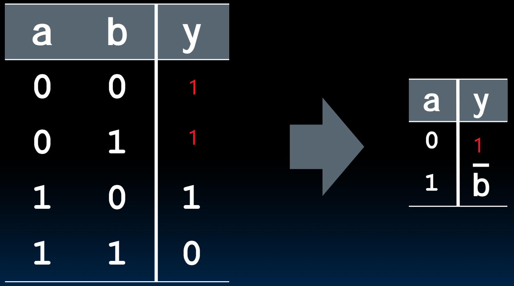

# 16.1-Truth Tables


Lecture Video Address


Truth Tables就是用于CL(combinational logic)的，state Element仅仅负责存储，没有logic，仅仅用于存储

下面是一个4-input，1-output的box

其真值表如下

| a    | b    | c    | d    | y          |
| ---- | ---- | ---- | ---- | ---------- |
| 0    | 0    | 0    | 0    | F(0,0,0,0) |
| 0    | 0    | 0    | 1    | F(0,0,0,1) |
| 0    | 0    | 1    | 0    | F(0,0,1,0) |
| 0    | 0    | 1    | 1    | F(0,0,1,1) |
| 0    | 1    | 0    | 0    | F(0,1,0,0) |
| 0    | 1    | 0    | 1    | F(0,1,0,1) |
| 0    | 1    | 1    | 0    | F(0,1,1,0) |
| 0    | 1    | 1    | 1    | F(0,1,1,1) |
| 1    | 0    | 0    | 0    | F(1,0,0,0) |
| 1    | 0    | 0    | 1    | F(1,0,0,1) |
| 1    | 0    | 1    | 0    | F(1,0,1,0) |
| 1    | 0    | 1    | 1    | F(1,0,1,1) |
| 1    | 1    | 0    | 0    | F(1,1,0,0) |
| 1    | 1    | 0    | 1    | F(1,1,0,1) |
| 1    | 1    | 1    | 0    | F(1,1,1,0) |
| 1    | 1    | 1    | 1    | F(1,1,1,1) |

How many Fs (4-input devices)

> 也就是说，4-input 1-output的设备总共有多少种可能

答案是$2^{2^4} = 64KB$，不论是哪种可能，真值表的行数是$2^4$，对于输出的可能性，这里是1-input，那么就是每一行有2种可能，即01，最终结果是$2^{2^4}$

> 1kb = $2^{10}$

如果是n-input, m-output，那么结果应该是$(2^n)^{2^m}$

## TT Example

下面列举几个真值表，

### 1 iff one (not both) a,b=1

如果是2-input，那么就是异或，真值表如下

| a    | b    | y(output) |
| ---- | ---- | --------- |
| 0    | 0    | 0         |
| 0    | 1    | 1         |
| 1    | 0    | 1         |
| 1    | 1    | 0         |

y在ab只有一个1的时候才为1

这个表也可以进行压缩，观察可得，当a为0的时候，b = y；当a为1的时候，y与b是互补的，所以这个4 × 3的表可以压缩为 2 × 2的表

| a    | y              |
| ---- | -------------- |
| 0    | b              |
| 1    | $\overline{b}$ |

如果想要扩展回去的话，在输入中多添加一列b，这样输入一共有$2^2$ = 4行，将y设置为b或者$\overline{b}$即可

习惯这种方式，上面所说，n-input m-output的box有很多种可能，每种可能都可能通过这种方式来压缩。

比如说如下的转换

### 2-bit adder

这个例子是一个2-bit adder的真值表

How Many Rows? $2^4$

这里要注意的是，在adder中，11 和 11是最大的输入，此时的输出为110，不存在输出为111情况。

### 32-bit unsigned adder

How Many Rows? $2^{32 + 32}$ = 16xb（相当大了）

> 这么大的情况，一般不使用真值表来实现32-bits adder

### 3-input majority circuit

> majority Circuit: 在输入中选择情况更多的作为输出

| a    | b    | c    | y(output) |
| ---- | ---- | ---- | --------- |
| 0    | 0    | 0    | 0         |
| 0    | 0    | 1    | 0         |
| 0    | 1    | 0    | 0         |
| 0    | 1    | 1    | 1         |
| 1    | 0    | 0    | 0         |
| 1    | 0    | 1    | 1         |
| 1    | 1    | 0    | 1         |
| 1    | 1    | 1    | 1         |
