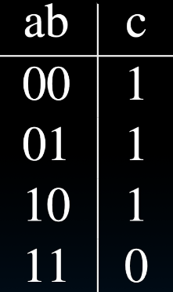
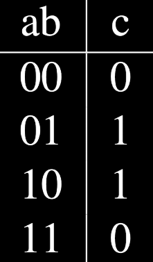

# 16.2-Logic Gates


Lecture Video Address


## Logic Gates

### 2-inputs gates

| Logic | Gate                                                           | Truth Table                                                    | Logic   | Gate                                                           | Truth Table                                                    |
| ----- | -------------------------------------------------------------- | -------------------------------------------------------------- | ------- | -------------------------------------------------------------- | -------------------------------------------------------------- |
| AND   |  |  | NAND    |  |  |
| OR    |  |  | NOR     |  |  |
| NOT   |  |  | XOR(异或) |  |  |

* 左边的三个，AND，OR，NOT是最基本的三个逻辑单元，不可再分（内部都是由晶体管实现的），在这些的基础上建立更复杂的电路

### n-inputs gates

上面我们已经讲了2-input的逻辑门，但是如果有更多的输入呢？

大多数都是很简单的，比如10-input的OR，仍然是只要有1个1，输出就为1，其他门同理

但是XOR有点区别了，因为2-input的XOR为1的情况是两个输入不一样

但是如果扩展到n位

It’s actually simple…XOR is a 1 iff the # of 1s at its input is odd

| a | b | c | y(output) |
| - | - | - | --------- |
| 0 | 0 | 0 | 0         |
| 0 | 0 | 1 | 1         |
| 0 | 1 | 0 | 1         |
| 0 | 1 | 1 | 0         |
| 1 | 0 | 0 | 1         |
| 1 | 0 | 1 | 0         |
| 1 | 1 | 0 | 0         |
| 1 | 1 | 1 | 1         |

## Truth Table → Gates

下面我们演示几个例子来展示怎么用真值表来表示电路的逻辑结果

### majority circ

> 多数电路

有如下的电路

> 之前说过为了防止看做相交，在相交处会隔开，但是只要交界处没有·的两条线就视为不是相交

对于这个例子，可以先找出让y=1的情况: 即 a AND b = 1；b AND c = 1；a AND c = 1；只有这三种情况下y=1，其他的都为0即可

### FSM circuit(TT → Gate)

* 这里特殊之处是某一个输入不是1-bit
* 我们将PS分为2个bits，  和 $$ps_0$$

这里将TT转化为Gates，先找到outputs为1的情况，就是PS=10,input=1的时候
