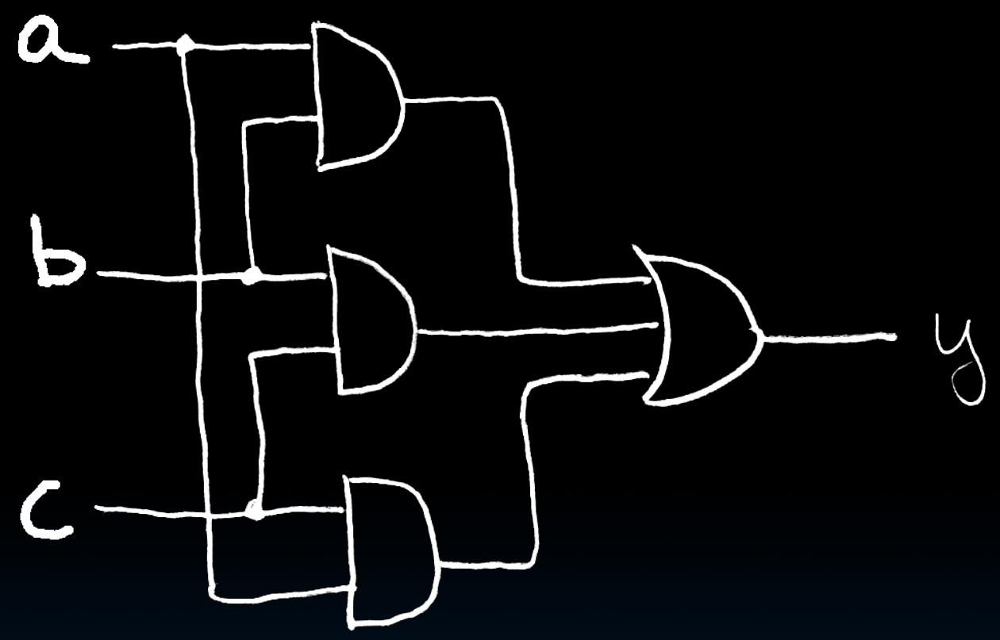
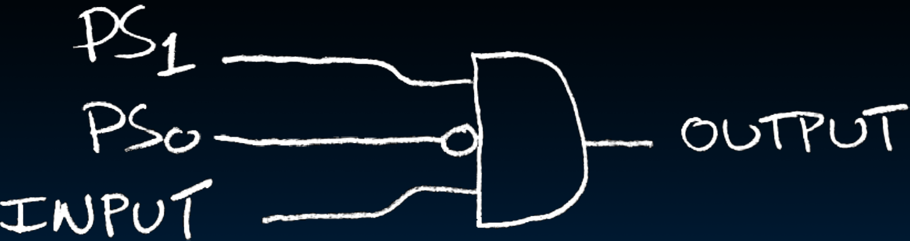
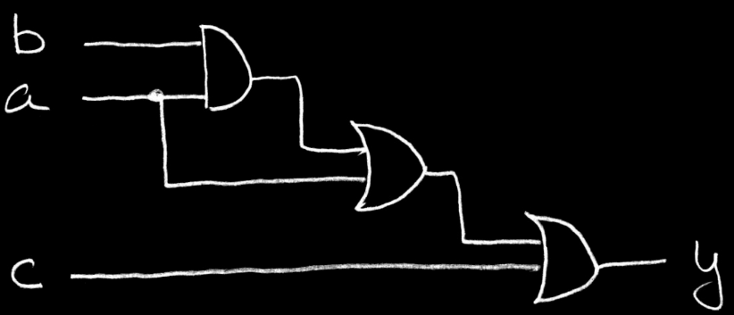
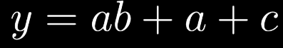
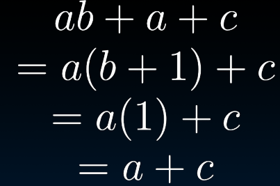
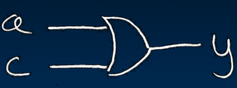

# 16.3-Boolean Algebra


Lecture Video Address


> Boolean Algebra 布尔代数

前面讲过，香农将晶体管与George Boole的数学研究结合起来，产生了Boolean Algebra

本节我们就先讲布尔代数

## Introduction of BA

George Boole, 19th Century mathematician

Developed a mathematical system (algebra) involving logic

- later known as “Boolean Algebra”

Primitive functions: AND, OR and NOT

## Boolean Algebra ↔ Circuit

Power of Boolean Algebra

- there's a one-to-one correspondence between circuits made up of AND, OR and NOT gates and equations in BA(Boolean Algebra)

> 由AND, OR, NOT逻辑门构成的电路与布尔代数是有一一对应关系的

\+ means OR, • means AND, $\overline{x}$ means NOT

### Example: Majority

下面将majority的电路转化成布尔代数

- y = a • b + a • c + b • c 
- y = ab + ac + bc(·是可以省略的)

### Example: FSM

在上节说道，FSM以state为输入，但是state可能有由多位表示

$OUTPUT = PS_1\cdot\overline{PS_0}\cdot INPUT$

这里用PS~1~，PS~0~表示，这样的符号很清楚，不要重新定义不相干的符号造成误解

> $PS_1\cdot\overline{PS_0}$其实就表示PS(previous state) = 10，INPUT表示INPUT = 1

## Usage

Boolean algebra的作用是什么？

### BA: Circuit & Algebraic Simplification

我们可以借助boolean algebra来简化Circuit，如下

| diagram/algebra                                              | desc                                   |
| ------------------------------------------------------------ | -------------------------------------- |
|  | original circuit                       |
|  | equation derived from original circuit |
|  | algebraic simplification               |
|  | simplified circuit                     |

可以看到，这样简化之后，大大降低了电路的复杂性，而且减少了电量以及delay的影响

> 在下节课会着重介绍怎么化简boolean algebra

### verify equation of circuits

BA also great for circuit verification Circ X = Circ Y? Use BA to prove!

可以将X和Y都转化成BA，然后化简，看最后的结果是否一致
