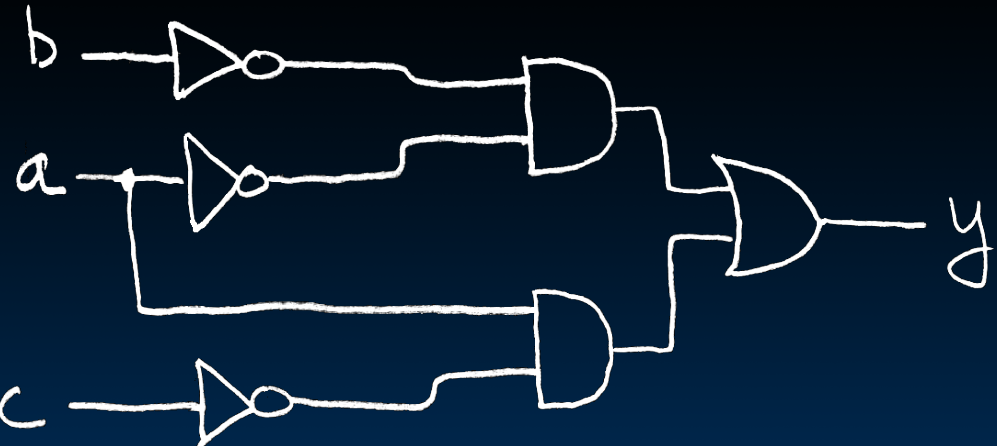

# 16.5-Canonical Forms & Summary


Lecture Video Address


> Canonical forms（规范形式）是数学和计算机科学中的一个概念，指的是将对象转化为一种标准化的、规范的表示形式。这种规范化的表示形式使得对不同对象的比较和处理变得更加简单和直接。

这里我们使用Boolean Algebra的Canonical Form

## Truth Table → Canonical Form

一个真值表由很多对应的Boolean Algebra，但是只有一个Canonical Form

寻找y=1的输入，找到对应的Boolean Algebra，然后使用OR加起来

> 真值表对应的Canonical Form的格式就是Sum of products

化简如下

$$
\begin{aligned}y &= \overline{a}\overline{b}\overline{c} + \overline{a}\overline{b}c + a\overline{b}\overline{c} + ab\overline{c} \\ &= \overline{a}\overline{b}(\overline{c} + c) + a\overline{c}(\overline{b} + b) \space\space\space \#distribution \\ &= \overline{a}\overline{b}(1) + a\overline{c}(1) \space\space\space \#complementarity \\ &= \overline{a} \overline{b} + a\overline{c} \space\space\space \#identify\end{aligned}
$$

得到的电路如下

省略非门，得到的电路如下

## <mark style="background-color:green;">In Conclusion</mark>

本节的内容可以用下面这张图来表示

> 要从Truth Table→Gate diagram，只能先转化成Boolean Expression，一般是Canonical Form

后面将要学习的内容

* Pipeline big-delay CL for faster clock
* Finite State Machines extremely useful
