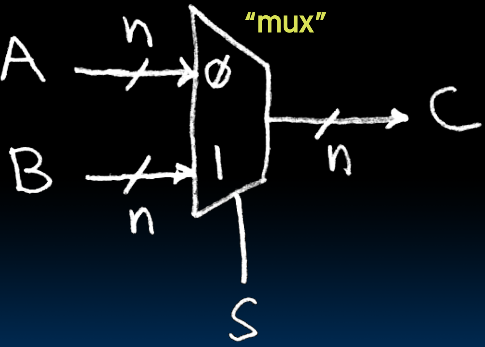
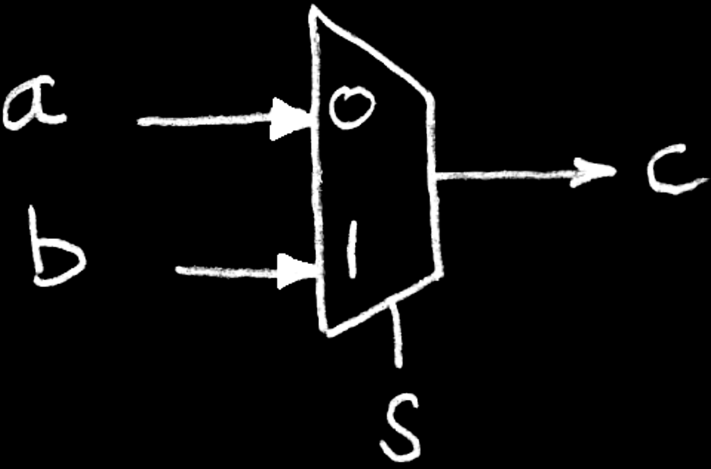
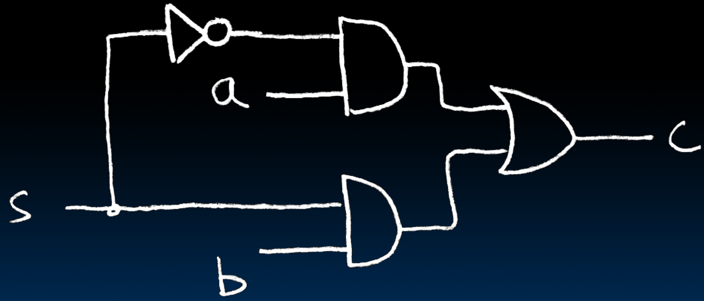
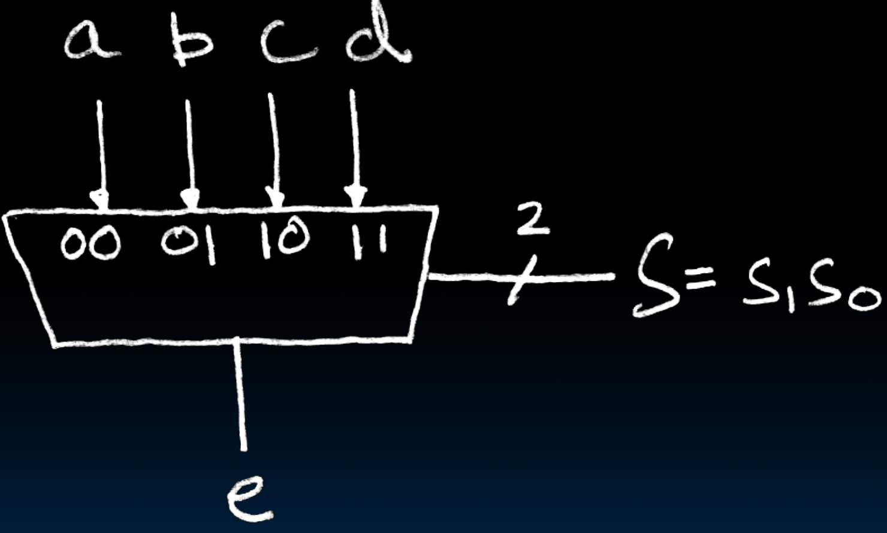
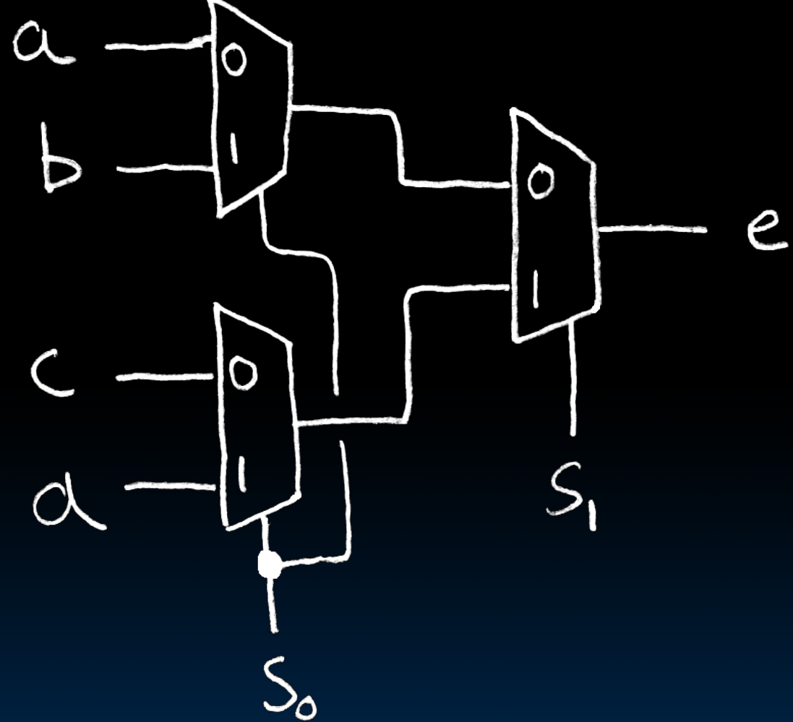

# 17.1-Data Multiplexors


Lecture Video Address


从本节开始，开始讲述一些典型的combinational logic blocks

> Multiplexor多路复用器，是用来选择数据的，就好像一个交通指挥员，只会放行某一条道

## Data Multiplexor

here 2-to-1, n-bit-wide

S选择是A通过还是B通过

在只有AB两个输入的情况下，S = 0，C = A；S = 1，C = B

## 1-bit-wide mux

上图中A和B都是n-bit，我们可以用N个`1-bit-wide mux`来实现一个`n-bit-wide mux`，所以本节我们重点讲解`1-bit-wide mux`

1-bit-wide mux的框图如下

> 我们也用这个为例演示一般怎么设计电路图

计算真值表

| s    | ab   | c    |
| ---- | ---- | ---- |
| 0    | 00   | 0    |
| 0    | 01   | 0    |
| 0    | 10   | 1    |
| 0    | 11   | 1    |
| 1    | 00   | 0    |
| 1    | 01   | 1    |
| 1    | 10   | 0    |
| 1    | 11   | 1    |

由TT得到Canonical Form

$\begin{aligned}c &= \overline{s}a\overline{b} + \overline{s}ab + s\overline{a}b + sab \\
&= \overline{s}(a\overline{b} + ab) + s(\overline{a}b + ab) \\
&= \overline{s}(a(\overline{b} + b) + s((\overline{a} + a)b) \\ 
&= \overline{s}(a(1)) + s((1)b) \\
&= \overline{s}a + sb \end{aligned}$

这样最终得到的Truth Table是

| s    | c    |
| ---- | ---- |
| 0    | a    |
| 1    | b    |

> 其实可以直接根据作用得出这个TT

$c = \overline{s}a + sb$对应的circuit是

## 4-to-1 Multiplexor

> 这里仍然是1-bit-wide mux，只不过输入的值增多为4个了

作用应该如下

- when S=00, e=a 
- when S=01, e=b 
- when S=10, e=c 
- when S=11, e=d

How many rows in the Truth Table?

> abcd都是1-bit的，S是2-bit，总共有6个input bits，所以row的数量是2^6^ = 64。这样的话真值表就难画了，而且Canonical Form也不好列出来，更不好化简

可以根据作用直接得到压缩后的真值表如下

- when S=00, e=a 
- when S=01, e=b 
- when S=10, e=c 
- when S=11, e=d

| s~1~s~0~ | c    |
| -------- | ---- |
| 00       | a    |
| 01       | b    |
| 10       | c    |
| 11       | d    |

直接得到结果$e = \overline{s_1}\cdot\overline{s_0}a + \overline{s_1}s_0b + s_1\overline{s_0}c + s_1s_0d$

> 根据压缩后的真值表就可以直接得到canonical Form，这样可以节省很多时间。
>
> 所以在设计的时候，尽可能的想捷径，而不是死板的TT → Canonical Form → Simplication → circuit

这样是可以通过Sum Of Products(4个3-1 AND 和1个4-1 OR)来得到，但是有没有其他的方式呢？

答案就是使用Hierarchically，如下

- 将4-to-1转化为2个2-to-1，和1个2-to-1(8-to-1,16-to-1都是可以的，甚至3-to-1也是可以的，但是这样会浪费S的一种可能)
- s0在ab, cd中选择一个(当然也可以在ad, bc中选择，但不能再ab cd选择)，`ac`或者`bd`同时被选择
- s1在第一次选择的结果ac或者bd的基础上再选择一次

> 使用Hierarchical，底层的部件的个数减少了吗？不见得，因为在2-to-1内部还是有很多逻辑门，但是这样先抽象出一个2-to-1，然后再组合，就和编程的Hierarchical一样，不断向上抽象
