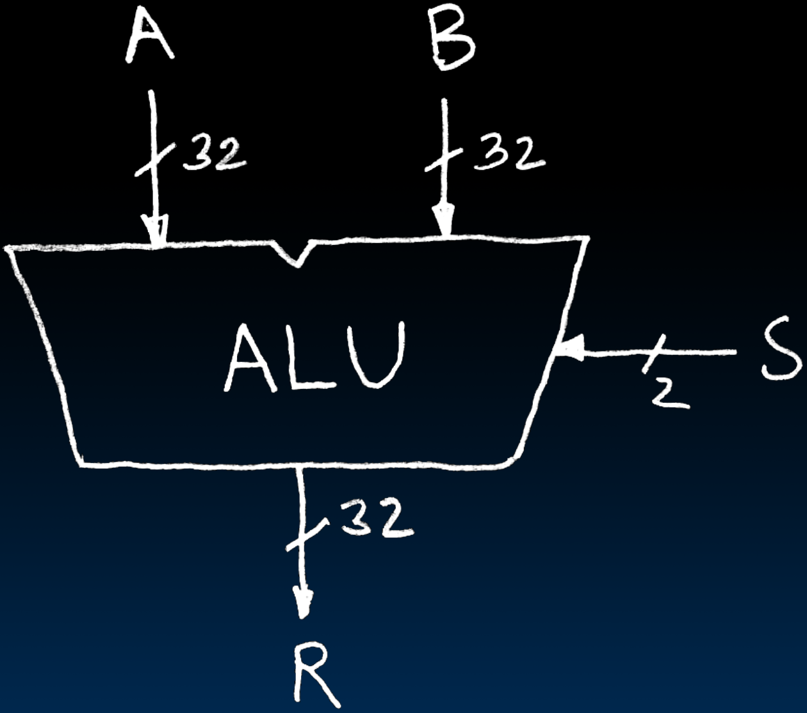
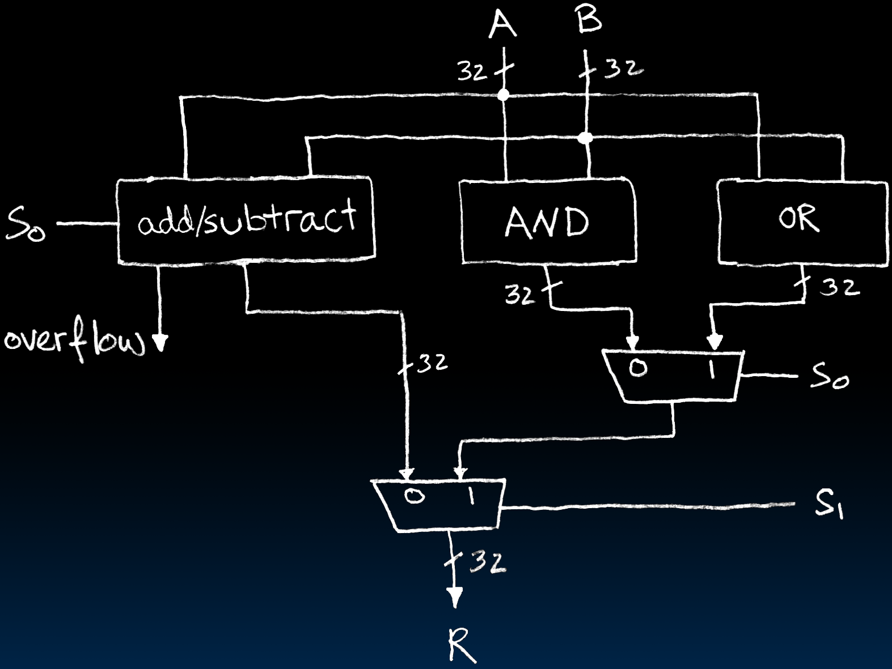

# 17.2-Arithmetic and Logic Unit(ALU)


Lecture Video Address


***

在RISC-V中的`add x01, x02, x03`, `sub x01, x02, x03`, `and t2, t0, t1`, `or t2, t0, t1`这些指令，实际执行的就是ALU

本节我们讲述ALU的构成(本节我们只是介绍一个简单的版本，只有+ - AND OR操作，但是可以在此基础上扩展)

## Arithmetic and Logic Unit

> ALU是一个high-level big block，一些单一功能的block被集成在ALU当中

Most processors contain a special logic block called “Arithmetic and Logic Unit” (ALU)

We’ll show you an easy one that does ADD, SUB, bitwise AND (`&`), bitwise OR (`|`)

> 这里我们只学习有ADD, SUB, AND, OR操作的ALU

S选择执行哪一个操作

* when `S=00`, `R=A+B`
* when `S=01`, `R=A-B`
* when `S=10`, `R=A&B`
* when `S=11`, `R=A|B`

Our simple ALU

在上节中，我们已经实现了一个4-to-1 mux，这里可以使用同样的思想

* add/subtract合成一个部件了，但也是2-to-1的作用（下节会将怎么实现这个box）
* 有一个overflowed的输出

> * 在这个电路中，add, sub, AND, OR这几个操作是不能控制是否执行的，硬件会自动执行
> * circuit能决定的就是选择哪一个的结果
