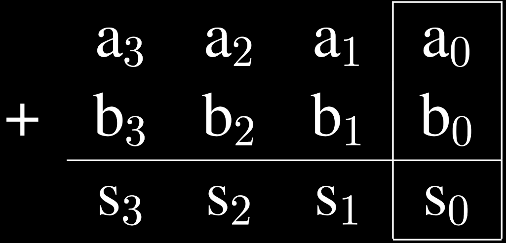
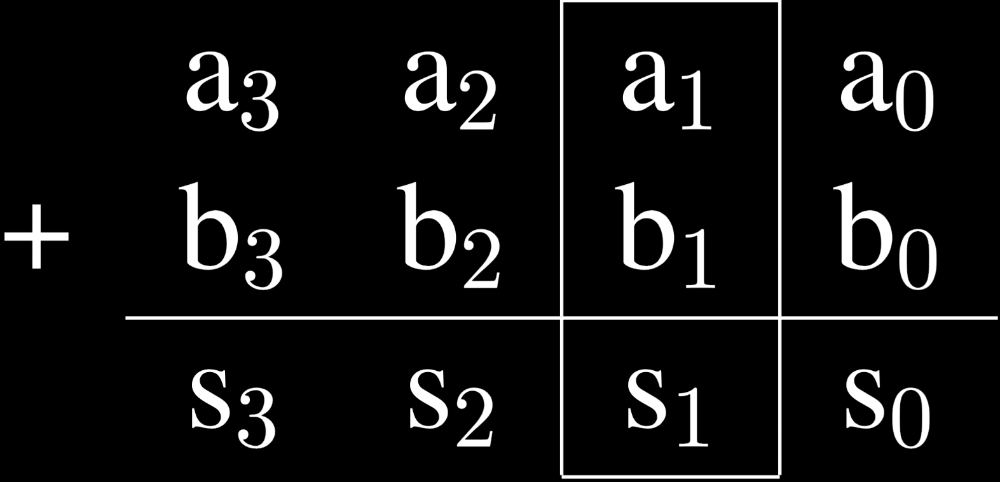
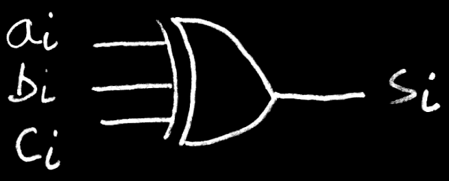
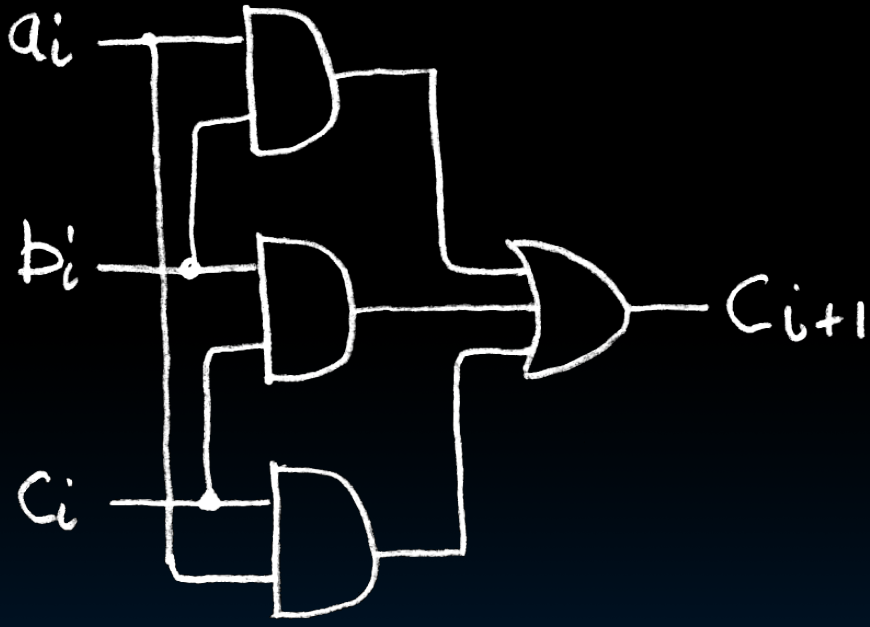
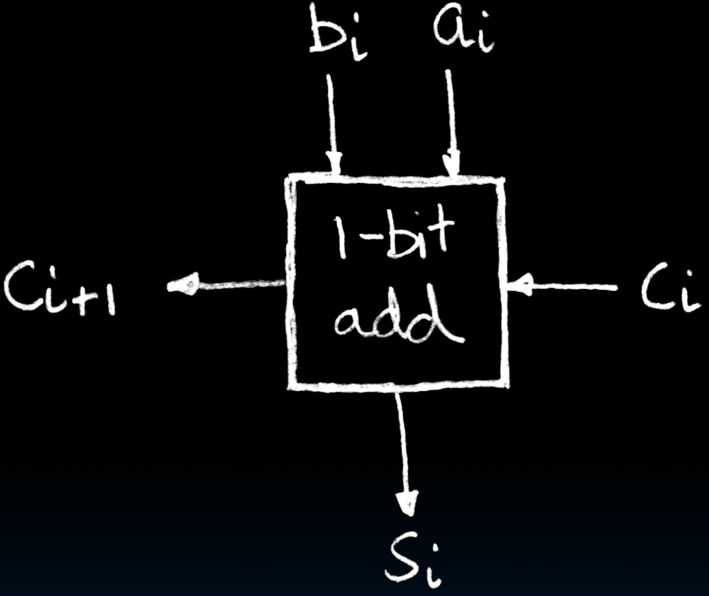
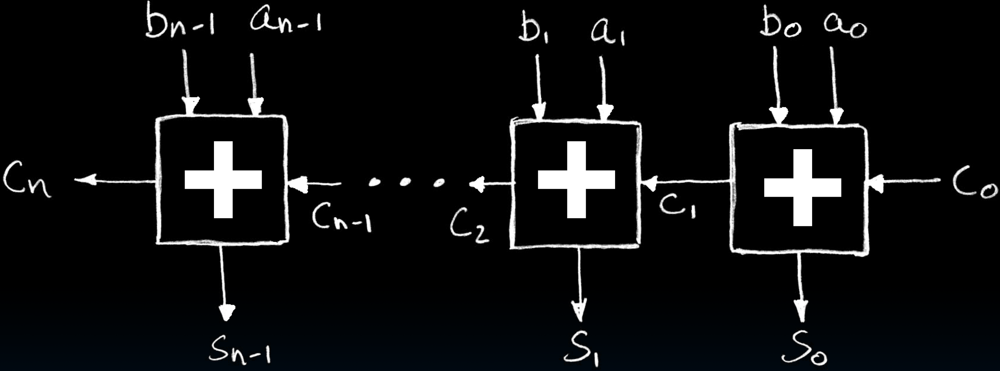
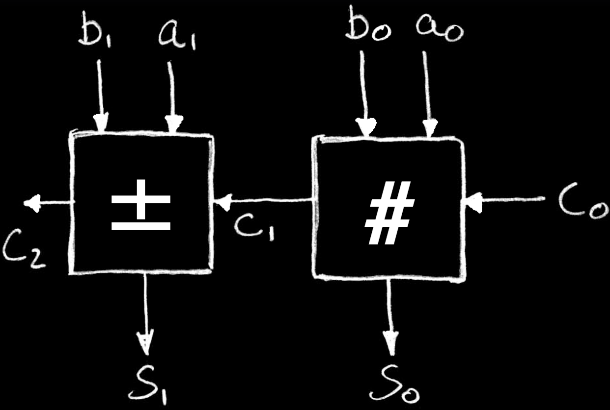
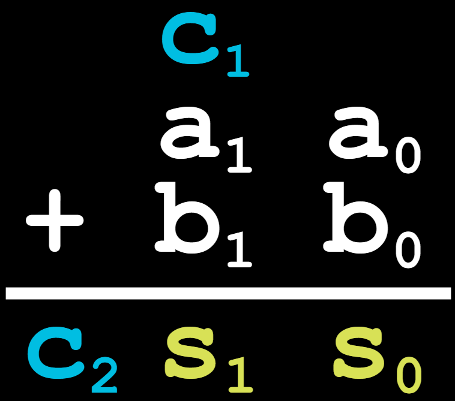
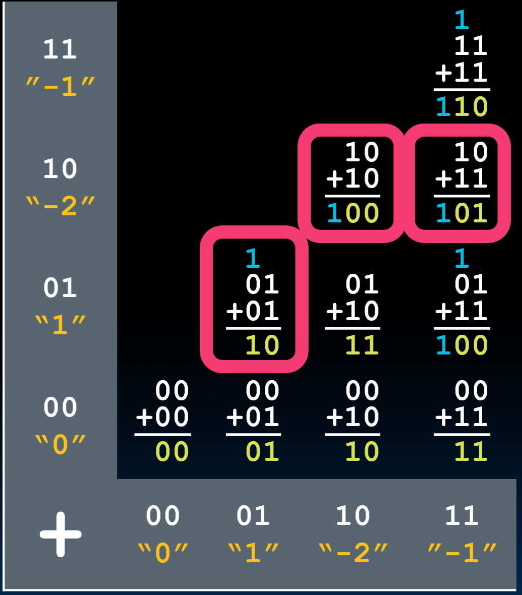

# 17.3-Adder


Lecture Video Address


## Adder / Subtracter Design

基本方法

1. Truth-table
2. then determine canonical form
3. then minimize
4. implement

但是还有其他的方法

Look at breaking the problem down into smaller pieces that we can **cascade** or **hierarchically** layer

> 核心思想 **cascade**, **hierarchy**

## 1-bit adder(LSB)

这里我们使用cascade的方式，先得出1-bit的adder(实际上也就是先考虑LSB的add)，然后进行cascade得到n-bit adder

如下是加法运算的式子(我们仅仅考虑LSB)

真值表如下

| $$a_0$$ | $$b_0$$ | $$s_0$$ (当前位结果) | $$c_1$$ (进位) |
| ------- | ------- | --------------- | ------------ |
| 0       | 0       | 0               | 0            |
| 0       | 1       | 1               | 0            |
| 1       | 0       | 1               | 0            |
| 1       | 1       | 0               | 1            |

其中

* $$s_0 = a_0 \oplus b_0$$（异或）
* $$c_1 = a_0 \odot b_0$$(同或)

> c是carry in的意思，表示进位输入

## 1-bit adder(with carry-in)

然后我们得考虑LSB前面的bits了

此时就需要考虑进位了（进位作为输入），这也是以后的所有位的计算规则

| $$a_i$$ | $$b_i$$ | $$c_i$$ | $$s_i$$ | $$c_{i+1}$$ |
| ------- | ------- | ------- | ------- | ----------- |
| 0       | 0       | 0       | 0       | 0           |
| 0       | 0       | 1       | 1       | 0           |
| 0       | 1       | 0       | 1       | 0           |
| 0       | 1       | 1       | 0       | 1           |
| 1       | 0       | 0       | 1       | 0           |
| 1       | 0       | 1       | 0       | 1           |
| 1       | 1       | 0       | 0       | 1           |
| 1       | 1       | 1       | 1       | 1           |

观察：

1. S在abc有奇数个1的情况下为1，这是一个XOR
2. C~~i+1~~在abc至少2个1的情况下为1，这是一个Majority circuit

由此得到的结果如下：

* $$s_i = \oplus(a_i, b_i, c_i)$$
* $$c_{i+1} = MAJ(a_i, b_i, c_i) = a_ib_i + a_ic_i + b_ic_i$$

> 这里是观察TT后根据规律直接得到的，而不是先写出Canonical Form然后minimize

这两个器件得到的结果如下

| $$s_i$$                                                        | $$c_{i+1}$$                                                    |
| -------------------------------------------------------------- | -------------------------------------------------------------- |
|  |  |

最终得到的1位加法器如下

## N 1-bit adders → 1 N-bit adder

上面已经得到了1-bit adder，通过cascade可以得到n-bit adder

C~~0~~是LSB的carry-in，一般设置为0

## Overflow?

What about overflow? Overflow = $$c_n$$ ?

对于unsigned，确实是这样， $$c_n$$ = 1表示无法存储了，即溢出，但是Signed呢？

### Example: 2-bit adder

下面用2-bit adder为例来演示Signed的加法什么时候溢出

将两个2-bit相加，电路图和运算规则如下

| circuit                                                        | add rules                                                      |
| -------------------------------------------------------------- | -------------------------------------------------------------- |
|  |  |

> 2-bit的整数有-2,-1,0,1(2's Complement Representation)；左边的一列是被加数，下面的一行是加数；两两相加，将计算得到的2-bit与应该得到的Decimal value进行比较，得到那些值是溢出的。

如果将2-bit看做unsigned的话，那么结果为3-bit且MSB为1的就是溢出，也就是说可以通过最后一个c来表示是否溢出

> 这里就可以看到2's Complement的好处了，硬件只能按照固定的规则进行逐位加法，使用了2's Complement之后，signed就可以和unsigned使用同样的硬件来进行加法了。
>
> signed和unsigned的不同之处：1.按照不同的规则解释01序列；2. 如何判断溢出

但是signed呢？

When do the lowest 2 bits of sum not represent correct sum?

> 上面红色方框围起来的就是有问题的：`01 + 01 = 10`，`10 + 10 = 100`， `10 + 11 = 101`
>
> 特别注意`01+01=10`，这里位数是没有溢出的，但是在意义上却溢出了，01是1,01+01结果应该是2，这超出了2's Complement的表示范围，所以说不能仅仅靠最后一个C来断定是否是溢出
>
> 同时有些结果溢出了，但是意义上没有溢出：`01 + 11 = 100`，`11 + 11 = 110`，这几个虽然最后一个C是1，但是并没有溢出

Is there a pattern of when this happens?

> Hint: Check out the carry-bit and the sum4s-column-bit

Highest adder(我们扩展到n-bit adder，但是也只是看最高的那一位的情况)

* $$c_{in}$$ = Carry-in = $$c_1$$ , $$c_{out}$$ = Carry-out = $$c_2$$
* No $$c_{out}$$ or $$c_{in}$$ → NO overflow!
* $$c_{in}$$ and $$c_{out}$$ → NO overflow!
* $$c_{in}$$ , but no $$c_{out}$$ → A,B both > 0, overflow!
* $$c_{out}$$ , but no $$c_{in}$$ → A or B are -2, overflow!

当 $$c_{n-1}$$ 为0并且 $$c_n$$ 为1，或者C~~n~~为0并且 $$c_{n-1}$$ 为1的时候，也就是异或XOR

overflow = $$c_n \oplus c_{n-1}$$
