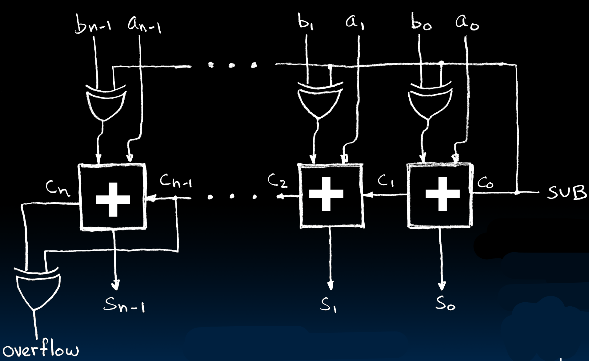

# 17.4-Subtractor Design


Lecture Video Address


上节我们已经实现了adder，本节来实现subtractor

## Extremely Clever Subtractor: A-B = A + (-B) 

Subtractor的实现是复用了Adder的电路，只不过SUB会做一些特殊的选择

> 1. 没有subi这样的指令，如果要`subi x01, x02, 3`，可以使用`addi, x01, x02, -3`，因此这里只讨论signed的情况
> 2. signed用2's Complement表示，那么一个数得到其负数的方式就是取反+1，A + (-B) = A + (B的反码) + 1

再看电路：

1. SUB作为C~0~，如果SUB = 1，那么就会自动+1
2. SUB = 1，根据 b XOR 1 = $\overline{b}$，会自动进行取反（使用XOR可以选择性的取反）

会议之前的压缩后的表格

| a    | output         |
| ---- | -------------- |
| 0    | b              |
| 1    | $\overline{b}$ |

==**所以SUB这里起到的作用为：将B取反+1**==

> 1. 这里使用C~n~ XOR C~n-1~作为signed的Overflow的信号
> 2. 这里也是先考虑1-bit的减法，使用 a - b = a + (-b)实现，然后进行cascade扩展到n-bit的减法

## Conclusion

1. Use muxes to **select** among input
    - S input bits selects 2S inputs
    
    - Each input can be n-bits wide, indep(独立的) of S
    
        > 因为n-bits就是1-bit的扩展，S的一个值同时选中n个1-bit就实现了n-bits
    
2. Can implement muxes hierarchically
    - ALU can be implemented using a mux
    
3. Coupled with basic block elements

4. N-bit adder-subtractor done using N 1- bit adders with XOR gates on input
    - XOR serves as conditional inverter
