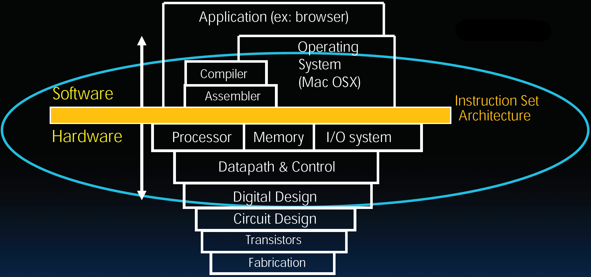
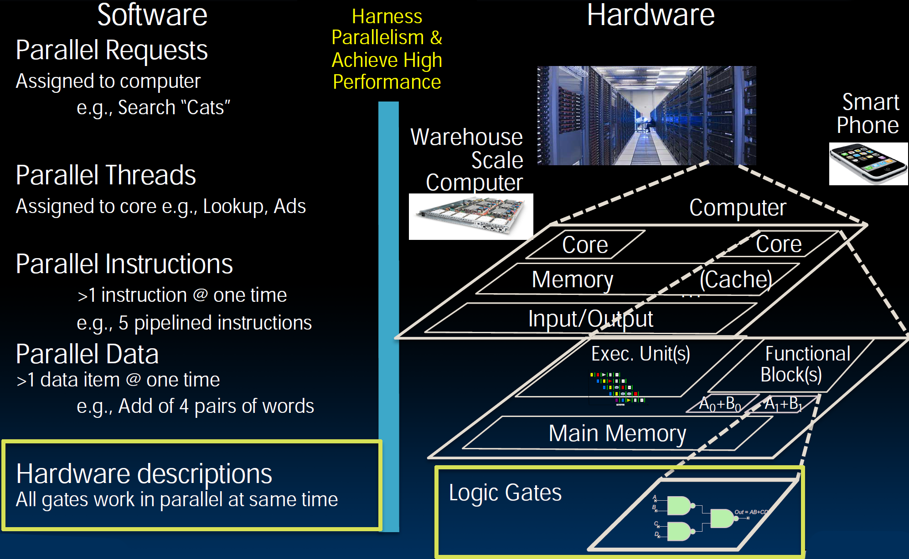
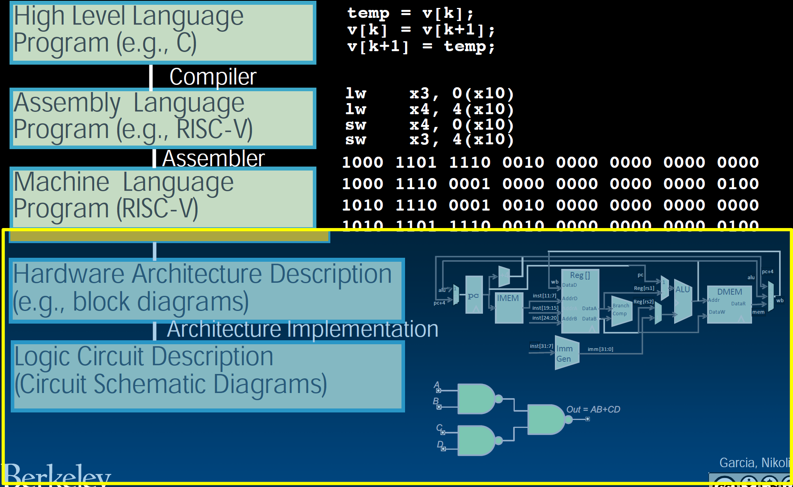
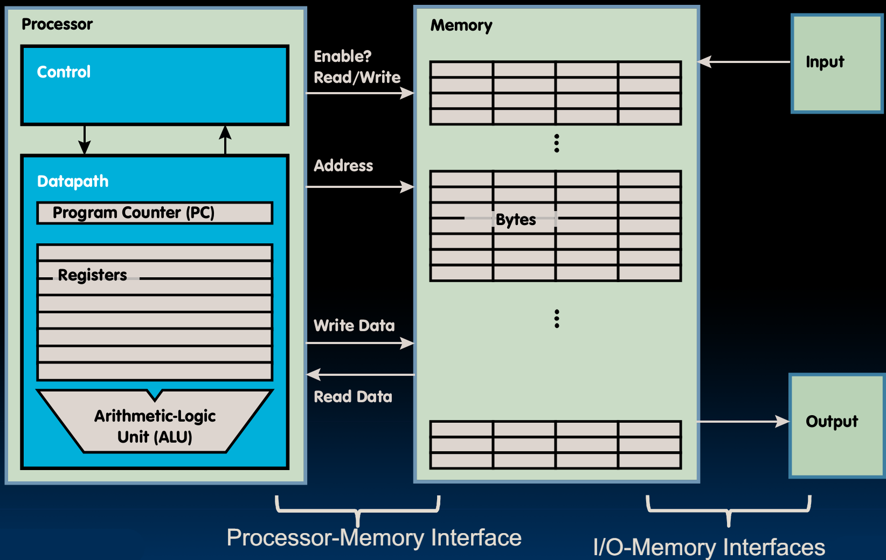
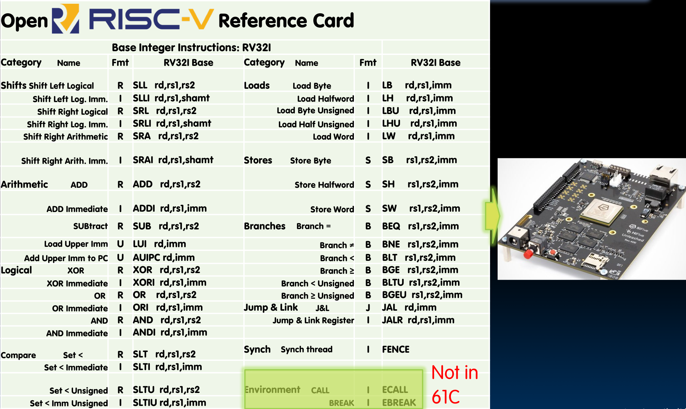

# 18.1-RISC-V Processor Design


Lecture Video Address


从本节课开始，我们将要学习如何设计RISC-V的processor

本模块开始将软件与硬件连接起来

## Machine Structure

### old machine structure

CS61C 课程以指令集架构(ISA)为中心，这是将软件和硬件分离并结合在一起的部分。

在课程初期，我们重点介绍了高级语言C和RISC-V汇编语言。汇编语言会编译成机器代码，任何实现相同RISC-V ISA的硬件都应该能够执行任何RISC-V二进制机器代码。

现在我们要看看如何构建实际执行RISC-V代码的硬件。请记住，这些硬件可能有许多不同的变体，但它们都必须执行这些代码。

我们已经了解了如何根据布尔方程式用逻辑门构建SDS。接下来，我们将深入研究Datapath和Control的设计，将它们组合在一起就构成了一个微处理器。

### New-School Machine Structures

上面的机器架构比较古早了，下面是新派的计算机架构

在新的机器结构学派中，我们强调并行性，并且我们已经看到在更高层次上有**很多方式**可以实现并行。

但请记住，在非常低的层次上，Hardware descriptions本质上是并行的。所有的**门电路**一起切换并以非常高的并行度运行，但我们会发现那些由这些门电路构建的**功能单元**也以并行方式运行。然后我们可以有多个功能单元可以并行执行多条指令。

因此，我们将在描述硬件的过程中一直强调这种并发性和并行性。

### abstraction hierarchy

RISC-V的硬件有很多实现的方式，但是它们必须能够执行machine code

## Single-Core Processor(CPU)

我们仅仅讲述单核的微处理器(当然，一个CPU可以有多核并行执行)

在Datapath中，有寄存器和一个特殊的寄存器，即程序计数器PC(或者叫做IP)。算术逻辑单元ALU是最常用的功能单元。可能还有其他功能单元，但我们现在将重点放在ALU上

* **Processor (CPU)**: the active part of the computer that does all the work (data manipulation and decision-making)

内部分为Datapath和Control两个部分，Control是大脑，用于告诉Datapath要做什么，Datapath是力量，是真正去做的部分

* **Datapath**: portion of the processor that contains hardware necessary to perform operations required by the processor (有时也叫作brawn)
* **Control**: portion of the processor (also in hardware) that tells the datapath what needs to be done (the brain)

> 【Notice】我们可以为**每条指令**构建一条单独的**数据通路**。到目前为止，我们已经在RISC-V整数子集中看到30多条指令，但是我们不会为每条指令构建单独的数据通路。
>
> 我们构建一个可以**执行多条指令的数据通路**，这条数据通路可以配置为优化执行每一条指令。
>
> 因此，控制单元或微处理器的大脑的作用就是控制数据通路，或者告诉数据通路如何设置自己，以便正确执行每条指令。

## Need to Implement All RV32I Instructions

我们之前已经学习了RV32I指令的子集，现在要做的就是为每一种指令构建一个Datapath和对应的Control

最后，我们要制作一个能运行C语言的CPU
