# 18.2-Building a RISC-V Processor


Lecture Video Address


## Review State Machine

CPU 是一个数字系统。基于设计数字逻辑的基本原理，我们应该能够构建一个CPU。但我们到底如何构建一个CPU呢？我们听说过状态机是一种常见的描述数字逻辑或更准确地说是数字系统的方法。那么我们可以用状态机来描述CPU或设计CPU吗？答案毫无疑问是肯定的。我们可以将CPU设计视为状态机的设计。

本节我们先考虑一个指令，然后我们可以尝试将其推广到CPU中的所有指令。

> 回顾有限状态机的知识
>
> | FSM diagram                                                  | circuit                                                      |
> | ------------------------------------------------------------ | ------------------------------------------------------------ |
> | 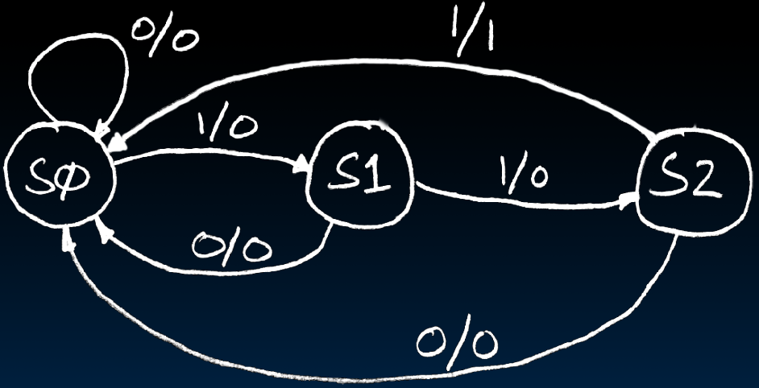 | 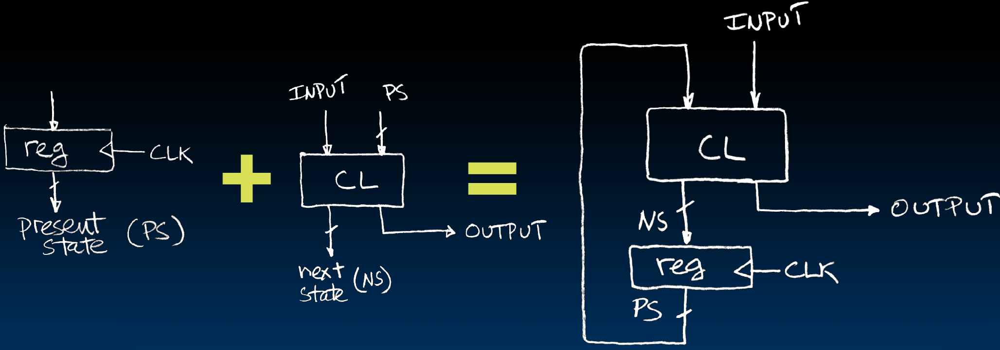 |
>
> 1. FSM有很多的状态，每个状态都可以接受一些输入，产生不同的输出并跳转到下一个状态
> 2. 用circuit来实现FSM，有两个任务：
>     - 保存状态，可以使用register或者memory保存状态
>     - 实现(previous state + input) → (next state + output)的映射，这个由CL来实现
>
> 所以我们在设计CPU的时候，也需要这两块，State Elements + CL

## One-Instruction-Per-Cycle RISC-V Machine

### CPU As State Machine

我们使用State machine的理念来构建CPU

CPU 中的状态包含在**寄存器**、**内存**(IMEM和DMEM)和程序计数器(PC)中。在CPU中没有其他存储数据的部分。这决定了CL的作用。

> 现在可以理解为什么叫做State Elements了，PC，IMEM，DMEM，Reg都是Elements，在State machine中存储状态

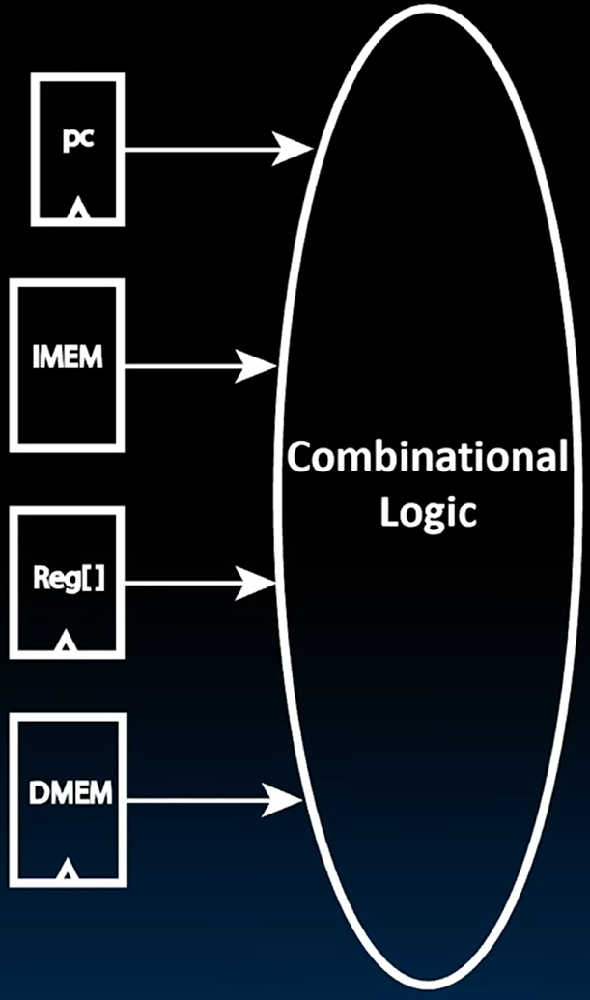

例如，在执行加法操作时，所有相关内容都会在DMEM中。我们不会关心DMEM的内容，但会关心register和PC的内容。

> 这里执行的加法就是对寄存器中的数据进行加法，而不是从内存中取出数据进行加法。
>
> CL在进行操作的时候，并不会涉及所有的存储部分。

IMEM中的寄存器和PC的内容将用于执行该指令的功能。如果指令是基于寄存器的加法操作，那么该CL将根据状态元素的内容执行加法操作，并将结果写回到State Element，即register，并更新PC。

> 读取哪些Element的State，并更新哪些Element的State，都是每一个操作需要考虑的。

每条指令都可以有一个独立的CL。可以想象我们可以用这种方式构建一个processor。RV32I 的每条指令都会有一个专用的CL。然后使用多路复用器，这些多路复用器的选择输入将是我们正在执行的指令类型，并且我们将根据这些不同的组合逻辑模型的输出来更新状态。

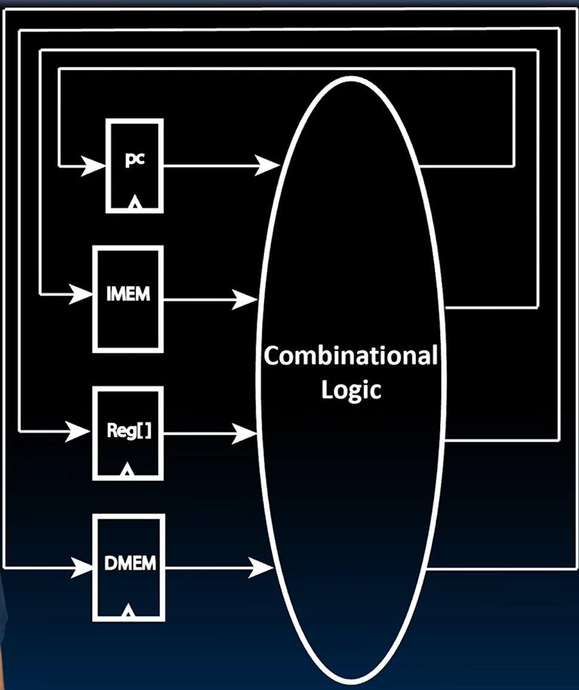

但这不实际，因为许多指令将共享相同的数据路径。因此，一般来说，我们会尝试将此数据路径构建为一个可以执行所有指令的逻辑云。

指令将在时钟上升沿开始执行，通过组合逻辑，并将输出返回到状态元素。在下一个时钟上升沿，我们将其写回状态元素的新状态。我们会继续这样做。通过这个序列，我们将执行所有指令。

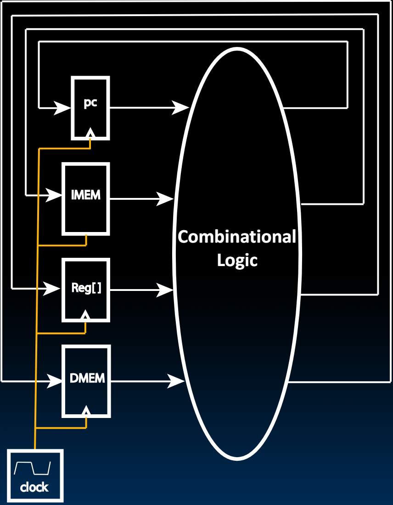

> Clock仅仅控制存储，准确的说，是控制Flip-flop，只有FF才有CLK输入

On every tick of the clock, the computer executes one instruction

Current **state** outputs drive the **inputs** to the combinational logic, whose outputs settles at the values of the state before the next clock edge

At the rising clock edge, all the **state elements** are updated with the combinational logic outputs, and execution moves to the next clock cycle

### problem & solution

Problem: a single, "monolithic" block that "executes an instruction" (performs all necessary operations beginning with fetching the instruction) would be too bulky and inefficient

> 也就是说，如果要构建一个能够执行所有指令的单片框图是比较笨重而且低效的。
>
> monolithic(单片的)，相对于为每一个指令设计一个CL，而是将所有指令用一个CL来实现

Solution: break up the process of "executing an instruction" into stages, and then connect the stages to create the whole datapath

> 解决的办法就是将指令的执行过程分解为多个不同的阶段，最后将这几个阶段连在一起

- smaller stages are easier to design
- easy to optimize (change) one stage without touching the others (modularity)

下面我们将指令分为几个部分，但是并不是所有的指令都有这结果执行阶段，只是大部分的指令至少有这几个阶段中的某几个

### Five Stages of the Datapath

一条指令的执行大概分为以下几个阶段

- Stage 1: Instruction Fetch (IF)
- Stage 2: Instruction Decode (ID)
- Stage 3: Execute (EX) - ALU (Arithmetic-Logic Unit)
- Stage 4: Memory Access (MEM)
- Stage 5: Write Back to Register (WB)

> 这几个stage是一个指令的CL，只不过是将一个指令分成多个stage了，不可理解为一个stage一个instruction

这里简单介绍一下这几个步骤

- IF获取从内存中获取指令并将其存储到处理器中。
- ID查看该过程，即指令，并确定其内容。Decode出想要执行的操作。（Decode就是将machine code进行拆分，将Register地址，imm，opcode，funct7/3等部分拆分开并送到应该的地方,这个阶段与寄存器读取相关联，我们知道指令的格式是固定的，并且指令的特定部分将被用作寄存器文件的地址。）
- EX执行操作，通常，这可能由ALU执行。我们将发现我们不仅在计算算术和逻辑操作（无论是基于寄存器还是立即数），还在处理分支时使用算术逻辑单元。
- MEM将访问内存，任何涉及内存的操作都在这个步骤执行
- WB阶段将内容写回到寄存器中，例如，在加载的情况下，我们将通过在第五阶段写回到寄存器来完成此指令。

## Basic Phases of Instruction Execution

下面是一个processor的Datapath的通用的circuit。其显示了我们之前见过的所有元素: 

- State Element有PC, IMEM, Reg[], DMEM
- CL有mux, ALU

这是我们第一次将其全部连接起来。

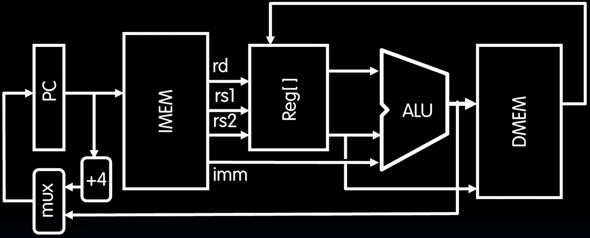

在这里，我们假设有两个分离的内存，IMEM和DMEM，虽然在物理上，他们是一块内存的两个部分(在后面会看到我们为什么要这么做以及怎样实现分离)

下面从左往右介绍一下过程：

1. PC的输入是一个mux的输出，如果指令是按顺序逐条进行的话，那么就会+4来指向下一条指令。但是如果执行了branch指令的话，ALU会计算出下一条指令的地址并赋予PC，mux在+4与branch地址之间选择一条。
2. IMEM中的指令会指向Reg[]里面的registers(在Format那个模块中讲到instruction machine code会包含register，包括rs1，rs2，rd)。IMEM会将源寄存器rs1，rs2的地址发送给Reg[]，并将imm传给ALU，Reg[]也会根据rs1，rs2将内容传给ALU
3. ALU进行计算输出结果
4. 结果送到DMEM中
5. 最终DMEM会将结果写回到寄存器当中

---

如上的步骤包含了前面所说的5个阶段。每个阶段包含的circuit如下图

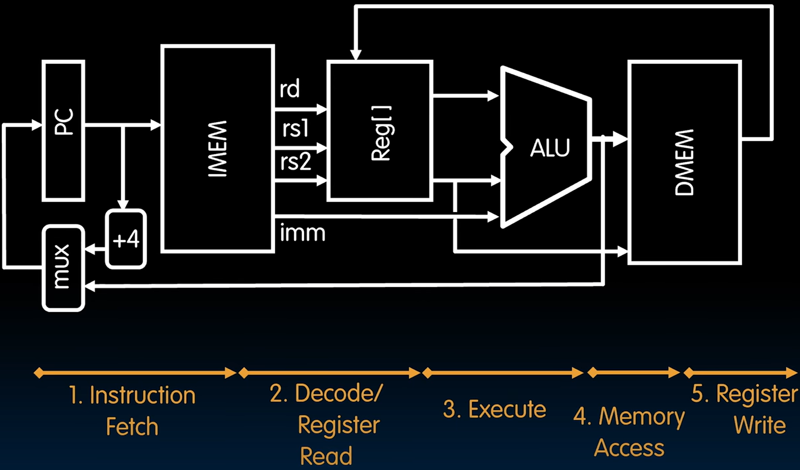

后面我们会就一条指令来讲解这个通路。但是，最终要的是要理解single cycle datapath.

这五个执行阶段将在一个时钟周期内发生。我们将在时钟的第一个上升沿开始指令执行，进行指令获取。然后，在下一个时钟的上升沿写回最终结果。因此，在那时，寄存器将被更新，程序计数器将被更新为包含下一条指令地址的新地址。

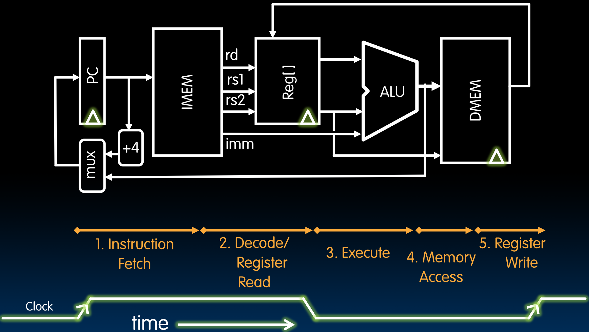

如上，可以看到Clock的上升沿在Fetch之前，下一次上升沿在Register Write之后

---

有了这样的模型之后，该如何构建Datapath呢？

下面介绍一些组件

## Datapath Components: Combinational

Combinational elements

| Adder                                                        | Multiplexer                                                  | ALU                                                          |
| ------------------------------------------------------------ | ------------------------------------------------------------ | ------------------------------------------------------------ |
| 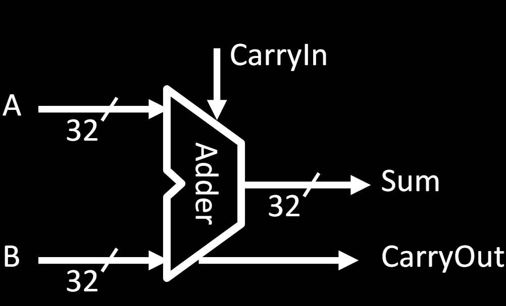 | 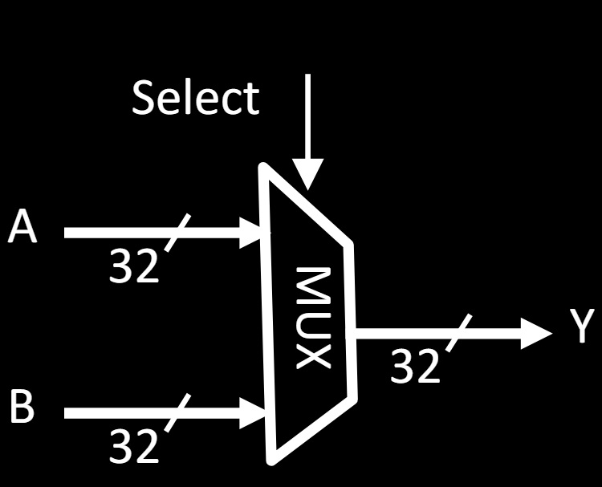 | 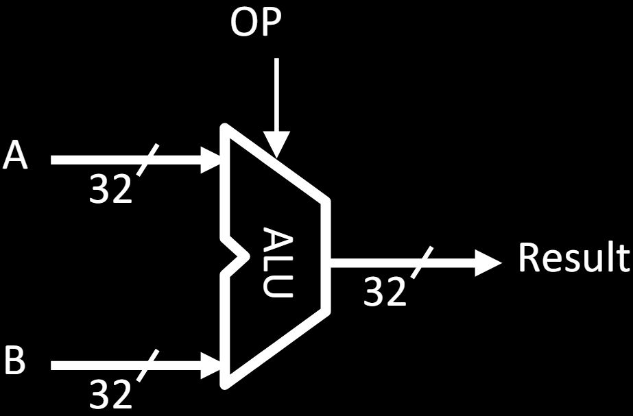 |

上面是我们需要用到的组合逻辑，然后，我们需要用State Elements来补充它们，这些Element是存储数据和Clock methodology的元素。目前，我们采用非常简单的时钟方法，对应于单周期CPU。

## Datapath Components: State and Sequencing

### Register

我们首先需要的一个State Element是Register。它是一个触发器的集合，可以说，一个32位的寄存器由32个触发器组成，它们都会在时钟的上升沿一起写入。

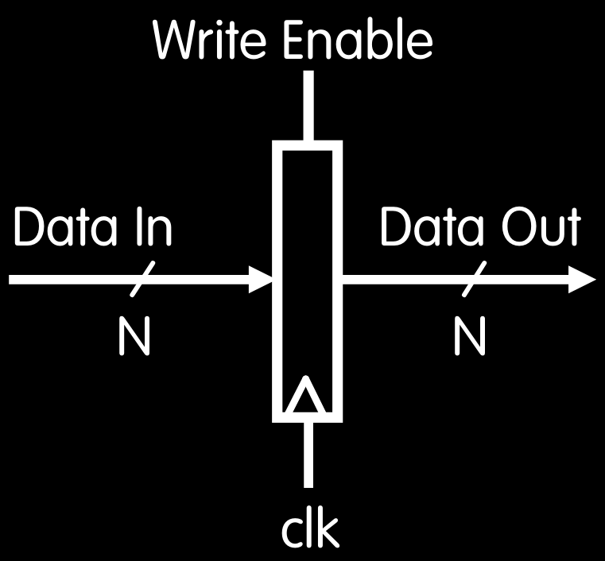

如上是Register的符号。我们有一个数据输入端口和一个数据输出端口我们标记它为具有N位宽的端口，在32位数据路径中，这个N通常是32。

寄存器只在时钟的上升沿更新，因此新值会在时钟的上升沿写入寄存器，如果Write Enable被asserted(1)。如果Write Enable未被断言，即为0，寄存器中的值将不会改变。

> Register有一个Write Enable写入使能信号来控制数据是否能够被改变 。

当数据端口或总线数据输入端口的数据在时钟的上升沿改变时，这些新值将被写入寄存器，并且这些值将保持在寄存器的输出端口直到下一个时钟周期。

### Register File

下一个层次结构中的构建块是寄存器文件。寄存器文件是寄存器的集合。因此，寄存器是触发器的集合，寄存器文件是寄存器的集合。在RV32I中，我们需要一个有32个寄存器的寄存器文件

如下，将32个32-bit Register看做一个Register file

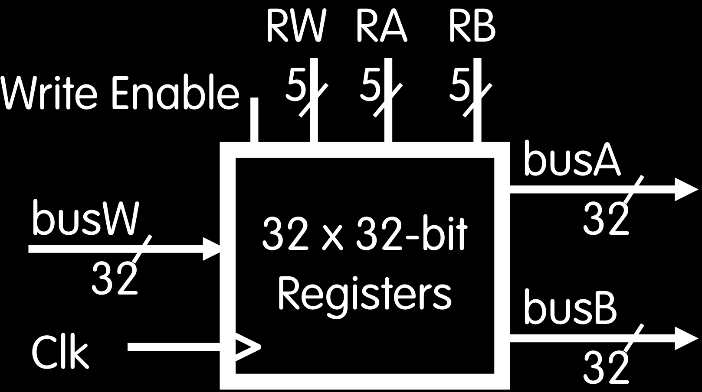

> 这几个接口可以对照上述Datapath的模型中的Register File

Register file (regfile, RF) consists of 32 registers:

- Two 32-bit output busses: busA and busB
- One 32-bit input bus: busW

> 需要注意的是，我们在同一时间可以访问的寄存器数量是有限的。当我们深入到处理器实现的具体细节时，会发现线缆是一个真正的挑战，我们无法在任何可能的顺序中访问这些寄存器。
>
> RISC-V的架构要求我们应该能够同时从寄存器文件中读取两个寄存器，并且可以写入其中一个寄存器。这被称为“双读单写”类型的寄存器文件，双读单写。

Register is selected by:

- RA (number) selects the register to put on busA (data)
- RB (number) selects the register to put on busB (data)
- RW (number) selects the register to be written via busW (data) when Write Enable is 1

> 我们访问寄存器文件的方式是通过地址和总线。有一个输入总线busW包含将要写入的新值，在RISC-V RV32I中，该总线宽度为32位。有两个输出总线，busA和busB，它们将包含寄存器A和B中的值，或者源寄存器一和二的值。
>
> 我们选择32个寄存器中的哪一个将其数据输出到总线A或总线B的方法是通过在这些端口RA和RB上设置它们的地址。所以，当我们在RA上放置一个5位数对应于32个寄存器中任一个的5位地址时，我们将在总线A上获得该寄存器的内容。同样地，当我们在端口RB上放置一个寄存器的地址时，我们将在输出RB上获得其内容。
>
> 当我们想要写入寄存器时，我们需要启用它进行写入。我们不想意外地覆盖寄存器，所以我们必须通过1. 断言写入使能(assert Write Enable)、2. 在busW上放置数据、3. 在RW上设置要写入的寄存器的地址来表示我们的意图，并且在时钟上升沿，这个值将从总线W传输到相应的寄存器。

Clock input (Clk) 

- Clk input is a factor ONLY during write operation
- During read operation, behaves as a combinational logic block:
    - RA or RB valid ⇒ busA or busB valid after "access time."

> 只有Write需要CLK(可以思考Register中的Flip-flop，在update的时候需要CLK作为LOAD信号，但是在读取output的时候不需要CLK)
>
> 我们假设每次只要在其地址输入上放置RA和RB的值，输出就会显示出来。所以，我们不需要时钟来读取寄存器文件。
>
> 当然，直到这些输出显示出来之前有一些延迟，我们称之为访问时间(access time)。

### Memory

> Memory和Register File是非常相像的，但是单读单写，因此不需要3个地址

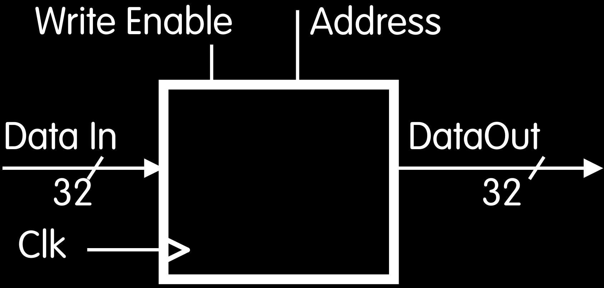

"Magic" Memory

- One input bus: Data In
- One output bus: Data Out

Memory word is found by:

- For Read: Address selects the word to put on Data Out
- For Write: Set Write Enable = 1: address selects the memory word to be written via the Data In bus

Clock input (CLK) 

- CLK input is a factor ONLY during write operation
- During read operation, behaves as a combinational logic block: Address valid ⇒ Data Out valid after  "access time"

## State Required by RV32I ISA

下面我们总结一下RV32I ISA需要的状态

Each instruction during execution reads and updates the state of : (1) Registers, (2) Program counter, (3) Memory

### Registers

- Register file (regfile) Reg holds 32 registers x 32 bits/register: `Reg[0]..Reg[31]`
- First register read specified by rs1 field in instruction
- Second register read specified by rs2 field in instruction
- Write register (destination) specified by rd field in instruction
- x0 is always 0 (writes to Reg[0]are ignored)

### Program Counter (PC)

- Holds address of current instruction

### Memory (MEM)

- Holds both instructions & data, in one 32-bit byte-addressed memory space
- We'll use separate memories for instructions (IMEM) and data (DMEM)
    - These are placeholders(占位符) for instruction and data caches
- Instructions are read (fetched) from instruction memory (assume IMEM read-only)
- Load/store instructions access data memory

> IMEM是read-only的，但是DMEM是writable的
