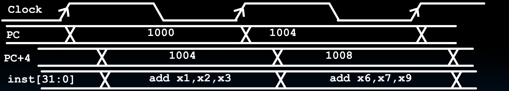

# 18.3-R-Type Add Datapath


Lecture Video Address


前面我们说了，一个Datapath是要应用于几乎所有的Instructions的。我们从一个简单的指令开始。

## Review: R-Type Instructions

下面是R-Type Instructions的Format格式


下面是每个R-Type Instructions对应的funct7,funct7及opcode的值

| instruction | funct7  | rs2 | rs1 | funct3 | rd | opcode  |
| ----------- | ------- | --- | --- | ------ | -- | ------- |
| add         | 0000000 | -   | -   | 000    | -  | 0110011 |
| sub         | 0100000 | -   | -   | 000    | -  | -       |
| sll         | 0000000 | -   | -   | 001    | -  | -       |
| slt         | 0000000 | -   | -   | 010    | -  | -       |
| sltu        | 0000000 | -   | -   | 011    | -  | -       |
| xor         | 0000000 | -   | -   | 100    | -  | -       |
| srl         | 0000000 | -   | -   | 101    | -  | -       |
| sra         | 0100000 | -   | -   | 101    | -  | -       |
| or          | 0000000 | -   | -   | 110    | -  | -       |
| and         | 0000000 | -   | -   | 111    | -  | -       |

例如：Addition/subtraction

* `add rd, rs1, rs2`: `R[rd] = R[rs1] + R[rs2]`
* `sub rd, rs1, rs2`: `R[rd] = R[rs1] - R[rs2]`

## Implementing the add instruction

```assembly
add rd, rs1, rs2
```

| instruction | funct7  | rs2 | rs1 | funct3 | rd | opcode  |
| ----------- | ------- | --- | --- | ------ | -- | ------- |
| add         | 0000000 | -   | -   | 000    | -  | 0110011 |

Instruction makes two changes to machine’s state:

* `Reg[rd] = Reg[rs1] + Reg[rs2]`
* `PC = PC + 4`

> FSM中，我们非常关注的就是哪些状态变化了

所以我们要构建的Datapath就是要实现这两个状态的更新

### Datapath for add

1. 首先，在State Elements中，需要实现PC的更新；在执行的过程中，先实现Fetch Instruction


*   PC保存着下一个执行的指令的地址，传给IMEM，IMEM在接受到地址之后会立即输出(当然有一个access time)指令inst传给下一段

    > 这里我们的IMEM的模型非常简单，只要输入地址就会输出地址对应的内容
* 在add中，PC只需要实现PC=PC+4的状态更新，因此这里只需要一个Adder，不需要mux
* 但是注意，PC的更新只有在下一个CLK信号的上升沿才会进行，在这段时间内PC一直保持不变

2. 剩下的阶段有：解码指令；执行add操作；更新reg\[rd]；（在add指令中，是没有内存访问阶段的）。电路图如下


* <mark style="background-color:green;">Instruction Decode</mark>: inst直接提取出rs2, rs1, rd的地址传给`Reg[]`，然后Reg\[]会立即输出Reg\[rs1], Reg\[rs2]的内容传给ALU
* <mark style="background-color:green;">Execute</mark>: ALU进行加法运算（这里我们默认ALU就是一个加法器，所以并没有选择信号）
* <mark style="background-color:green;">Write Register</mark>: ALU将结果反馈给Reg\[]，由于inst已经解析并输出了rd的地址给Reg\[]了，所以ALU的结果输出到busW当中，在下一个CLK的时候就会更新Reg\[rd]的值

> PC和Reg\[rd]的输入都已经稳定了，等待下一个时钟周期进行更新

3. Control


在Adder里面的Control是非常简单的，只需要一个`RegWriteEnable`用来assert Reg\[]即可

## Timing Diagram for add

下面来看看add的时序图


上面的图和原来的Datapath diagram是一样的，不过添加了`RegWEn`信号和`Clock`信号

下面我们分析在每个时钟周期内每个CL和State Element做了什么

首先是时钟Clock：我们这里有两个3个上升沿，重点分析前两个周期


1. PC


PC在Clock上升沿之后要进行update，中间有一段延迟，所以在上升沿后面小段时间更新为新的值

> 这里我们使用了bundle representation，用1000,1004来表示PC的值，而不是01bits

2. PC + 4 (Add操作)


* 执行操作也需要一定的延迟，在PC更新之后，再**经过一段时间**，PC+4有了新的值(中间经过的时间是Adder的propagation delay)
* 执行操作是不需要CLK控制的，只要PC有值，就会自动进行，PC更新之后，过一段时间也会由新的值计算出新的结果

3. `inst[31:0]`(Fetch操作)



*   PC会一直作为输入到IMEM中，但是从IMEM中读取inst也需要时间，所以PC更新后再过了一段延迟inst才会更新

    > 这里我们也是将指令的32位machine code进行反汇编，使用instructions来表示01bits
* 读IMEM的操作是不需要CLK的

4. `Reg[rs1]`, `Reg[rs2]` (Decode)


* 在inst\[31:0]更新之后，解码几乎可以立即进行，addrA, addrB也是几乎可以立即得到
* 但是读取寄存器的值并输出是需要延迟的，所以在inst\[31:0]更新后过了一段时间才会更新`Reg[rs1]`, `Reg[rs2]`
* 读寄存器操作是不需要Clock的

5. ALU(Execute)


* ALU执行需要一段时间(ALU的propagation delay)才能输出结果

5. Write Register


* 写寄存器是需要CLK控制的，因此这里在下一个CLK的上升沿后经过一小段延迟之后才会更新`Reg[rd]`
