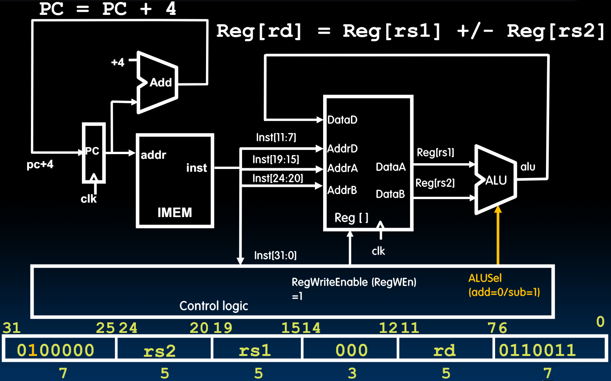

# 18.4-Sub Datapath


Lecture Video Address


本节我们会在上节addition的基础上来实现sub

## Implementing the sub instruction

```assembly
sub rd, rs1, rs2
```

| instruction | funct7  | rs2 | rs1 | funct3 | rd | opcode  |
| ----------- | ------- | --- | --- | ------ | -- | ------- |
| add         | 0000000 | -   | -   | 000    | -  | 0110011 |
| sub         | 0100000 | -   | -   | 000    | -  | -       |

* Almost the same as add, except now have to subtract operands instead of adding them
* inst\[30] selects between add and subtract

## Datapath for add/sub



1. IMEM将inst传给Control Logic
2. Logic从funct7中提取出Add和Sub不同的那一位Control bit，然后传递给ALU作为 选择信号

> 如此可以理解为什么Add和Sub那样的区别了，funct3一样是因为其使用的是一个CL: Adder/Subtractor，然后用funct7中不同的那一个bit决定是add还是subtract

## Implementing Other R-Format Instructions

| instruction | funct7  | rs2 | rs1 | funct3 | rd | opcode  |
| ----------- | ------- | --- | --- | ------ | -- | ------- |
| add         | 0000000 | -   | -   | 000    | -  | 0110011 |
| sub         | 0100000 | -   | -   | 000    | -  | -       |
| sll         | 0000000 | -   | -   | 001    | -  | -       |
| slt         | 0000000 | -   | -   | 010    | -  | -       |
| sltu        | 0000000 | -   | -   | 011    | -  | -       |
| xor         | 0000000 | -   | -   | 100    | -  | -       |
| srl         | 0000000 | -   | -   | 101    | -  | -       |
| sra         | 0100000 | -   | -   | 101    | -  | -       |
| or          | 0000000 | -   | -   | 110    | -  | -       |
| and         | 0000000 | -   | -   | 111    | -  | -       |

All implemented by decoding funct3 and funct7 fields and <mark style="background-color:green;">selecting appropriate ALU function</mark>

> R-Format的funct7和funct3都起到一个 产生ALUSel的作用
