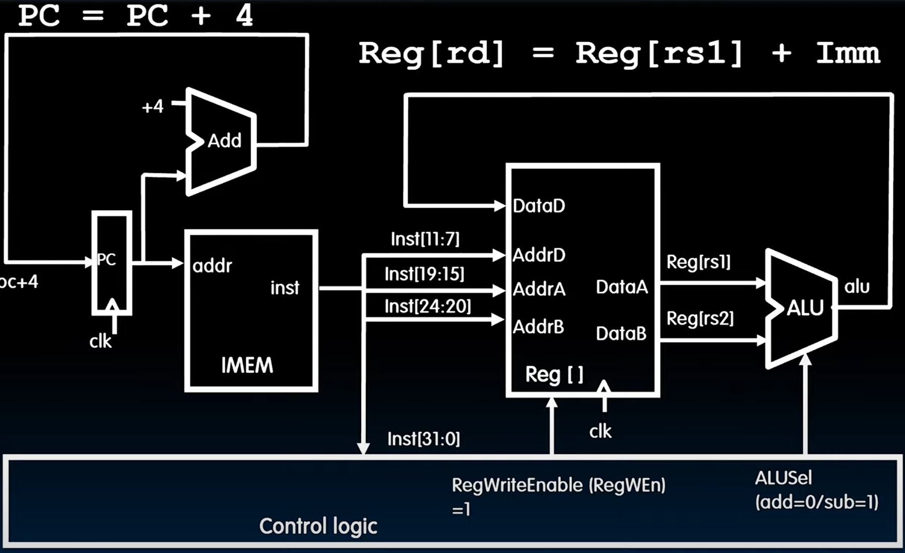
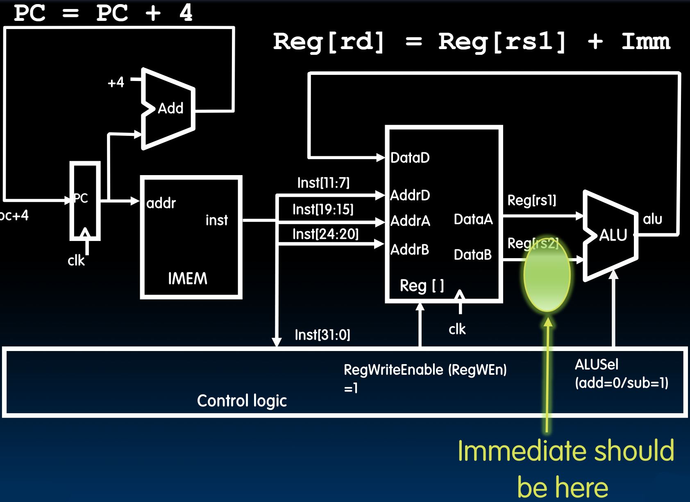
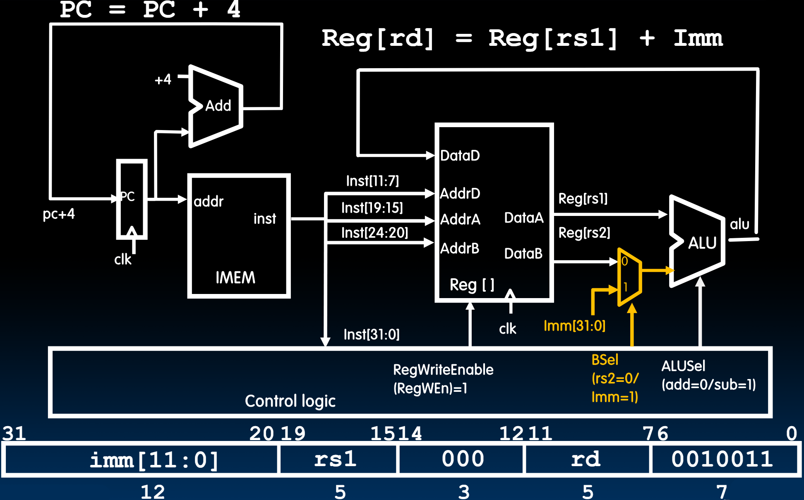
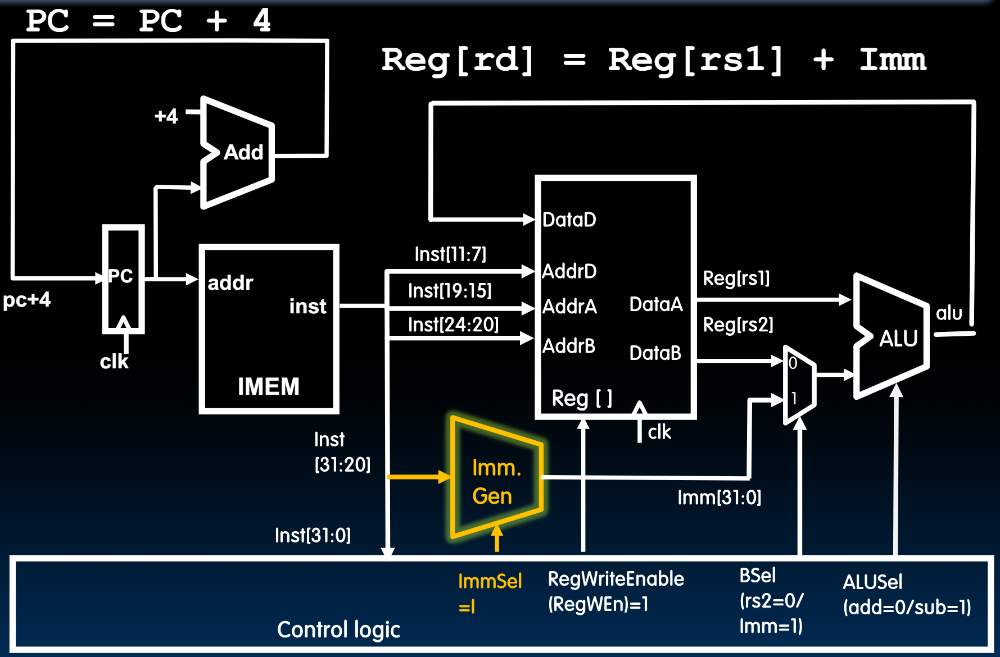
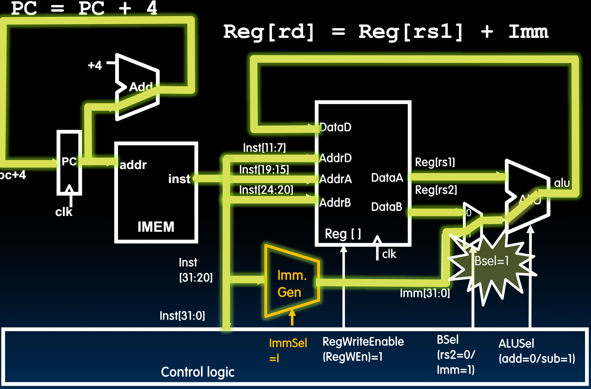
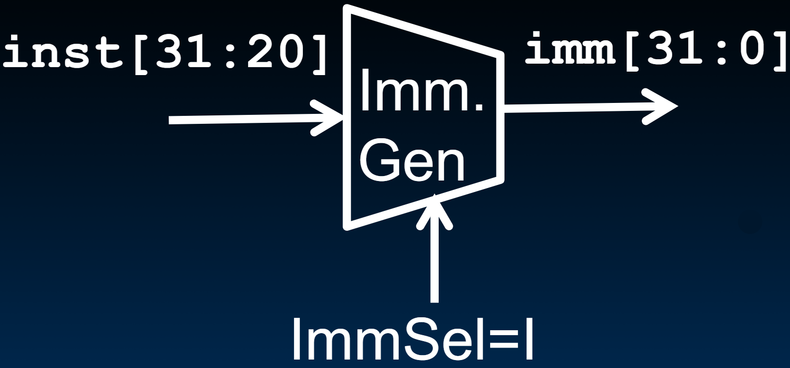
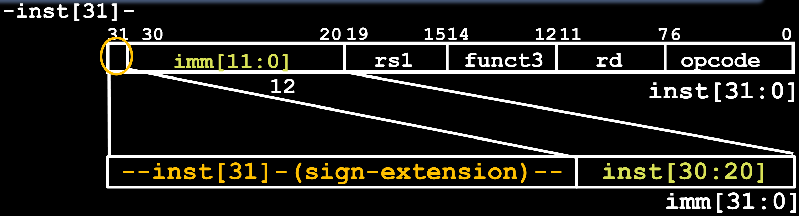

# 18.5-Datapath with Immediates


Lecture Video Address


本节来实现有I-Type Instruction

## Implementing I-Format - addi instruction

RISC-V Assembly Instruction:

```assembly
addi x15,x1,-50
```

> 没有`subi`指令，要实现sub -50的任务，使用`addi x15, x1, 50`

I-Format如下


## Datapath for add/sub

如下是add/sub的Datapath



我们在add/sub的基础上实现addi

Immediate应该加到如下的地方



> 这里替换的是Reg[rs2]而不是Reg[rs1]，因为从R-Type→I-Type，将rs2与funct7进行拼接得到了imm，rs1仍然表示寄存器

## Adding addi to Datapath

### 2-to-1 mux

1. 为了使这个Datapath同时支持I-Type和R-Type，使用2-to-1 mux来选择Reg还是Imm执行加法，如下



- Control Logic在接受了Inst之后，会根据opcode来输出BSel(意思是B Select，即B operant)的选择信号，来控制执行加法的是Imm还是Reg
- 这里mux输入的imm是32位的(Reg[rs2]和ALU的结果都是32根wires)，但是Inst中的imm是12位的，因此我们需要将这12位转化成32位

### Imm. Gen

2. 因此我们需要一个block来做立即数生成，如下图中的Imm. Gen



- Imm. Gen将由ImmSel来控制
- 不同指令类型对立即数有不同的编码，所以我们会希望这个block能够根据不同的编码生成立即数。后面我们会看到

下面就是这个datapath的流程图了



- 即便是执行的I-Type instruction，`Reg[rs2]`仍然会有输出(也就是仍然会读取rs2的值)，`Reg[rs2]`会被忽略
- 因为这个Datapath是要同时支持I-Type和R-Type，所以所有的线都会有输出，只不过会根据Control Logic的Enable决定使用哪一个（Enable也是解析Inst得到的）

## I-Format Immediates Generation

还剩下的一个问题就是如何生成立即数



> 不同指令的立即数格式不一样，所以Imm. Gen针对不同指令会执行不同的操作



- High 12 bits of instruction (`inst[31:20]`) copied to low 12 bits of immediate (imm[11:0])
- Immediate is **sign-extended** by **copying** value of `inst[31]` to fill the upper 20 bits of the immediate value (`imm[31:12]`)

> sign-extended的方式就是将imm的MSB复制20次

## Adding addi to Datapath


Works for all other I-format arithmetic instructions (`slti`,`sltiu`,`andi`, `ori`,`xori`,`slli`,`srli`, `srai`) just by changing ALUSel
