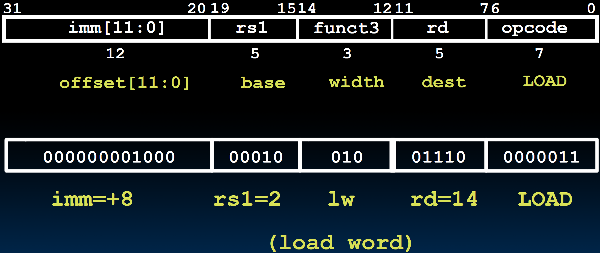
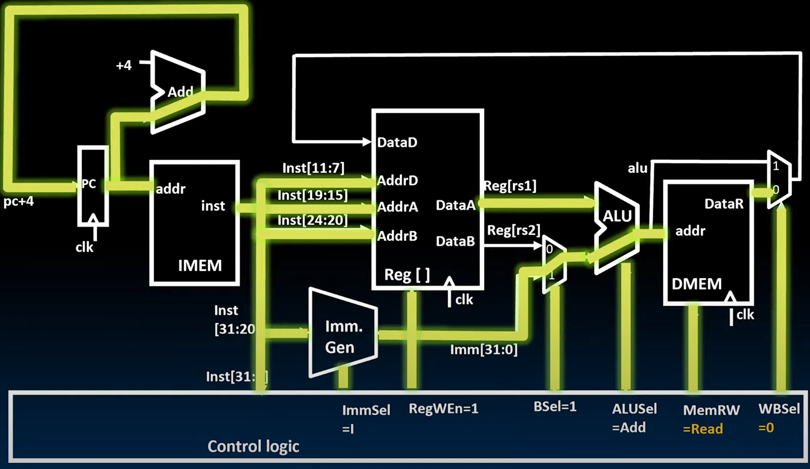

# 19.1-Supporting Loads


Lecture Video Address


## R+I Arithmetic/Logic Datapath

先来回顾一下之前的Datapath


在我们目前讨论的数据路径中，我们只有四个执行阶段。然而之前我们提到过，典型的指令执行有五个阶段。但这里的R型或I型指令不需要访问内存，所以这一阶段被省略了。

四个阶段的步骤如下：

1. 首先，我们的指令地址存储在程序计数器中。程序计数器指向指令内存，并获取我们要执行的指令。
2. 在第二阶段，我们可以对该指令进行解码。通过使用我们从指令字段解码出来的信息，我们设置控制位。同时，我们从寄存器中获取数据并准备立即数。（Control Logic的任务也属于解码阶段）
3. 在第三阶段，我们在ALU中执行指令。我们根据指令字段执行加法、减法或任何逻辑操作。
4. 在我们目前看到的指令中没有内存访问阶段。所以我们直接进入执行的第五阶段，即将ALU的输出写回到目标寄存器中。

现在，为了支持**加载**和**存储**，我们必须有数据内存DMEM。

>RISC-V 是load store type of an architecture，其中==**所有与内存的操作都仅通过加载和存储进行**==。没有其他指令类型访问内存。（也就是说只有Load指令和S-Type的指令能够访问内存）

## Add lw

### lw instruction

先来回顾一下lw instruction

lw的指令如下

```assembly
lw rd, offset(rs1)
```

类型仍然是I-Format，指令格式如下



- The 12-bit signed immediate is added to the base address in register rs1 to form the memory address
    - This is very similar to the add-immediate operation but used to create address not to create final result 
- The value loaded from memory is stored in register `rd`

---

在之前的I-Type指令中，立即数与 rs1 的值之和直接写回目标寄存器。但是在Load指令中，这个和被用来指向我们希望从中检索数据的内存地址。然后，从内存中获取的数据将被写回目标寄存器。

下面看看

### add lw in Datapath

下面看看如何在原有的Datapath中添加block以实现`lw`指令


1. ALU的结果不是直接被写入到rd当中，先传给了DMEM作为要加载数据的内存地址。内存获得内存地址后，在短暂的access time之后会输出DataR
2. alu与DataR会被送到2-to-1 mux中，通过WBSel(Write B operant Select)信号选择哪一个数据被吸入到rd当中

> - 这里的DMEM仅仅用于read，所以不用在意CLK
> - DMEM是单读单写的，只有一个Address输入，需要一个MemRW信号来控制是读还是写，这里是读

## Light up Datapath

下面我们通过Light up的方式来说明lw操作的过程

### Instruction Fetch

PC指向IMEM中指令所在的地址。


我们检索该指令，并在执行的第二阶段对其进行解码。


### Instruction Encode

在解码指令时，我们知道了这个指令要做什么什么，并设置适当的控制来执行它。在`lw`指令中，要设置下面的控制信号


| Control      | desc                                                         |
| ------------ | ------------------------------------------------------------ |
| ImmSel = I   | 将立即数设置为I型(`lw`指令是I-Type的，也遵循I-Type的生成imm的规则，后面还会看到其他类型的立即数) |
| RegWen = 1   | 这个操作要写寄存器，设置Reg File的写使能信号(Reg需要设置WEn才能进行写) |
| BSel = 1     | lw进行reg + imm，BSel控制ALU的operant B为imm，               |
| ALUSel = Add | lw执行reg+imm操作，ALUSel控制ALU执行的操作                   |
| MemRW = Read | lw仅仅读取内存，并不写内存，这里设置MemRW = Read             |
| WBSel = 0    | 选择写到寄存器的事是哪一个值，lw应该是从DMEM中读取出来的值   |

在同一时刻，准备ALU操作数

- 从Reg[]中读取得到的Reg[rs1]
- inst的inst[31:20]经过Imm. Gen之后得到的imm[31:0] （当然这一操作需要再ImmSel设置之后进行）


这样，解码阶段就全部准备就绪了。可以进行操作了

### Execute


ALU进行加法并指向数据存储器中的地址（计算结果出来后输出会直接送到DMEM的addr输入接口）

### Memory Access



- 进行内存访问

### Write Back to Register


写回目标寄存器。

### Notice

1. 在分析时，我们按照了先前将指令拆分成的五个阶段的顺序进行分析，比如先进行Instruction Decode，然后再Execute
2. 但是在实际上，有很多操作都是没有严格的前后时间顺序的，因为CL并没有CLK这样的时钟控制，会不断执行当前输入对应的输出。当输入更新之后，自动进行新的输出。并不会在所有的Control Logic的信号都准备好之后，再准备Execute

但是这样按顺序分析有助于帮助我们搞清楚并且不遗漏Datapath是怎样工作的

## All RV32 Load Instructions

实现了lw之后，其他的指令就很好实现了

| instruction | imm       | rs1  | funct3 | rd   | opcode  |
| ----------- | --------- | ---- | ------ | ---- | ------- |
| lb          | imm[11:0] | -    | 000    | -    | 0000011 |
| lh          | -         | -    | 001    | -    | -       |
| lw          | -         | -    | 010    | -    | -       |
| lbu         | -         | -    | 100    | -    | -       |
| lhu         | -         | -    | 101    | -    | -       |

Supporting the narrower loads requires additional logic to extract the correct byte/halfword from the value loaded from memory, and sign- or zero-extend the result to 32 bits before writing back to register file.

> It is just a mux + a few gates
