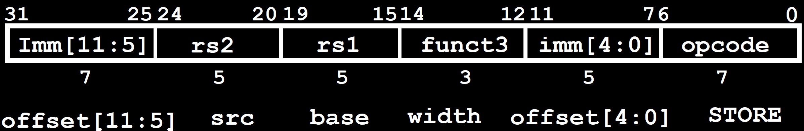
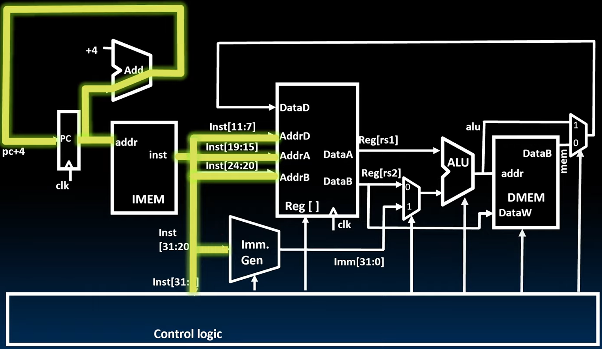

# 19.2-Datapath for Stores


Lecture Video Address


我们设计了一条可以在所有 R 类型和 I 类型指令之间共享的datapath，包括加载指令。

为了支持加载，我们在数据路径中添加了内存。我们通过指向内存地址来访问内存，然后读取值并将其存储到目标寄存器中。

本节我们要学习为了支持存储指令需要进行哪些修改。

## Adding sw instruction

以下是一个典型的存储指令，即 RISC-V 中的存储字指令。

`sw`: Reads two registers, `rs1` for base memory address, and `rs2` for data to be stored, as well immediate offset!

```assembly
sw x14, 8(x2)
```

> x14是rs2，x2是rs1,8是imm

指令格式如下。



它读取两个寄存器 rs1 和 rs2 以及指令中的立即数。我们取立即数，将其扩展并加到存储在寄存器 rs1 中的值上。这形成了用于访问内存的地址。当我们有了这个地址后，我们将寄存器 rs2 的内容写入内存。

从中我们可以看到，我们可以重用大部分数据路径：我们仍然会使用 ALU 来形成地址，将立即数值加到寄存器 rs1 的内容上。

我们需要提供一条额外的路径，将寄存器 rs2 的内容放入用于写入的内存端口中，并且需要修改内存以使其在下一个时钟周期内启用写入。


另一个重要的方面是，这次我们需要不同的立即数。因此，我们的立即数生成单元需要更新，以支持两种类型的立即数。在 I 类型立即数中，立即数位于指令的最高 12 位有效位中。但在 S 格式中，立即数被分成两部分。最高 7 位仍然在指令的最高 7 位有效位中，但最低 5 位现在位于位置 11 到 7。

> 这样做是为了在所有指令格式中保持存储寄存器地址的字段相同，因为这些字段位于关键路径中。如果在开始访问寄存器文件之前试图到处移动这些地址将会很混乱，而寄存器文件通常位于关键路径中。因此，我们需要对立即数生成单元进行修改。

## Datapath with lw


到目前为止，我们有了支持加载的数据路径。在加载操作中，这里只展示了包含 lw 的数据路径。lb和lh需要在添加一个额外的多路复用器和一些逻辑门，但为了避免过于复杂，这里省略了这些部分。

因此，我们有了数据存储器。我们添加了一个数据存储器，用于读取值并将其存回寄存器文件。我们的ALU指向我们希望读取的地址，并通过将立即数加到源寄存器 rs1 来形成地址。

我们添加的内容是这些控制信号：mem、rw 和 write back select。

## Adding  sw to Datapath

再来回顾一下store指令做什么

```assembly
sw rs2, imm(rs1)
```

将Reg[rs2]的value存储在(rs1 + imm)的内存地址当中

如下是在Load的Datapath的基础上修改得到的sw的Datapath


> 最明显的是内存模型的变化，Reg[rs2]作为DataW的输入，MemRW = write允许写入，在下一个CLK的时候会写入到内存当中

首先是Control Logic的一些变化

| Signal             | desc                                                         |
| ------------------ | ------------------------------------------------------------ |
| immSel=s           | store和load指令中imm的位置不同，因此生成imm的规则也不同。这里`s`表示生成store指令的imm |
| RegWriteEnable = 0 | sw指令写在内存当中而不是reg file当中，因此写使能信号为0，不允许写 |
| BSel               | B operant选择为imm，要进行rs1 + imm的加法，Reg[rs2]要写到内存当中，不参与加法 |
| ALUSel = Add       | ALU执行加法                                                  |
| MemRW = Write      | 允许写入到内存当中                                           |
| WBSel = *          | Write Back信号无所谓，因为RegWriteEnable = 0，所以不会在寄存器中写，WBSel选择哪个都一样 |

在电路中的变化就是：Reg[rs2]作为DMEM的DataW输入，表示要写入

> 前面已经说过，只有load指令和store指令涉及访问内存，也就是只有store会写入到内存当中，因此DataW也就只有`Reg[rs2]`这一个输入了

## Light Up Datapath

下面我们逐步电量sw指令需要的路线

1. Instruction Fetch



2. Decode Instruction


同时计算出`imm`，并且输出`Reg[rs1]`和`Reg[rs2]`


这里可以看到，Reg[rs2]的路径是到达DataW，在sw中Reg[rs2]是要写的内容，而不是参与加法的内容

3. Execute


4. Memory Access

在下一个CLK，将DataW的内容写入到内存当中

> 前面已经学过，不是所有的指令都要经过5个阶段的，`sw`指令是没有Write Register的步骤的

## I+S Immediate Generation

下面是关于Imm. Gen的组合逻辑的设计，需要能够支持I-Format和S-Format的imm

如下


> I-Format和S-Formt的Imm的格式是很想的，他们的前7位是完全一致的，所以在生成Imm的时候，将MSB，也就是inst[31]进行sign-extension，然后将后面的6位，也就是inst[30:25]赋值到imm[11:5]即可。
>
> 不同的就是最后的5位，在I-Format中，最后5位是inst[24:20]，但是在S-Format，是inst[11:7]，因此这里需要一个2-to-1 5-bit mux，根据指令的类型来选择用instruction的那一段来填充imm[4:0]

- Just need a 5-bit mux to select between two positions where low five bits of immediate can reside in instruction
- Other bits in immediate are wired to fixed positions in instruction

## All RV32 Store Instructions

还有两个store指令

- sw: Store byte writes the low byte to memory
- sh: Store halfword writes the lower two bytes to memory

| instruction | imm1      | rs2  | rs1  | width | imm2     | opcode |
| ----------- | --------- | ---- | ---- | ----- | -------- | ------ |
| sb          | Imm[11:5] | -    | -    | 000   | imm[4:0] | -      |
| sh          | Imm[11:5] | -    | -    | 001   | -        | -      |
| sw          | Imm[11:5] | -    | -    | 010   | -        | -      |

这两个指令也可以用相同的Datapath实现，只是需要添加一些门来防止覆盖
