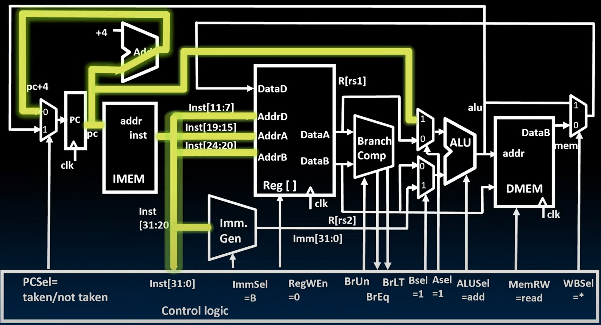

# 19.3-Implementing Branches


Lecture Video Address


我们前面已经实现了支持R-Type，I-Type，S-Type的Datapath，本节课要使其支持B-Type的指令

## RISC-V B-Format for Branches

`beq`的指令如下

```assembly
beq rs2, rs1, Label
```

- 比较rs2和rs1的内容，如果一样，进行跳转
- 跳转的本质是设置PC为给定的地址（所以B-Type指令最大的改变就是PC这个State Element的更新）

> 在Assemble和Link的过程中，会将Label替换为跳转的地址（在machine code中替换），所以后续设计Datapath的时候不需要考虑Label，只需要考虑地址的imm即可


- B-format is mostly same as S-Format, with two register sources (rs1/rs2) and a 12-bit immediate imm[12:1]

    > 最大的区别是将imm[11]后移到了inst[7]，其他的imm依次前移

- But now immediate represents values -4096 to +4094 in 2-byte increments

- The 12 immediate bits encode even 13-bit signed byte offsets (lowest bit of offset is always zero, so no need to store it) 

## Add Branches

### Analysis

下面是到目前为止的Datapath


B-Type指令要经历的阶段有：

1. Instruction Fetch
2. Decode Instruction
3. Execute(Compare Reg[rs1], Reg[rs2]，PC + Immediate)

不需要Memory Access，Write Register

我们要做的事情：

1. 验证branch condition(也就是比较两个Register)
2. 计算跳转地址

Different change to the state:

$$
\begin{equation}
PC = \begin{cases} 
PC + 4, & \text{branch not taken} \\
PC + \text{immediate}, & \text{branch taken}
\end{cases}
\end{equation}
$$

> 这里需要重点修改的State Element不是Register和Memory了，而是Program Counter

- Six branch instructions: `beq`, `bne`, `blt`, `bge`, `bltu`, `bgeu`
- Need to compute PC + immediate and to compare values of `rs1` and `rs2`
    - But have only one ALU – need more hardware

---

那么我们的datapath需要做什么呢？它需要比较rs1和rs2的内容，然后需要计算PC加上立即数。但是到目前为止我们只有一个ALU可以使用。所以我们需要添加额外的硬件。

PC + Immediate可以使用ALU来进行，额外的硬件用来比较。

### Adding Branches To Datapath

如下便是添加了branch的Datapath

branch的指令为(这里以beq为例)

```assembly
beq rs2, rs1, Label(imm)
```

- 比较rs2，rs1，并由此决定是否将PC设置为(PC + imm)


解释：

1. `Imm. Gen`要添加能够解析B-Type Immediate的逻辑
2. `Branch Comp`用于比较`Reg[rs1]`, `Reg[rs2]`，接受BrUn为比较规则，比较结果要传给Control Logic（BrUn表示unsigned还是signed，BrEq表示Equal，BrLT表示less than）
3. 将PC与DataA用一个mux连接，ASel用来选择A operant是哪一个（ASel是解析B-Type instruction后得到的）
4. ALU的结果被送回到PC之前，与PC + 4通过一个mux，选择信号为PCSel(PCSel是根据Branch Comp的结果得到的)

下面是在B-Type中的Control Logic的信号设置

| Signal                    | desc                                                         |
| ------------------------- | ------------------------------------------------------------ |
| immSel = B                | Imm. Gen要解析B-Type instruction的imm                        |
| RegWEn = 0                | B-Type不需要写寄存器                                         |
| BrUn                      | 根据instruction来确定比较的规则是unsigned和signed            |
| BrEq, BrLT                | 比较的结果，BrEq表示Equal，BrLT表示less than                 |
| BSel = 1                  | ALU执行PC + Immediate，B operant选择Immediate                |
| ASel = 1                  | ALU执行PC + Immediate，A operant选择PC                       |
| ALUSel = Add              | ALU执行PC + Immediate，操作选择Add                           |
| MEMRW = read              | B-Type没有Memory Access(只有Load和Store与内存访问相关)，为了防止内存被写，所以这里显示设置MEMRW = read防止被写 |
| WBSel = *                 | B-Type也不会写寄存器，所以Write Back Select无所谓            |
| PCSel = token / not token | 这里根据Branch Comp的结果决定                                |

## Component

下面介绍一些相关的部件

### Branch Comparator

首先重点分析Comparator


- `BrEq` = 1, if A=B
- `BrLT` = 1, if A
- `BrUn` = 1 selects unsigned comparison for `BrLT`, 0=signed(`BrUn`仅仅用于`BrLT`，因为`BrEq`会比较符号位的)

> 这里只有两个输出，是因为其他的比较结果都可以用这两个得出，比如GBE可以用BrLT取反。

- BGE branch: A >= B, if $\overline{A<B}$

### Branch Immediates Generation

另一种重要的事情的是B-Type instructions中分支和立即数编码的差异，这是RISC-V与其他一些ISA的不同之处。

#### other ISA

在其他ISA中，你会发现Immediate在指令编码中整体左移了一位，这需要我们使用一个宽多路复用器来左移或右移我们希望从指令中选择的立即数。所以有12个输入到多路复用器，产生12个输出，但所有输入都被占用了。

12-bit immediate encodes PC-relative offset of -4096 to +4094 bytes in multiples of 2 bytes

Standard approach: Treat immediate as in range -2048..+2047, then shift left by 1 bit to multiply by 2 for branches


> 这是其他的ISA的做法

Each instruction immediate bit can appear in one of two places in output immediate value – so need one 2-way mux per bit

#### RISC-V Branch

RISC-V的处理方式有点不同。它保持了大多数立即数值，12个立即数值中的11个，与我们在S格式中的位置相同，只移动了一个立即数值。这就是为什么我们有那种最初看起来有点奇怪的编码方式的原因。

但结果是，现在我们只需要一个带有两个输入的多路复用器来在两种格式之间将该位移到正确的位置。因此，S型立即数和B型立即数彼此非常相似。我们需要做的只是将第11个立即数放在正确的位置。请查看并确认这是真的。

RISC-V approach: keep 11 immediate bits in fixed position in output value,


Only one bit changes position between S and B, so only need a single-bit 2-way mux

## RISC-V Immediate Encoding

借此我们来复习一下各种Type指令中的Immediate的格式（R-Type是没有Immediate的）


B-Type和S-Type都需要将imm分段存储，但是其结构是极其相似的。

二者都需要将`inst[31]`进行sign-extension，`inst[30:25]`和`inst[11:8]`都复制到相同的位置。

区别在于，S-Type需要将inst[7]移动到imm[0]的位置，B-Type需要将`inst[7]`移动到`imm[11]`的位置。所以我们只需要一个1位的mux即可

## Lighting Up Branch Path

让我们通过Light up Branch的Datapath来说明这个指令的执行过程

### Instruction Fetch

首先通过将PC指向IMEM来接触指令。


然后我们将获取该指令，并且指令将地址指向寄存器文件中的相应字段，PC也被传到应该用到的地方。



- 这里只关心两个源寄存器，不关心目标寄存器rd。因此，RegWEn = 0，不允许写。
- inst传给Imm. Gen，通过符号扩展生成立即数
- PC送给Add执行PC + 4，因为我们可能会使用该值。
- PC被发送到ALU，用于执行后续的PC + Immediate

### Decode Instruction


设置如下指令

| Signal       | desc                                                         |
| ------------ | ------------------------------------------------------------ |
| immSel = B   | Imm. Gen要解析B-Type instruction的imm                        |
| RegWEn = 0   | B-Type不需要写寄存器                                         |
| BrUn         | 根据instruction来确定比较的规则是unsigned和signed            |
| BSel = 1     | ALU执行PC + Immediate，B operant选择Immediate                |
| ASel = 1     | ALU执行PC + Immediate，A operant选择PC                       |
| ALUSel = Add | ALU执行PC + Immediate，操作选择Add                           |
| MEMRW = *    | B-Type没有Memory Access(只有Load和Store与内存访问相关)，为了防止内存被写，所以这里显示设置MEMRW = read防止被写 |
| WBSel = *    | B-Type也不会写寄存器，所以Write Back Select无所谓            |

但是有些信号这个时候还不能确定

- BrEq和BrLT是Branch Comp的输出结果，是Control Logic的输入，并不是Control Logic的输出；要在执行阶段之后才能得到
- PCSel要根据BrEq和BrLT这两个输入后才能决定，与inst的内容无关

---

与此同时，Imm.Gen也从inst中解析生成了Immediate，并且rs1和rs2也读取出来送到Branch Comp(当然也送到了两个operant mux，但是在B-Type中不会使用这两个值用于ALU，所以没light up)


### Execute(branch comparator & PC + Immediate)

1. 首先执行Branch Comp，并将结果BrEq，BrLT传给Control Logic，用于控制PC到底去到哪里


2. ALU执行PC + Immediate的操作，并将结果写回到到mux


### update PC

1. 在接受了Branch Comp的结果之后，Control Logic会生成PCSel来选择是否进行跳转（也就是PC会更新为哪个值）


2. 然后更新PC，实现跳转


