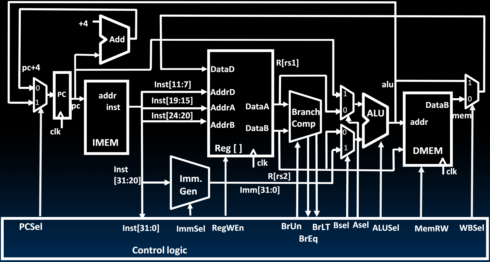
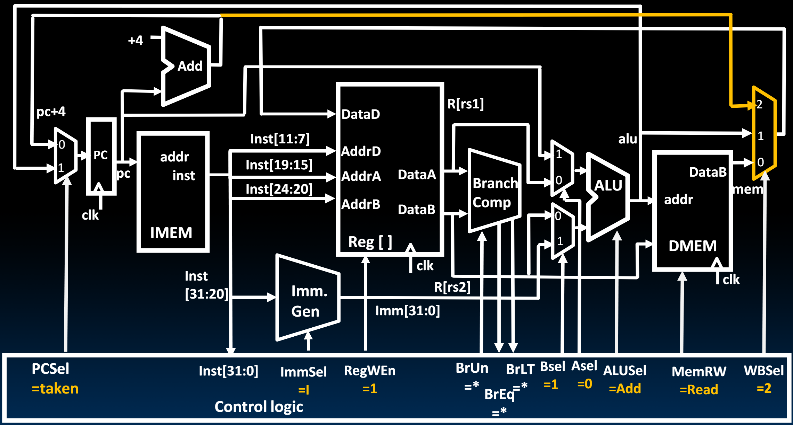
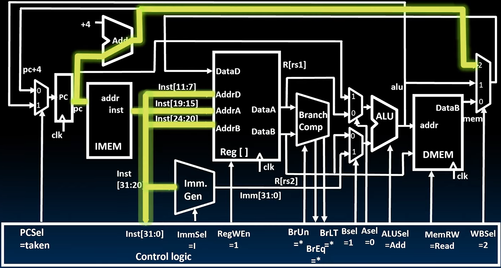
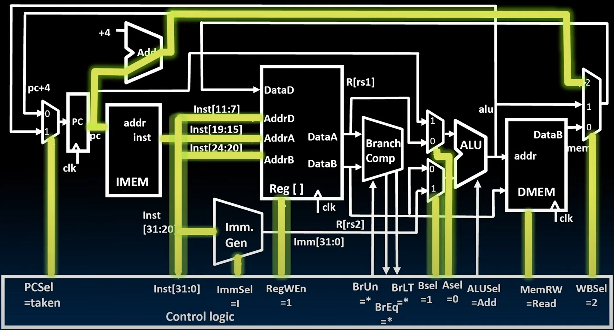
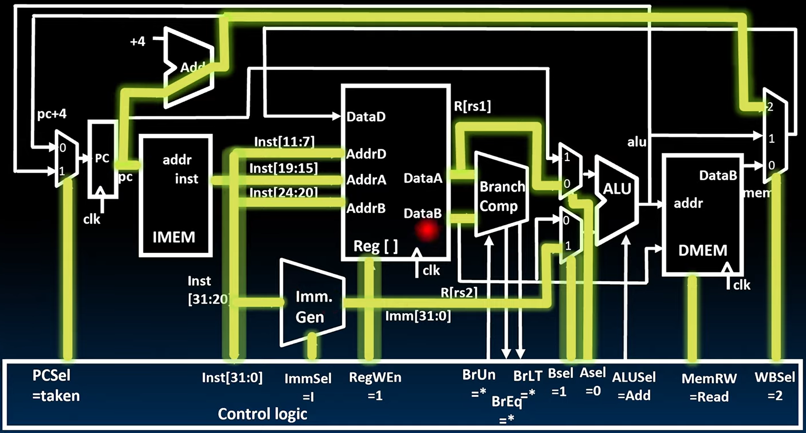
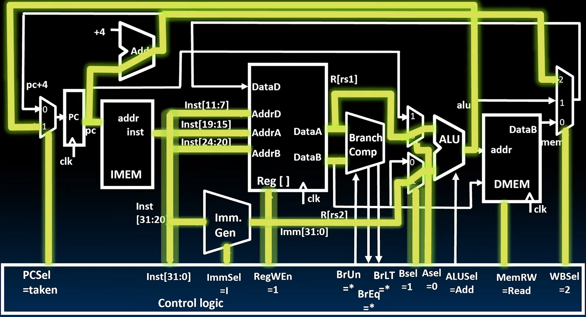
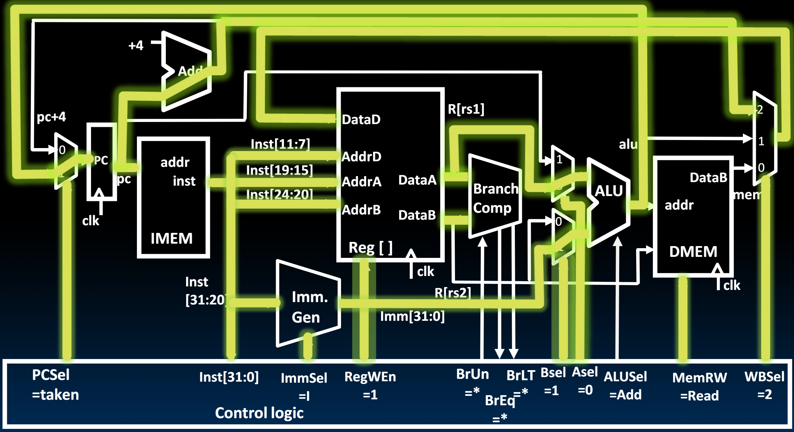

# 19.4-Adding JALR to Datapath


Lecture Video Address


> JALR: Jump And Link Register，常常在函数调用中使用

## Review JALR Instruction

JALR的instruction如下

```assembly
jalr rd, imm(r1)
```

> 先将rd设置为PC + 4(一般rd为ra寄存器，表示return address)，然后设置PC = r1 + imm的（jalr中的r就是Register，表示相对寻址）。JALR是无条件跳转

JALR也是I-Format的


- `JALR rd, rs, immediate`
- Two changes to the state
    - Writes PC+4 to rd (return address)（用于函数调用后的返回）
    - Sets PC = rs1 + immediate（进行跳转）
- Uses same immediates as arithmetic and loads
    - no multiplication by 2 bytes
    - LSB is ignored

> 在指令跳转的时候，按理说和Branch一样跳转到偶数位，也就是说最后一位默认为0，但是JALR依然使用了I-Format，这样少了一个范围位，但是简化了Datapath

## Add JALR to Datapath

下面是目前有的Datapath



我们需要两个改动：

1. 设置`rd = PC + 4`
2. 设置`PC = Reg[rs1] + Immediate`

> 这两个加法计算之前的电路已经实现了，现在需要考虑如何选择赋值。并且JALR是无条件跳转，因此信号都是固定的

电路如下



- WBmux添加了PC + 4

    > WBmux的output就是要写回到寄存器的值，将PC + 4的值放到这里

涉及到的Control Logic的信号如下

| Signal        | desc                                                  |
| ------------- | ----------------------------------------------------- |
| ImmSel = I    | Imm. Gen解析I-Type的Immediate                         |
| RegWEn = 1    | JALR指令需要将PC+4写到rd寄存器                        |
| BSel = 1      | B operant是Immediate                                  |
| ASel = 0      | A operant是Reg[rs1]                                   |
| MemRW = read  | 不需要进行内存的读写，为了防止误写，设置为默认的Read  |
| WBSel = 2     | 选择写回到寄存器rd的是PC + 4                          |
| PCSel = taken | PC的值设置为Reg[rs1] + Immediate，也就是ALU的计算结果 |

## Light up datapath

### Instruction Fetch

和之前的流程一样



这里有一个显著的事情是，尽管PC加4的值会返回到程序计数器的输入端，但这是一个从不会被选取的路径。因此，我们只点亮通往写回选择的路径。

### Decode Instruction

Control Logic之后会设置一些信号（这些信号都是固定的，上面已经提到过）



设置了信号之后，生成Immediate，然后读取Reg[rs1]传到mux再输入到ALU(Reg[rs2]的值会被忽略，不会使用)



### Excute

ALU执行Reg[rs1] + Immediate（要赋值给PC）



结果传回到PC Select mux，然后经过PCSel选择之后赋值给PC


### Write Register



PC + 4经过WBSel信号选择之后要写入到rd当中。

在下一个时钟周期，PC和rd才会更新
