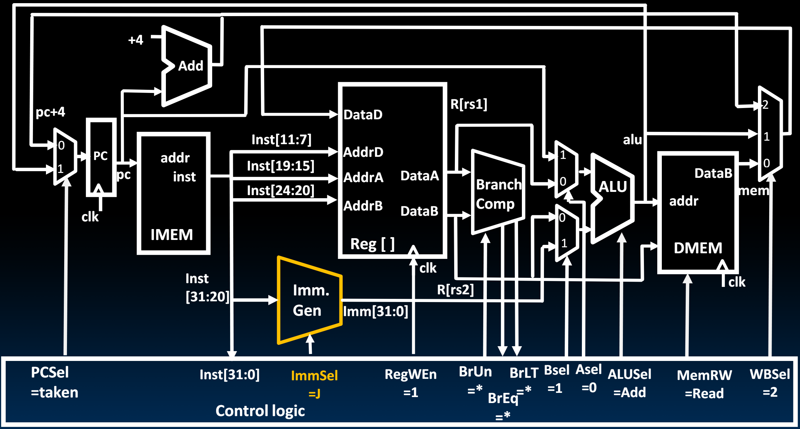

# 19.5-Adding JAL


Lecture Video Address


> 与JALR不同的是，JAL是基于PC的相对寻址(JALR是基于给定寄存器的相对寻址，跳转指令都是使用相对寻址)，使用J-Format

## J-Format for Jump Instructions

JAL的指令是

```assembly
jal rd, Label(imm)
```

> Label会在assemble和Link阶段被替换为绝对地址，当做Imm处理

如下是JAL指令对应的J-Format（J-Format中只有JAL一个指令）


Two changes to the state

* jal saves PC+4 in register rd (the return address)
* Set PC = PC + offset (PC-relative jump)

> JAL是无条件跳转，所以一些信号是固定的

Target somewhere within $$±2^{19}$$ locations, 2 bytes apart

* $$±2^{18}$$ 32-bit instructions

> J-Format中只有一个寄存器，所以有20个bits来存储Immediate，又由于RISC-V中地址跳转只能到偶数地址，所以LSB为0不用保存，实际上的Immediate为21个bits，并且是signed，所以位置的个数是 $$±2^{19}$$ locations，或者说 $$±2^{18}$$ 32-bit instructions

## Add JAL(J-Format) to Datapath



在原来的基础上要实现JAL，我们只需要使得Imm. Gen能够解析J-Format的Immediate


Immediate encoding optimized similarly to branch instruction to reduce hardware cost

***

整个执行流程和上一节中得到的支持JALR的流程只有两点不同（可以查看上一节的Light up过程）

1. ImmSel = J，表明解析J-Format的Immediate
2. ASel = 1，选择PC进行加法PC + Immediate

> 在下一个CLK的时候，PC和rd寄存器更新
