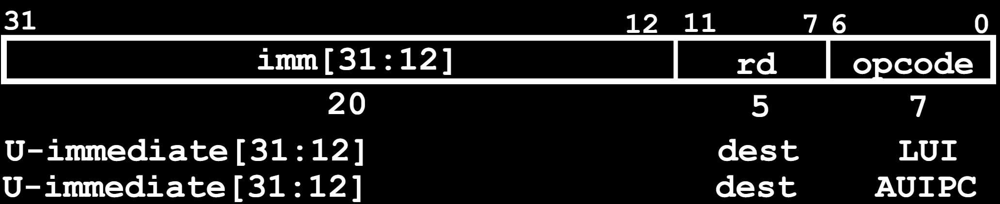
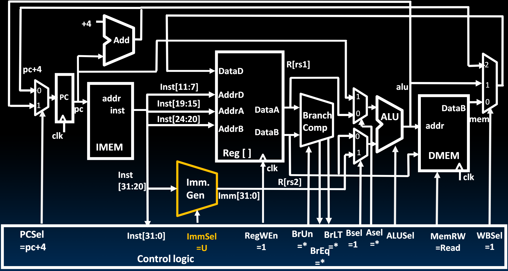

# 19.6-Adding U-Types


Lecture Video Address


## U-Format for "Upper Immediate" Instructions

U-Format Instruction如下

- Has 20-bit immediate in upper 20 bits of 32-bit instruction word(这点和J-Format很类似，但是Immediate的排版方式不同)
- One destination register, `rd`
- Used for two instructions
    - `lui` – Load Upper Immediate
    - `auipc` – Add Upper Immediate to PC(最终结果是存储在rd寄存器当中)

## Datapath With LUI, AUIPC

在原来的基础上支持U-Type，我们仅仅需要让Imm.Gen能够解析U-Type并生成对应的Immediate

## Lighting Up LUI

LUI的状态更新只有`rd = Immediate`

- 这里仅仅点亮了用到的线路，没点亮的线路仍然有值并且会执行，但是可能不会用到
- Control Logic的信号都是固定的，例如PCSel = PC +4, WBSel = 1(表示写入的是Immediate)

### Instruction Fetch

- 这里没有rs1，rs2，所以inst[19:15], inst[24:20]没有被点亮
- 但是需要生成Immediate

### Decode Instruction

关于Control Logic的信号

| Signal         | desc                                                 |
| -------------- | ---------------------------------------------------- |
| ImmSel = U     | Imm. Gen解析U-Type的Immediate                        |
| RegWEn = 1     | LUI指令需要将Immediate写到rd寄存器，允许写           |
| BSel = 1       | B operant是Immediate                                 |
| ASel = *       | ALU的执行与A operant无关                             |
| **ALUSel = B** | 这里不进行任何操作，所以直接将B作为输出              |
| MemRW = read   | 不需要进行内存的读写，为了防止误写，设置为默认的Read |
| WBSel = 1      | 选择写回到寄存器rd的是ALU的结果，也就是Immediate     |
| PCSel = PC + 4 | PC的值设置为PC + 4                                   |

同时 生成Immediate

### Execute

没有执行结果，ALUSel = B，直接将Immediate作为输出

### Write Register

将ALU的输出，也就是Immediate写回到寄存器

## Lighting Up AUIPC

执行过程和LUI非常类似

- 这里点亮了PC→A operant mux的路线，需要计算PC + Immediate
- ALUSel = Add

- WBSel = 1，将ALU的结果，也就是PC + Immediate写回到寄存器
