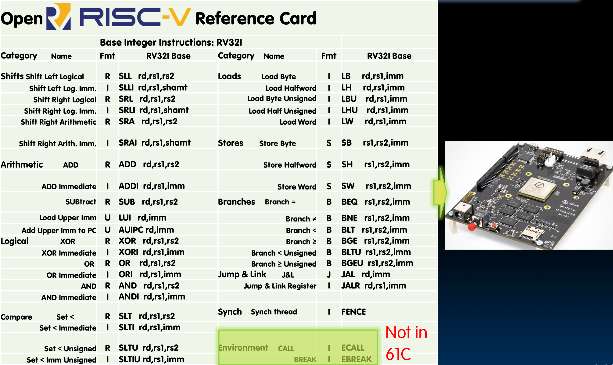

# 19.7-Single-Cycle CPU Datapath Summary


Lecture Video Address


## Complete RV32I Datapath!

到现在，我们已经实现了所有的6种格式的指令

这能够使我们执行任何可以编译为RISC-V汇编语言的C程序

## Complete RV32I ISA!

## Review

We have designed a complete datapath

- Capable of executing all RISC-V instructions in one cycle each
- Not all units (hardware) used by all instructions（之前在点亮Datapath的时候，可以看到不是所有的路线都点亮了）

5 Phases of execution

- IF, ID, EX, MEM, WB
- Not all instructions are active in all phases

Controller specifies how to execute instructions

- We still need to design it
