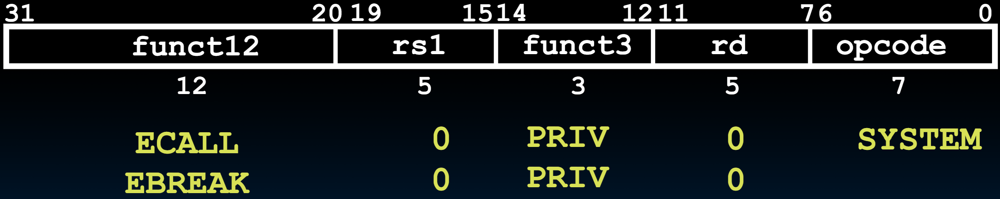

# 20.1-Control and Status Registers


Lecture Video Address


## Datapath


在前面的两节课，我们已经设计出能够支持所有类型指令的Datapath，这是一个可配置的Datapath，可以通过配置来执行RV32I中的所有指令。其中，我们仅仅说了Control Logic需要做什么，但是还没有进行设计，这就是我们这节课要做的事情。

但在此之前，让我们看看每台计算机几乎都需要具备的几个其他组件。

## Control and Status Registers

### Introduction

Control and status registers (CSRs) are separate from the register file (x0-x31)（CSR与ISA中的Register file是分离开的，它们靠近处理器，但不如通用整数寄存器那么近。）

* 它们用于不同类型的目的，包括监控状态和性能，以及与其他设备如外设或同一芯片上的其他单元通信。
* RISC-V ISA允许寻址多达4096个CSRs，尽管在大多数情况下，我们不会有那么多。

那么这些CSRs是什么？它们用于什么？

* 当我们谈到监控性能时，我们通常关心程序执行的效果。因此，CSRs可能会计算我们执行的周期数或已经完成的指令数。
* 它们可以用于与核心处理器（如floating point unit）或外围设备（如打印机）通信。通常，通信是通过将某种控制字放入寄存器中，该寄存器由外围设备拾取并执行相应操作完成。当操作完成后，外围设备会将其状态（如准备就绪、等待或完成）放入寄存器中，处理器便会知道该操作已经完成。
* 在某些情况下，通信只是单个bit或一个flag(而不必是整个word)。这与我们曾经使用邮政服务的方式类似。传统的邮箱中，有人会将邮件放入邮箱并升起一个flag。当邮递员来取走邮件时，他们会放下或清除flag。这也是为什么我们称处理器中的某些单位信息为flag，并对其进行设置和清除的原因。

几乎所有处理器中都有CSRs，但它们不是基本ISA的一部分。它们曾经是基本ISA的一部分，但为了模块化的原因，它们被移除了。因此，RISC-V中有一个标准扩展覆盖了这些CSRs。

> ChatGPT
>
> 控制寄存器（Control Register）和状态寄存器（Status Register）是计算机系统中的重要组成部分，负责管理和监控处理器及其操作。这些寄存器主要用于控制处理器的运行状态、处理器模式以及中断处理等功能。
>
> #### 控制寄存器 (Control Registers)
>
> 控制寄存器用于控制处理器的操作和状态。它们可以包含多种信息，如：
>
> 1. **模式寄存器**：用于切换处理器的运行模式，例如用户模式和内核模式。
> 2. **中断控制寄存器**：用于启用或禁用中断，以及管理中断优先级。
> 3. **内存管理寄存器**：用于配置内存管理单元（MMU），包括页表基地址寄存器、段寄存器等。
> 4. **时钟控制寄存器**：用于管理处理器时钟频率及其分频器。
> 5. **I/O控制寄存器**：用于管理输入输出操作，包括端口地址和数据传输控制。
>
> #### 状态寄存器 (Status Registers)
>
> 状态寄存器用于反映处理器当前的状态和操作结果。它们可以包含以下信息：
>
> 1. **程序状态字（PSW, Program Status Word）**：包含条件码、处理器模式、优先级等信息。
> 2. **标志寄存器（Flags Register）**：包括零标志、进位标志、溢出标志、符号标志等，用于表示最近一次运算的结果。
> 3. **异常状态寄存器**：用于指示处理器当前的异常状态，如页面错误、总线错误等。
> 4. **中断状态寄存器**：用于指示当前处理中断的状态和优先级。
>
> #### 应用
>
> 1. **操作系统管理**：操作系统利用这些寄存器来管理任务切换、中断处理和系统调用等。
> 2. **故障检测和处理**：状态寄存器中的标志用于检测和处理运行时错误和异常。
> 3. **优化性能**：通过控制寄存器调节处理器的时钟和电源管理，可以优化系统性能和能效。
>
> #### 总结
>
> 控制寄存器和状态寄存器在计算机体系结构中扮演着至关重要的角色，它们不仅帮助管理和优化处理器的运行，还在故障检测和处理方面发挥关键作用。理解这些寄存器的功能和应用有助于深入掌握计算机系统的工作原理。

### CSR Instructions

要控制CSRs，需要使用指令。这些指令采用了I-Format。

有两种类型的CSR指令，一种是带有源寄存器的，另一种是使用立即数的。所以其中一半有一个寄存器操作数，另一半有一个立即数操作数。区别就在于inst\[19:15]，如下（inst\[19:15]表示source或者uimm\[4:0]）


*   I-Format的upper 12 bits用于立即数，而在CSR Instruction中这12bits表示CSRs的序号（也就是哪一个CSR）

    > 因为有12 bits用于表示CSRs，所以可以最多有2^12^ = 4096个CSRs
* funct3用于表明执行的是哪个操作
* opcode固定是1110011，表示是CSR Instructions，也是系统指令

***

这些CSR通常是与通用寄存器一起工作。我们要做的就是将CSR中的值与通用寄存器的值**交换**。

如下是一些指令

| Instr   | rd  | rs  | Read CSR? | Write CSR? | desc            |
| ------- | --- | --- | --------- | ---------- | --------------- |
| csrrw   | x0  | -   | no        | yes        | 将x0的值赋予指定的CSR   |
| csrrw   | !x0 | -   | yes       | yes        | 将rd与指定的CSR的内容交换 |
| csrrs/c | -   | x0  | yes       | no         | 读取制定CSR到        |
| csrrs/c | -   | !x0 | yes       | yes        |                 |

一个很好的例子是基本的CSR读写指令`csrrw`，它将我们正在寻址的特定CSR中的内容复制到目标寄存器中。

同时，它将源寄存器rs1中的值复制到CSR中（这是在目标寄存器是x零以外的任何寄存器时完成的）如果是x零，那么我们不会读取CSR，因为我们不能更改x零中的值。（而仅仅是将CSR设置为0）

> 在RISC-V架构中，`csrrw`（Control and Status Register Read and Write）指令用于对控制和状态寄存器（CSR, Control and Status Register）进行读写操作。具体来说，这条指令能够将一个寄存器的值写入到指定的CSR中，同时将该CSR的原始值存入另一个寄存器。它的基本功能可以描述如下：
>
> * 读取指定CSR的当前值。
> * 将指定寄存器的值写入到这个CSR中。
> * 将之前读取到的CSR值存入另一个指定寄存器中。
>
> `csrrw`指令的格式如下：
>
> ```assembly
> csrrw rd, csr, rs1
> ```
>
> 其中：
>
> * `rd`：目标寄存器，用于存放从CSR中读取的值。
> * `csr`：要访问的控制和状态寄存器的编号。
> * `rs1`：包含要写入CSR的新值的源寄存器。
>
> 指令执行的步骤如下：
>
> 1. 将CSR中原来的值存入寄存器`rd`。
> 2. 将寄存器`rs1`中的值写入到CSR中。
>
> 例如：
>
> ```assembly
> csrrw x5, 0x300, x10
> ```
>
> 这条指令将：
>
> 1. CSR编号为0x300的寄存器的值读到寄存器`x5`。
> 2. 将寄存器`x10`中的值写入到CSR编号为0x300的寄存器中。
>
> 这条指令可以用于在系统中进行特权级操作、处理器状态的读写以及其它需要操作CSR的情形。

`csrrs/c`是在读取后(只有读取)设置为1(set)或者清除为0(clear)。这些基本上是设置或清除CSR已读标志

> 在RISC-V架构中，`csrrs`指令是一个用于访问和修改控制状态寄存器（CSR）的指令。具体来说，`csrrs`指令的全称是 "Control and Status Register Read and Set"。它的作用是读取指定的CSR，并将读取到的值和一个指定的立即数或寄存器的值按位“或”运算，然后将结果写回到CSR。
>
> `csrrs`指令的语法如下：
>
> ```assembly
> csrrs rd, csr, rs1
> ```
>
> 其中：
>
> * `rd` 是目标寄存器，用于存放从CSR读取的值。
> * `csr` 是CSR的编号，指定要访问的控制状态寄存器。
> * `rs1` 是源寄存器，包含要与CSR的当前值进行按位“或”运算的值。
>
> 操作步骤如下：
>
> 1. 读取指定的CSR的当前值，并将其存入目标寄存器 `rd`。
> 2. 将CSR的当前值与源寄存器 `rs1` 的值进行按位“或”运算。
> 3. 将运算结果写回到指定的CSR中。
>
> 一个使用`csrrs`指令的例子：
>
> ```assembly
> csrrs x5, 0x300, x10  # 将CSR编号为0x300的寄存器的值按位“或”寄存器x10的值，然后存入x5
> ```
>
> 在这个例子中：
>
> * `0x300` 是要访问的CSR的编号。
> * `x10` 是源寄存器，包含要与CSR当前值进行按位“或”运算的值。
> * CSR编号为 `0x300` 的当前值将存入 `x5`，同时将 `0x300` CSR的值与 `x10` 的值按位“或”后写回到 `0x300`。
>
> `csrrs`指令常用于在不丢失CSR的现有内容的情况下，设置特定位，同时能够读取CSR的原始值。

> 在RISC-V中，`csrrc`指令（Control and Status Register Read and Clear）是一条用于访问控制和状态寄存器（CSR, Control and Status Register）的指令。具体来说，`csrrc`指令的作用是从一个指定的CSR中读取当前的值，并将一个指定的值与其进行按位与非（bitwise AND with the complement）操作，然后将结果写回到该CSR中。
>
> 指令格式为：
>
> ```assembly
> csrrc rd, csr, rs1
> ```
>
> 其中：
>
> * `rd`：目标寄存器，用于存储从CSR中读取的值。
> * `csr`：控制和状态寄存器的地址。
> * `rs1`：源寄存器，包含将用于与CSR的当前值进行按位与非操作的值。
>
> 操作过程如下：
>
> 1. 从`csr`指定的CSR中读取当前值并将其存储到`rd`中。
> 2. 将`rs1`寄存器的值按位取反（补码），然后与CSR的当前值进行按位与操作。
> 3. 将结果写回到`csr`指定的CSR中。
>
> 例如：
>
> ```assembly
> csrrc x5, 0x300, x6
> ```
>
> 在这条指令中：
>
> * CSR地址`0x300`（假设为`mstatus`寄存器）。
> * `x5`寄存器将被赋值为`mstatus`寄存器的当前值。
> * `x6`寄存器的值会与`mstatus`寄存器的当前值进行按位与非操作，然后结果写回到`mstatus`寄存器。
>
> 简而言之，`csrrc`指令用于读取CSR的值，同时将指定的值清零（即，对指定的值按位取反后与CSR的当前值进行与操作），并将结果写回到CSR中。

***

然后还有立即数类型的CSR指令。其工作方式完全相同。不同之处在于，在源字段中，我们不是存储源寄存器的地址，而是存储立即数值，这个立即数值是五位，需要扩展以写入32位CSR(它始终是零扩展的，对状态位进行符号扩展是没有意义的。我们从未对CSR进行算术运算)。

| Instr    | rd  | rs | Read CSR? | Write CSR? |
| -------- | --- | -- | --------- | ---------- |
| csrrwi   | x0  | -  | no        | yes        |
| csrrwi   | !x0 | -  | yes       | yes        |
| csrrs/ci | -   | 0  | yes       | no         |
| csrrs/ci | -   | !0 | yes       | yes        |

#### CSR Instruction Example

The CSRRW (Atomic Read/Write CSR) instruction 'atomically' swaps values in the CSRs and integer registers.

* We will see more on 'atomics' later

CSRRW reads the previous value of the CSR and writes it to integer register rd. Then writes rs1 to CSR

```assembly
csrrw rd, csr, rs1
```

Pseudoinstruction `csrw csr, rs1` is `csrrw x0, csr, rs1`

* `rd=x0`, just writes rs1 to CSR

Pseudoinstruction `csrwi csr, uimm` is `csrrwi x0, csr, uimm`

* `rd=x0`, just writes uimm to CSR

> Hint: Use write enable and clock… CSRs也仅仅是寄存器，在写的时候需要write enable和Clock信号

## System Instructions

有一些基本指令集中更多的指令我们将在本课程中不予实现。但有时它们会在我们的汇编代码中出现。

* `ecall` – (I-format) makes requests to supporting execution environment (OS), such as system calls (syscalls)
* `ebreak` – (I-format) used e.g. by debuggers to transfer control to a debugging environment（将控制权转移到调试器）



`fence` – sequences memory (and I/O) accesses as viewed by other threads or co-processors

> `fetch`在这门课中出现的频率更低。这是一个将内存和IO访问与其他线程和进程分离的指令。就这些了。
