# 20.2-Datapath Control


Lecture Video Address


***

从本节开始，要设计Control Logic来配置Datapath

## Our Single-Core Processor


Control 和 Datapath都是在CPU内部的

### Single-Cycle RV32I Datapath and Control


Control Unite主要是位于这张图底部的Control Logic。

在数据路径内，我们有许多functional units，如PC、Add、IMEM、Imm. Gen、Reg File、Branch Comp、ALU、DMEM以及多个mux，这些多路复用器允许我们配置这个数据路径以执行指令。

Control Logic负责设置这些多路复用器和数据路径内的其他配置选项以执行不同的指令。

所以，为了真正理解这将如何完成，我们来看几条指令的执行，并看看控制单元如何处理它们，同时尝试理解处理器内部的不同计算或不同操作是如何并发发生的。

## Light Up Datapath

### sw

sw的指令如下

```assembly
sw rs2, imm(rs1) # 数据方向为→
```

> 将Reg\[rs2]的内容存储到Mem\[rs1 + imm]，寄存器相对寻址

S-Format如下

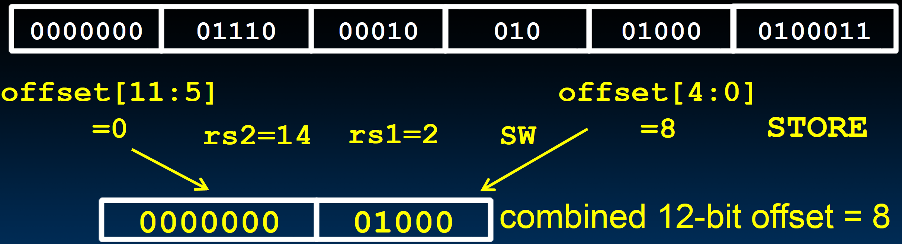

sw的状态变化：

* `PC = PC + 4`
* `DMEM[Reg[rs1] + imm] = Reg[rs2]`

***

下面逐步点亮Datapath来分析其执行过程（两次相邻的CLK的上升沿之间的分析）

#### Instruction Fetch

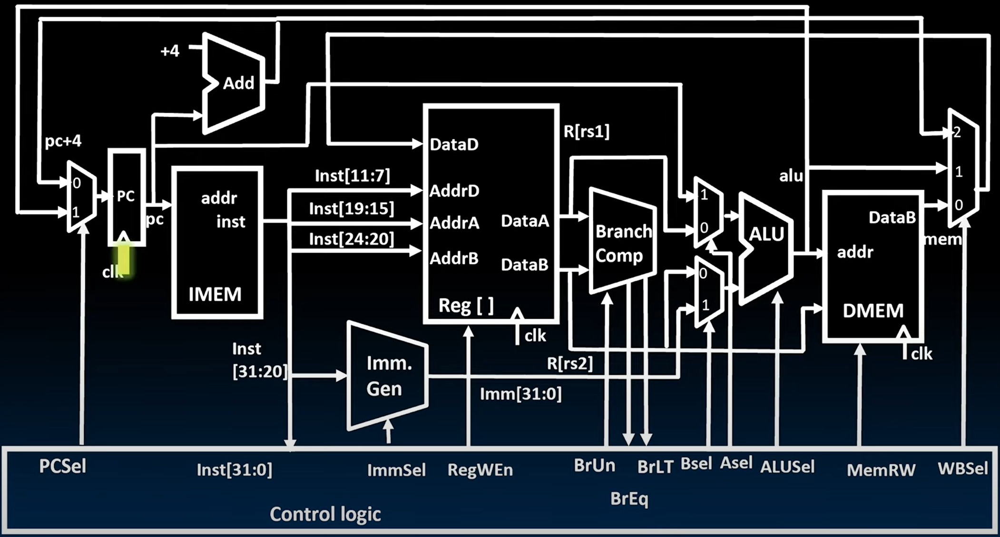

* 数据路径中的每条指令都在时钟脉冲时开始执行。在时钟的上升沿，向PC写入一个新值。
* 该值需要一点时间才能出现在PC的输出端，这里的**写入时间**是$$t_{clk-q}$$
* 在$$t_{clk-q}$$后，我们在这里得到了一个有效的PC地址，指向IMEM。

> 此时PC已经准备好被更新，并且可能在后续的数据路径中使用。

接下来发生了什么

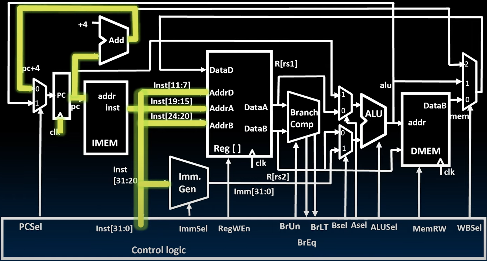

有两件事同时发生：**从IMEM中获取一条指令**；**更新PC**。

* **更新PC**：当我们将PC+4添加到PC时，在多路复用器的输入端得到一个新值。但是**在知道PCSel的新值之前，它不会通过多路复用器传播**(所以PC + 4就会在这里等待，直到PCSel才会通过多路复用器)。为了让它通过，我们需要知道实际执行的指令是什么以及它如何影响PC选择信号。
*   **从IMEM中获取指令**：在我们加上4的**同时**，我们从IMEM中得到了我们的指令。

    > 这里有一点要将记住：通过指令存储器和这个固定加法器的传播延迟是相当的。之前我们提到过，从内存中读取要花很长的时间，而执行加法操作并不需要这么长的时间。
    >
    > 但是这里并不是从内存中读取，而是读取一部分指令的副本，使得我们可以很快的读取指令。这是缓存cache的概念（在后面会介绍到，但现在不需要了解cache的细节，只需要知道读取指令是很快的，与执行PC + 4的时间是相当的）

#### Instruction Decode

一旦接收到一个指令，就可以用从该指令中获得的不同数据**同时**做多件事。

* 由于寄存器文件中不同寄存器的地址总是在指令的固定位置，因此，我们可以直接从那些位置获取寄存器地址。即使我们不需要使用某些寄存器(比如这里不需要Reg\[rd])，如果这个指令不操作寄存器，也不会对我们造成任何损失(从指令中解析寄存器地址是不需要什么开销的)。我们可以获取数据，然后如果不需要就丢弃。但我们不必等待控制信号继续执行。
* 同时，我们可以生成一个立即数（Inst会传给Imm. Gen），但是怎么生成立即数需要Control Logic来决定。
* 同时做的第三件事是确定这是哪种指令以及控制信号应该是什么值。

> 这些任务都是读取指令后解码指令的部分

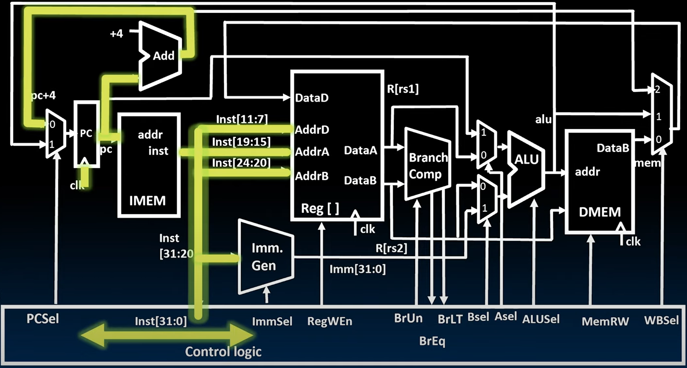

* Control Logic在接受到Inst之后，会解析指令中的相应位，从而生成Control signals（Control Logic本质上是一系列逻辑门，布尔逻辑门，这些逻辑门从指令中获取比特并根据这些比特决定控制信号）

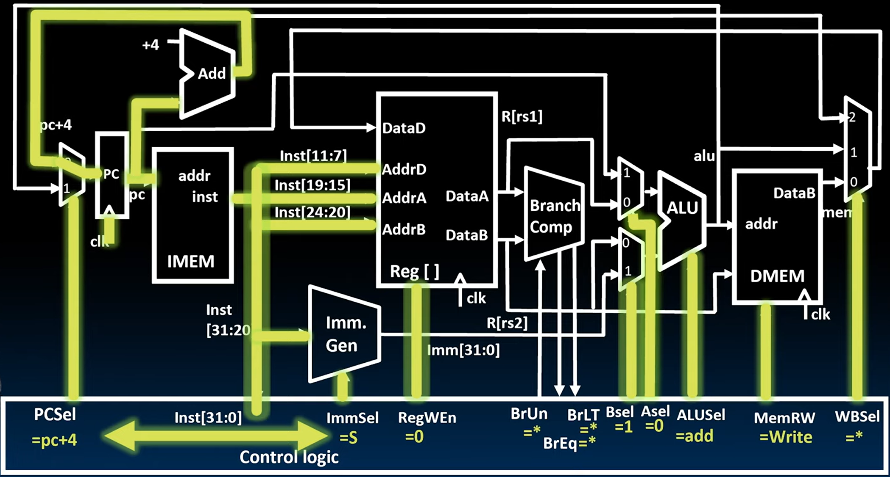

生成的指令含义如下

| Signal                          | Desc                                                  |
| ------------------------------- | ----------------------------------------------------- |
| ImmSel = S                      | Imm. Gen按照S-Format解析生成Immediate                       |
| RegWEn = 0                      | Store指令不需要写寄存器                                        |
| BrUn = \*, BrEq = \*, BrLT = \* | Store指令与比较无关                                          |
| BSel = 1, ASel = 0              | 执行Reg\[rs1] + Imm, A operant为Reg\[rs1], B operant为Imm |
| ALUSel = Add                    | 执行加法操作                                                |
| MemRW = Write                   | Store要讲数据写入到DMEM，启动写使能信号                              |
| WBSel = \*                      | 已经设置RegWEn = 0，不可能Write Back，所以WBSel无所谓               |
| PCSel = PC + 4                  | 没有跳转，PC更新为下一条指令                                       |

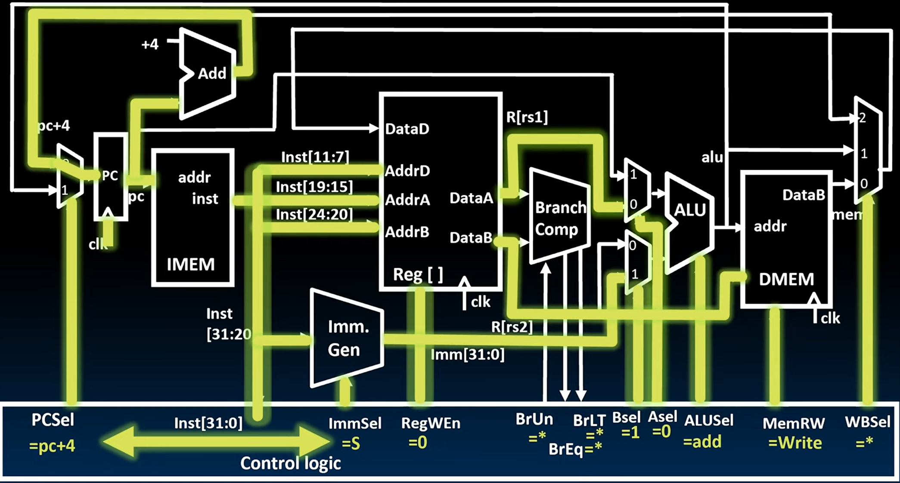

* 与此同时，还进行着**从寄存器文件中获取数据**；**生成立即数**。

> 立即数生成可能比从寄存器获取数据花费的时间稍长一些，因为它受限于确定我们需要哪种立即数（需要知道ImmSel）。但二者仍然是Comparable的。此，我们将大约在同一时间获得rs1和rs2的值以及立即数，然后我们可以继续执行指令的其余部分。它们将通过多路复用器传播。

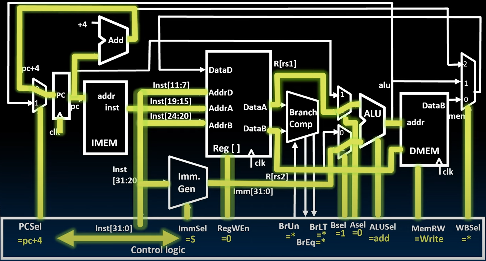

* ALU执行加法计算得出结果，作为addr送到DMEM。

> 此时我们就有了完成指令所需要的一切数据：
>
> * `PC + 4`通过多路复用器送到PC
> * 在DMEM中，`addr = Reg[rs1] + Imm`已经计算并送到输入口，`Reg[rs2]`已经送到数据输入口，`MemRW = Write`使能信号也准备就绪。
>
> 在Store指令中，需要的状态更新就是`PC = PC + 4`, `DMEM[Reg[rs1] + Imm] = Reg[rs2]`，在下一个时钟信号之前，所有的数据和信号都准备好了。万事俱备，只欠东风。

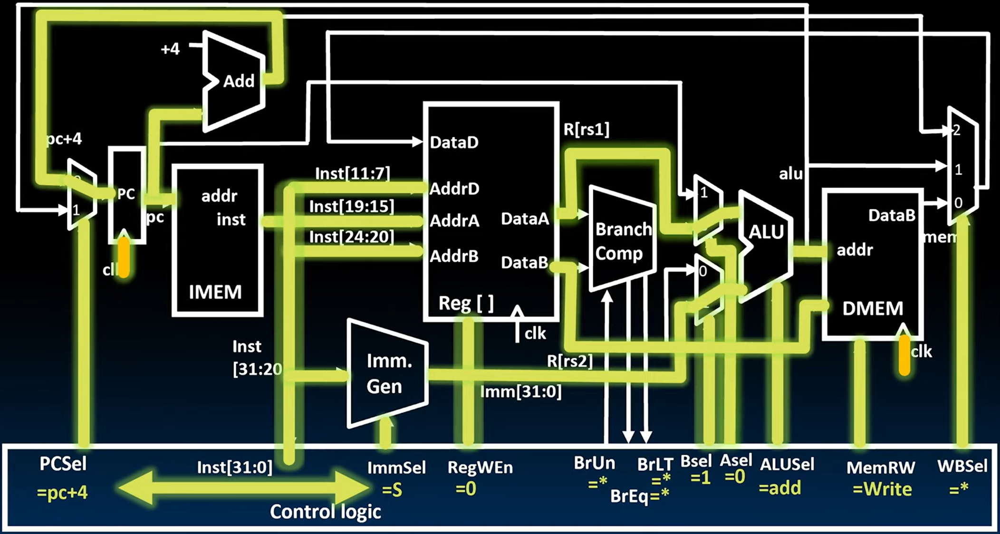

* 完成这条指令所需的唯一事情是再次提高时钟信号。因此，在这个时钟脉冲上，PC和DMEM都会更新。我们已经完成了这条指令，并且实际上已经同时开始执行下一条指令。

### beq

beq的指令如下:

```assembly
beq rs2, rs1, Label(imm)
```

> 在assemble和link的的时候，Label会被relocate，替换为立即数
>
> 指令的作用：比较rs1和rs2，如果相等的话，那么设置PC = PC + imm(PC-relative)


> 这里由于Branch跳转的位置是偶数位，所以最后一位不用保存，并且为了在生成Imm的时候与其他指令尽可能保持一致，将imm\[11]移到最低位，其他的imm前移

在beq指令中，需要更新的状态为

$$
PC = \begin{cases} PC + 4, & \text{branch not taken} \\ PC + \text{immediate}, & \text{branch taken} \end{cases}
$$

过程如下：

#### Instruction Fetch

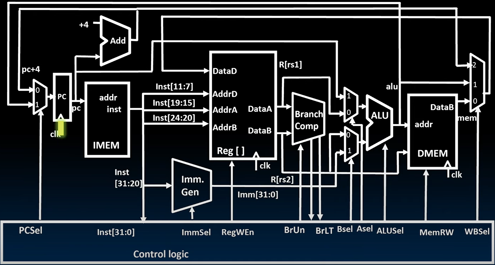

* 在时钟的上升沿，向PC写入一个新值。
* 该值需要一点时间才能出现在PC的输出端，这里的**写入时间**是t~~clk-q~~
* 在Clock to output delay后，我们在这里得到了一个有效的PC地址，指向IMEM。

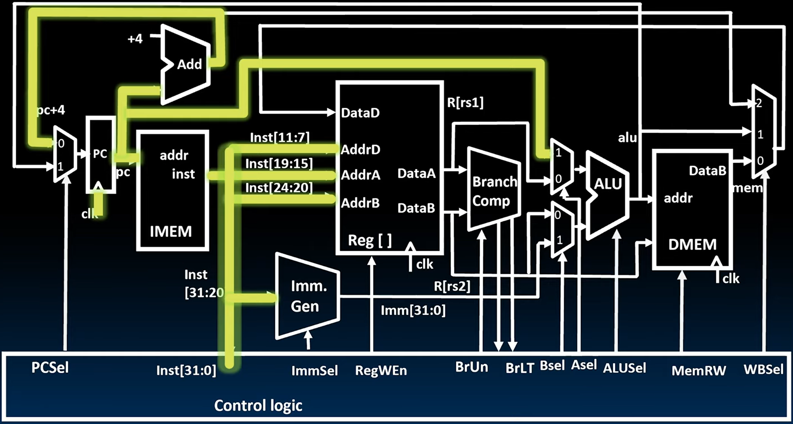

有两件事同时发生：**从IMEM中获取一条指令**；**计算PC + 4**。

*   **计算PC + 4**：当我们将PC+4添加到PC时，在多路复用器的输入端得到一个新值。但是**在知道PCSel的新值之前，它不会通过多路复用器传播**(所以PC + 4就会在这里等待，直到PCSel才会通过多路复用器)。

    > PCSel需要再分支比较结束后才能确定
* **从IMEM中获取指令**：在我们加上4的**同时**，我们从IMEM中得到了我们的指令。
*   同时PC被送到A operant mux，此时ASel并未有信号，所以PC不能通过mux

    > 每条指令都会有这个过程，但是只有Branch指令或者jump指令会用到A多路复用器中的PC

#### Instruction Decode

* 从指令中提取出`rs1`，`rs2`(`rd`在beq`指令`中没用，但也会自动提取出来，这并不消耗多少时间)被送到Reg\[]来读取`rs1`和`rs2`的内容
* Inst被送到Imm. Gen用来 生成立即数作为offset，但是由于没有ImmSel，所以还不能生成立即数

Inst被送到Control Logic，得到Control Logic

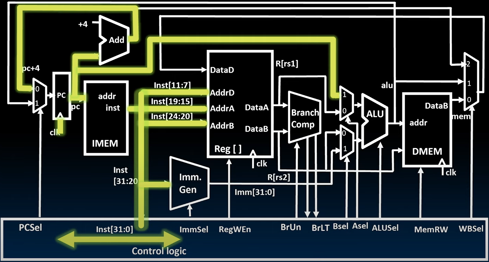

得到的信号如下

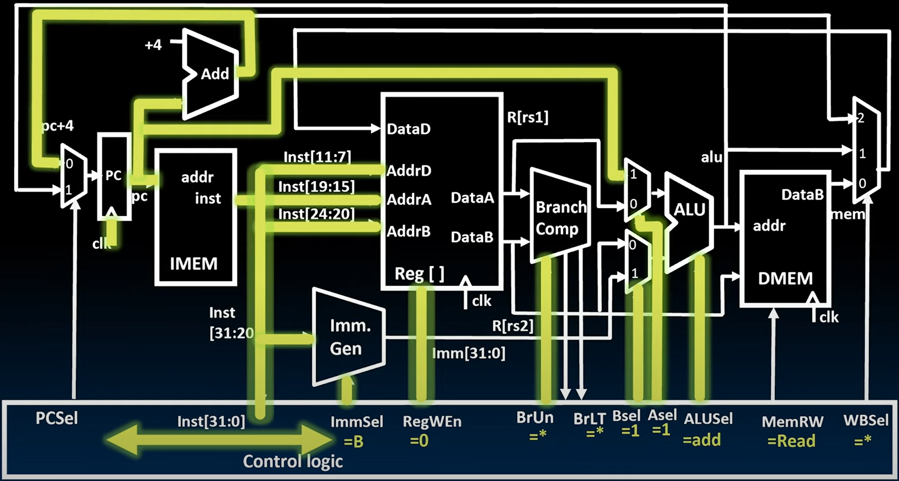

| Signal             | Desc                                    |
| ------------------ | --------------------------------------- |
| ImmSel = B         | Imm. Gen按照B-Format解析生成Immediate         |
| RegWEn = 0         | `beq`指令不需要写寄存器，为了防止误写，设置为0              |
| BrUn = \*          | beq指令不分unsigned和signed，两种数据的比较规则一致      |
| BrLT = \*          | beq指令仅仅比较是否equal，与Less Than无关           |
| BSel = 1, ASel = 1 | 执行PC + Imm, A operant为PC, B operant为Imm |
| ALUSel = Add       | 执行加法操作                                  |
| MemRW = Read       | beq操作不涉及内存读写， 但为了防止误写，设为默认的只读           |
| WBSel = \*         | 已经设置RegWEn = 0，不可能Write Back，所以WBSel无所谓 |

> 未能确定的两个信号
>
> * BrEq是Branch Comp的比较结果输出，在比较之前未能确定；
> * PCSel决定PC更新为哪一个值，由比较结果BrEq决定，故尚未能确定

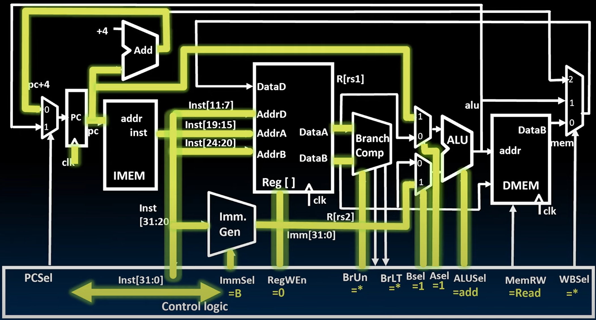

在解析的同时，完成了两件事：

* 生成立即数
* 从寄存器文件中读取`Reg[rs1]`和`Reg[rs2]`的内容

#### Execute

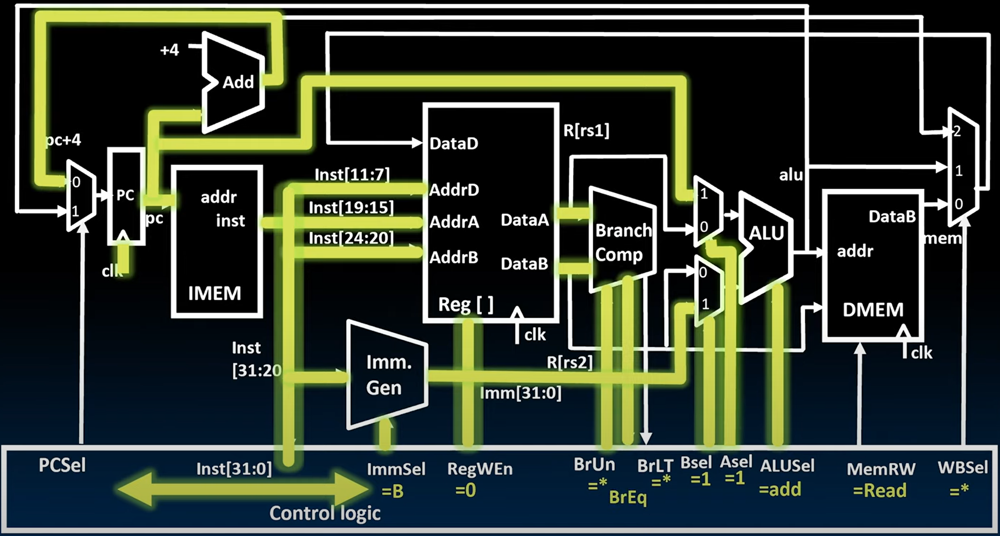

* Branch Comp比较`Reg[rs1]`和`Reg[rs2]`的内容并将结果BrEq输入到Control Logic

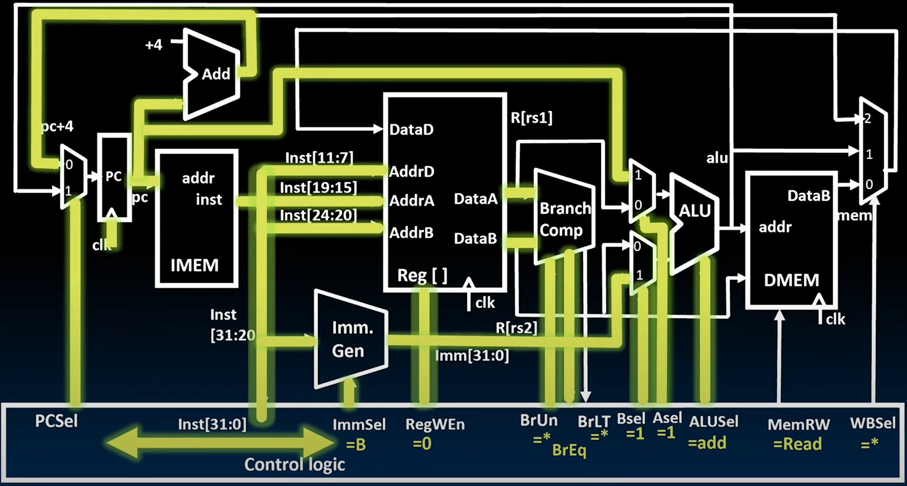

* Control Logic根据BrEq生成了PCSel

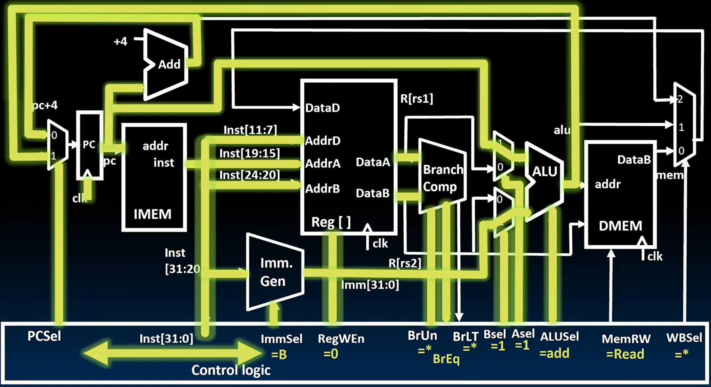

* ALU执行完PC + Immediate并将结果送回到多路复用器

> 此时准备好了状态更新前所有的数据：PC + 4，PC + Immediate，PCSel。只待更新了

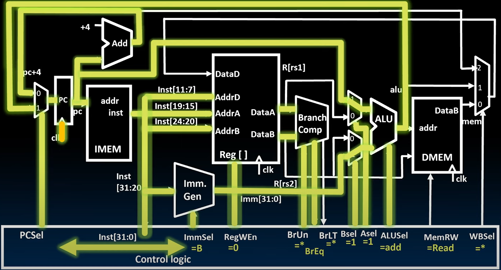

* 完成这条指令所需的唯一事情是再次提高时钟信号。因此，在这个时钟脉冲上，PC和DMEM都会更新。我们已经完成了这条指令，并且实际上已经同时开始执行下一条指令。
