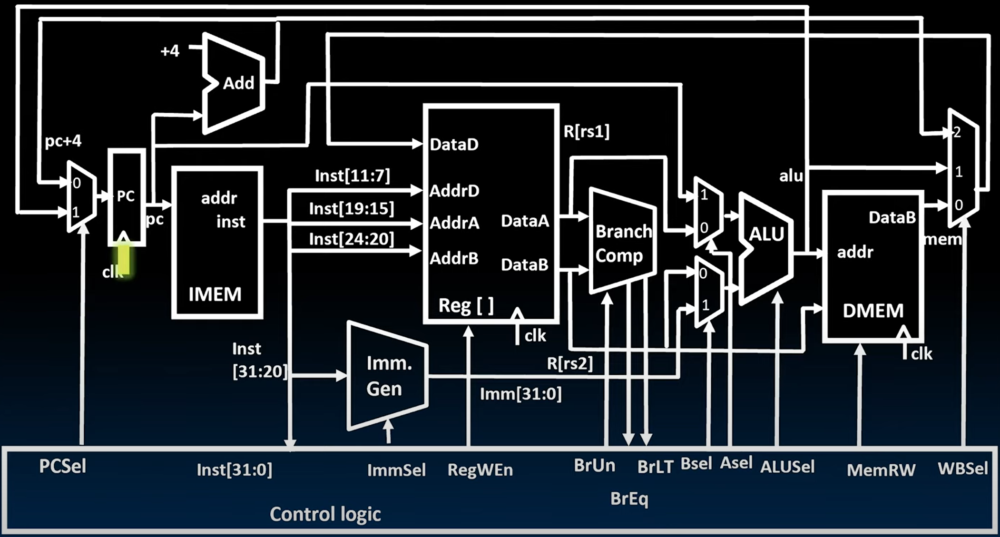

# 20.3-Instruction Timing


Lecture Video Address


***

我们设计了一个可配置的Datapath。我们还概述了设置数据通路以执行几乎所有基于RV32I指令集的指令的Control Logic。

在这个过程中，我们发现datapath和Control Logic中有很多并发发生的事情。例如，当我们从寄存器文件中检索操作数时，我们也同时生成立即数。我们还对时间安排有了一些了解，时间安排非常重要。显然，实现数据通路和控制逻辑需要一些时间来完成。**关键路径**——我们在数据通路中执行指令所需的最长时间——决定了处理器每秒钟能运行的频率以及每秒能执行的指令数。

到目前为止，我们只对时间安排有定性了解，因此我们将在这一部分尝试使其更具定量性。

## add Timing

我们先以add操作为例分析add的执行流程，并量化时间

### Datapath process

我们以add操作为例分析在整个执行过程中涉及哪些时间（特别是哪些操作是同一时间并行执行的）

```assembly
add rd, rs2, rs1
```

更新的状态：

* Reg\[rd] = Reg\[rs2] + Reg\[rs1]
* PC = PC + 4

***

执行流程如下

#### Instruction Fetch



* 在时钟的上升沿，更新PC。新值需要经过写入时间(**Clock to output delay**)才能到达输出端
* 在Clock to output delay后，输出端得到了一个有效的PC地址，指向IMEM。


在PC输出之后，同一时间经历了两个事情

* Add执行PC + 4
* IMEM根据PC的地址读取指令

这两个过程将需要大致相同的时间。但不是完全相同，那个时间更长取决于技术。

> PC + 4计算结束之后，还需要PCSel信号来确定PC更新为哪个值，所以此时PC + 4还不能确定会通过多路复用器。
>
> 由于寄存器地址在instruction中是固定的，所以从IMEM中提取出地址是在Instruction Fetch的一瞬间发生的，但是这属于Instruction Decode的步骤

当instruction输出之时，便完成了Instruction Fetch阶段

#### Instruction Decode

在这一阶段两件事会同时发生：获取源寄存器rs1和rs2的值；解码指令


* Control Logic接受Inst之后读取关键位生成逻辑信号


| Signal                          | Desc                                                              |
| ------------------------------- | ----------------------------------------------------------------- |
| ImmSel = \*                     | add指令不生成立即数                                                       |
| RegWEn = 1                      | 结果要保存在Reg\[rd]当中                                                  |
| BrUn = \*, BrEq = \*, BrLT = \* | add指令与比较无关                                                        |
| BSel = 0, ASel = 0              | 执行Reg\[rs1] + Reg\[rs2], A operant为Reg\[rs1], B operant为Reg\[rs2] |
| ALUSel = Add                    | 执行加法操作                                                            |
| MemRW = Read                    | 不读写内存，为了防止误写                                                      |
| WBSel = \*                      | 已经设置RegWEn = 0，不可能Write Back，所以WBSel无所谓                           |
| PCSel = PC + 4                  | 没有跳转，PC更新为下一条指令                                                   |

在`PCSel = PC + 4`设置好之后，`PC + 4`就会通过多路复用器


在这个时候，同时进行Reg的读操作


* `Reg[rs1]` 和 `Reg[rs2]`都被送到了多路复用器
* 由于此时已经生成了ASel和BSel，所以可以直接通过


#### Execute

ALU的两个操作数已经准备就绪，ALUSel也已就绪，执行加法操作


结果送到Write Back的多路复用器的输入，由于WBSel已经设置好，所以可以直接通过


#### Write Register

ALU的结果然后被送回到Reg\[] 的DataD中


> 现在，状态更新需要的所有数据和信号都准备就绪，在下一个时钟信号时设置值


* 下一个时钟信号来到，更新PC和Reg\[rd]，add指令结束

### Add Timing Diagram

下面分析timing diagram来更详细的描述并行的操作

如下是之前得到的Datapath


***

时钟信号有高电平和低电平值。每个时钟周期对应于从一个时钟的上升沿到下一个时钟的上升沿的时间。所以在这个图中我们有总共两个时钟周期，我们将展示在PC的输出处我们拥有的内容。


#### Instruction Fetch

> 在PC的输出处， 有一组32根导线。这里不会像逐个显示这32根导线的01序列，而是使用之前介绍过的简写符号。如下图，使用了bundle，用1000,1004来表示01序列的状况


*   在CLK上升沿之后，PC输出的值在进过一段延迟t~~CLK-q~~之后才会更新。 并且该程序计数器的所有32个输出同时具有相同的值。

    > 在Register使用的是32个flip-flop，它们是各自独立的，因此更新的时候也会独立更新，所以32个bits会同时更新

现在，两件事情正在同时发生：从IMEM中获取一条指令，执行PC+4


*   PC+4的值在经过一定的传播延迟(执行加法计算)之后稳定

    > 执行操作是不需要CLK控制的，只要PC有值，就会自动进行，PC更新之后，过一段时间也会由新的值计算出新的结果
    >
    > 这里有一个区别，PC在更新的时候，是32位同时更新的，因为其内部使用是独立的32个flip-flop；但是Adder内部是串联了32个1-bit Adder，必须等前一位加法执行结束之后才能执行后一位加法；也就是说，PC + 4的32位不是同时更新的，而是逐位更新，LSB比更高的有效位更早稳定，最后全部保持稳定。这里我们的timing diagram仅仅显示最后一位更新的时间

另一件事情就是从IMEM中读取指令


*   PC会一直作为输入到IMEM中，但是从IMEM中读取inst也需要时间，所以PC更新后再过了一段延迟inst才会更新

    > 这里我们也是将指令的32位machine code进行反汇编，使用instructions来表示01bits
* 读IMEM的操作是不需要CLK的

在IMEM的输出端的instruction稳定之后，表明Instruction Fetch结束

#### Instruction Decode


* instruction Fetch之后送到了Control Logic进行解析，一段时间后设置Control bit

同时进行的操作是读取寄存器


* 寄存器的读取也是要一定的延迟，这个时间和解码指令的时间相当

> 寄存器的值读取出来后被送到多路复用器，由于ASel和BSel已经设置好了，所以会直接通过到达ALU的输入端

#### Execute


* 在读取了`Reg[rs1]`和`Reg[rs2]`之后经过一段的时间，执行加法计算

#### Write Register


* 加法计算结束以后，结果经过wb多路复用器，到达Reg\[]的DataD输入端

最后经过一个时钟上升沿，PC和rd更新


> 可以看到Reg\[1]在CLK上升沿之后才更新，PC同理

### Quantify Time

下面我们看看是否可以量化这个时间。

在整个过程中，可以认为有两件大事同时发生，下图中用不同的颜色标识（同色表示串行发生，有先后顺序，异色表示并行执行）

> 这里假设Control Logic肯定比从寄存器文件中检索数据所需的时间短。


$$
Critical path = t_{clk-q} +max {t_{Add}+t_{mux}, t_{IMEM}+t_{Reg}+t_{mux}+t_{ALU}+t_{mux}}+t_{setup} \\ = t_{clk-q} + t_{IMEM}+t_{Reg}+t_{mux}+t_{ALU}+t_{mux}+t_{setup}
$$

下面解释一下各段时间

| time                                         | desc                                                                                                  |
| -------------------------------------------- | ----------------------------------------------------------------------------------------------------- |
| $$t_{clk-q}$$                                | 时钟上升沿到PC更新完成的延迟                                                                                       |
| $$t_{Add}+t_{mux}$$                          | 执行PC+4并且通过mux的时间                                                                                      |
| $$t_{IMEM}+t_{Reg}+t_{mux}+t_{ALU}+t_{mux}$$ | 从IMEM读取指令，从Reg\[]读取数据，Reg\[rs1]和Reg\[rs2]通过mux，ALU执行加法操作，结果通过WB mux(这里假设Control Logic在读取寄存器之前，所以没有列出) |
| $$t_{setup}$$                                | Reg\[rd]的更新时间                                                                                         |

在这个路径中，显然有$$t_{Add}+t_{mux} < t_{IMEM}+t_{Reg}+t_{mux}+t_{ALU}+t_{mux}$$，所以关键路径为 $$Critical path = t_{clk-q} + t_{IMEM}+t_{Reg}+t_{mux}+t_{ALU}+t_{mux}+t_{setup}$$

add指令仅仅经历了4个阶段(没有Memory Access阶段)，下面演示有5个阶段的指令`lw`

## lw timing

lw有5个阶段

```assembly
lw rd, imm(rs1)
```

更新的状态：

* Reg\[rd] = DMEM\[Reg\[rs1] + imm]
* PC = PC + 4

### Datapath process

这里我们不会像之前一样详细说明每个过程，仅仅列出过程图

| phrase             | operations                                    |                                                                |                                                                |
| ------------------ | --------------------------------------------- | -------------------------------------------------------------- | -------------------------------------------------------------- |
| Instruction Fetch  | PC + 4                                        |  |  |
| Instruction Decode | decode instruction                            |  |  |
|                    | read register & generate immediate            |  |  |
|                    | mux(AB多路复用器，这里假设Control Logic在读寄存器和生成立即数之前生成) |  |                                                                |
| Execute            | Reg\[rs1] + immediate                         |  |                                                                |
| Write Regitser     |                                               |  |                                                                |

* 与add不同的是，lw会有Immediate generation的操作，并且有内存访问的阶段

### quantify time

如下同样用不同的颜色区分出了并行的路径


$$
Critical\space path = t_{clk-q} +max \{t_{Add}+t_{mux}, \\ t_{IMEM}+t_{Imm}+t_{mux}+t_{ALU}+t_{DMEM}+t_{mux}, \\ t_{IMEM}+t_{Reg}+t_{mux}+t_{ALU}+t_{DMEM}+t_{mux}\}+t_{setup}
$$

下面是三个并行的路径

| time                                                  | desc          |
| ----------------------------------------------------- | ------------- |
| $$t_{Add}+t_{mux}$$                                   | (见add操作的time) |
| $$t_{IMEM}+t_{Imm}+t_{mux}+t_{ALU}+t_{DMEM}+t_{mux}$$ | $$t_{Imm}$$   |
| $$t_{IMEM}+t_{Reg}+t_{mux}+t_{ALU}+t_{DMEM}+t_{mux}$$ | $$t_{Reg}$$   |

后面两个时间关键的就是$$t_{imm}$$和$$t_{Reg}$$，哪个时间久，哪条路就是关键路径。

## Instruction Timing

### Conceptual Instruction Timing

下面用一个更概念化的时间线来表示在上面看到的内容


> 该图重点显示了每一个阶段的时间，例如 $$t_{IF}$$, $$t_{ID}$$ 等等

### concrete instruction timing

下面我们将每个阶段的大致时间列出来

| IF    | ID       | EX    | MEM   | WB    | Total |
| ----- | -------- | ----- | ----- | ----- | ----- |
| I-MEM | Reg Read | ALU   | D-MEM | Reg W |       |
| 200ps | 100ps    | 200ps | 200ps | 100ps | 800ps |

执行一条指令需要800ps

***

不同的指令可能会涉及的阶段也不同，下面是五中指令会经历的阶段及其总时间

| Instr | IF = 200ps | ID = 100ps | ALU = 200ps | MEM = 200ps | WB = 100ps | Total |
| ----- | ---------- | ---------- | ----------- | ----------- | ---------- | ----- |
| add   | √          | √          | √           |             | √          | 600ps |
| beq   | √          | √          | √           |             |            | 500ps |
| jal   | √          | √          | √           |             | √          | 600ps |
| lw    | √          | √          | √           | √           | √          | 800ps |
| sw    | √          | √          | √           | √           |            | 700ps |

在这种情况下，时间最长的是`lw`指令，所以在设计时钟的时候要能够满足lw指令

* Maximum clock frequency $$f_{max}$$ = 1/800ps = 1.25 GHz

如果我们能够以某种方式时钟这个数据通路，以便只执行其中的一部分操作，我们将能够以对应于每个执行单元最长延迟的频率运行它，因此我们可能可以以5千兆赫运行这个过程。

* Most blocks idle most of the time $$f_{max,ALU}$$ = 1/200ps = 5 GHz

现在还没发这样做，但是后面我们将会学习这样的好处。
