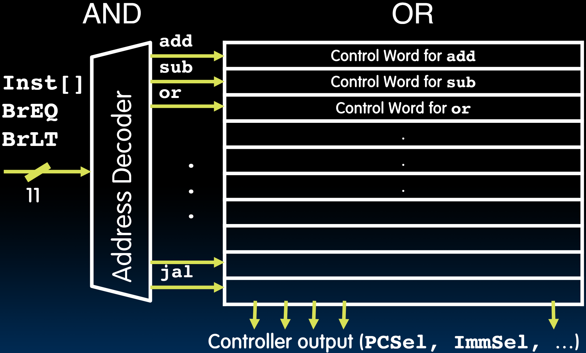
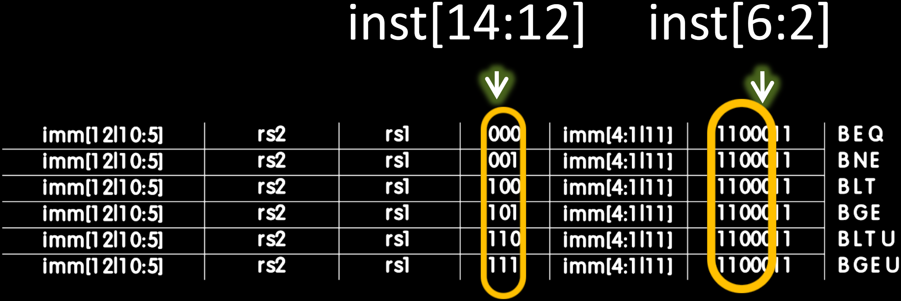

# 20.4-Control Logic Design


Lecture Video Address


---

前面几节课，我们一步一步的学习一些指令是怎么执行的，主要目的有两个：

1. 帮助我们更好的理解一个指令执行多长时间（在上一节课中我们已经计算过了）
2. 让我们更熟悉Control Logic的任务

本节我们就开始讲述怎么设计Control Logic

## Control Logic Truth Table

Control Logic可以看做下面的一张真值表（也可以看做是一张查询表），根据对应的输入得到对应的输出

| Inst[31:0]\(I) | BrEq(I) | BrLT(I) | PCSel | ImmSel | BrUn | ASel | BSel | ALUSel | MemRW(Read) | RegWEn | WBSel  |
| -------------- | ------- | ------- | ----- | ------ | ---- | ---- | ---- | ------ | ----------- | ------ | ------ |
| add            | *       | *       | +4    | *      | *    | Reg  | Reg  | Add    | Read        | 1      | ALU    |
| sub            | *       | *       | +4    | *      | *    | Reg  | Reg  | Sub    | Read        | 1      | ALU    |
| (R-R op)       | *       | *       | +4    | *      | *    | Reg  | Reg  | (Op)   | Read        | 1      | ALU    |
| addi           | *       | *       | +4    | I      | *    | Reg  | Imm  | Add    | Read        | 1      | ALU    |
| lw             | *       | *       | +4    | I      | *    | Reg  | Imm  | Add    | Read        | 0      | Mem    |
| sw             | *       | *       | +4    | S      | *    | Reg  | Imm  | Add    | Write       | 0      | *      |
| beq            | 0       | *       | +4    | B      | *    | PC   | Imm  | Add    | Read        | 0      | *      |
| beq            | 1       | *       | ALU   | B      | *    | PC   | Imm  | Add    | Read        | 0      | *      |
| bne            | 0       | *       | ALU   | B      | *    | PC   | Imm  | Add    | Read        | 0      | *      |
| bne            | 1       | *       | +4    | B      | *    | PC   | Imm  | Add    | Read        | 0      | *      |
| blt            | *       | 1       | ALU   | B      | 0    | PC   | Imm  | Add    | Read        | 0      | *      |
| bltu           | *       | 1       | ALU   | B      | 1    | PC   | Imm  | Add    | Read        | 0      | *      |
| jalr           | *       | *       | ALU   | I      | *    | Reg  | Imm  | Add    | Read        | 1      | PC + 4 |
| jal            | *       | *       | ALU   | J      | *    | PC   | Imm  | Add    | Read        | 1      | PC + 4 |
| auipc          | *       | *       | +4    | U      | *    | PC   | Imm  | Add    | Read        | 1      | ALU    |

> `Inst[31:0]`, `BrEq`, `BrLT`都是输入，后面的几列是输出
>
> 这些输入可以看做一个Control word(当然这些位并没有32bit那么多)

## Control Realization Options

实现Control Logic一般有两种方式：其中一个方法是使用ROM。另一个选择是使用Combinational Logic。

### ROM

> "Read-Only Memory"（ROM和普通的存储器很像，只是无法写，只能读）

我们希望Control Logic在接受到特定输入之后输出特定的Control word，只需通过指向特定的控制字来从ROM中读取它。

在设计过程中，可以不断重新编程ROM。并且可以通过执行大量指令来测试它。

这在原型设计和扩展指令时非常实用。例如，我们希望添加指令集RISC-V指令集的压缩部分。我们只需将该部分添加到我们的ROM表中，然后进行测试。

### Combinatorial Logic

在实际中，设计真实芯片时，Control Logic将由Combinatiorial Logic(一堆逻辑门)实现，因为这样更紧凑且速度更快。

## Control Logic Input: RV32I, A Nine-Bit ISA!

Control Logic需要什么输入？我们需要对每一条指令都有一个唯一的表示。还需要两个位来表示分支结果。

在RV32I中，instruction是32bits，但其相关信息只存储在9 bits

| bits        | desc                                   |
| ----------- | -------------------------------------- |
| inst[30]    | 编码加法，减法，移位操作               |
| inst[6:2]   | opcode的upper 5 bits，表示指令大类型   |
| inst[14:12] | funct3，执行的事某一类型指令中的哪一种 |

如果我们要添加一些指令，比如compressed instructions，我们还需要查看lower 2 bits，这两位在RV32I中被设定为11。

## ROM-based Control

下面是使用ROM实现Control Logic的框图

- 输入有11位，instruction中的9bits，还有两位表示Branch comp的结果
- 输出有15位，某些Signal不止1 bit

### ROM Controller Implementation

它看起来像一个字面意义上的查找表。我们将使用原始初始查找表中的内容来访问这个查找表。

我们的指令将由它们的九位值加上表示分支结果的两位来表示。然后，在每一行中，将有一个对应这些指令的控制字。

首先，我们decode address。这些输入，即Instruction Type，是二进制编码的。address decoder的输出是“one-hot”。只有其中一条线会亮起。每条指令只访问一个控制字。

例如，我们的加法指令将指向这个只读存储器的第一行。在Address Decoder的输出中，只有add那一条线会亮起。此时，控制器的输出将是一个仅对应加法指令的控制字。

可以把这看作一个and/or structure。为了只使其中一条线被启用，Address Decoder必须是一个相当宽的**与**操作。然后，为了形成输出控制字，纵向可以只是一个**或**操作。

> 在ROM中：
>
> - Address Decoder是一个与操作，输入的11位中如果有必须是0或者1的，就进行与操作，只有符合要求的才为1（后面的add就是例子）
> - 纵向是OR，因为1 OR 任何bit结果还是1，0 OR 任何bit结果还是其bit。我们要在最下方的Controller output得到某一行的结果，只需要一行一行的对应位进行OR即可。

这是实现Control Logic的最简单方法。但是有很多冗余。许多条目将是零。所以这就是将整个控制逻辑简化为较少数量的与和或的想法。

下面是几个例子

## Example

### Combinational Logic implementation

这里使用Combinational Logic来实现Control Logic

> 使用CL实现Control Logic就是将11位input直接生成一个Control bit

这里用Branch的BrUn这一个Control bit来举例

How to decode whether BrUn is 1?

> 只有当Branch类型的指令并且Inst[13] = 1的时候，也就是进行无符号整数比较的时候，才需要BrUn
>
> BEQ是不需要BrUn的，无符号有符号整数的比较规则都一样

- $BrUn = i[13] \cdot Branch$
- $Branch = i[6]\cdot i[5] \cdot \overline{i[4]} \cdot \overline{i[3]} \cdot \overline{i[2]}$

> 有时六位宽的与门可能不是最实用的实现方法。所以我们通常会尝试将其分解为几个门。

### ROM implementation

下面用add举例。（我们只需要让Address decode得到add为1即可，其他的输出bit为0）

- $add = \overline{i[30]}\cdot\overline{i[14]}\cdot\overline{i[13]}\cdot\overline{i[12]}\cdot R-type$
- $R-type = \overline{i[6]}\cdot i[5]\cdot i[4]\cdot\overline{i[3]}\cdot\overline{i[2]}\cdot R-type$
- $RV32I = i[1]\cdot i[0]$

> 如果要添加其他的扩展，RV32I要求最低的2个bits必须为11，如果没有的话这个11就没什么必要
