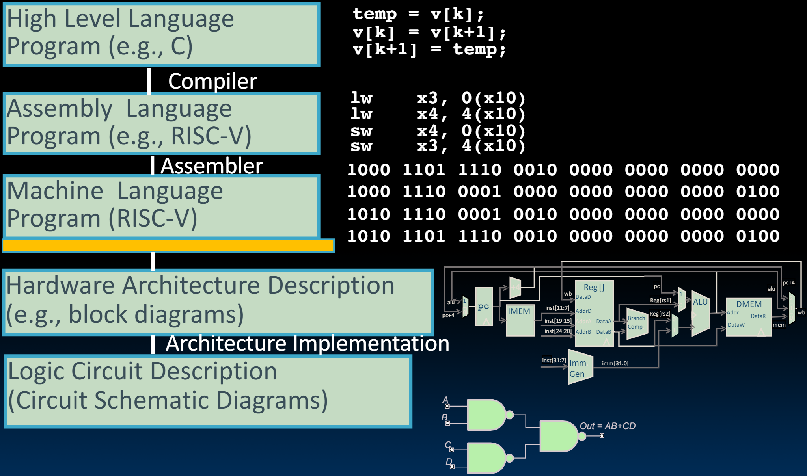

# 20.5-Milestone Summary


Lecture Video Address


到现在是本课程以及计算机科学教育中的一个重要里程碑。

我们从高层开始，从高级语言到汇编语言、机器语言，并弄清楚如何使高级语言编译成机器可理解的东西。然后我们从底层开始，从门电路和布尔逻辑开始，构建了一个完全工作的计算机。我们实现了硬件和软件的对接。

***

We have built a processor!

* Capable of executing all RISC-V instructions in one cycle each
* Not all units (hardware) used by all instructions
* Critical path changes

> 总结一下，我们确实建造了一个可工作的处理器。它可以执行任何RISC-V指令。因此，我们可以将C程序编译到它上面。我们已经看到它可能不是最好的、性能最强的处理器，因为它的关键路径相当长。我们后面就会改进这个设计，增加一些新功能，并学习其周围的世界。

5 Phases of execution

* IF, ID, EX, MEM, WB
* Not all instructions are active in all phases

Controller specifies how to execute instructions

* Implemented as ROM or logic
