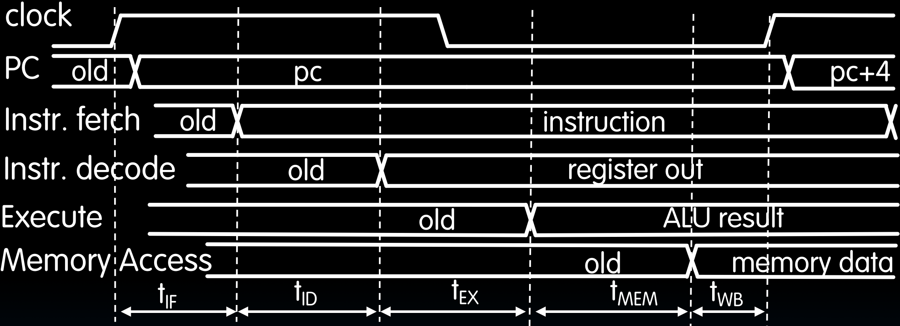

# 21.1-Pipelining


Lecture Video Address


---

到目前为止，我们已经设计了功能单元并评估了其性能。但我们并没有真正了解其性能是好是坏，周期时间是否是衡量性能的唯一标准。在这一单元中，我们将实际开始测量性能或不同的性能测量方法，然后找出改进性能的方法。

## Lecture Outline

本节课的内容

### New-School Machine Structures

在我们新的机器结构学派中，我们已经看了不同层次的层次结构，以及它们如何支持并行性。现在，我们将来看一下指令级的并行性，以及在硬件中、在执行单元中需要做什么来支持指令的同时执行。

### 6 Great Ideas in Computer Architecture

1. Abstraction (Layers of Representation/Interpretation)
2. Moore’s Law
3. Principle of Locality/Memory Hierarchy 
4. Parallelism
5. **Performance Measurement & Improvement**
6. Dependability via Redundancy

我们还将介绍计算机体系结构中的六个伟大思想之一，即性能测量和改进(Performance Measurement & Improvement)。我们的意思是，我们需要知道如何测量性能，以便能够改进它。

> 测量性能是一部分内容，如何改进是pipelining的内容

## Instruction Timing

在上节课中分析了一个性能指标，即在单周期RISC V CPU中执行一条指令所需的最小周期时间。

通过测量执行五个阶段中每个阶段所需的时间来确定这个时间。（如下是每个阶段需要的时间）

| IF    | ID       | EX    | MEM   | WB    | Total |
| ----- | -------- | ----- | ----- | ----- | ----- |
| I-MEM | Reg Read | ALU   | D-MEM | Reg W |       |
| 200ps | 100ps    | 200ps | 200ps | 100ps | 800ps |

将所有这些时间相加，最小周期时间为800ps。

然而，不是每条指令都经过所有五个执行阶段。

| Instr | IF = 200ps | ID = 100ps | ALU = 200ps | MEM = 200ps | WB = 100ps | Total |
| ----- | ---------- | ---------- | ----------- | ----------- | ---------- | ----- |
| add   | √          | √          | √           |             | √          | 600ps |
| beq   | √          | √          | √           |             |            | 500ps |
| jal   | √          | √          | √           |             | √          | 600ps |
| lw    | √          | √          | √           | √           | √          | 800ps |
| sw    | √          | √          | √           | √           |            | 700ps |

只有一条指令load word经过了所有五个执行阶段。如果我们提高了频率，虽然其可以执行大多数其他指令，但是lw指令就无法执行了。因此，我们的**关键路径总是由最长指令决定的**——指令所需的最长时间。

- Maximum clock frequency f~max~ = 1/800ps = 1.25 GHz

## Performance Measures

时钟周期/频率是一个性能的衡量标准。因此，我们的单周期CPU可以以1.25千兆赫的速度执行指令。这意味着它可以在800皮秒内启动并完成一条指令，然后可以启动另一条指令，耗时同样为800皮秒，如此循环。它每秒可以完成12.5亿条指令。

现在面临的问题是：

1. 我们能否提升这个性能？
2. 时钟周期/频率是不是唯一的性能衡量标准？

通常，当我们查看任何产品的规格表时，通常有不同类型的性能衡量标准。在这种情况下，让我们试着看看我们所说的处理器性能是什么意思。

- 在某些情况下，这可能意味着它的响应时间更快。所以，如果你给它一个任务，它会更快完成。因此，执行一个任务所需的时间可能是一个性能衡量标准。

- 或者，它在单位时间内能完成多少任务？比如，它能服务多少个网页？或者能识别多少个口述词语？或者每小时能下多少盘棋？

- 或者它需要多少能量，也就是说，当在这个处理器上运行任务时，我们的电池能持续多长时间，比如(在电脑上)看电影时，一次充电能看多少部电影？

    > 底层的设计是会影响电脑的耗电量的。

### Transportation Analogy

下面用一个交通来类比说明。通常人们认为跑车是高性能车辆，但在某些指标下，公交车也是高性能车辆。

下面是跑车和公交车的性能指标。

|                                  | Sports Car | Bus    |
| -------------------------------- | ---------- | ------ |
| Passenger Capacity(载乘客的数量) | 2          | 50     |
| Travel Speed                     | 200 mph    | 50 mph |
| Gas Mileage(每加仑的英里数)      | 5 mpg      | 2 mpg  |

可以看到，跑车的速度快，载人数量比较少，油耗比较高。

我们看看它们在运输100名乘客进行50英里旅程的任务中表现如何（我们假设只测量单程，并且立即返回起点，重新装载乘客除法）

|                         | Sports Car                | Bus                         |
| ----------------------- | ------------------------- | --------------------------- |
| Travel Time             | 15min                     | 60min                       |
| Time for 100 passengers | 750min(50 2-person trips) | 120 min(two 50-person trip) |
| Gallons per passenger   | 5 gallons                 | 0.5 gallons                 |

跑车一个路程要15分钟，但是要走50次，总共750分钟，而且每个乘客对应的汽油量也远大于公交车。由此可见，公交车的能效远高于跑车。

如果我们需要快速运输一些高价值的物品——例如受伤的人——跑车会更好。但公交车在长距离运送大量人群时表现更佳，它用更短的时间并节省大量能量。

### Computer Analogy

下面将运输与计算机做类比

| Transportation          | Computer                           | Computer(e.g.)                                               |
| ----------------------- | ---------------------------------- | ------------------------------------------------------------ |
| Trip Time               | Program execution time             | time to update display                                       |
| Time for 100 passengers | Throughput                         | number of server requests handled per hour                   |
| Gallons per passenger   | Energy per task(Energe Efficiency) | how many movies you can watch per battery charge or energy bill for datacenter |

- `Program execution time`和`Throughput`是不一样的，前者是一个 程序执行的时间，后者是同时执行任务的数量。
- 参考运输，如果有100个任务要完成，那么可能二者都会决定最终任务完成的时间。
- **energy**对于**移动设备**和**高性能服务器**都很重要。在移动设备中，我们对电池中储存的能量有更好的感知；能源对于数据中心的高性能服务器也非常重要，在那里，运行数据中心的成本基本上是能源成本，**在部署一年或一年半后，能源成本会超过硬件成本**。因此，在**每个应用领域或每个计算领域，能源都是一个大问题**。

> Note: Power(功率) is not a good measure, since low-power CPU might run for a long time to complete one task consuming more energy than faster computer running at higher power for a shorter time

我们会在后面两节中，逐个分析Program Execution Time, Energy efficiency, 以及用流水线提高Throughput
