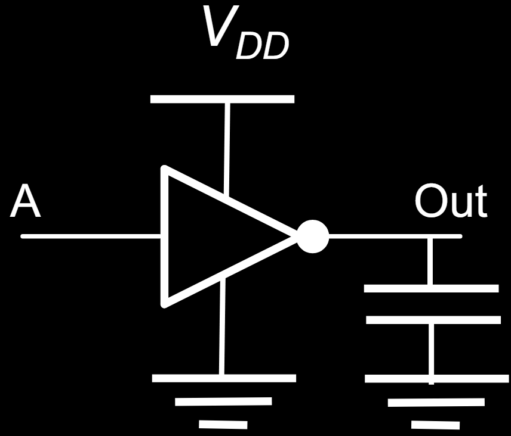
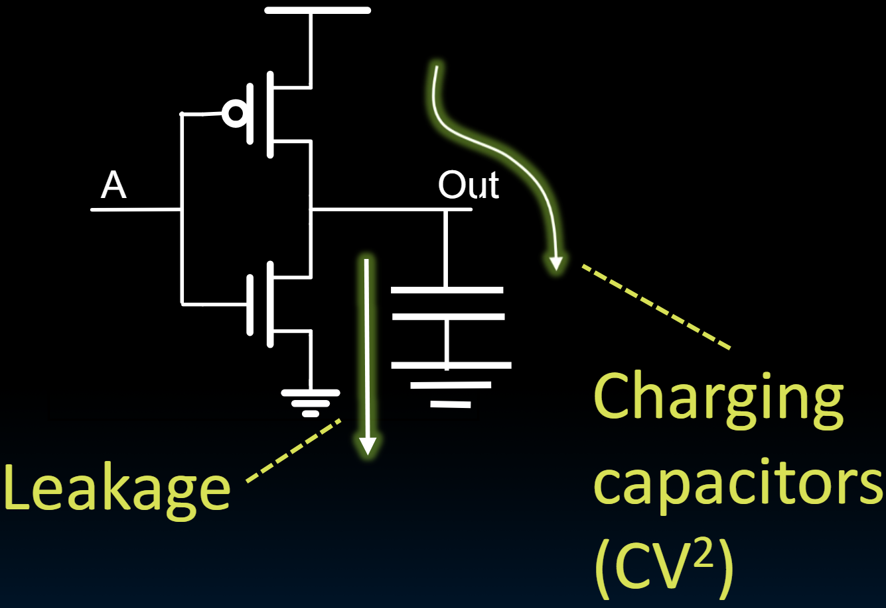
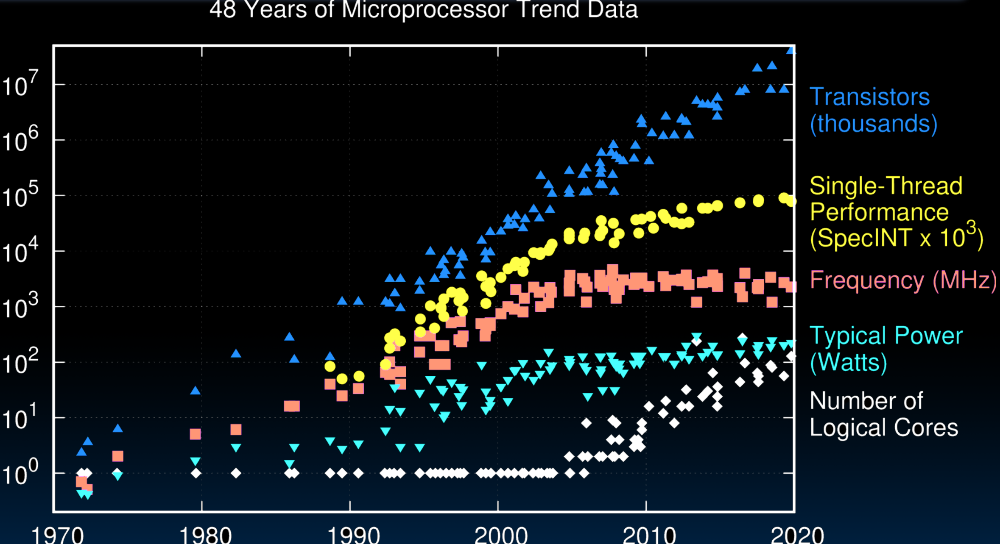
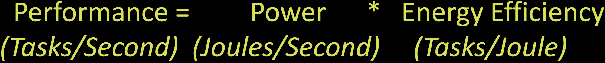

# 21.3-Energy Efficiency


Lecture Video Address


---

本节我们来介绍energy efficiency

能源效率与处理器性能有关。在过去的几十年中，功耗变得更加重要。

在80年代，架构师和设计师的设计目标与现在有很大不同。那时，他们唯一的目标是尽可能快地提高性能。他们缩短了逻辑深度，使用了尽可能高的电源电压来提高处理器频率，结果是处理器性能每隔一年就会翻倍。但代价是功耗也在快速增加，大约每三年翻倍一次。

> 在上一节我们说过，Time per Cycle中energy是影响因素，能量越大速度就会越快。因此在早些年代会尽可能提高电压来提高处理器频率。但是这造成了功耗太大的问题。
>
> 我们不能仅仅考虑性能，还必须考虑功耗问题。

这在80年代初期并不是一个大问题，当时处理器相对简单，功耗相对较低。但随着时间的推移，功耗达到了极限。在所有功率域中，功耗在2000年代初期成为主要的限制因素。

如今，功率在每个计算域中都是有限的：功率限制存在于手机、桌面处理器和数据中心的仓库级计算机中。这些功率限制的性质是不同的。例如：

- 在手机中，功率受到我们愿意随身携带的电池大小的限制。
- 在桌面计算机中，功率受到相对便宜的风扇可以从处理器中移除的热量的限制。
- 在数据中心中，功率限制既涉及热量，也涉及运行数据中心所需的能源成本。

因此，如今及可预见的未来，==**设计的目标是在功率限制下最大化性能**==。因此，现在的目标不再是单纯获得最大性能，而是在功率和能源限制下提供可用的性能。

## Where Does Energy Go in CMOS?

为了更好地了解能源效率，让我们首先了解CMOS中的能量流向。（现今所有的逻辑门都采用CMOS技术架构）

我们以反相器invertor为例。

如下左图是invertor的符号，它有三个附加部分：电源、电压供应和接地，因为它需要电源和接地来将逻辑电平从0切换到1。输出端有电容。

如下右图显示出反相器内部的结构(和上图一样，只不过是更深层次的抽象)。

| Symbol(invertor)                                             | Schematic                                                    |
| ------------------------------------------------------------ | ------------------------------------------------------------ |
|  |  |

电容的出现是因为晶体管的特性。在反相器中使用的每个晶体管都有其输入和输出电容。因此，每当我们试图将反相器的输出电平从0切换到1时，必须给电容充电。这个电容包括该反相器输出端的电容，还包括由该反相器驱动的任何下游反相器输入端的电容。

下面是耗电的部分

- 需要多少能量使电容从0到V(Charging capacitors)？所需能量等于CV^2^，其中一半的能量储存在电容中，一般的能量在晶体管上消耗掉了，当我们从1切换为0时，那一半的CV平方释放到地。这是如今CMOS技术中功耗或能量消耗的主要部分。
- 另一部分是漏电(Leakage)。漏电是由于晶体管不再是理想开关造成的。当我们关闭晶体管并将其输入电压设置为零时，它确实会关闭。通过晶体管的电流会非常小。而现在，它们更像是调光器。我们只能调节通过晶体管的电流。因此，当晶体管应该关闭时，它仍然会漏掉一些电流。（具体可以查看维基百科或者ChatGPT等）

这两部分的比例为7:3，我们大约花费70%的能量用于充放电电容，这是我们对能量的有效使用，而30%的能量可能会漏掉。这源于与技术相关的基本因素，与CMOS技术相关，我们不会深入探讨。

> 相关内容在151或者130中会涉及到。

## Energy per Task

完成一个任务需要多少能量？

> 与完成一个任务需要多少时间一样，有很多参数，要将其进行分解。

$\frac{Energy}{Program} = \frac{instructions}{Program} * \frac{Energy}{Instructions}$

- 其中，$\frac{instructions}{Program}$在上一节衡量性能时已经谈到过了，一般程序越短，使用的能量就越少（这通常超出了设计师可以影响的范围，因为这是由程序或者说程序员决定的，但它确实影响了架构和计算机设计）
- 我们重点考虑的是$\frac{Energy}{Instructions}$，这是我们可以优化的

在这一部分，我们忽略了漏掉的30%，仅仅考虑充放电使用的70%，所以有

$\frac{Energy}{Program} =\propto \frac{instructions}{Program} * CV^2$

所以此时有关键的两个指标

| Symbol | matrices                | desc                                                         |
| ------ | ----------------------- | ------------------------------------------------------------ |
| C      | Capacitance             | depends on technology, processor features e.g. # of cores(此时的电容不是一个逻辑门的电容，而是正在切换的所有逻辑门的总等效电容，所以与core的数量有关) |
| V      | Supply voltage, e.g. 1V | 电源电压是一个非常强的参数，用于权衡功率与性能或能量与性能。电源电压通常在1伏左右，在最近的个位数纳米技术中，更接近0.8伏或0.7伏，但能量与电源电压成二次方关系。因此，如果我们将电源电压降低10%，我们可以节省20%的能量，更精确地说是21%或19%。 |

所以减小$\frac{Energy}{Program}$的方法就是减小Capacitance和Supply Voltage，其中电压是一个很有利的调节器。

---

但是，同时也要记住：V也是与晶体管的速度有关的，晶体管在较低的电源电压下运行的速度较慢。

因此，改变电源电压会在节能和性能损失之间进行权衡。在不同的计算域中，我们会看到处理器在稍高的电压和稍低的电压下运行，以实现不同的功率性能权衡点。

## Energy Tradeoff Example

下面是关于能量权衡的例子。

每当我们进入一个新的技术节点并实现一个新的处理器时，我们都会自然地节省一些能量。在80年代和90年代，直到大约2010年，每次我们迭代技术，进入摩尔定律的下一个节点时，电容都会缩小大约30%。

> 摩尔定律指出，集成电路上可容纳的晶体管数量每隔约18至24个月就会翻倍，同时价格保持不变或下降。换句话说，摩尔定律预示着集成电路的性能将以指数级别增长，而成本则会下降。
>
> （ChatGPT）摩尔定律主要描述了集成电路上晶体管数量的增长规律，而没有直接说明电容的减少量。然而，==**摩尔定律所描述的晶体管数量的增长通常伴随着晶体管尺寸的缩小**==，这也导致了元件之间的距离减小，从而可能导致电容减少。随着集成电路技术的发展，设计者必须考虑如何在尺寸减小的同时维持或增加电容，以确保电路的正常运行(?)

现在，这些**电容**节省大约是每个节点15%。尽管如此，15%的节省也是很大的。最近，电源电压也在缩减，大约减少15%，这种情况自90年代中期以来一直在发生。

> 最初，电源电压的降低应该减少30%，以匹配电容缩减的效果，这与Dennard定律相关。但实际上，大约减少15%，因为设计师希望最大化性能，他们尽量保持电源电压尽可能高。现在，电源电压的减少受到漏电的限制，因为如果我们真的想降低电源电压，漏电会增加。

"Next-generation" processor

| C(Moore's Law)         | -15%                   |
| ---------------------- | ---------------------- |
| Supply voltage, V~sup~ | -15%                   |
| Energy consumption     | 0 - (1-0.85^3^) = -39% |

因此，当我们从一个节点到另一个节点乘以C和V平方时，我们现在得到的能量几乎有40%的节省。这使我们能够做更多的事情。也就是说，当我们构建一个新产品时，如果保持完全相同的架构和相同数量的核心，它自然变得能效提高40%或能量减少40%。或者，如果我们有固定的能量预算，我们可以在其中增加40%的内容。

Significantly improved energy efficiency thanks to

- Moore's Law
- Reduced supply voltage

> 简而言之，由于摩尔定律和降低电源电压，能效一直在提高，架构师利用这一点来增加更多功能和提高性能。

## Performance/Power Trends

下面是过去的几十年内，计算器相关性能的变化示意图（从70年代初 Intel 4040开始）

- 晶体管Transistor的数量指数级增加，到了最近几年才开始缓下来
- Single-Thread Performance也在不断增长，但是近几年增长率也逐渐平缓
- Frequency在80 90年代是指数级上升的，但是到了2000以后就开始平缓，原因之一是Power成为了 重要的问题，必须要保持平缓。
- Power在2000年以后增长率也平缓。
- 内核的数量增加，利用并行计算来提高计算机性能。

## End of Scaling

随着摩尔定律的结束，未来的变化不容易准确预测。

- In recent years, industry has not been able to **reduce supply voltage** much, as reducing it further would mean increasing "leakage power" where transistor switches don't fully turn off (more like dimmer switch than on-off switch)

- Also, size of transistors and hence capacitance, not shrinking as much as before between transistor generations
    - Need to go to 3D
    
    > 原先电路都是在2D板上展开的，进行3D打包之后会节省很多电容。
    
- Power becomes a growing concern – the "power wall"（电容的减少将有助于解决Power wall的问题）

## Energy "Iron Law"

下面是关于Energy Efficiency和Performance的关系（这个叫做Energy Iron Law）

- Energy efficiency (e.g., instructions/Joule) is key metric in all computing devices

    > 能源效率现在实际上成为我们设计的关键指标，它告诉我们实际上我们可以从功率受限设计中获得多少性能。

- For power-constrained systems (e.g., 20MW datacenter), need better energy efficiency to get more performance at same power

- For energy-constrained systems (e.g., 1W phone), need better energy efficiency to prolong battery life
