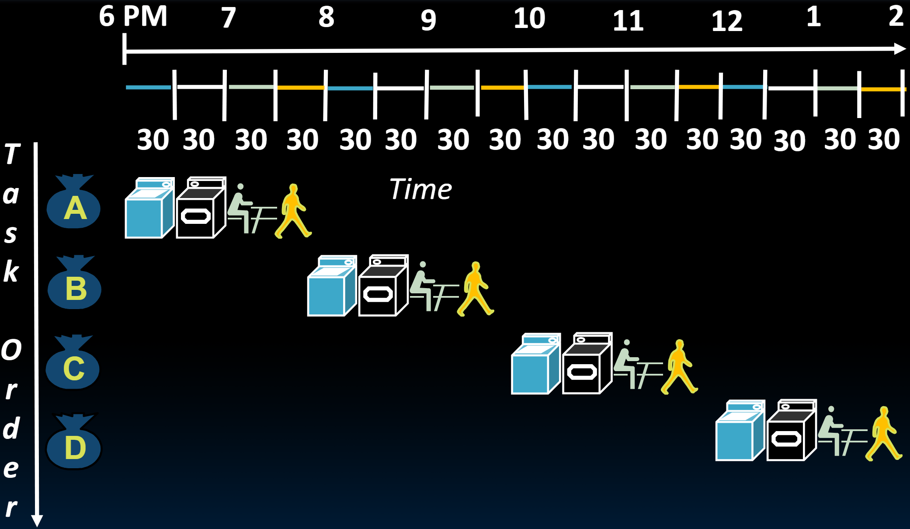
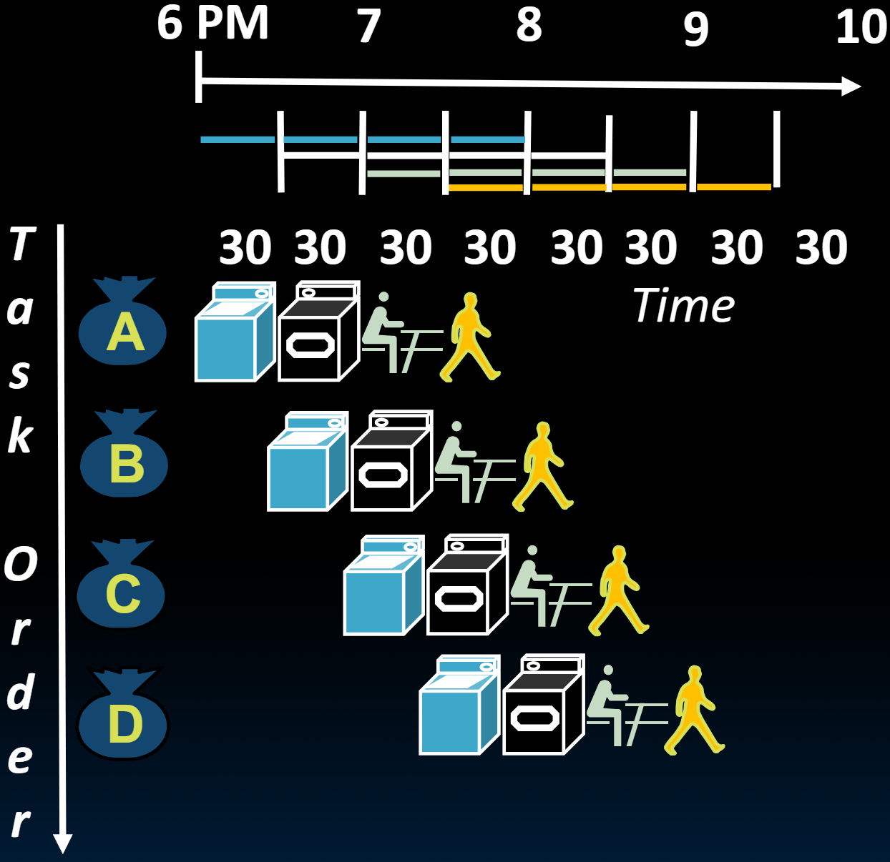

# 21.4-Introduction to Pipelining


Lecture Video Address


本节介绍Pipelining，以此来提高计算机的throughput

## Gotta Do Laundry

下面用洗衣服为例说明流水线的作用

Avi, Bora, Caroline, Dan each have one load of **clothes to wash**, **dry**, **fold**, and **put away**

四个人用下面的符号表示

四个步骤的符号和所需的时间如下。

| desc   | Washer takes                                                 | Dryer takes                                                  | "Folder"                                                     | "Stasher"to put clothes into drawers                         |
| ------ | ------------------------------------------------------------ | ------------------------------------------------------------ | ------------------------------------------------------------ | ------------------------------------------------------------ |
| time   | 30 minutes                                                   | 30 minutes                                                   | 30 minutes                                                   | 30 minutes                                                   |
| symbol |  |  |  |  |

四个人执行相同的任务，每个任务有4个阶段。

## Sequential Laundry

Sequential laundry takes 8 hours for 4 loads! 

我们可以在同一时间并行做一些事情来提高效率。

## Pipelined Laundry

Pipelined laundry takes 3.5 hours for 4 loads! 

- 在这个过程中，用了三个Cycles来填满流水线，以便可以完全利用资源，然后用了三个Cycles来排空流水线。
- 如果有1000人想使用这个洗衣系统，不会需要2000小时。如果把它流水线化，将需要503小时，因为仍然需要三个循环来填满流水线，然后每个人都会在四个阶段同时运行四个任务。最后，在最后的三个循环中，我们将排空流水线，所有1000批洗衣将在大约500小时内完成。

下面是关于流水线的一些关键点。

- Pipelining doesn't help latency of single task, it helps throughput of entire workload

- Multiple tasks operating simultaneously(同时地) using **different resources**

- Potential(理论上的) speedup = Number of pipe stages

    > 在这个例子中，有4个阶段，所以理论上可以得到4倍的速度

- Time to "fill" pipeline and time to "drain" it reduces speedup: 2.3X v. 4X in this example

    > 但是这个例子并没有达到4倍，而仅仅是2.3倍，这是因为需要一些时间来填满流水线，然后排空流水线。如果有1000个任务使用相同的流水线，那么我们会更接近理论上的4倍加速。

还有一些关键概念。

有人决定投资改进洗衣系统。

- new Washer takes 20 minutes 
- new Stasher takes 20 minutes. 

> 总之就是两个阶段都减少了20分钟

How much faster is pipeline? 如果有1000人使用洗衣房，它会显著缩短时间吗？会减少到大约500小时的三分之二吗？

不会。因为整个系统的**吞吐量**是由我们在流水线中拥有的最慢任务或最慢资源决定的，这会减少开始的10分钟和结束的10分钟。洗衣机将少用10分钟，变成20分钟而不是30分钟。存放将用20分钟而不是30分钟。所以对于我们四个人来说，代替三小时半，将需要三小时十分钟。但这不会改变1000人处理他们的洗衣时间。仍然大约是500小时。

> 减少时间仅仅能改变单个任务的时间，但是不一定能够提升吞吐量，由于使用了流水线，减少单个阶段的时间不能改变多个任务整体的时间

- Pipeline rate limited by slowest pipeline stage
- Unbalanced lengths of pipe stages reduce speedup
