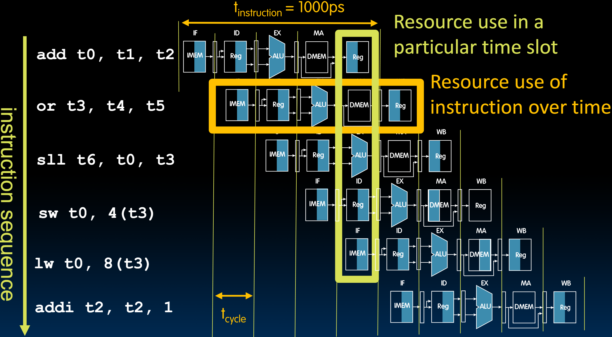

# 22.1-Pipelining RISC-V


Lecture Video Address


在前面几节课，我们已经设计出了功能性的RISC-V processor，但遗憾的是，在实际中，没有计算机会使用Single-Cycle Processor，(早期确实有一些单周期CPU，但它们基本上随着时间的推移被废弃了)，因为它们的效率通常会非常低：Single-Cycle是按照每个指令执行5个阶段来执行的，但是实际上并不是所有的指令都会执行这5个阶段。

在上一节，我们举了洗衣服的例子，洗衣服有四个阶段: wash, dry, flod, stash，多人依次同时执行洗衣的不同阶段，后面的人就不必等前面的人执行完任务之后才能开始。这样大大提升了整体的效率。

从本节开始，我们会将这种思想应用于processor

## 'Sequential' RISC-V Datapath

一条指令也可以分为五个阶段：IF，ID，EX，MEM，WB

下表将每个阶段的时间和示意图和所需的时间列出来

| Phase                | Pictogram                                                    | t~step~Serial | Phase                 | Pictogram                                                    | t~step~Serial |
| -------------------- | ------------------------------------------------------------ | ------------- | --------------------- | ------------------------------------------------------------ | ------------- |
| 1. Instruction Fetch |  | 200ps         | 2. Reg Read           |  | 100ps         |
| 3. ALU               |  | 200ps         | 4. Memory             |  | 200ps         |
| 5. Register Write    |  | 100ps         | (total)t~instruction~ |  | 800ps         |

> - 这里使用填充颜色的位置来区分对同一单元的操作，Read是右边填充，Write是左边填充，例如`IMEM`(右)和`DMEM`(左)，`Reg Read`(右)和`Reg Write`(左)
> - ID(Instruction Decode)和Reg Read是并行进行的，我们这里假设ID在Reg Read之前完成，所以这里列出了Reg Read时间。

- `Register Read`和`Register Write`是要比其他的阶段时间短的
- 执行整个指令的时间是所有这些阶段的总和，也就是800ps

下面是Single-Cycle Processor执行指令的流程

- add, or, sll指令都没有MEM的阶段的，但是都需要等这个时间

可以看到这样执行是非常浪费时间的。

## Pipelined RISC-V Datapath

下面是按照流水线的方式来执行这三条指令

1. 在流水线中，不需要等待整个指令完成后再开始下一条指令，只需要等待第一个**资源**释放，即IMEM。一旦从指令内存中读取到`add`指令，即使我们还不知道它是`add`指令，只是读取了32bits，我们可以立即开始读取下一个32bits，即`or`指令，并在读取完`add`指令后立即开始处理`or`指令。因此，将会有两件事情同时发生: `decode add instruction`; `fetch or instruction`
2. 可以看到每两个阶段中间都有一个寄存器，因为需要保存每个阶段结束后的结果，否则数据就会混在一起，这种寄存器叫做pipelined registers(流水线寄存器)

使用Single-Cycle Processor的时钟周期是所有阶段的时间总和，但是在Pipelining的情况下，时钟周期是用于在这些执行阶段之间==**传递数据**==或在==**流水线阶段**==之间==**移动数据**==的。它与处理整个指令无关。

> 可以理解为一个时钟周期，每个指令往后移动一个阶段。

因此，这个周期要短得多，大约是处理整个指令时间的五分之一，如下图。

还有一件事，与Single-Cycle CPU相比，处理整个指令的时间现在更长了。其原因在于我们必须将时钟周期设置为匹配流水线中最慢的阶段。这意味着在流水线中这些阶段是不平衡的，有些阶段需要200ps，有些阶段需要100ps。现在，由于我们**使用一个时钟来控制所有阶段的操作**，我们必须**将时钟周期设置为200ps**。否则，如果周期短于此，一些阶段将无法完成其操作(比如IF，EX，MEM阶段，如果t~cycle~ < 200ps, 这几个阶段就无法执行)

> 在上一节课中说过，如果降低流水线中的一个阶段的时间，并不会减少使用流水线工作的多个任务的时间。流水线的速度只取决于最慢的那一阶段。延长比较快的阶段不会降低流水线的速度。Unbalanced lengths of pipe stages reduce speedup

因此，流水线处理器的时钟周期为200ps(如下图)，这要短得多，仅为单周期CPU的四分之一，即800ps。但执行整个指令的时间为1000ps，因此更长。因此，我们在单个指令的延迟上有所损失，但在吞吐量上有显著的提高。

| Phase                | Pictogram                                                    | t~step~Serial | t~cycle~Pipelined | Phase                 | Pictogram                                                    | t~step~Serial | t~cycle~Pipelined |
| -------------------- | ------------------------------------------------------------ | ------------- | ----------------- | --------------------- | ------------------------------------------------------------ | ------------- | ----------------- |
| 1. Instruction Fetch |  | 200ps         | 200ps             | 2. Reg Read           |  | 100ps         | **200ps**         |
| 3. ALU               |  | 200ps         | 200ps             | 4. Memory             |  | 200ps         | 200ps             |
| 5. Register Write    |  | 100ps         | **200ps**         | (total)t~instruction~ |  | 800ps         | **1000ps**        |

> 在前面讨论过，影响程序执行时间的因素有很多，比如Time Per Cycle和CPI(Cycles per Instruction)，不同的因素之间是无法独立分析，而是相互影响的。
>
> 在这里使用流水线，时钟信号用来驱动不同阶段之间的数据传递，结果使得时钟周期缩短为执行一个阶段的最长时间，但是每个阶段都要按照这个时钟周期进行。（时钟周期缩短了，但是执行一条指令的时间变长了）。

## Single-Cycle Vs. Pipelined

下面我们分别就指标和流程来比较两种方式

### Matrices

|                                  | Single Cycle                       | Pipelined                |
| -------------------------------- | ---------------------------------- | ------------------------ |
| Timing                           | t~step~ = 100 ... 200 ps(variable) | t~cycle~ = 200 ps(fixed) |
|                                  | Register access only 100 ps        | All cycles same length   |
| Instruction time, t~instruction~ | = t~cycle~ = 800ps                 | 1000ps                   |
| CPI(Cypers Per Instruction)      | ~1 (ideal)                         | ~1 (ideal), <1 (actual)  |
| Clock rate, f~S~                 | 1/800 ps = 1.25 GHz                | 1/200 ps = 5 GHz         |
| Relative speed                   | 1 x                                | 4 x                      |

- 理想情况下，CPI（每条指令的周期数）为1。实际上，如果有任何内存未命中，我们需要超过一个周期来完成一条指令，这取决于我们的内存系统的性能。稍后我们会详细讨论这一点。实际上，流水线系统允许我们拥有多个执行单元，允许我们将CPI降到1以下。这不是本课程的内容，而是CS 152课程的内容。

- 总结来说，执行一条指令的时间稍微变长了（因为时间较短的阶段必须与时间较长的阶段保持一致），但我们通过显著提高时钟速度，显著提高了吞吐量。

    > 吞吐量增加不等于拥有的阶段数。理论上，可以有5倍的吞吐量增加，但由于阶段之间存在不平衡的延迟，我们损失了一点。不过我们仍然获得了4倍的提升。（这里并不是由于填充Pipeline所以没达到5x）

## Resource Usage in Pipelined

下面以执行6条指令为例介绍流水线执行过程中

> 在上图中，DMEM没有填充表示没有访问DMEM，比如add和or，只有lw和sw需要读取或者写内存，有填充

下面分别横向与纵向来分析执行过程中单条指令对资源的使用

- 横向：指令的资源使用在时间上是顺序的，每条指令依次经过取指、解码和寄存器访问、执行阶段、内存访问和写回。

- 纵向：多条指令在同一时间使用不同的资源。

    > 在上图的黄框中：
    >
    > - `add`指令正在将结果写回t0寄存器。
    > - `or`指令处于数据访问阶段，基本上只是等待`add`指令完成，以便它可以将结果写回t3。
    > - `sll`指令正在使用ALU执行移位操作。
    > - `sw`指令本质上是在从t3和t0寄存器中获取t3和t0值，以便使用它们。
    > - `lw`指令刚从内存中取出，甚至不知道它是加载指令。

接下来，我们将在下一个模块中看到，为了支持流水线，我们需要对datapath做些什么。
