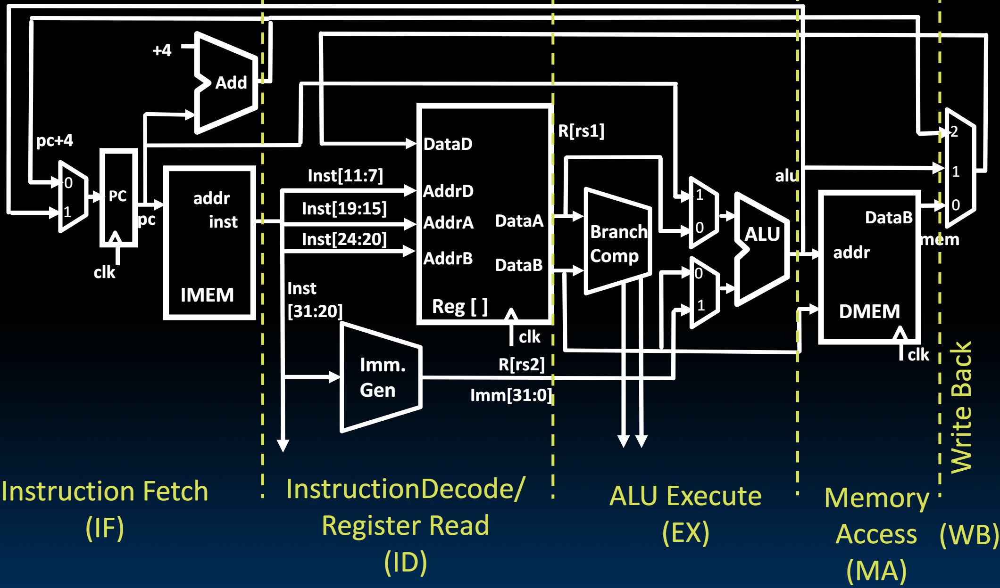
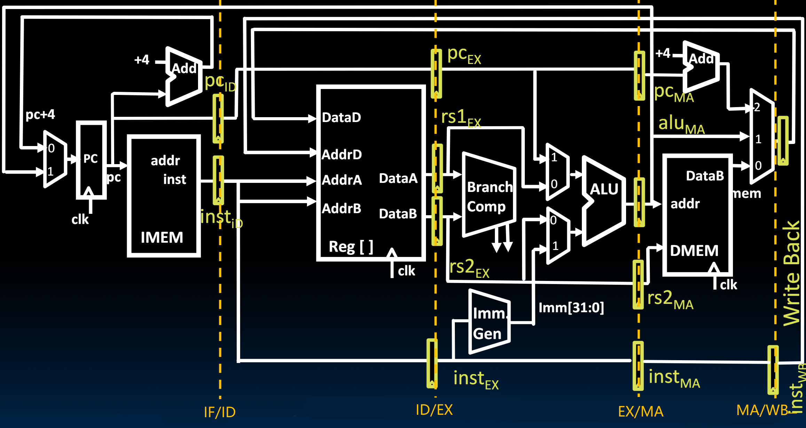
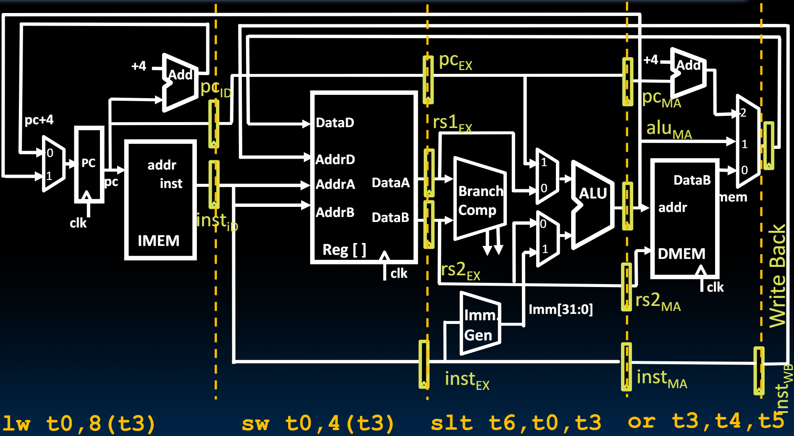
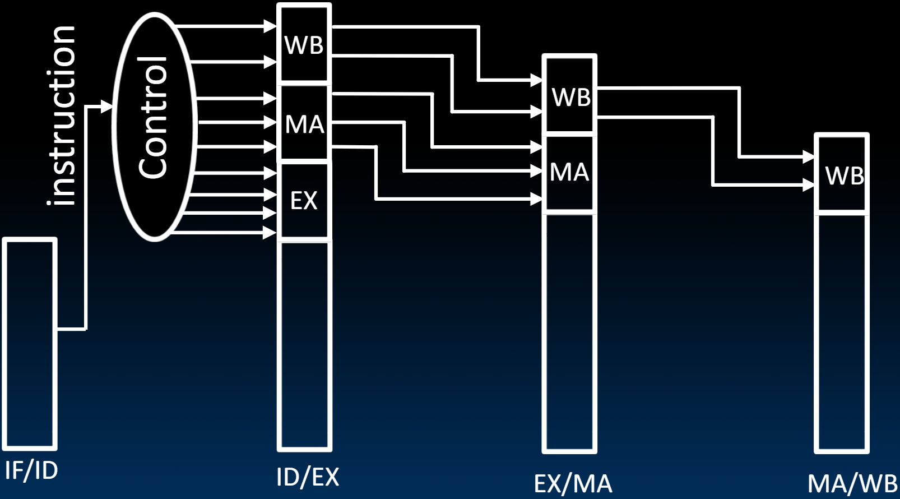

# 22.2-Pipelining Datapath


Lecture Video Address


之前，我们已经看到了如何将流水线应用于洗衣处理。我们也概述了如何对RISC-V Datapath进行流水线处理（将一个instruction的执行阶段分为5个阶段：Instruction Fetch, Instruction Decode, Execute, Memory Access, Reg Write）

## Single-Cycle RV32I Datapath

如下是之前设计的Single-Cycle RV32I Datapath

我们根据划分的指令执行的阶段，将Datapath进行划分

下面是每个阶段的说明

| stage              | Description                                                  | supplement                                                   |
| ------------------ | ------------------------------------------------------------ | ------------------------------------------------------------ |
| Instruction Fetch  | 从时钟上升沿开始，通过PC + 4进行操作，并在从IMEM读取数据时结束。 内存读取和寄存器访问被视为Combinational Logic操作，这意味着它们不依赖于时钟。只要数据在输出端稳定，我们就认为操作已经完成。所以，当指令内存输出端的指令位稳定时，我们进入下一个阶段。 | PC + 4的操作也算在Instruction Fetch当中                      |
| Instruction Decode | 这个阶段将解码指令并**读取寄存器**。寄存器读取就像组合逻辑操作一样。所以一旦寄存器文件输出端的值稳定，指令解码阶段就完成了。 | 读取寄存器的操作也算在Instruction Decode阶段当中；这里省略了Control Logic的Decode Instruction阶段，因为这一部分与寄存器读取是并行进行的，且慢于读寄存器。 |
| Execute            | 这一阶段我们执行ALU操作。当ALU输出有效时，操作完成。         |                                                              |
| Memory Access      | 如果在执行加载或存储操作时访问内存，则进入内存访问阶段。     |                                                              |
| Write Back         | 在时钟上升沿将结果写回到寄存器文件中的目标寄存器。           |                                                              |

## Pipelined RV32I Datapath

下面在硬件上来实现流水线

- 在每个执行阶段的边界上，需要放置寄存器。（这里将相邻阶段的交界处都标识出来: IF/ID, ID/EX, EX/MA, MA/WB）

    > 在lec15.4中提到过，电路实现流水线的方式就是在执行阶段之间添加寄存器以保存上一个执行阶段的结果给下一个阶段使用。这样下一个任务就可以使用上一个阶段的资源了

- 这里Inst需要逐个传递给后面的每个阶段。同一时间可能有五条正在执行的指令。当其中一条指令被获取时，在流水线下游保存了先前获取的指令副本。

- 每个流水线寄存器都必须保存与当前阶段执行的指令相对应的位，否则将不知道该阶段正在做什么。因此，该阶段必须保持指令以及与之对应的控制位。

- 另一个要注意的是，我们传递PC的值，因为在后续中会使用PC + Imm的操作，但是不传递PC + 4的值，相反，我们在内存访问阶段重新生成PC加4的值。另一个原因是，在执行的前三个阶段更多地使用PC值，然后只在内存访问阶段只需要PC加4的值，以便在需要时写回。

    > 回顾：PC + 4要传到MA/WB前的mux的作用主要是`JAL`和`JALR`指令，需要将PC + 4的结果写在`ra`寄存器用以返回。在先前的版本中，直接将IF阶段的PC + 4传到后面了。但是现在为了实现流水线，需要将PC + 4传递到MA阶段，这需要三个寄存器（数据不能跨阶段传递，因为下一个阶段的资源可能是上一个指令正在使用，所以传递只能一步一步走），这样的代价是要大于直接在MA添加一个+4 adder的（这个adder是固定的，只能+4）

---

下面用一个例子来演示

这里总共有五个指令，其中第最早的指令没有显示，其处于WB阶段(图中的`WB pipeline register`到`Reg[]`的`DataD`)，第二个执行的指令是`or t3, t4, t5`，然后依次次是`slt t6, t0, t3`, `sw t0, 4(t3)`, `lw t0, 8(t3)`，此时lw刚刚被取出来，还未解析(也就是还不知道这个指令是做什么的)

> 执行指令的先后顺序是从右往左，最右边的是最先执行的

Pipeline registers separate stages, hold data for each instruction in flight

整个阶段的执行过程，就是在时钟周期上升沿之前，保证Pipeline Register的输入信号稳定，此时在时钟信号来临的时候，寄存器更新并输出新值，并自动进行下一个阶段，下一个阶段的最后也是需要最后的信号稳定。

## Pipelined Control

除了指令位之外，还需要保存解码后的控制位。控制逻辑告诉我们每个阶段应该做什么，以及每个阶段应该如何配置。因此，一旦我们解码了指令，除了指令之外，还需要将与该指令对应的所有控制位传递下去。

- As in single-cycle implementation
- Information is stored in pipeline registers for use by later stages

- Instruction Decode在指令被传入到Control Logic的时候就会立即执行(当然有一些控制信号需要再执行阶段才能确定，比如说Branch指令的PCSel信号需要在Branch Comp之后才能确定)
- 这些信号需要依次向后传递到使用该信号的阶段。比如ID后得到了WB，MA，EX三个阶段需要的信号，那么EX就直接在EX阶段使用，不必向后传递了。MA在WA阶段使用，WB要传递到最后一个阶段。

---

流水线的实现基本就是这样，然而，在有多条指令同时执行的情况下，有一些特定的问题，称为风险（hazards）。接下来我们将讨论这些风险。
