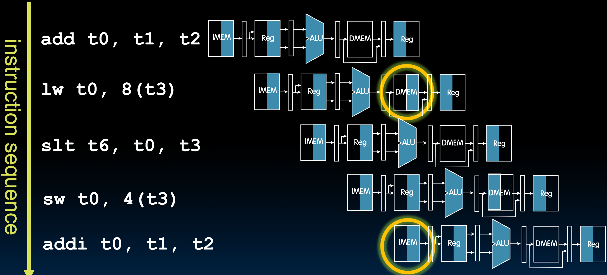
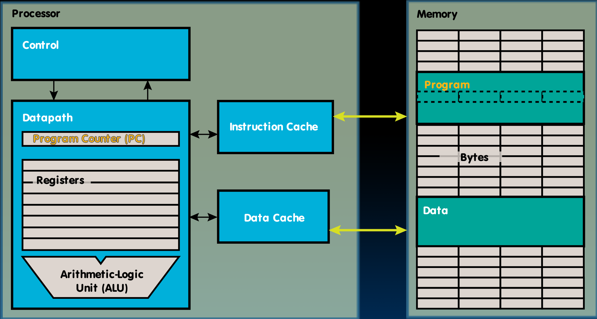

# 22.3-Pipeline Hazards


Lecture Video Address


> Hazard(危害)

到目前为止，我们已经将单周期CPU修改为流水线处理器。在此过程中，我们添加了一些流水线寄存器并移动了一些资源(比如+4 adder)，以使流水线设计起来更容易一些。

但我们并没有真正设计出一个好的流水线处理器，因为还存在一些流水线危害(pipeline hazards)。

流水线危害指的是流水线处理器遇到的一系列问题。流水线处理器和单周期处理器(Single-Cycle Processor)之间的区别是我们有多个指令在同时进行。在单周期处理器中，指令只依赖于它们自身，每个指令完成后，下一个指令才开始执行，它们之间实际上没有依赖关系。而在流水线处理器中，有多个指令在同时执行。如果一个指令的结果影响了后续指令，那么就会遇到问题，后续指令将无法继续执行。

## Pipelining Hazards

通常存在三种类型的危害，它们有不同的解决方案。

> 称其危害是因为尤其在早期阶段，不清楚谁将负责处理这些问题。它们可以由编译器或流水线处理器的设计者解决，但必须有人负责这些危害。如果没有人处理，处理器将无法工作，或者更糟的是，大部分时间正常工作但偶尔会失败，而且很难找出何时以及为何失败。

A hazard is a situation that ==**prevents starting the next instruction in the next clock cycle**==

下面简要介绍一下常见的三种危害：Structural hazard、Data hazard、Control hazard

| Hazard            | desc                                                         |
| ----------------- | ------------------------------------------------------------ |
| Structural hazard | 由于资源争用引起。在大多数现代处理器中，至少在不太复杂的处理器中（如我们在本课程中设计的处理器）我们很少会遇到结构性危害。ISA的设计避免了这些危害，而流水线是与ISA相匹配的，所以也不会遇到这样的问题。 |
| Data hazard       | 数据危害实际上是因为指令之间的依赖性而存在。如果有一个正在执行的指令要将结果写入寄存器文件，后续指令不能在结果写入寄存器文件之前使用相同的操作数，否则我们将使用不正确的值。 |
| Control hazard    | 当有分支时会发生控制危害。如果流水线中有一个分支，并且在它之后有另一条指令，那么如果分支被执行，那条指令可能是无效的。 |

> 这些危害是由于使用流水线而带来的，如果是Single-Cycle Processor就不会有这些问题。

## Structural Hazard(all solved)

### Adder Hazards

我们已经在设计Single-Cycle CPU时解决了最简单的结构性危害，即PC + 4和执行算术运算以及确定内存地址之间对ALU的争用。

本应存在的问题是PC + 4的时候ALU无法用于运算，但在设计Datapath的时候，为PC increment设置了一个专用加法器。用以解决这个问题。

### solution

Problem: Two or more instructions in the pipeline compete for access to a single physical resource

- Solution 1: Instructions take it in turns to use resource, some instructions have to stall(停顿)

    > 在上一条指令使用完资源之前，下一条指令先暂停

- Solution 2: Add more hardware to machine(这也是最常用的方法，例如为PC+4设置专用Adder)

Can always solve a structural hazard by adding more hardware

### Regfile Structural Hazards

> 之前我们谈到过，Regfile, IMEM都看做CL，其读操作是会自动进行而不需要CLK信号

Regfile structural Hazards意思是Regfile资源发生冲突，例如读和写要同时进行。

这个问题已经解决了。

在RISC-V中每个指令最多可以访问寄存器文件三次：最多有两个操作数需要读取，最多一个操作数需要写入。（Regfile必须支持这种情况，否则我们将面临资源短缺的问题）

而我们的Regfile在设计的时候就有2个read ports和1个Write ports，且这几个ports是相互独立的。（Avoid structural hazard by having separate "ports": Two independent read ports and one independent write port）

同时要注意，我们假设寄存器的读写时间是非常短的，短于其他的阶段，因此一个阶段连续完成寄存器的读写操作是足够的。（但是关键还是Regfile有3个端口能够支持每个周期同时进行三次访问）。(Three accesses per cycle can happen simultaneously)

### Structural Hazard: Memory Access

内存争用：内存在读写的时候发生了冲突。

几乎所有指令都需要访问IMEM，有些指令(比如`lw`和`sw`)需要读取或写数据，要访问DMEM。在读指令的时候如果有写数据或者读数据的操作，就会争用内存。

> 只可能存在**读指令**和**读数据**或者**读指令**和**写数据**的冲突；不可能存在写数据和读数据的冲突，因为二者都在指令的MA阶段，按照流水线的设计，是不允许两个指令同时处于同一阶段的。
>
> 换言之，只有IMEM和DMEM的冲突。

如下，`lw`在读取数据的同时，`addi`在读取指令

我们的解决办法就是有两个内存：将内存区分为两块，DMEM和IMEM，写数据时写入到DMEM，读指令时从IMEM中读取。

但是之前也说过，我们使用的是存储程序计算机，程序和数据以相同的形式存储，有统一的内存概念（也就是说在物理上只有一个内存），这与上面的划分相悖，怎么在物理上实现划分呢？

实际上，我们有一个主内存，它在DRAM中，但我们通常在处理器芯片上有缓存。

Fast, on-chip memory, separate for instructions and data

## Structural Hazards – Summary

Conflict for use of a resource

In RISC-V pipeline with a single memory

- Load/store requires data access
- Without separate memories, instruction fetch would have to stall for that cycle
    - All other operations in pipeline would have to wait

Pipelined datapaths require separate instruction/data memories

- Or separate instruction/data caches

RISC ISAs (including RISC-V) designed to avoid structural hazards

- e.g. at most one memory access/instruction
