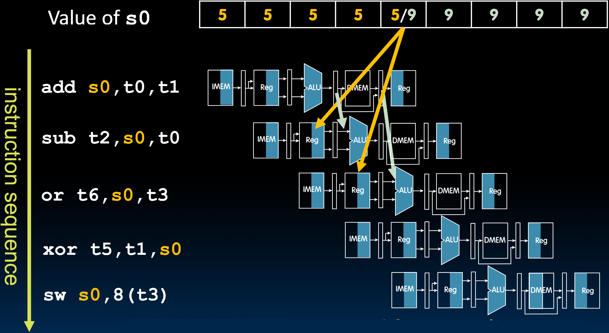

# 22.4-Data Hazards


Lecture Video Address


## Register Access

在访问Regfile的时候，如果读和写同一个寄存器发生的冲突。


Separate ports, but what if write to same register as read? 

> 要与上一节中的Regfile Structural Hazards区分开来，structural hazards主要是指争用Regfile产生的冲突，解决方式是设置3个独立的端口，一写二读。
>
> 但是现在的问题是读与写的寄存器是同一个寄存器。比如图中所示，`add`的结果要写在t0中，`sw`要从t0中读取，二者发生在同一周期

### Solution

Does sw in the example fetch the old or new value?

解决办法就是我们的Regfile是支持Single-Cycle read-write operation的（这依赖于Regfile的电路和逻辑实现）。充分利用了寄存器文件读写的高速度（读和写都可以在100ps完成），在200ps的周期内，前100ps进行写，后100ps读，在一个周期内连续执行读写操作。

> 图示符号阴影的位置也可以表示先后顺序，Reg Write是左边阴影，Reg Read是右边阴影。先写后读

Might not always be possible to write then read in same cycle, especially in high-frequency designs.

> 也就是说，在大多数标准的五阶段流水线有效，但是在复杂的高频率的流水线中并不适用，详细内容可以在CS152中学习。

## ALU Result

看如下的指令序列

```assembly
add s0, t0, t1
sub t2, s0, t0
or t6, s0, t3
xor t5, t1, s0
sw s0, 8(t3)
```

`add`的结果写在s0当中，`sub`, `or`, `xor`, `sw`全依靠add的结果

下面是执行的流程


- s0初始值为5，直到第5个周期的前半部分，也就是Regfile的写阶段，s0=5；
- add的ALU的结果为9，但此时还未到达WB阶段，所以结果仅仅保存在Pipeline Register当中，还没有更新寄存器s0的结果
- 在第5个周期的后半部分，也就是Regfile的读阶段，S0=9

但是在这个过程中，出现了问题，如下图所示


- `sub`在第3个周期读取了s0=5；`or`在第4个周期读取了s0=5；这个结果并不是add的结果，因此会得到错误的结果。
- `xor`在第5个周期的后半段读取s0=9，`sw`在第六个周期读取s0=9；这个结果与add的结果一致。

Without some fix, `sub` and `or` will calculate wrong result!

## ALU Result: Solution

### Stalling

Problem: Instruction depends on result from previous instruction

如下，`sub`指令依赖于`add`指令的结果

```assembly
add s0, t0, t1
sub t2, s0, t3
```

解决方式就是让sub暂停，在add的执行结束之前先暂停`sub`


暂停的方式就是在中间插入`bubbles`

Bubble: Effectively `nop`: Affected pipeline stages do "nothing"

> nop: no operation
>
> 插入bubble应该是在编译的过程中，当发现后面的指令依赖前面的结果时，在中间插入bubble

bubble并不是说让一个指令完全不动（比如说`add`完全执行结束后才执行`sub`），而是让`Reg Write`阶段和`Reg Read`阶段对其，如下图


> add的Reg Write阶段和sub的Reg Read阶段处于流水线的同一时刻。

在stall的方法中插入bubble可能不是很好的方法，因为在bubbles期间，processor什么都不做。

#### Stalls and Performance

Stalls reduce performance: But stalls are required to get correct results

> 为了防止processor do nothing，编译器会遍历紧跟在 add 之后的指令列表，尝试找到一些不依赖于 add 结果的指令，并尝试将 sub 与不依赖 add 结果的指令交换。这样，我们就不会丢失任何周期。
>
> 但如果找不到任何指令，我们就必须插入这些空指令，这些空指令将导致停顿，以便我们能够正确对齐寄存器读取与寄存器写入。

Compiler can **arrange code** or insert `nops` (`addi x0, x0, 0`) to avoid hazards and stalls: Requires knowledge of the pipeline structure

### Forwarding instruction sequence

第二种解决方案是硬件解决方案，需要通过修改datapath来实现。

以之前的指令序列为例


当`add`指令在其Ex阶段结束时，计算结果已经有了，但是只是存储在Pipeline Register，还没有保存在寄存器s0当中，而`sub`和`or`仍然从s0中读取数据。

解决办法就是将EX阶段后的Pipeline Register存储的计算结果先转发到sub的ALU的输入端口，以便`sub`能够正常执行；MA阶段后的Pipeline Register中的正常结果转发到`or`的ALU的输入端口。如下



我们需要在数据路径中有这些转发或所谓的旁路路径，以便数据在未写入寄存器文件的情况下转发到正确的位置。数据将写入寄存器文件，但这只是为了让后续指令立即使用结果。

#### Forwarding (aka Bypassing)

Use result when it is computed

- Don't wait for it to be stored in a register
- Requires extra **connections** in the datapath


简单设想，实现这样的功能需要在Pipeline Register后连接一个多路复用器并输出到ALU的A operant（这里仅仅显示的是A operant，B operant也要转发）

#### Data Needed for Forwarding (Example)

这样我们就需要一个控制信号能够控制多路复用器选择Pipeline Register的结果输入到ALU当中，这个信号是什么呢？

数据路径保存了当前正在执行的指令，因此我们会知道两个连续指令正在访问哪些寄存器。因此，我们需要做的是查看执行阶段指令的目标寄存器，并将其与指令解码阶段的指令进行比较。如果它们相同且不是 x0，那么我们有一个data hazards，需要进行转发。


只需比较这两个寄存器，这将选择我们的转发多路复用器。我们将在 ALU 和内存访问阶段之间进行相同的比较，以允许再次转发。

> Must ignore writes to x0!

#### Pipelined RV32I Datapath

下面是实现的Datapath


原先A Operant的mux有2个输入，PC和Reg，现在又多了两个，分别是EX和MA阶段后的Pipeline Register的forward path

然后还需要控制信号控制forward


> Remember to forward operand B as well!
