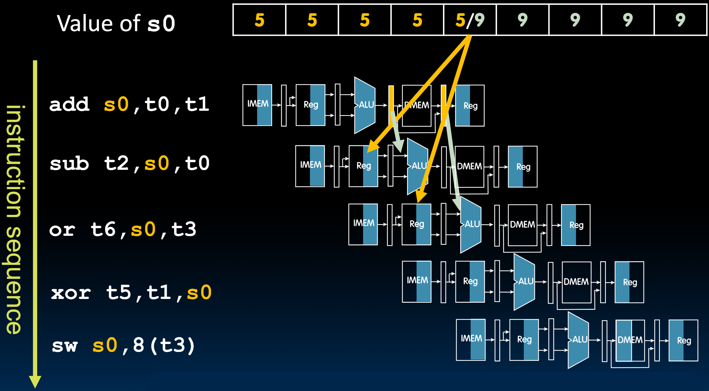
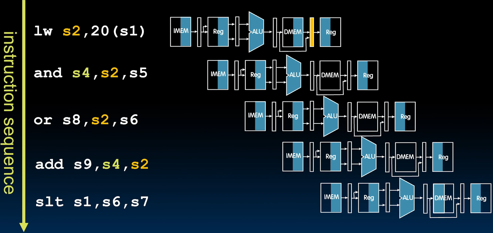
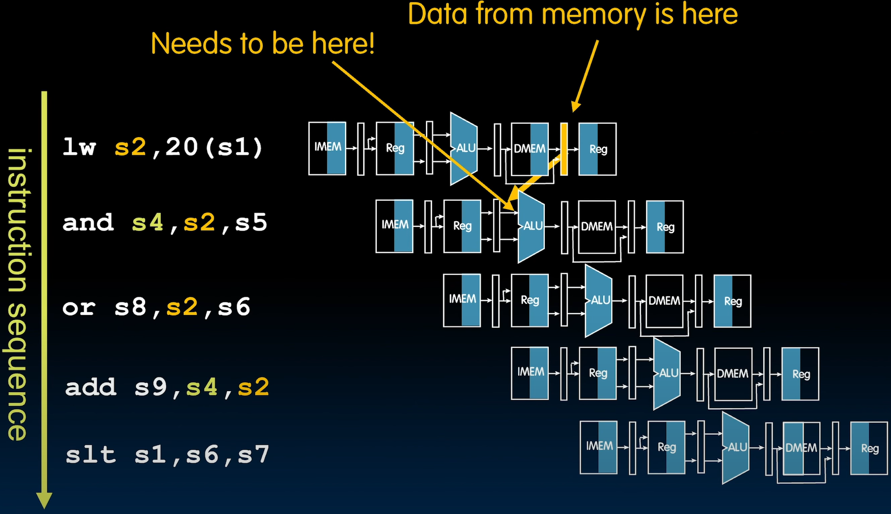
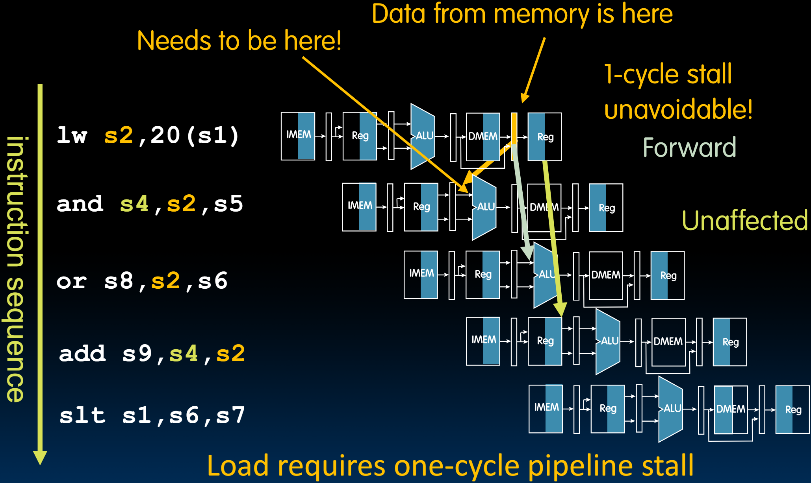
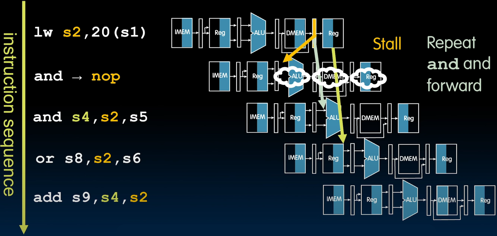
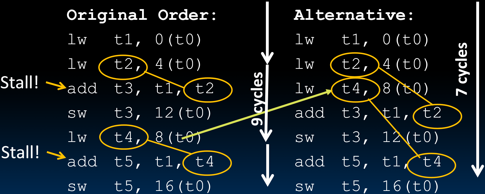

# 23.1-Load Data Hazard


Lecture Video Address


> Load Data Hazard也是Data Hazard的一种

到目前为止，我们已经研究了流水线的原理，然后继续分析了各种风险。我们看到，通常通过增加足够的硬件来解决结构性风险，以便我们可以在流水线中执行多条指令。然后我们继续研究数据风险，这些风险源于后续指令依赖于流水线中先前指令的结果这一事实或条件。

如下图



> Forwarding: grab operand from pipeline stage, rather than register file

在这种情况下，我们有一条已经在流水线中的`add`指令，然后有一条`sub`指令跟在它后面，并使用存储在目标寄存器`s0`中的结果作为后续指令的源。之后的指令也使用`s0`作为源寄存器。当`add`指令通过流水线的五个阶段时，尽管这个加法运算的结果在执行阶段结束时已知，但它要到两个阶段之后才能写回寄存器文件，即在写回阶段的一半时才写回寄存器文件。因此，在这种情况下，`s0`的值仍然是旧值5，并且在写回阶段的第一阶段更新为新值9。

因此，如果在指令解码阶段，跟在`add`指令之后的`sub`指令从寄存器读取值，它会读取错误的值，即旧值5。相反，我们通过转发新值来处理这个问题。这是可能的，因为我们已经知道新值是9，只是还没有写回寄存器文件，但它在ALU输出寄存器中可用，分离执行阶段和内存访问阶段。因此，我们需要扩大为ALU提供操作数的多路复用器，在这种情况下是`ra`，它将在ALU的输入处显示。同样，对于后续的指令，我们会在结果写入寄存器文件之前，从分离内存访问阶段和写回阶段的流水线寄存器中转发这个加法结果。由此。我们学会了通过使用硬件转发来处理这些数据风险。

如果没有硬件转发，我们将不得不暂停流水线，这意味着我们必须插入空操作，并且在特定周期内不执行任何操作。

## Load Data Hazard instruction sequence

一种数据风险的情况下，没有这样简单的解决方法，那就是与`lw`相关的数据风险。

如下是lw开头的指令序列

```assembly
lw s2, 20(s1)
and s4, s2, s5
or s8, s2, 6
add s9, s4, s2
slt s1, s6, s7
```

- `lw`读取内存数据存储在s2中，`and`, `or`, `add`都需要s2寄存器的内容

执行流程如下



现在出现的问题是`lw`在MA阶段读取数据，但还未存储在Regfile当中，但是and在其ID阶段，也就是lw的EX阶段就要从Regfile中读取数据。但是在这种情况下，数据是没法forward的，如下



> 这里要与add的data hazard区分开来
>
> - add的问题在于计算结果还未保存在Regfile当中，后续的指令就要读取Regfile了。但是此时计算结果已经出来了，所以可以通过forward来解决。
> - 但是lw的问题是后续指令要从Regfile中读取数据的时候，lw还没有从内存中读取出数据，此时数据还没有，所以没法通过forward解决。

在这种情况下，解决方式之一就是stall，让后续指令停止。

暂停一个周期之后，就可以进行forward了，如下，`lw`从MA阶段读取的数据可以通过forward传给`or`的ALU，后续的指令也不会受影响



简而言之，所有类型的加载指令都需要一个周期的流水线暂停。

## Stall

下面看看Stall是如何进行的

如下是原先的执行流程，由于and在读取Regfile之后lw才能从DMEM中读出数据，无法通过forward来解决


只能通过stall来解决这个问题，如下


这里将and替换为空操作(nop)，并且原来的`and s4, s2, s5`后移，后续的指令也依次后移

但现在出现一个问题，怎么用硬件实现and→nop呢？

> compiler仅仅负责将HLL转化成assembly language，并不负责插入nop，我自己猜测的原因之一是违反了abstraction，因为在ISA上层仅仅负责将HLL转化成machine code，在ISA下层才负责用硬件实现ISA。出现这样的data Hazard是由于硬件在Datapath中使用了流水线，而compiler是不知道硬件是怎么实现的，更不知道硬件会出现这样的问题，硬件只负责提供接口，所以出现问题也应该由硬件来解决。
>
> 而且编译和执行是可以分开进行的，在一台机器上用compiler进行编译后的machine code可以移植到另一台计算机上运行，如果该计算机没有这样的data hazard，那么compiler进行nop插入就会浪费processor。
>
> 但是后面使用Code Schedule解决的时候就将任务交给了compiler。

~这里注意时间节点，在解析`lw`指令的同时，Fetch了`add`指令，并且硬件只有在解析了add指令之后，也就是ID之后才能知道Fetch的是add指令（在IF阶段只是获取了32bits的指令，并不知道指令是什么意思）也就是说这个时候才能判断是否有dataHazerd，此时才能决定是否替换为nop，所以在上图中，and只有EX，MA，WB阶段覆盖了bubbles，IF和ID照常执行~

~硬件需要做的是，在解析了`add`指令之后，要取消本次执行，而要在下一次的时候重新执行`and`。怎么做呢？~

> 这里不能再Decode add Instruction之后再进行Stall，下面会说。

整个CPU是根据FSM(Finite State Machine)的思路设计的，指令执行的结果就是状态的更新(包括PC = PC + 4，本质上就是修改flip-flop)，那么只要我们在解析了add指令并且发现其rs与上一条lw指令的rd一致时，不允许进行状态更新(包括PC，registers，DMEM)，那么本次任务就相当于什么都没做，甚至PC也没变。

下一次执行的时候就会重新读取PC，也就是add指令，重新执行，此时就可以使用forward来解决data Hazard了



> 进行Stall的时间是lw的ID阶段，也就是说，当得知了是lw指令之后，不论下一条指令是什么，都必须Stall。
>
> 如果我们要在Decode add Instruction后得知add需要用到lw的rd然后再Stall，也就是关闭写使能信号，那么PC就会出错。因为在Decode add Instruction阶段开始的时候，PC=PC + 4会更新，下一条指令就会进入流水线。而我们希望add先Stall，然后重复执行add，所以必定要在add的ID之前阻止写状态，也就是说当lw的ID阶段识别出是lw指令之后就需要立即阻止写信号。

简而言之，为了处理加载数据风险，我们必须在硬件中实现一个周期的流水线暂停，防止指令完成，不更新处理器状态，并强制重新执行后续指令。

### lw Data Hazard

**Slot** after a load is called a **load delay slot**

- If that instruction uses the result of the `lw`, then the hardware will stall for one cycle
- Equivalent to inserting an explicit `nop` in the slot
    - except the latter uses more code space
- Performance loss(这种方式仍然会影响性能)

## Code Scheduling

Idea:（使用替换的方式来解决）

- Put unrelated instruction into load delay slot
- No performance loss!

Reorder code to avoid use of load result in the next instr! 

> 这个任务就要由compiler解决了。
>
> （个人猜测）前面分析compiler不能插入slot，其实本质原因是防止在没有Data Hazard的硬件中执行的时候降低效率。但是compiler进行交换后，不论有没有Data Hazard，都不会影响效率。

如下是一个例子

RISC-V code for `A[3]=A[0]+A[1]`; `A[4]=A[0]+A[2]`



- 左边是使用Stall解决，需要9cycles
- 右边是代码交换解决，需要7cycles
