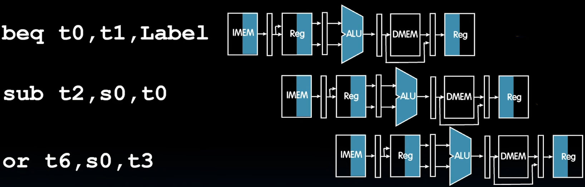
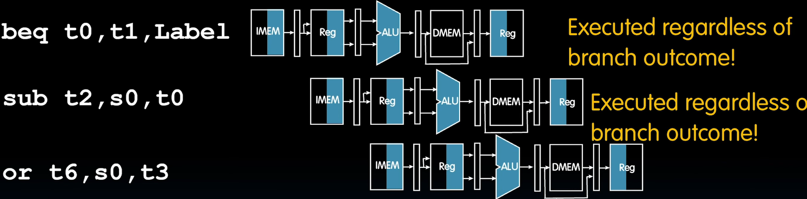
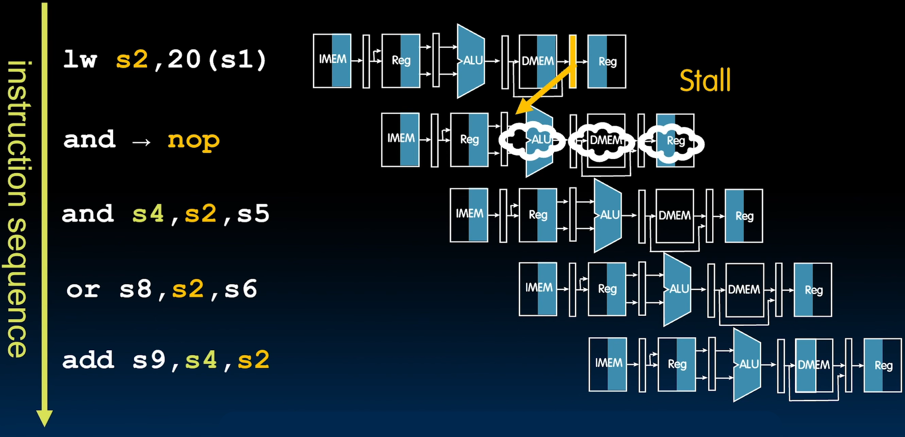

# 23.2-Control Hazards


Lecture Video Address


到目前为止，我们已经看过了structural Hazards和Data hazards。通过在我们的流水线中提供足够的硬件，可以使处于不同执行阶段的多条指令同时执行，从而解决structural Hazard。另一方面，那些与连续指令相关的Data Hazard，在后续指令中使用源寄存器中的值，在前一条指令中将该值刚写入目标寄存器或应该写入目标寄存器。为了让它们正确执行，我们需要使用Data forwarding(也叫作 Data bypassing)。因此，在我们的流水线中添加了这些多路选择器。

让我们看看在通过流水线运行的代码中可能遇到的第三种类型的冲突。这些是与Branch和jump相关的Control Hazard。

## Control Hazards

这里我们重点分析Branch指令，因为jump是unconditional jump，在ID之后就可以立即知道是否需要跳转，而Branch无法理解确定是否进行跳转。

我们以下面的指令序列为例

```assembly
beq t0, t1, Label
sub t2, s0, t0
or t6, s0, t3
xor t5, t1, s0
sw s0, 8(t3)
```

首先分析Branch指令


- 在IF阶段取出指令，ID阶段进行解析，但是此时还不能 确定是否进行跳转
- 只有在EX阶段之后才能确定是否跳转



- 在`beq`的ID阶段，此时无法确定是否跳转，此时会Fetch `sub`指令，`sub`进入流水线；在EX阶段还未结束，此时仍然未确定是否跳转，`or`进入流水线
- 也就是说，beq后面带两个指令是必定会执行的，无论分支的结果如何。



- 在beq的EX阶段结束之时，会计算出PC + Immediate并且确定是否跳转（此时PC更新）

- 在下一条指令的IF阶段，也就是`xor`的Fetch阶段，==**第一步是先更新PC**==，然后取值，最后信号稳定之时取出的是beq确定的指令。(后续的指令都会正确)

    > 我们这里假设xor是label的位置，实际上label在任何地方都有效。


所以，在流水线的每个Branch之后，都需要有2个Stall cycles。

下面我们来看看如何使用Stall来解决Control Hazard的

## Stall

回忆之前在Load Data Hazard中是怎么实现Stall的（只需要阻止and更改State就相当于将and替换为nop了）



- 在Load Data Hazard的Stall中，当发现是`lw`指令之后(ID阶段)，立即关闭与将新状态写入处理器相关的所有控制信号。在Stall之后会重复执行`add`

    > 也就是说在lw的ID阶段只要识别出是lw指令，那么就立即Stall，不论后面的指令是什么，是否利用到了rd。


- Branch的区别在于，在EX阶段后明确需要跳转的时候才将后面两个指令进行Stall。如果不跳转，那么后两条指令继续执行。
- 并且Branch的Stall结束之后，不会重复执行`sub`和`or`，因为下一个周期PC会更新为Label的位置

> Load Data Hazard和Control Hazard不一样：
>
> - Load Data Hazard是因为读取寄存器的结果错误所以需要推迟。我们希望重复执行，就需要阻止PC = PC + 4的更新
> - Control Hazard是因为Branch后面的指令可能不会执行，所以即使PC = PC + 4更新，那么也不会有影响。即使是真的要跳转，那么也会在下一次更新PC的时候更新为PC + Immediate，也就是Label的位置

## Reducing Branch Penalties

### Observation

- If branch not taken, then instructions fetched sequentially after branch are correct
- If branch or jump taken, then need to flush incorrect instructions from pipeline by converting to NOPs

也就是说，Branch只有50%的几率是会跳转，所以使用下面的方法是有效的。

> 如果Branch的几率是99%，那么这个方法没啥帮助，此时必须要进行2个Stall了。

---

- Every **taken** branch in simple pipeline costs 2 dead cycles（只有确实需要跳转的时候才会有2个cycles）
- To improve performance, use “branch prediction” to guess which way branch will go earlier in pipeline

我们可以观察到，分支要么大多数被执行，要么大多数不被执行。我们可以预测它们是否会被执行。分支往往用在循环代码中，比如`while`或者`for`循环，如果我们的for循环应该执行100次，我们的分支只会被执行一次，99次不会被执行（跳回到循环开头的跳转都是jump执行的）。如果我们正确地预测到这是一个很少被执行的分支——仅1%的时间——那么我们可以消除大部分的惩罚。我们可以将这个分支的惩罚减少到2个停顿周期的1%。

所以我们会一直执行循环中的代码，只在预测不正确时偶尔取消它。那么我们如何预测分支是否会被执行？

实际上，有一些相当复杂的预测器，但最简单的是一个single-bit predictor，它记录上次分支是否被执行。这是一个相当好的指示，表明它是否会在下一次被执行。所以你只需保持一个比特，表示这个分支上次被执行了。这在大多数情况下都是正确的。

> 如果想要深入了解复杂的predictor，可以学习CS152。

这些分支预测器已经被很好地调优，无论代码如何，它们的准确率都高达90%以上。不一定需要是一个循环执行100次。

- Only flush pipeline if branch prediction was incorrect(只有预测失败的时候清空流水线)

### Branch Prediction

下面是预测的示意图


首先是beq指令。如果分支被执行，我们会预测它将被执行，并开始从标签处执行代码。我们会立即将该标签加载到PC中，然后继续用这个猜测的PC执行指令。

> Branch的Stall的问题在于，我们本希望被采取的Branch指令的下一条是Label处的指令，但是由于PC是逐个递加的，所以下两条填入流水线的指令是物理上相邻的下两条指令，而不是Label处的指令。
>
> 减小惩罚的目的就是希望被采取的beq指令的下一条是Label的指令。

但是在完成指令之后，我们有机会检查我们的猜测，并在预测不正确时纠正自己（在beq的EX阶段可以检测）。

所以，如果我们的猜测是正确的，一切都很好。如果猜测不正确，那么我们就必须将那些已经执行的指令转换为空操作指令（nops）。
