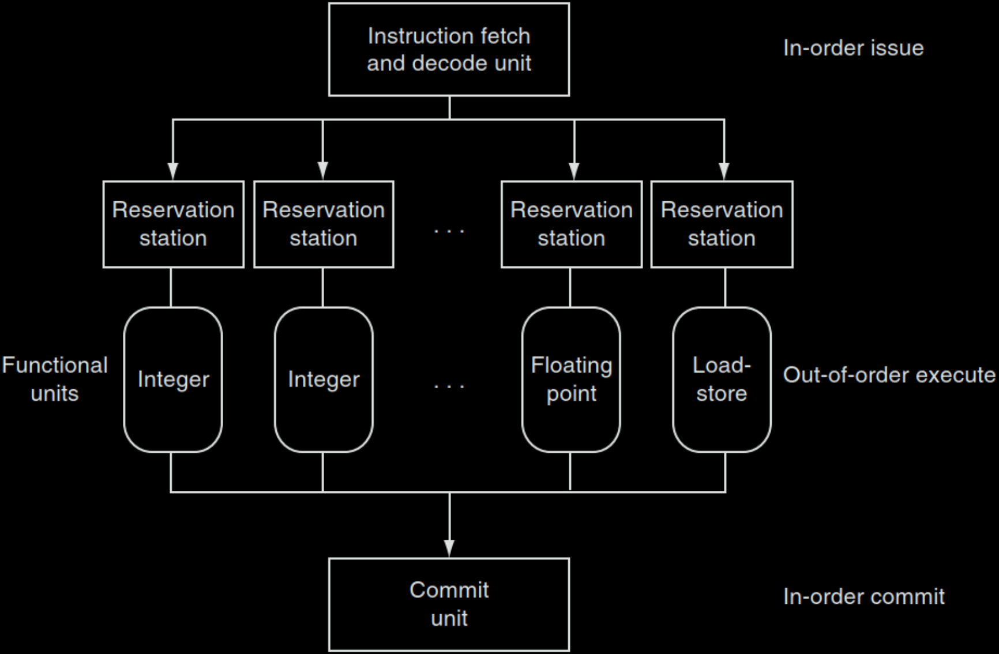
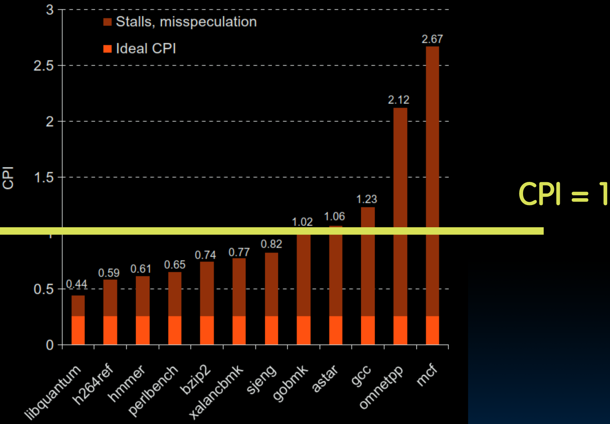
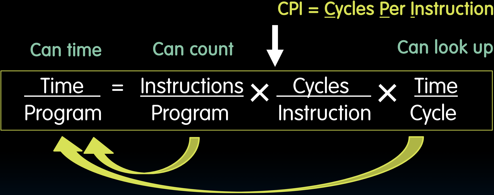
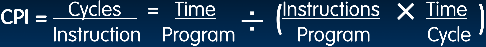

# 23.3-Superscalar


Lecture Video Address


我们已经学习了如何设计一个流水线过程。我们实际上学到了设计流水线处理器的原理。当你做一个项目并真正经历流水线的设计和所有风险的解决时，你将真正感受到如何设计一个流水线处理器。那其实很有趣。

但现在，虽然我们已经理解了设计一个好处理器所需应对的所有原理，但是还有一个更高级的概念存在，那就是所谓的超标量处理器(Superscalar Processor)的概念。许多现代的高性能处理器都是超标量类型的。

## Increasing Processor Performance

在了解Superscalar processor之前，我们再来讨论一下如何在前面的基础上进一步提高处理器的性能

> 在之前，我们设计了一个五阶段流水线。而这个五阶段流水线是现在行业的主力。大约80%或90%的处理器都是五阶段流水线，例如汽车和各种电器，但它们没有达到最高的性能。
>
> 还有许多不同的设计，它们性能更高，在笔记本电脑、台式电脑，甚至手机中，我们通常会找到一些性能更高的处理器。
>
> 那么，我们如何提高处理器的性能呢？

1. 尝试提高时钟频率(Clock rate)

但是Clock rate受两因素的限制：

- 晶体管的开关速度（这个由技术Technology决定）

- 功耗

    > 我们之前提到过。提高时钟频率是我们在90年代到2000年代初期增加性能的主要手段，但随后我们达到了功耗上限，我们的设计人员发现他们可以设计运行非常快的高时钟频率处理器，但没有实际的冷却手段，所以时钟频率必须保持恒定以允许合理的冷却。

2. 与时钟频率增加常常协同工作的选项是更深的流水线概念。

    > 之前我们已经设计了五阶段流水线，但其实可以将执行分解成越来越小的部分。目前已经建造了10阶段或15阶段深的流水线。英特尔的处理器曾一度达到20阶段深的流水线。
    >
    > 这里的想法是每个周期做更少的工作，通过更少的逻辑门，以便缩短时钟周期。这使我们能够以更高的频率运行，或者如果我们受到功耗限制，可以降低电源电压，在相同的时钟频率下运行，但功耗更低。

    - 然而，流水线越深，我们遇到风险的可能性就越高。因此，我们的CPI自然会高于1。

---

作为替代方案出现的是所谓的多发射(Multiple issue)或超标量(Superscalar)处理器。这些处理器理论上可以拥有远低于1的CPI。那么这些是如何工作的呢？

## Superscalar Processor

在超标量处理器中，我们有多个发射单元(multiple issues)。

我们有多个执行单元以及帮助这些执行单元运行的其他所有部分。

所以每个执行单元实际上都是一个独立的流水线，能够执行整数指令或浮点指令，或者我们可能有专门的加载和存储流水线。

> 之前我们是所有的指令都使用一个Pipeline，现在是不同的任务有不同的流水线。

由于我们有多个执行单元(多个流水线)，我们可以==**在每个时钟周期内获取多条指令**==，并将其发射(issue)到不同的执行流水线中。这使我们能够将CPI降到1以下，因此我们每个时钟周期将完成多条指令。

> 通常，人们会使用IPC（每时钟周期指令数）这个概念，这样更容易理解和比较大于1的情况。例如，如果你有一个4KMHz的四路多发射处理器，它能够每秒执行160亿条指令，峰值CPI为0.25。峰值IPC则是它的倒数，即4。
>
> 峰值意味着如果没有冲突，没有依赖关系，没有风险，我们可以达到这个峰值CPI或IPC。但在实际操作中，这个数字不会那么高。

这些处理器通常采用一种称为乱序执行(Out of Order Execution)的技术。为了处理依赖关系和风险，会有一个硬件单元负责挑选和判断哪些指令有依赖关系，并尝试以不依赖彼此的顺序执行它们。然后在流水线末端会有一个重排序单元，将结果重新排序，以确保运行该程序的人获得有意义的结果。这一切都是完美完成的。

> CS152 discusses these techniques!

### Overview

下面快速概述一下你会在超标量处理器中发现的内容。

- 通常，会有一个指令获取和解码单元(Instruction fetch and decode unit)，每个周期获取和解码多条指令。它会识别指令类型，并将其发送到整数流水线、浮点流水线或加载存储流水线。
- 它使用某种类型的保留站(Reservation Station)来保留资源，为未来使用保留这个功能单元，因为处理器会尽可能保持它们的满载状态。
- 最后，指令会按顺序提交或退休。因此，它们会无序地到达，但从提交单元出来时是有序的。

## Benchmark: CPI of i7

下面是一个超标量乱序处理器的例子，即Intel i7，这是一个相对现代的处理器，很多笔记本电脑中使用这个processor。

横轴是一些benchmark的CPI，不需要知道是那种类型。

测量了这些benchmark的CPI。会发现，在大多数情况下，CPI会降到1以下。因此，CPI会小于1，在某些情况下，可能会大于1。

这个图表上还有另一件有趣的事情值得注意。理想的CPI大约是0.25，而现实中的CPI很少低于0.5。现实中的CPI是由于停顿(Stall)、重新推测(respeculation)和处理风险(handling hazards)造成的。

那么CPI是怎么测试的呢？

### How to measure CPI

- time/program可以测量
- Instructions/Program可以数，而且每个benchmark都有标注
- Time/Cycle可以查询（因为在设计Processor的时候就设置了时钟频率）

知道了其他三个就能知道CPI了

## Pipelining and ISA Design

下面是关于ISA设计的一些说明以及哪些ISA适合流水线设计。

RISC-V是一种专门为流水线设计的精简指令集ISA。在RISC-V中，你会发现一些非常有助于设计流水线的特性。

- 在32位版本中，所有指令和寄存器都是32位的。但在RISC-V的每个变种中，所有指令都是32位的。所以所有这些指令都可以在一个周期内轻松解码。

    > 相比之下，x86的指令可以是1字节到15字节不等，所以解码非常复杂。你查看一条指令时，可能能够解码其中的内容，知道该做什么，但更可能的是，你需要获取更多的字节。经过15个字节，最复杂的指令才能解码。

- RISC-V有六种不同的指令格式，数量较少，解码和读取寄存器都非常容易。因此，在一个阶段中，我们可以同时完成这两项工作。

    > 许多更复杂的指令集要求我们在多个步骤中完成这些操作。

- 加载存储寻址可以在第三阶段使用ALU完成，并在第四阶段访问内存。然后，内存操作数都是对齐的，只需要一个周期。

## In Conclusion

We have built a processor!

- Capable of executing all RISC-V instructions in one cycle each

5 Phases of execution

- IF, ID, EX, MEM, WB
- Not all instructions are active in all phases

Controller specifies how to execute instructions

- Implemented as ROM or logic

Pipelining improves performance

- But we must resolve hazards

我们已经设计了能够执行所有任意高指令的工作处理器。首先在一个周期内完成，然后我们找出了如何将其流水线化。我们确定了与流水线五个阶段相关联的执行的五个阶段。我们首先为单阶段流水线设计了这个控制器，然后我们概述了单阶段执行的原理，并确定了需要如何修改它以支持流水线中的风险解决。流水线提高了性能，并为构建真正强大的计算机开辟了途径。
