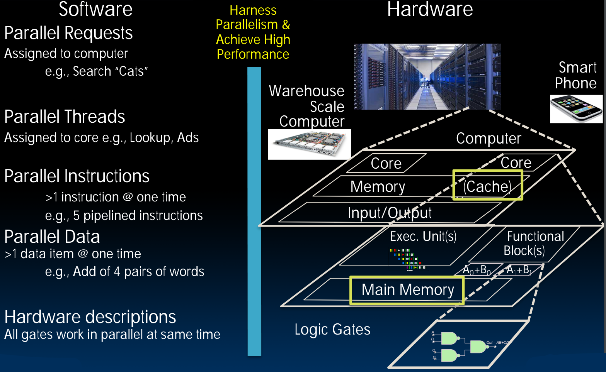
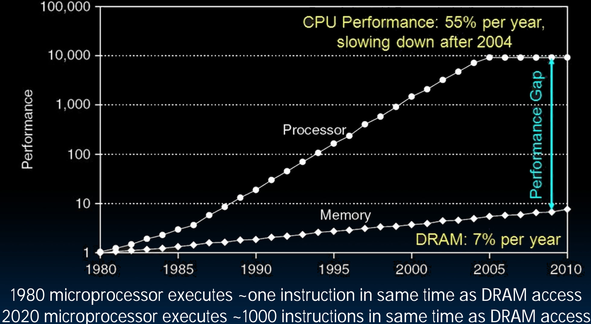

# 24.2-Library Analogy


Lecture Video Address


## Overview

### New-School Machine Structures

如下是新派的计算机结构体系

从本节开始要学习Cache和Main Memory，并且要学习他们如何交互。

### Components of a Computer

下面是关于计算机组件的示意图。

下面将会学习如何在这个图中添加Cache

## Why are Large Memories Slow? Library Analogy

我们用从图书馆中找书为例来说明为什么大的内存非常慢的。（这里的图书馆是很古早的图书馆，是没有电子设备来快速寻找的）

Time to find a book in a large library

- Search a large card catalog – (mapping title/author to index number)
- Round-trip time to walk to the stacks and retrieve the desired book

> 在很大的图书馆中找书，需要先找到一张小卡片(卡片记录着书本的index与title/author的映射)，然后根据卡片从图书馆中找书。
>
> 所以说时间供分为两个阶段。

Larger libraries worsen both delays（图书馆越大，找书越慢）

Electronic memories have same issue, plus the technologies used to store a bit slow down as density increases (e.g., SRAM vs. DRAM vs. Disk)

> 随着存储离CPU越远，那么存储量就会越大，并且速度会越慢。SRAM，DRAM，Disk就是如此。

## Processor-DRAM Gap (Latency)

下面这个图标展示了processor速度和Memory速度之间的关系，以及完成某事所需的时钟周期数量。

Slow DRAM access has disastrous impact on CPU performance!

- CPU性能有了极大的提升，但到达内存所需的时间，内存速度提升要慢得多，这种提升每年是7%，而CPU性能提升每年是55%。
- 但是CPU速度的增加在2004或2005变之后趋于平稳，称之为sea change（后面会说到）
- 但是不论如何，Processor和Memory之间仍然有非常大的差距。假设访问内存需要1000条指令，那么CPU在1000个周期内是空闲的

我们后面的可成就是为了应对CPU和DRAM速度的差异。
