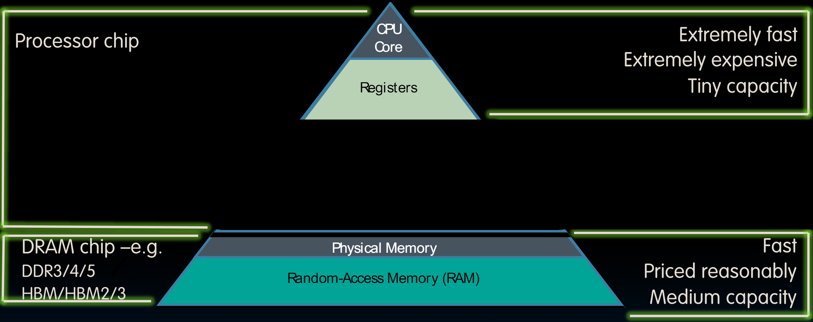
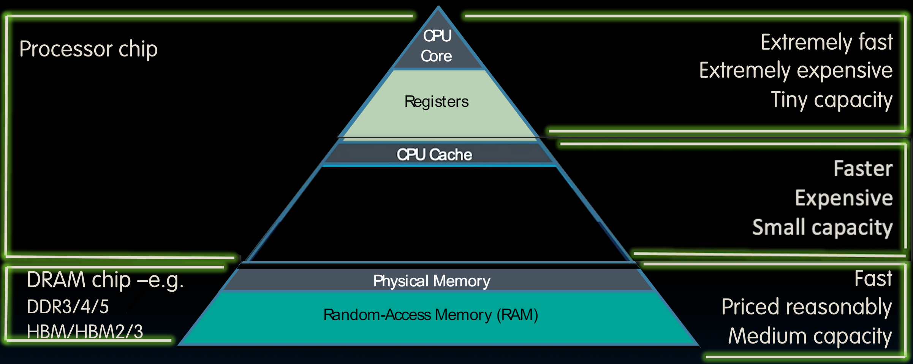
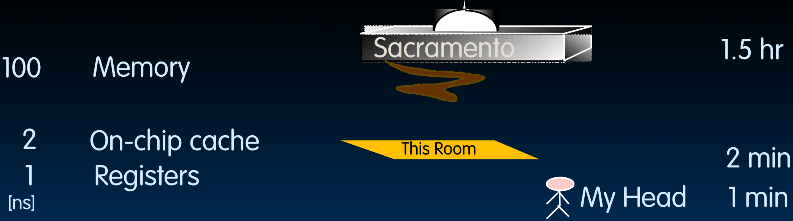
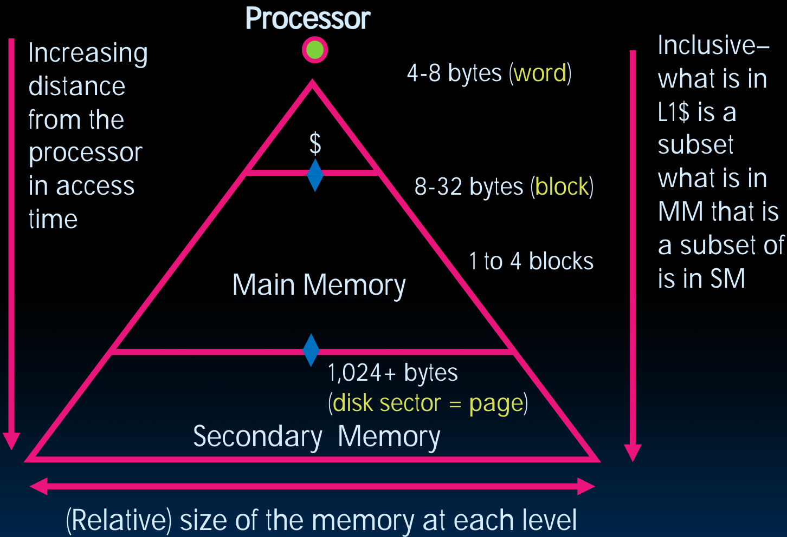
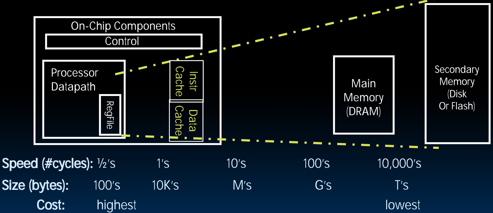

# 24.3-Memory Hierarchy


Lecture Video Address


## What To Do: Library Analogy

我们同样用图书馆来类比。

- 我们需要用图书馆的一些书写一篇报告，然后从馆中找了很多书，然后将这些数摊在桌子上，如果需要更多的书，就去借书，但是桌子上能够放的书是有限的，必须放回去一些。
- 细想一下，如果桌子变得很小，那么会很痛苦，这样就不得不一直跑来跑去找书。
- 一个理想的情况就是这些书就在旁边，找书的时候不需要站起来，再去找。
- 也就是说，把经常使用的东西放在离我们很近的地方(物理上和时间上的近)。

## The idea of Memory Caching

缓存就是利用了上述的想法。

桌子上的书就相当于processor可以非常快速访问的数据集。

Cache就相当于在桌子附近的书，可以非常快的取出。

> 可以类比手机中的通讯录（不论是手机号，还是QQ，还是微信），往往会有一页显示最近联系或者常联系，用于快速查找。另一页显示所有的通讯对象。这也是Cache的思想的体现。

其使用和CPU相同的处理技术，所以读取速度也是非常快的。

> by the way，缓存也是计算机科学中非常重要的概念。而且不仅仅用于单机存储结构中，在计算机思维——计算机科学家看待世界的方式中，也是非常重要的。

同时Cache有时集成在CPU chip上，这意味着其在物理上与processor的距离非常近，这也加快了访问速度。

但要注意的事，Cache并不完全和从图书馆取出书到附近一样，==**Cache的内容是主存的子集的copy**==

> 在计算机领域，很多地方都使用到了这种copy of subset的思想，比如Memory实际上就是Disk的copy

大多数的处理器分离的Cache，一部分用于存储instruction，一部分用于存储Data(在Datapath中我们在逻辑上将Memory分成了IMEM和DMEM，在物理上就是使用separate Cache实现的）

## Great Idea #3: Principle of Locality / Memory Hierarchy

如下是之前学习的存储结构

- 最上面的事Procesor Chip: 里面包含CPU Core和Register：距离CPU最近，并且读取速度很快，可以在一个cycle之内读取数据；但是价格比较昂贵，而且容量是最小的

- 三角的底层是DRAM chip：其距离CPU最远，且读取速度很慢；但是其价格是比较合理，而且容量也是中等的

    > DRAM意思是dynamic RAM，需要一直刷新以提醒是1还是0，相对的是static RAM，不需要刷新
    >
    > 当要说到升级内存的时候，就是指升级DRAM。
    >
    > 内存往往是External的，也就是可以插拔内存模块，插入内存使得有更大的空间。当然有时候内存被焊在板上不能移动，但是大多数是可以的。
    >
    > 顺便说一句，如果想要电脑运行更快，后面在学习VM的时候会有更多的内存。

而CPU Cache就处于其中间：

> 这里说的是CPU Cache，所以其还在Processor chip里面。
>
> Cache通常使用不同的技术来制作。

三个指标如下：

- speed: Registers > CPU Cache > Memory
- price: Registers > CPU Cache > Memory
- capacity: Registers < CPU Cache < Memory

### Speed Analogy

> 下面用一个类比来形象的说明三种存储之间访问时间的差距

- 假设我们有一些内容写在一张纸上，房子啊Sacramento这个地方，那么从内存中读取所花费的时间就相当于到Sacramento中去取这张纸，需要1.5hr
- 而从Register中获取这个信息就相当于在脑子中回想这个内容，需要1min
- On-chip Cache就相当于纸在房间内的某个地方，找到他只需要2min

> 当然，实际上从Register中读取数据不需要1min，1ns即可。从内存中取数据一般是从寄存器中取数据的几百倍。寄存器只有几个，缓存比寄存器大，而且速度和寄存器差不多，距离CPU也不是那么远。
>
> 在后面，我们将学习不止一种缓存。

### Characteristics of the Memory Hierarchy

如下是Memory Hierarchy的三角形，顶端是Processor

我们下面说明这个三角形所表示的不同存储的特征变化

> Secondary Memory指的是计算机中用来存储数据和程序的非易失性存储设备，如硬盘驱动器、光盘和闪存驱动器等。这些存储设备通常用于长期存储数据，与RAM（主存储器）相比，其访问速度较慢，但容量较大。

首先是指标的变化

1. 越往下，访问时间越长，这取决于两方面：越往下，存储离processor的距离越远；由于制作技术的不同，越往下的存储器本身的读取时间就长
2. 越往下，存储的相对大小(容量)越大（缓存<内存<Secondary Memory）
3. 越往下，价钱越便宜(这里比较的是1bit的价钱，磁盘上的每1bit的价格可以忽略不计，内存中的价格时钟，Cache非常规)

同时还有个特点——inclusive：

- 上面的存储的内容永远是下面的存储的子集，或者说是copy，副本。从处理器正在处理的某个数据，到寄存器中的数据流，然后到缓存、内存和磁盘中的数据，每一层都是较大层次的副本。
- 例如我们的`lw`指令，就是从Memory中复制内容(实际上是从Cache中)到Register。除此之外，Cache是从Memory复制内容，Memory是从Disk中复制内容

### Typical Memory Hierarchy

如下是另一种层次结构图，下方展示了随着离CPU的距离越远，Speed，Size，Cost的变化趋势

The Trick: present processor with as much memory as is available in the cheapest technology at the speed offered by the fastest technology

> 这里也体现了抽象的概念，我们享受较小层次的速度，却拥有较大层次的容量。
>
> 缓存的想法就是让很大的main Memory的速度和Register一样快甚至更快

其中Cache分为Instr Cache和Data Cache，并且都是On-Chip Components

## Summary

If level closer to Processor, it is:

- Smaller
- Faster
- More expensive
- subset of lower levels (contains most recently used data)

Lowest Level (usually disk=HDD/SSD) contains all available data (does it go beyond the disk?)

Memory Hierarchy presents the processor with the illusion of a very large & fast memory
