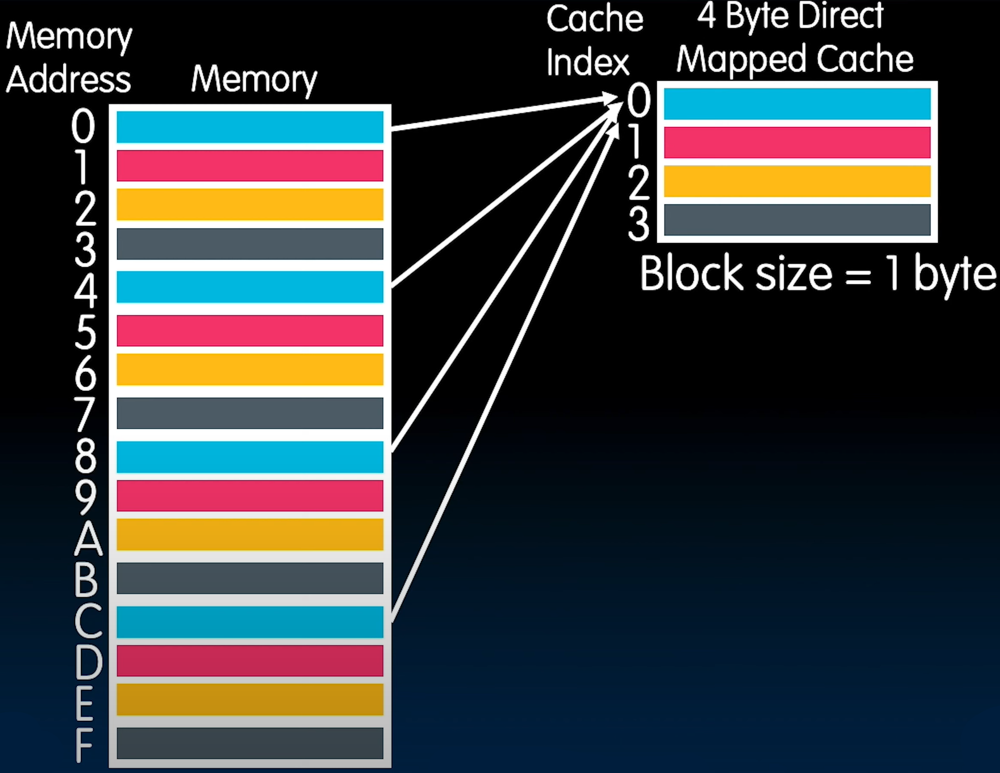
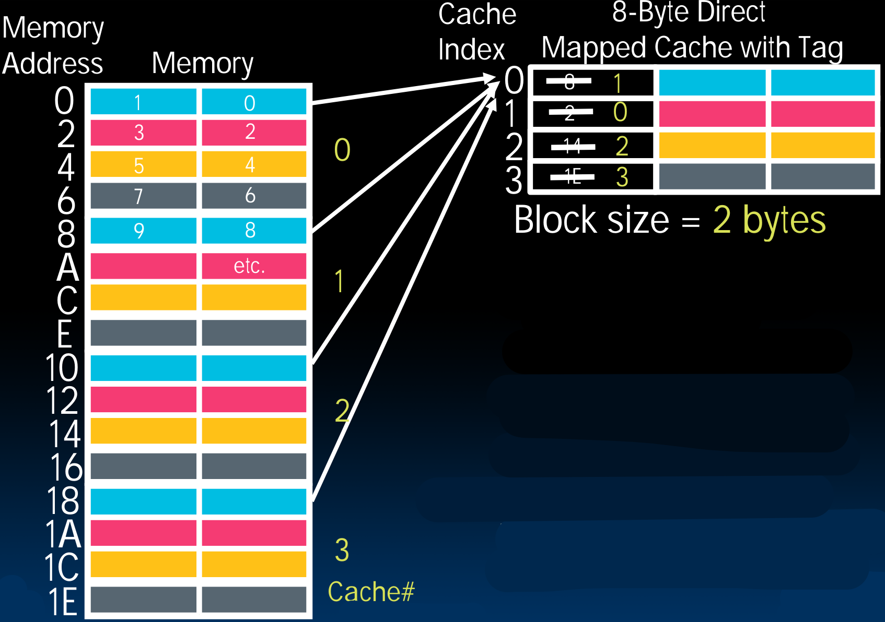

# 25.1-Direct Mapped Caches


Lecture Video Address


本节开始我们要解决的问题是lec24.4中提出的：

- Where does each memory address map to?
- How do we quickly locate(get) them?

> 比如可以将Memory的数据放在缓存中的任何地方以linear或者log的时间复杂度来搜索吗

---

## Direct Mapped Caches

> 直接映射缓存，这是最简单的缓存

In a direct-mapped cache, each memory address is associated with one possible block within the cache

> 反过来，Cache的一个block可以对应Memory的多个block。

- Therefore, we only need to look in a single location in the cache for the data if it exists in the cache

    > 我们已经知道了内存的地址对应的Cache的地址是什么，所以可以用内存地址很快的定位到在Cache的位置。也就是不许呀搜索了

- Block is the unit of transfer between cache and memory

    > 块是在缓存中进出数据的数量单位。不同的存储层次都是有一个单位的：如果在讨论硬盘中的文件，那么单位就是file，Register的单位就是word，Cache单位就是Block

## Example: 1 byte Caches

下面是一个例子

> 左边是一个内存，内存的抽象之一是可以将内存做是无限的。这里我们假设地址大小是2^32^(=2^2^ * 2^30^) = 4gibi，也就是有4gibi个bytes（在Memory中是byte addressable的，在画Memory的时候每个地址对应一个byte），在上图所示的Memory就是byte wide，每个地址对应一个byte，高度是4gibi
>
> 当然也可以有其他的画法，比如word wide，在32bits的架构中，每行就是4个byte，这样高度就是1gibi。
>
> 所以内存可以有很多的画法，拥有不同的长高比例。
>
> 但是建议画Memory的时候保持其宽度和Cache的宽度一致（如图Cache的宽度是1byte，所以Memory也是byte width）
>
> 这里Memory的地址递增的顺序是从上往下递增，有的时候可能反过来（比如绘制Memory的不同区域，从下往上依次是Code/Text, Static, Heap, Stack）

上图中已经使用颜色编码来表示Memory和Cache地址的对应关系。

每4个bytes都知道其在Cache中的对应位置。这是一个4 byte Cache(Block Size = 1byte，所以Memory也是byte width；Cache的高度是4)

在这种对应关系之下，如果已经知道了Memory Address，在Cache中寻找对应的内容是非常容易的，不需要搜索。假设Memory Address = 9，寻找其在Cache中的位置，以下是两种思路：

1. `Cache Address = Memory Address % 4 = 9 % 4 = 1`，通过module的操作就可以很快的找到位置

2. 9 = 1001~2~，Cache的位置就是1001的lowest 2 bits 10<u>01</u>

    > 在底层计算机电路中用二进制数表示Memory，通过这种方式可以非常快速的截取所需位然后转换为Cache的地址，假设地址是FED97346，那么不需要计算%4的值，只需要知道6 = 0110~2~的lowest bits = 10，很快确定
    >
    > 所以Cache的高度设置为2^n^可以便于locate。
    >
    > 当然这样的定位方式适用于1byte Cache，在其他Block大小的Cache中有不同的方式。

---

Cache Location 0 can be occupied by data from: Memory location 0, 4, 8, ... （最后2bits是00的所有数组，也就是4的倍数，其他Cache Location同理）

---

What if we wanted a block to be bigger than one byte?

> 1 byte Cache很多情况下都没法工作，如果一个value是32-bits，那么这个value可能要存储在Cache的不同的block当中，在这种情况下，我们希望Cache的block最小为1 word wide

## Example: 2 bytes Caches

如下展示的是8-bytes Cache及其对应的Memory的示意图

> Memory的宽度与Cache的block的大小一致

- Memory的每行中，地址较小的在右边，地址较大的在左边，地址的叠加顺序如下

- 如果Cache的Block增大，同时Memory的宽度也增大，仍然以这样的规则排列

    > lowest byte永远是top right byte

如下是Memory地址和Cache地址的对应关系

此时如果怎样寻找对应关系？

| Memory Location | Binary | Cache Location |
| --------------- | ------ | -------------- |
| 0               | 0000   | 0              |
| 1               | 0001   | 0              |
| 2               | 0010   | 1              |
| 3               | 0011   | 1              |
| 4               | 0100   | 2              |

- 可以看到，此时不再看LSB，而是看中间的2位

    > 也就是说随着Block的增大，在定位的时候需要skip几个bits

---

下面是关于这个cache的一些问题

When we ask for a **byte**, the controller finds out the right block, and loads it all!

> 将Memory Location转化为Cache Location是硬件controller自动实现的

- How does it know right block?(截取特定的bits即为Cache Block Location)
- How do we select the byte from the block?（一个Block包含多个byte，我们怎么知道是Block中的哪一个byte呢？LSB可以确定）

也就是说，在使用Memory Location请求一个byte的时候，怎么定位到Cache Location

---

但是更重要的问题是，怎么确定Cache中的某一个Block对应的是Memory中的哪一个Block

> 因为Memory的block与Cache的block是多对一的关系。
>
> 我们不能直接使用Memory Location → Cache Location的方式直接或缺Cache中的value，因为可能反过来并不对应，这样就没意义了。
>
> 比如请求Mem0的值，定位到Cache0的位置，但是Cache0可能保存着Mem8或者Mem10的位置

所以我们需要能够标识Cache中的block对应的是哪一块内存地址，用以区分同一颜色的Memory block

### Cache With Tag

引入Tag来进行区分，下面是一个8-byte Cache

> 在Cache中是需要保存对应的Cache#的，但是取数据的时候不取那块，所以也不会算在Block中

What should go in the tag? 使用Memory的地址是可行的，如下

但是Tag中需要保存内存地址的全部bits吗？

有几位不用再保存了

- LSB确定了block的哪一列(哪一个byte)
- next 2 bits确定了Cache Location

可以类比RISC-V中Branch指令不需要存储最后1bits，即用12bits存储13bits的内容。

> 在B-Format Instruction中，会保存跳转距离的Immediate，1条指令长度32bits(4 byte address)，但是由于RSIC-V有compressed instructions，所以跳转距离可以为16bits(2 address)。也就是说，B-Type Instruction跳转的距离固定是2的倍数，LSB一定是0，所以也就不需要存储LSB=0。
>
> 在这里也一样，Cache0对应的Memory Location为0(0000), 8(1000), 10(00010000), LSB前面的两位永远是00，而LSB确定了column，所以也不需要保存。

所以我们可以去除后面的3bits，直接用Cache number来填充Tag

> 在上图中为Memory的区域使用Cache#进行标号，一个标号表示一个Cache大小

- It's useful to draw memory with the same width as the block size

## generic

上面仅仅举了1-byte，2-bytes cache的例子，如下是对其进行总结并泛化到更大的Cache上

- Since multiple memory addresses map to same cache index, how do we tell which one is in there?
- What if we have a block size > 1 byte?
- Answer: divide memory address into three fields

- Tag是upper bits

> 将内存地址进行切分，就可以使用内存地址定位到Cache地址并且判断是否是对应的。

### Direct-Mapped Cache Terminology

All fields are read as **unsigned integers**.

| field  | desc                                                         |
| ------ | ------------------------------------------------------------ |
| Index  | specifies the cache index (which “row”/block of the cache we should look in) |
| Offset | once we've found correct block, specifies which byte within the block we want |
| Tag    | the remaining bits after offset and index are determined; these are used to distinguish between all the memory addresses that map to the same location |

### TIO Cache Mnemonic

> 下面是TIO Cache的助记符，根据Cache的Block和大小来主机

AREA (cache size, B) = HEIGHT (# of blocks) * WIDTH (size of one block, B/block)

(Index, Offset)决定着Cache的Area：

- Offset决定着width(Offset有2bits，说明width为4，byte per block = 4)
- Index决定着height（Index有3位，表示高度，或者说# of blocks是8）
- Cache的大小$$B = 2^{H+W} = 2^H*2^W$$，H是Index的位数，W是Offset的位数

假设Index长度为9，Offset长度为6，那么有：

- Hight = $$2^9$$, Width = $$2^6$$
- B = $$2^9 * 2^6$$ = $$2^{15}$$ = 32kibi bytes(512bytes)

> 这里要学习在Format和实际数值之间转换
