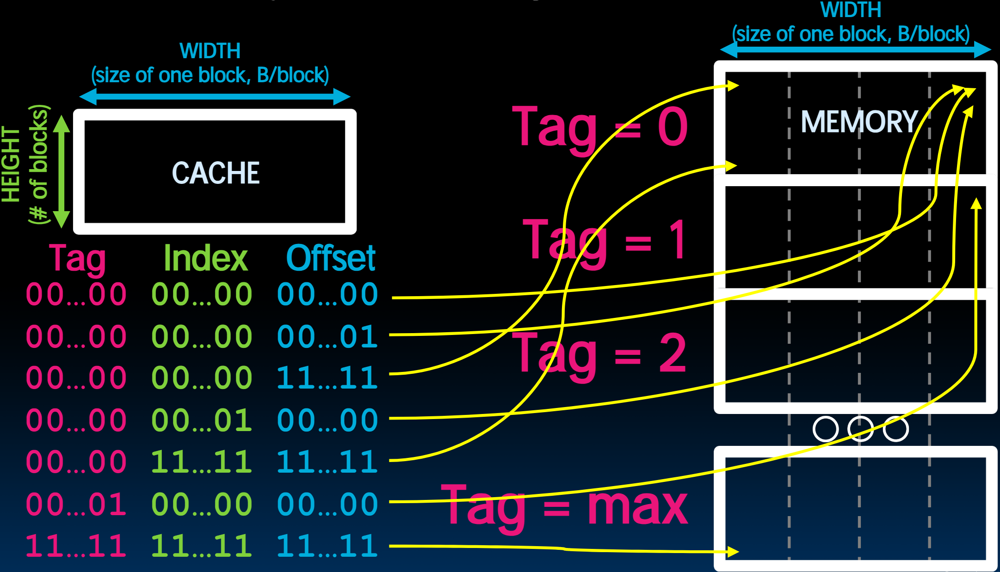

# 25.2-Direct Mapped Example


Lecture Video Address


如下我们举几个例子来说明关于Cache的相关的问题。

## Direct-Mapped Cache Example

> 关于Cache Address的各个部分的长度

Suppose we have a 8B of data(8 bytes) in a directmapped cache with 2-byte blocks

在32-bits arch中，Memory Address是32-bits，我们要决定其中Tag，Index，Offset的长度

Offset

- need to specify correct byte within a block
- block contains 2 bytes = 2^1^ bytes
- need 1 bit to specify correct byte

Index: (~index into an “array of blocks”)

- need to specify correct block in cache
- cache contains 8 B = 2^3^ bytes
- block contains 2 B = 2^1^ bytes
- \# blocks/cache = $\frac{bytes/cache}{bytes/block} = \frac{2^3 bytes/cache}{2^1 bytes/block} = 2^2blocks/cache$

need 2 bits to specify this many blocks

> 根据Block大小可以决定Index的长度，根据Cache的大小和Block的大小可以决定Cache的高度，也就知道了Index的长度。
>
> 这里Cache是8 bytes，Block是2bytes，那么Offset有1位，height是4，Index的长度为2

Tag: use remaining bits as tag

- tag length = addr length – offset - index = 32 - 1 - 2 bits = 29 bits

- so tag is leftmost 29 bits of memory address
- Tag can be thought of as “cache number”

> 计算Tag的长度不需要分别计算Index的长度和Offset的长度，在得知Cache是8 bytes的时候，就知道rightmost 3  bits是用来表示Cache内部的位置的，剩下的29位表示Tag

Why not full 32-bit address as tag?

- All bytes within block need same address
- Index must be same for every address within a block, so it’s redundant in tag check, thus can leave off to save memory

## Memory Access

下面介绍处理器加载数据的过程（有Cache和没有Cache的区别）

任务如下

- Load word instruction: `lw t0, 0(t1)`
- t1 contains 1022~ten~ , Memory[1022] = 99

最终t0应该存储99

### without Cache

下面是没有Cache的

1. Processor issues address 1022~ten~ to Memory
2. Memory reads word at address 1022~ten~ (99)
3. Memory sends 99 to Processor
4. Processor loads 99 into register t0

> 这一过程我们在前面学习Datapath的时候就已经走过了，甚至可以通过Light up path来显示整个指令的执行过程

### With Cache

- Load word instruction: `lw t0, 0(t1)`

- `t1` contains 1022~ten~ , Memory[1022] = 99

- With cache (similar to a hash)
    1. Processor issues address 1022~ten~ to Cache
    
    2. Cache checks to see if has copy of data at address 1022~ten~
    
        > Memroy address可以直接发送给Cache，只不过Cache和Memory解析的方式有点不一样。
    
        1. If finds a match (Hit): cache reads 99, sends to processor
    
        2. No match (Miss): cache sends address 1022 to Memory
    
            > 在Cache中保存着Tag和Block，Tag用于和Memory的前几位进行比较，来判断是否对应，然后根据Memory Block的后几位来定位 数据。
    
            1. Memory reads 99 at address 1022~ten~
            2. Memory sends 99 to Cache
            3. Cache replaces word with new 99
            4. Cache sends 99 to processor
    
    3. Processor loads 99 into register t0

> Processor仅仅负责从Cache中取出数据，但是Cache与Memory的数据交互对于Processor来说是透明的，这是一层abstraction。Cache就是通过这样的abstraction让processor拥有Memory的大小以及Cache的速度

## Solving Cache problems Visually

下面绘制了Cache Location与Memory Location的对应关系

> 画图也是解决Cache的很重要的方法之一。

Draw memory a block wide given T I O bits, dashed word boundary lines

> Width of Memory = width of Block

首先是(Tag, Index) = 0

- `00..00 00..00 00..00`表示内存的第一个Address，在Memory的右上角

    > Cache始终是Memory的copy of subset, 或者说镜像，其内容与Memory保持一致。
    >
    > 当请求Memory的内容时，Cache的内容与Memory的一致

- 随着Offset的增加，位置逐渐左移。（当要逐bytes读取Cache的数据时，随着提供的Memory的增加，bytes的位置就是一直连续左移）

> - 当Index相同的时候，不同的Offset表示Cache中同一行的不同bytes
> - 当(Tag, Index)相同的时候，不同的Offset表示Memory的同一行的不同bytes

Offset到达最大值11.11，然后Index变为1

- 当Index变化的时候，行数也变化
- 当Index = 11..11的时候，到达Cache的最后一行
- 当(Index, Offset) = 11..11 11..11的时候，到达Cache的最后一个bytes

> Index变化意味着Block的变化，bytes的变化流程是Z字形的

(Index, Offset)到达最大，Tag变为1

- Tag的改变意味着Memory的Cache#的变化，如上图，从第一个区域移动到下一个区域。从这个区域开始Z字形移动
- 当Tag = 11..11的时候，指向了最后一个区域。

> 将Memory Address划分成T I O三种部分，可以很清楚的展示出所取数据在Cache和Memory中位置的变化

以可视化的方式可以便于理解和解决很多关于Cache的问题：

> 特别是在分析代码的时候，根据代码的stride来确定数据跳转的大小，从而判断Cache的使用情况

1. 比如在Loop中，可能在Cache中读取的是如下的数据

其在Memory中读取的位置为

2. 同时如果有一些jump操作，我们也可以知道存取数据在Memory中的变化

下面是不同步伐中数据位置的关系

步伐为byte（在同一行中移动）

3. 步伐为Block

|  |  |
| ------------------------------------------------------------ | ------------------------------------------------------------ |

步伐为Cache Size（在Cache中的位置不变，但是在Memory中每次都跨越一个区域）

4. 步伐为其他情况

| 略小于Block Size                                             | 略大于Block Size                                             | 略大于Cache Size                                             |
| ------------------------------------------------------------ | ------------------------------------------------------------ | ------------------------------------------------------------ |
|  |  |  |
| 略小于Cache Size                                             | Cache Size - Block Size                                      | Cache Size + Block Size                                      |
|  |  |  |

> 通过画图，可以帮助我们分析在代码中有stride的时候，数据在Memory中是怎样移动，Cache有多少次是hit的，有多少次是miss的，进而能够分析代码性能。
