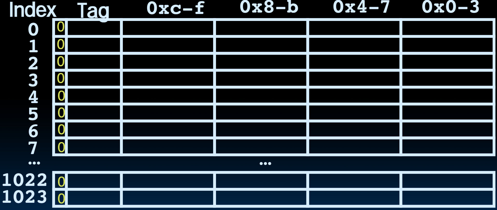

# 25.3-Cache Terminology & Valid bit


Lecture Video Address


在上一节中，我们已经学习了有关分析Cache的一些方法，本节开始介绍Cache的一些术语，以便于后续分析Cache的性能

## Caching Terminology

When reading memory, 3 things can happen: 

| terminology                   | meaning                                                      |
| ----------------------------- | ------------------------------------------------------------ |
| cache hit                     | cache block is valid and contains proper address, so read desired word |
| cache miss                    | **nothing** in cache in appropriate block, so fetch from memory |
| cache miss, block replacement | **wrong data** is in cache at appropriate block, so discard it and fetch desired data from memory (cache always copy) |

> 后两个的区别在于：
>
> - `cache miss`的时候Cache中没有数据，只需要Fetch即可
> - `cache miss, block replacement`的时候Cache中的数据是其他地方的，是错误的，因此需要替换

下面使用温度术语来形容Cache的使用情况（这些属于并不是正式的，但是会有人这样形容Cache）

> 温度用来形容Cache的使用成功情况，温度越高，使用情况越好，也就是hit的次数越多

| temperatures | meaning                                                      |
| ------------ | ------------------------------------------------------------ |
| Cold         | Cache empty（比如说在代码执行的一开始，比如loop的一开始，Cache是Cold，除非Cache进行preload，但是在大多数计算机中是不会preload Cache的） |
| Warming      | Cache filling with values you’ll hopefully be accessing again soon |
| Warm         | Cache is doing its job, fair % of hits                       |
| Hot          | Cache is doing very well, high % of hits                     |

在代码执行的过程中，Cache逐渐升温：

- 在执行开始之前，Cache empty，没有数据
- 刚开始一段时间后，Cache经历了一些miss然后从Memory中copy数据，Cache转为Warming
- 再进行一段时间之后，Cache逐渐填满了数据，hit的几率增大，Cache Warm
- 随着程序继续执行，Cache的数据逐渐填满，hits的几率也非常高，Cache hot

| terms        | meaning                                                      | desc                                                         |
| ------------ | ------------------------------------------------------------ | ------------------------------------------------------------ |
| Hit rate     | fraction of access that hit in the cache                     |                                                              |
| Miss rate    | 1 – Hit rate                                                 |                                                              |
| Miss penalty | time to replace a block from lower level in memory hierarchy to cache | 仅仅表示Cache从Memory中取出数据替代的时间，为惩罚时间，不包括processor从Cache中取数据的时间 |
| Hit time     | time to access cache memory (including tag comparison)       |                                                              |

Abbreviation: "$" = cache

## Valid Bit

- When start a new program, cache does not have valid information for this program

    > 但是我们不知道Cache中的数据此时是不是垃圾数据，例如刚刚启动程序，此时的Tag一定是有value但是Cache的值不一定是有意义的，这种情况下是不能读取的，所以要有一个Valid bit来表明Cache的这个地方的值是不是有意义。

- Need an indicator whether this tag entry is valid for this program

    > 不能从tag中借用某一位，因为tag的所有位都表示Memory的Cache #，没有多余的位

- Add a "valid bit" to the cache tag entry
    - 0 → cache miss, even if by chance, address = tag
    - 1 → cache hit, if processor address = tag

> ChatGPT: valid bit的作用
>
> 在计算机体系结构中，缓存（cache）是一种高速的存储设备，用来暂时存储常用的数据，以加快访问速度。每个缓存行（cache line）通常包括几个重要的字段，其中之一是**有效位（valid bit）**。有效位的主要作用如下：
>
> 1. **指示缓存行的有效性**：
>    - **有效（Valid）**：如果有效位被设置为1，表示该缓存行包含的内容是有效的，即缓存行中存储的数据是当前有效的，可以被处理器访问和使用。
>    - **无效（Invalid）**：如果有效位被设置为0，表示该缓存行内容无效。无效的缓存行中的数据不应被使用，因为它可能是过期的或无用的。
>
> 2. **初始化和重置**：
>    - 当缓存初始化或重置时，有效位通常被设置为0，表示所有缓存行无效。
>    - 在启动或重启系统时，有效位帮助区分新的缓存内容和旧的、可能无效的数据。
>
> 3. **缓存命中与未命中**：
>    - 在缓存查找过程中，有效位用于判断缓存行是否有效。
>    - 如果处理器访问的数据地址在缓存中找到（标签比较匹配），且该缓存行的有效位为1，则表示缓存命中（cache hit）。
>    - 如果有效位为0，即使标签匹配，也表示缓存未命中（cache miss），处理器需要从主存（或下一级缓存）中加载数据。
>
> 4. **缓存替换策略**：
>    - 在替换缓存行时（如使用LRU、FIFO等替换策略），有效位帮助决定哪些缓存行可以被替换。
>    - 只有有效位为0的缓存行可以被立即替换，因为这些行不包含有效数据，不会影响系统性能。
>
> 总之，有效位在缓存管理中起到关键作用，确保处理器能够有效区分缓存中的有效数据和无效数据，从而提高数据访问效率和系统性能。

> ChatGPT: 为什么要valid bit
>
> 在缓存（cache）系统中，需要有效位（valid bit）来实现以下关键功能：
>
> ### 1. 数据有效性判断
> - **区分有效和无效数据**：缓存行中的数据可能在某些情况下（如系统启动、重置、缓存替换等）变得无效。有效位通过简单的二进制指示（1为有效，0为无效），帮助处理器快速判断缓存行中的数据是否可以使用。
> - **防止使用无效数据**：在缓存查找过程中，如果有效位为0，即使标签匹配，也表明该缓存行的数据无效。这样可以避免处理器使用无效或过时的数据，确保数据的一致性和正确性。
>
> ### 2. 系统初始化和重置
> - **缓存初始化**：当系统启动或重置时，缓存中的所有数据默认无效。有效位被设置为0，表示所有缓存行均无效。这样，在系统开始正常运行前，不会误用初始化阶段缓存中的无效数据。
> - **缓存清除**：在某些情况下（如上下文切换、任务切换等），需要清除缓存中的数据。通过将有效位设置为0，可以快速无效化缓存中的所有数据，而无需逐一清除数据内容。
>
> ### 3. 缓存替换策略
> - **确定替换目标**：当需要将新数据写入缓存时，有效位帮助确定哪些缓存行可以被替换。有效位为0的缓存行表示无效数据，可以直接替换；有效位为1的缓存行则需要根据缓存替换策略（如LRU、FIFO等）决定是否替换。
> - **提高缓存利用率**：通过合理使用有效位，缓存替换策略可以更有效地管理缓存空间，减少缓存未命中（cache miss）率，提高缓存利用率和系统性能。
>
> ### 4. 性能优化
> - **快速检查**：在缓存查找过程中，通过检查有效位，可以快速判断是否需要进行标签比较。如果有效位为0，可以直接判定缓存未命中，减少不必要的比较操作，节省处理时间。
> - **简化控制逻辑**：有效位的引入简化了缓存控制逻辑，使缓存管理更加高效。有效位的设置和检查是非常简单的逻辑操作，有助于提高缓存系统的整体性能。
>
> ### 结论
> 有效位（valid bit）在缓存系统中起着至关重要的作用，确保数据有效性、支持缓存初始化和重置、辅助缓存替换策略，并优化系统性能。这些功能共同确保了缓存系统的高效运作和数据的一致性。

### Example: 16 KB Direct-Mapped Cache, 16B blocks

> - 16 KB bytes, 2^14^，说明Tag有32 - 14 = 18bits
> - 16B：Block有16个bytes，Offset有4bits，
> - Index有10bits，高度为2^10^ = 1024

Valid bit: determines whether anything is stored in that row (when computer initially powered up, all entries invalid)

在reset的时候，valid bit设置为0，表示数据全部无效

Looks like a real cache, will investigate it some more!

## In Conclusion

- We have learned the operation of a direct-mapped cache
- Mechanism for transparent movement of data among levels of a memory hierarchy
    - set of address/value bindings
    - address → index to set of candidates
    - compare desired address with tag
    - service hit or miss: load new block and binding on miss
