# 26.1-Direct Mapped Example


Lecture Video Address


本节我们会举一个例子，将hit, miss, miss with replacement的情况全部包含在内。

之前我们讲述的都是read byte，从本节开始read word

## Accessing data in a direct mapped cache

Ex.: 16KB of data, direct-mapped, 4 word blocks

> - 16KB: 2^14^, Tag长度为32 - 14 = 18（16KB of data，言外之意是其他的内容不是data，比如Tag和valid bit）
> - 4 word blocks，一个block有4word，16bytes，Offset有4bits。也就是说hex进制的最后一个nibble就是Offset
> - Index有14 - 4 = 10bits，有1024个rows/blocks
>
> 则height为1024，width为16个bytes

Read 4 addresses

1. 0x00000014
2. 0x0000001C
3. 0x00000034
4. 0x00008014

Memory values here:（Memory以一个word展示）

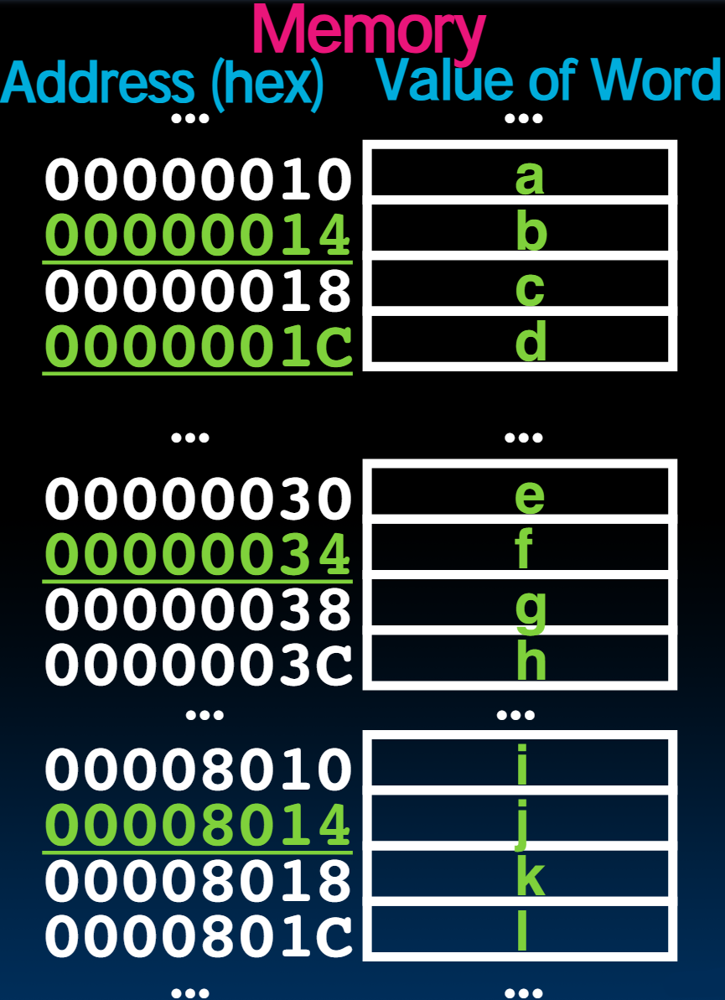

4 Addresses divided (for convenience) into Tag, Index, Byte Offset fields

| Address    | Tag                | Index      | Offset |
| ---------- | ------------------ | ---------- | ------ |
| 0x00000014 | 000000000000000000 | 0000000001 | 0100   |
| 0x0000001C | 000000000000000000 | 0000000001 | 1100   |
| 0x00000034 | 000000000000000000 | 0000000011 | 0100   |
| 0x00008014 | 000000000000000010 | 0000000001 | 0100   |

> - 这里的Tag是从0开始的，但是实际上Memory的低地址可能存放其他东西。此处仅仅作为演示
> - 每一个filed表示的内容：
>     - Tag，Memory中的Cache#
>     - Index，Cache中的row(block)
>     - Offset，Cache的列（由于读取的是word并且在Memory是word-aligned，所以Offset是4的倍数，最后两个bits是00）

如下是Cache内容的表（每个word连在一起）

> 此时的Cache可以用cold来形容，是empty的

| Index | Valid bit | Tag  | 0xc-f | 0x8-b | 0x4-7 | 0x0-3 |
| ----- | --------- | ---- | ----- | ----- | ----- | ----- |
| 0     | 0         |      |       |       |       |       |
| 1     | 0         |      |       |       |       |       |
| 2     | 0         |      |       |       |       |       |
| 3     | 0         |      |       |       |       |       |
| 4     | 0         |      |       |       |       |       |
| 5     | 0         |      |       |       |       |       |
| 6     | 0         |      |       |       |       |       |
| 7     | 0         |      |       |       |       |       |
| ...   | ...       | ...  | ...   | ...   | ...   | ...   |
| 1022  | 0         |      |       |       |       |       |
| 1023  | 0         |      |       |       |       |       |

> 虽然在Address中，Index在Tag后面，但是在实际中，先由Index来选取Cache的row

### 1. Read 0x00000014

首先将Address进行分解

| Address    | Tag                | Index      | Offset |
| ---------- | ------------------ | ---------- | ------ |
| 0x00000014 | 000000000000000000 | 0000000001 | 0100   |

Tag为1；Index为1，Offset为4（只看前两列为第1个word）

1. 首先，Index定位到Cache的行

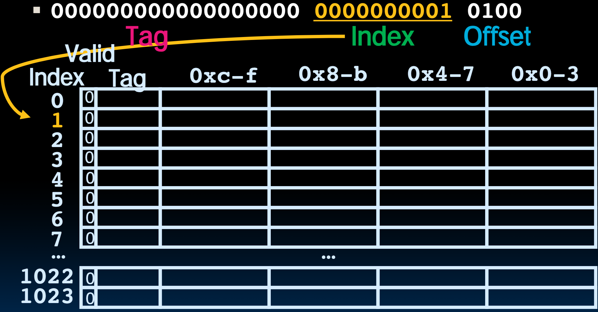

> 同理，在解析Address的时候，首先解析Index

2. 然后查看Tag，发现no valid data

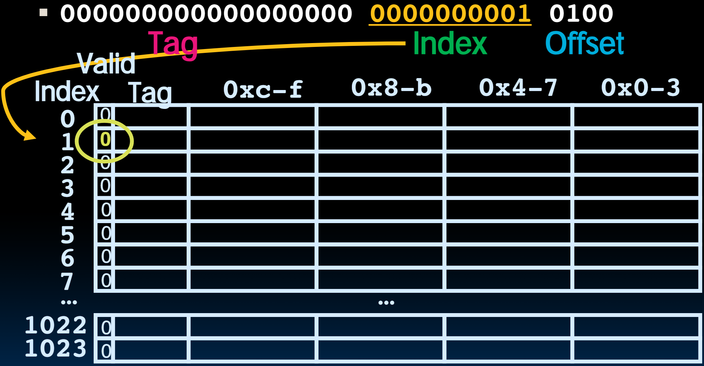

3. 然后从内存中加载数据到Cache中，并且set tag和valid bit（Tag就使用Address中的Tag赋值）

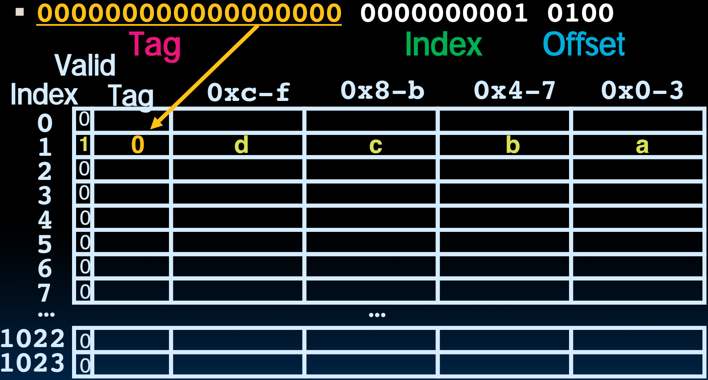

> - Block就是Cache和Memory的数据交换单位，所以一次加载一个block
> - 从Memory加载数据到Cache满足了temporal locality和spatial locality
>     - temporal locality：加载的数据是最近访问的数据
>     - spatial locality：一次加载了附近的数据，而不仅仅是访问的那一个数据

4. 然后根据Offset定位到block的哪一列，返回这个word

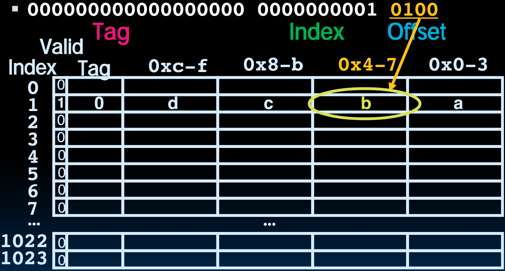

> 在解析offset的时候有一个技巧，加载word的时候Offset必定是4的倍数，也就是最后两个bits是00，所以可以直接看前两位01，表示是第二列

==**总之，address的顺序为TIO，但是在解析时顺序为ITO，如果考虑Valid bit的话，就是IVTO**==

### 2. Read 0x0000001C = 0…00 0..001 1100

> 下面仍然以IVTO的顺序来读取这个数据
>
> 与前面地址相比，只有最后一个nibble不同，因此可以料想到block已经在Cache中了，只不过column不同

初始状态

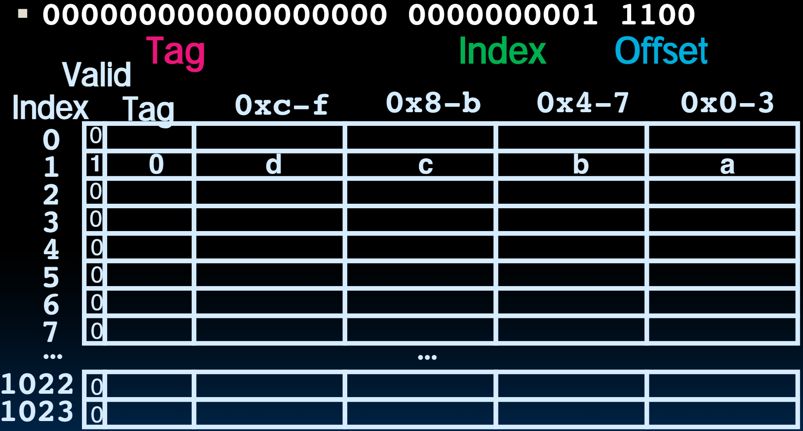

Tag = 0, Index = 1, Offset = 12(只看钱两列为第3个word)

1. Index定位Cache的row

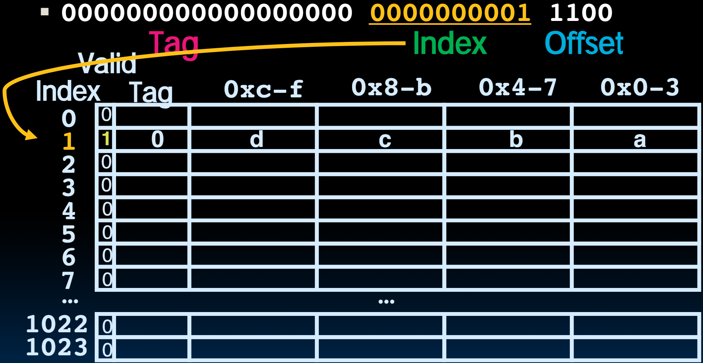

2. 查看valid bit和比较Tag，发现匹配

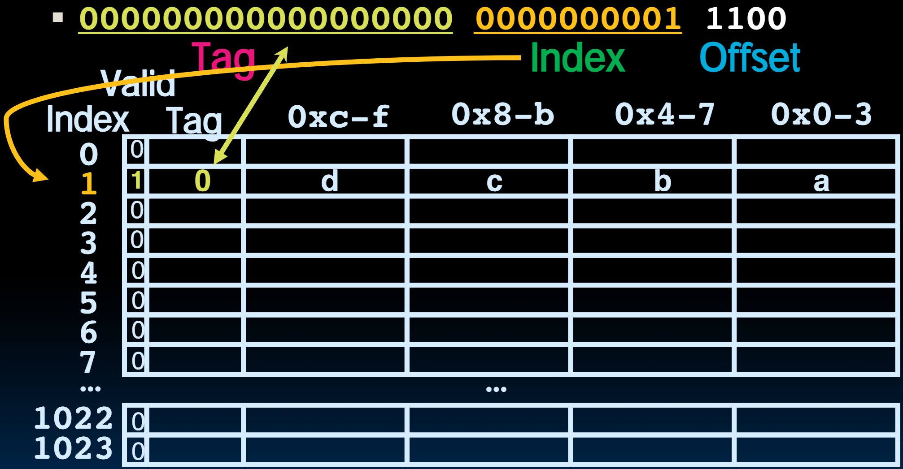

3. 根据Offset选取对应的word

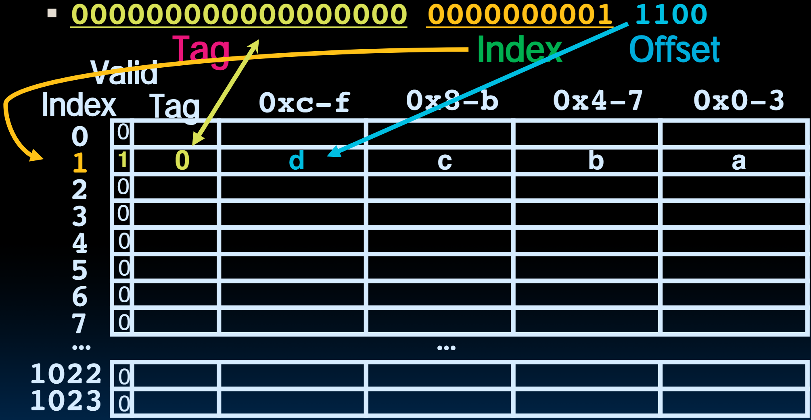

### 3. Read 0x00000034 = 0…00 0..011 0100

初始状态

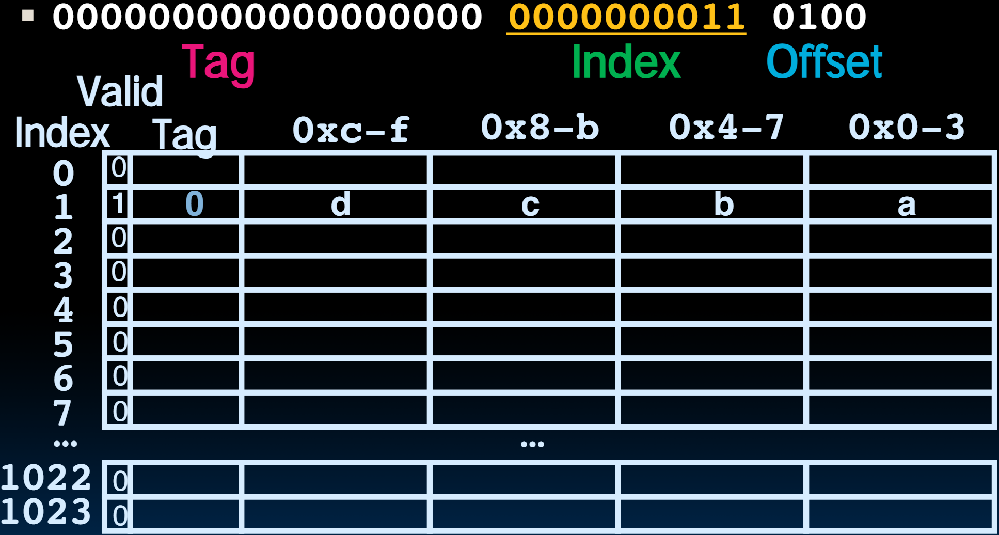

2. Index定位Cache的row

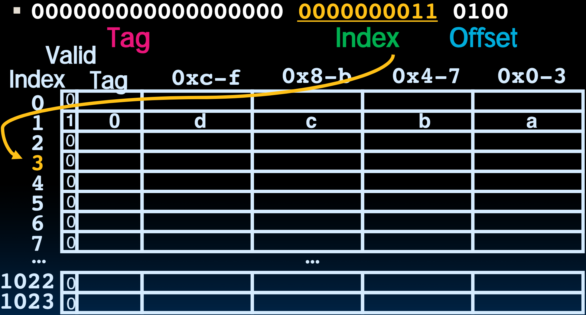

2. valid bit为0，从内存中加载数据到Cache，并设置valid bit和Tag

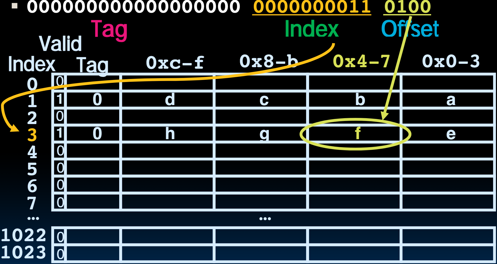

3. 然后根据Offset选择Word

### 4. Read 0x00008014 = 0…10 0..001 0100

初始状态

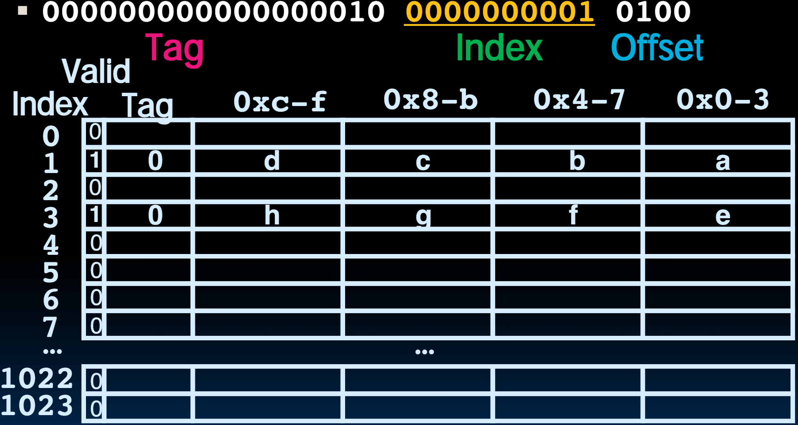

1. Index定位Cache的row

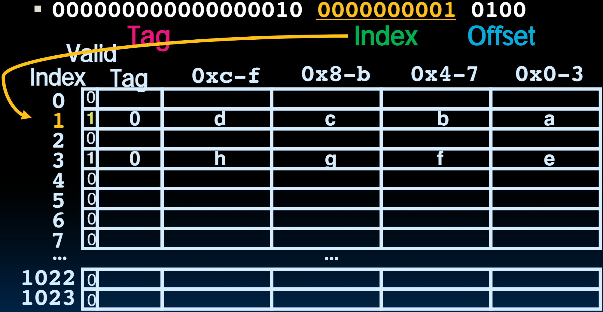

2. Valid bit为1，有效；但是Tag并不匹配

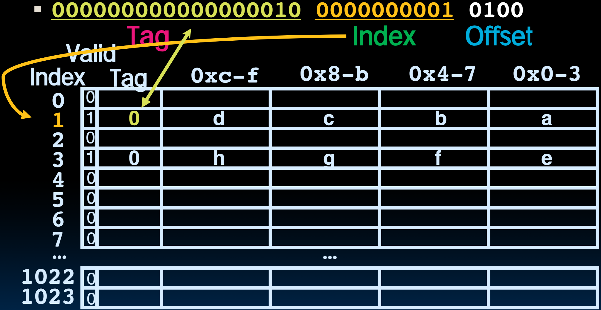

3. 从内存中加载数据到Cache中，并重新设置Tag

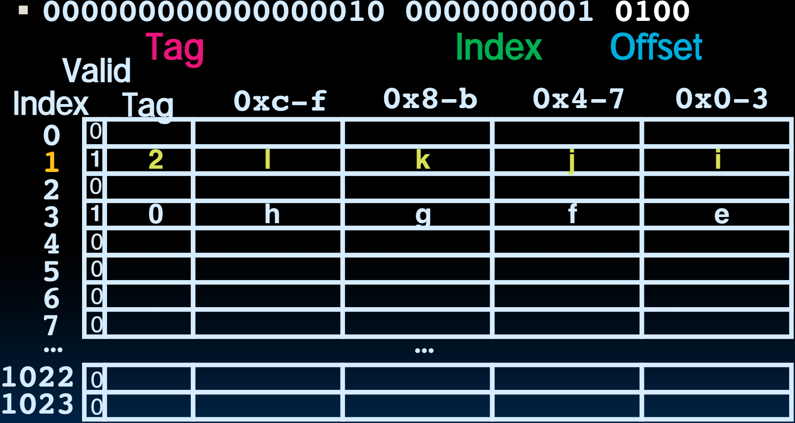

4. 根据Offset选择对应的word

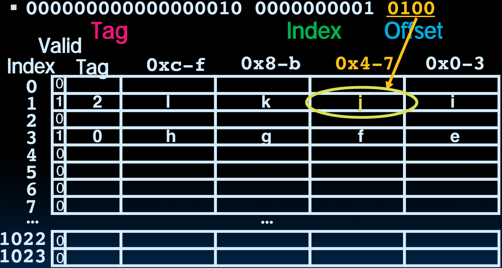

## Do an example yourself. What happens?

Chose from: Cache: Hit, Miss, Miss w. replace

Values returned: a ,b, c, d, e, ..., k, l

- Read address 0x00000030 ?
- Read address 0x0000001c ?

如下是Cache的内容

| Index(不属于Cache) | Valid bit | Tag  | 0xc-f | 0x8-b | 0x4-7 | 0x0-3 |
| ------------------ | --------- | ---- | ----- | ----- | ----- | ----- |
| 0                  | 0         |      |       |       |       |       |
| 1                  | 1         | 2    | l     | k     | i     | i     |
| 2                  | 0         |      |       |       |       |       |
| 3                  | 1         | 0    | h     | g     | f     | e     |
| 4                  | 0         |      |       |       |       |       |
| 5                  | 0         |      |       |       |       |       |
| 6                  | 0         |      |       |       |       |       |
| 7                  | 0         |      |       |       |       |       |

如下是Memory的内容

> 分析读取过程时，先将Memory Address按照TIO的形式分解

| Address    | Tag                | Index      | Offset |
| ---------- | ------------------ | ---------- | ------ |
| 0x00000030 | 000000000000000000 | 0000000011 | 0000   |
| 0x0000001c | 000000000000000000 | 0000000001 | 1100   |

然后根据IVTO的顺序解析指令

## Answers

0x00000030 a hit Index = 3, Tag matches, Offset = 0, value = e

0x0000001c a miss Index = 1, Tag mismatch, so replace from memory, Offset = 0xc, value = d

- Since reads, values must = memory values whether or not cached:
    - 0x00000030 = e
    - 0x0000001c = d
