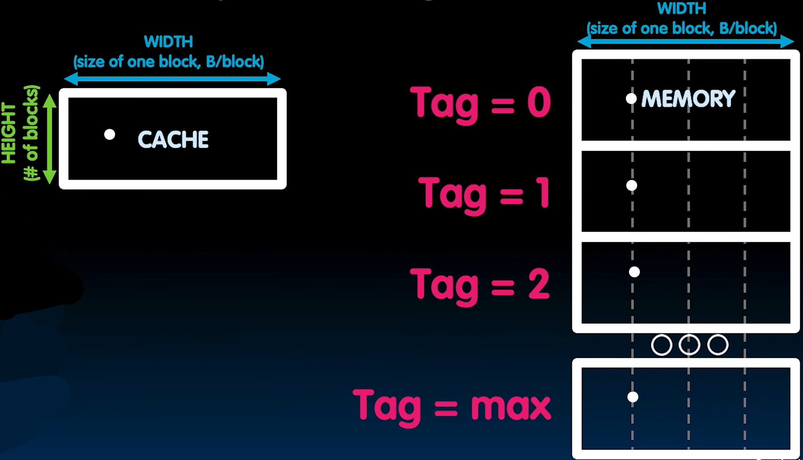

# 26.2-Multiword Cache, Writes, Block Sizes, Misses


Lecture Video Address


本节开始讲述怎么Write，并且以word为单位

## Multiword-Block Direct-Mapped Cache

我们先来从硬件层面介绍Multiword-Block Direct-Mapped Cache的工作流程

如下是一个Cache，Four words/block, cache size = 4K words。在上方是一个Memory Address

> 分析TIO格式的长度
>
> - Four words/block，一个block有4个word，即16个bytes，则Offset有4bits
> - cache size = 4K words，则height有1ki，Index有10bits
> - Tag = 32 - 4 - 10 = 18bits

下面是工作流程

1. Address的Index选取Cache中的一个block，被选中的block会将内容输出

整个Cache的输入为Address，输出有两个：Hit和Data：

1. Hit信号：
    - Memory Address的Tag部分与Block中的Tag进行比较，确定Block的内容是否确实是内存地址的内容
    - 比较结果与Valid bit进行AND操作，因为要先确定数据不是垃圾数据，是有效的，需要Valid bit = 1
    - AND的结构即为Hit信号
2. Data：
    - 被Index选中的Block会将4个byte送到4→1 mux当中（我们往往是读取word，因此会以word为单位送入mux并输出）
    - 4→1的选择信号为Memory Address的Offset中的前两位，因为read word以及word-aligned，所以Offset的最后两位永远是00，所以只看前两位即可知道选择的是哪一个word
    - 被选中的word即为输出的Data

虽然分析的时候好像是有 先后顺序的，但是该图中的所有信号都是同时发生的，只是最后在选择的时候如果`hit = 1`，即表明Data是有效的

---

What kind of locality are we taking advantage of? 

temporal locality 和 spatial locality

- temporal locality：Cache每次将要读取的数据从内存中读取出来以便后续使用，本身就符合时间局部性
- spatial locality：Cache每次不仅仅读取一个word，而是将附近的words以一个Block的单位读取出来。

## What to do on a write hit?

### Write Through

Update both cache and memory

这种方式使得Cache和Memory一直保持一致

这也是最简单的写方式，不需要考虑不一致时的冲突

但是效率会很低，每次写都需要写内存

### Write-back

因为processor一直都是直接在和Cache交互，从Cache中读数据，可以只在Cache中写数据，读取的时候也是读取Cache中被写后的数据，不必立即告诉Memory

update word in cache block（但是不会更新Memory）

allow memory word to be "stale(过时的)"

> 虽然在这种情况下，Cache不再是Memory的copy了，但是可以省去写内存的时间（因为访问一次内存的时间是远大于访问Cache和Register的时间）

---

但是这种情况下，会增加复杂度。

Memory中的值是stale的，最新的正确的值是在Cache中而不是在Memory中，这也就意味着需要让system知道二者的值是不一致的。

这就需要添加一个bit来实现

- add 'dirty' bit to block(dirty bit = 1可以表示Cache和Memory的内容是不一致的)

> 这里有一个细节，如果在写的时候写入的值和原先的值一样，也要认为是不一致，即设置dirty bit = 1，否则就需要再每次写的时候都需要将新值与旧值进行比较。

更新Memory的时机（Memory的值后续肯定要修改的）

1. 当出现miss with block replacement的时候，也就是Cache需要从Memory中读取Block替换的时候，此时将Cache中Block的值更新到Memory

    > 因为出现replacement之后，Block的新值就需要被替换，此时需要将这块新值保存到内存当中。

2. …OS flushes cache before I/O…(OS在进行Input或者output的时候，会flush Cache，此时会将内容写入到Memory)

    > 在进行flush的时候，Cache保存的值也会被清空，此时也需要保存在Memory当中

更新的方式

- 在flush的时候，如果Cache的值仅仅是Memory中的拷贝（也就是没有修改），那么只需要设置valid bit = 0即可
- 不是全部的值都需要更新到Memory当中，有些值可能是垃圾值，或者没有修改过的值，此时需要看dirty bit，如果为1，那么先写到内存当中，然后清空

---

Performance trade-offs?

不像1's Complement和2's Complement一样的淘汰关系，上面的两种写的模式都有各自适用的应用，对于特定的Cache或者系统会使用不同的写的方式。

> 而且前面也提到过，Cache并不仅仅是存储结构中的概念，在很多地方都有这样的思想，比如浏览器的网页Cache，收集的call list等等，这些Cache也有适用的写的方式。

## Block Size Tradeoff

### Benefits

Benefits of Larger Block Size

- Spatial Locality: if we access a given word, we're likely to access other nearby words soon
- Very applicable with Stored-Program Concept
- Works well for sequential array accesses（连续的数组访问体现了很好的空间局部性）

### Drawbacks

Drawbacks(缺点) of Larger Block Size

- Larger block size means **larger miss penalty**：on a miss, takes longer time to load a new block from next level

    > miss penalty是进行block replacement时需要的额外时间，Block越大，每次需要替换的数据就越多，从内存中读取的数据就越多，所以miss penalty就越大

- If block size is too big relative to cache size, then there are too few blocks：Result: miss rate goes up

    > Spatial locality仅仅是一个规律，并不是所有的应用都会遵循这个规律。比如需要随机访问内存的程序，可能会访问很多离散的数据，本身就不符合spatial locality，此时如果Block过大就会导致miss rate上升。并且每次replacement时会读取附近的数据，但是附近的数据也不会使用。

---

这里设想一个spatial locality最坏，也就是Cache性能最坏的情况。

假设我们在进行数组等距访问的时候，如果每次的stride就是Cache Size的话，示意图如下：

那么每次都需要替换一个较大的Block，这样的性能是最低的。既没有temporal locality，也没有spatial locality

> 可以尝试写一个程序，查阅Cache的大小，开一个很大的数组，设置stride = Cache Size的循环。

### Extreme Example: One Big Block

下面我们举一个极端，一个Cache只有一个Block

Cache Size = 4 bytes Block Size = 4 bytes

- Only ONE entry (row) in the cache!

If item accessed, likely accessed again soon

- But unlikely will be accessed again immediately!
- The next access will likely to be a miss again

    - Continually loading data into the cache but discard data (force out) before use it again

> 虽然访问数据有temporal locality，但是并是不会立即访问，可能需要过一段时间，在此之间，只要有一次miss，那么就会立即替换掉这次从Memory中读取的数据，那么一会读取这个数据的时候，又需要从Memory中读取。
>
> 由于Block只有一块，所以多个Block(row)的数据是不能共存的。

> 这里有一个例子，数组copy，逐个将arrA中的数据copy到arrB中，那么就读一次A，写一次B，写B的时候会进行替换掉A的内容，下一次读A的时候再一次替换掉B的内容。每次数组访问都需要从内存中读取并替换，就和没有Cache一样。
>
> 即使Block小一点，Cache可以保存两个row，也要有可能这两个Block有一样的Index，仍然需要不断替换。

- Nightmare for cache designer: Ping Pong Effect

    > 就像打ping pong一样，不断的在两块地址交替访问。

### Block Size Tradeoff Conclusions

| Miss Penalty                                                 | Miss Rate                                                    | Average Access Time                                          |
| ------------------------------------------------------------ | ------------------------------------------------------------ | ------------------------------------------------------------ |
|  |  |  |

- Miss Penalty: Block增大，每次replacement时从内存中读取并替换的数据就大，呈线性增长
- Miss Rate: Block增大后，由于spatial locality，附近的数据有更高的几率被使用，所以Miss rate降低；但是随着越来越大，那么Block的数量减小，同时能保存的Block也变小，那么Miss的几率增大（可能数据会来回替换，刚刚访问的数据也会被替换，失去了temporal locality）
- Average Access Time最后的上升是由于Miss Penalty和Miss Rate的共同上升所致

## Types of Cache Misses

- "Three Cs" Model of Misses

### 1st C: Compulsory Misses

- occur when a program is first started(此时Cache中没有数据，也就是valid bit为0)
- cache does not contain any of that program's data yet, so misses are bound to occur
- can't be avoided easily, so won't focus on these in this course
- Every block of memory will have one compulsory miss (NOT only every block of the cache)

### 2nd C: Conflict Misses

- miss that occurs because two distinct memory addresses map to the same cache location
- two blocks (which happen to map to the same location) can keep overwriting each other
- big problem in direct-mapped caches
- how do we lessen the effect of these?

- Dealing with Conflict Misses
    - Solution 1: Make the cache size bigger
        - Fails at some point 
    - Solution 2: Multiple distinct blocks can fit in the same cache Index?(下一节的内容)
