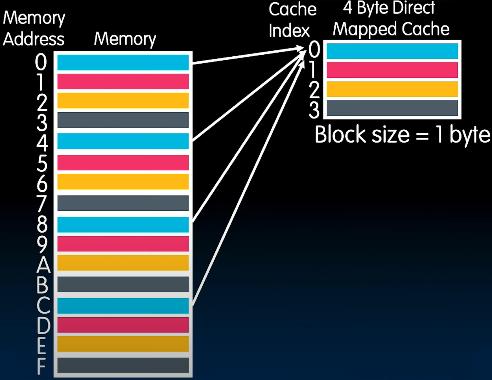
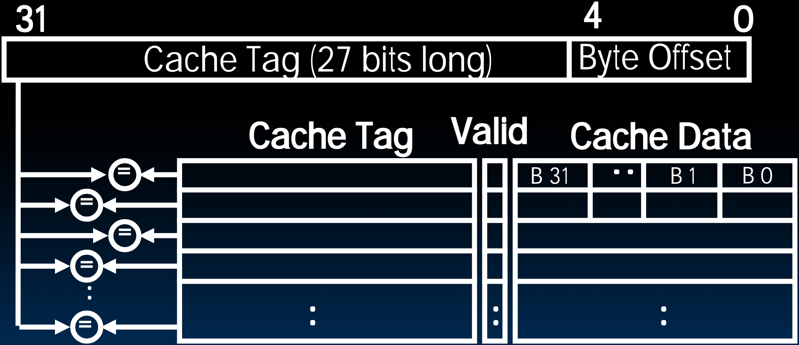
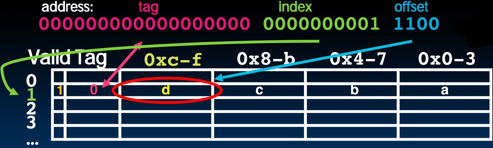

# 26.3-Fully Associative Caches


Lecture Video Address


上节中最后，我们提到由于访问的多个内存地址对应Cache的同一个Block导致了Conflict Miss。如下，同一颜色的Memory Block对应Cache的一个Block，那么先后访问0和4的时候，就会导致Conflict Miss。

本节课讨论如何解决这个问题。

> 让同一颜色的Memory可以映射到Cache的任何地方。而不是固定的Block

## Fully Associative Cache

### Decode Address

如下是Fully Associative Cache的结构

Memory address fields:

- Tag: same as before
- Offset: same as before
- Index: non-existant（因为Index决定着Address对应着Cache的哪一行或者Block）

> 也就是说没有Index指定Memory Address对应Cache的哪一行

What does this mean?

- no "rows": any block can go anywhere in the cache
- must compare with all tags in entire cache to see if data is there

### process

如下是该Cache的工作原理

Fully Associative Cache (e.g., 32 B block)

- compare tags in parallel

- Address中没有Index了，Byte Offset取决于Block Size，其余全为Cache Tag

- 由于没有Index指定Cache的row，所以选择Block的方式就是并行的比较，将Memory中的Cache Tag与Cache中的Tag进行比较，如果有相同的，即找到了对应的Block。

    > 在比较的同时也要查看Valid bit是否为1

### Benefit & Drawbacks

Benefit

- No Conflict Misses (since data can go anywhere)

> 此时还会有Miss，比如比较完之后发现没有一个Cache Tag相等，说明该Memory Address的内容没有加载到Cache中，但是这并不算Conflict misses。

Drawbacks

- Need hardware comparator for every single entry: if we have a 64KB of data in cache with 4B entries, we need 16K comparators: infeasible(不可行的)

    > 软件实现是可行的，但是硬件实现就要受到物理因素的影响。

## Final Type of Cache Miss

下面介绍最后一种miss

- 3rd C: Capacity Misses
    
    - miss that occurs because the cache has a limited size
    
        > 这就是Fully Associative Caches会发生的miss
    
    - miss that would not occur if we increase the size of the cache
    
        > 如果Fully Associative Caches无穷大，就不会发生这种问题。最极端的情况就是Cache保存着Memory的所有内容，只不过顺序会打乱。
    
    - sketchy definition, so just get the general idea

This is the primary type of miss for Fully Associative caches.

> 这种miss不同于Compulsory miss：在最初Cache没有Valid value的时候，发生的miss是Compulsory miss，随着Cache不断填充，当Cache满之后再发生的miss就是Capacity Misses

## How to categorize misses

下面是区分三种不同miss的方法。

Run an address trace against a set of caches:

- First, consider an infinite-size, fully-associative cache. For every miss that occurs now, consider it a compulsory miss.
- Next, consider a finite-sized cache (of the size you want to examine) with full-associativity. Every miss that is not in #1 is a capacity miss.
- Finally, consider a finite-size cache with finite associativity. All of the remaining misses that are not #1 or #2 are conflict misses.

> - fully-associative cache没有Conflict misses
> - infinite-size, fully-associative cache没有capacity misses
> - finite-size cache with finite associativity如果不是compulsory miss，那么就是conflict misses.

## in Conclusion

- Divide into T I O bits, Go to Index = I, check valid
    - If 0, load block, set valid and tag (COMPULSORY MISS) and use offset to return the right chunk (1,2,4-bytes)
    - If 1, check tag
        - If Match (HIT), use offset to return the right chunk
        - If not (CONFLICT MISS), load block, set valid and tag, use offset to return the right chunk

> 这里没有提到dirty bit
