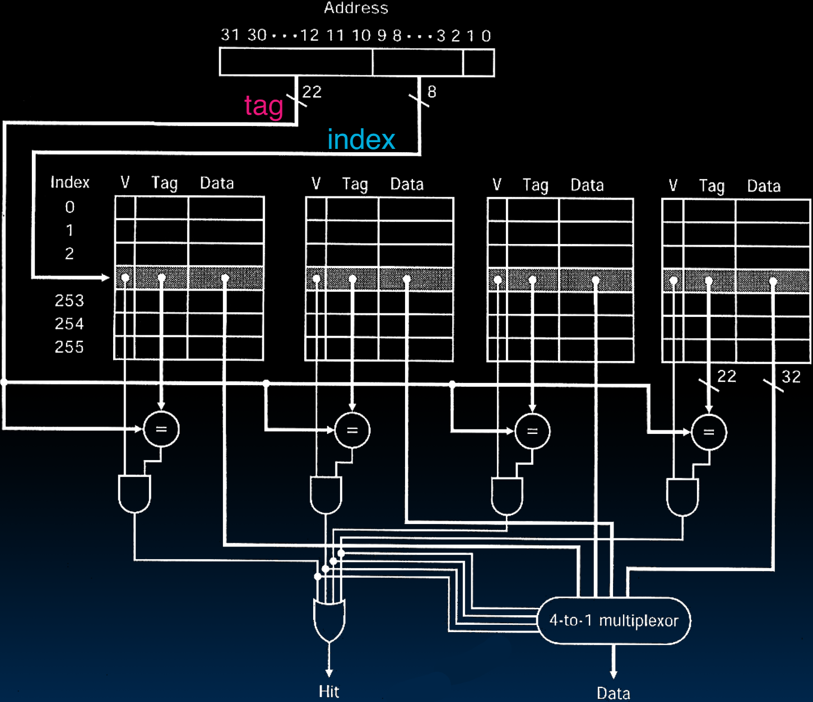

# 27.1-Set-Associative Caches


Lecture Video Address


本节将Set Associative Caches(组相联缓存)，它位于全相连缓存(Fully Associative Caches)与直接映射缓存(Directly mapped Caches)之间。

> Fully Associative Caches允许你可以坐在任何地方，而Directly mapped Caches则要求你有指定的座位，并且只能坐在那里。
>
> Set-Associative Caches位于这两者之间的某个位置，就像你可能会坐在头等舱、商务舱或经济舱的某个区域内，但具体位置是相对固定的。这就是其概念。

## N-Way Set Associative Cache

> N-way Set Associative Cache意味着，每个Set中有n个Blocks。如果是2-way，意味着每组有2个Block

Memory address fields:

- Tag: same as before
- Offset: same as before
- Index: points us to the correct set

So what's the difference?

- 每个set包含多个blocks
- 一旦进入一个set，那么组内就是全相连的，必须与组内的所有Tag进行比较。
- Cache Size = 组数 * 组里的Block数量 * Block的大小

### Associative Cache Example

Here's a simple 2-way set associative cache: 2 sets, 2 blocks in set

> 如图所示，Block Size是Byte，但是每个Set有多少个Block是不确定的，可以有任意多个，所以在说明Set-Associative Caches的时候要指明N-Way的N是多少。

这里回顾一下ping pong effect，当Block相对于Caches非常大的时候（Caches非常宽并且矮的情况，极端情况为Block Size = Caches Size），那么Cache无法同时存储两个相同颜色的memory block，这样当交替访问同一颜色的memory区域的时候，就会不断替换Cache。

但是现在在Cache中的一个Set中，都是同一颜色，但是可以容纳多个Block

---

- Basic Idea
    - cache is direct-mapped with respect to sets
    
        > Cache是相对于集合直接映射的
    
    - each set is fully associative with N blocks in it

---

匹配Memory Address与Cache Location的方式如下

- Given memory address:
    - Find correct set using Index value.
    - Compare Tag with all Tag values in that set.
    - If a match occurs, hit!, otherwise a miss.
    - Finally, use the offset field as usual to find the desired data within the block.

---

- What's so great about this?
    - even a 2-way set assoc cache avoids a lot of conflict misses
    
        > 即使是2-way set assoc Cache，也能使得Cache能够同时存储两个有相同颜色的Block，这样就能大大避免Conflict misses。缓解了Directly Mapped Cache的问题
    
    - hardware cost isn't that bad: only need N comparators
    
        > 硬件成本过大是Fully Associative Caches的问题。以每个Set为一个单位进行比较也缓解了硬件设计困难的问题。

---

- In fact, for a cache with M blocks
    - it's Direct-Mapped if it's 1-way set assoc（一个Set只有一个Block）
    - it's Fully Assoc if it's M-way set assoc
    - so these two are just special cases of the more general set associative design

## 4-Way Set Associative Cache Circuit

下面以4-WaySet Associative Cache为例展示这种Cache是怎么工作的

Hit到Data中间是"One Hot" Encoding

关于circuit：

1. Caches中并不存储Index，图中所示的Cache旁边的Index的标号都是逻辑上的
2. 为了方便画circuit，以及表示多个block为同一个set，图中将Cache分成了4个，但是在物理上可能同一行是连续的地址
3. Memory有8bits Index，也就是有256个set，Tag有22bits。Offset有2bits，说明Block有4个Byte

执行流程：

1. Address中的Index选择Cache的Set（如图阴影所示，同一行为一个Set，一个Set里面有4个Block）

2. 这个Set里的Block中的Tag与Address中的Tag进行比较，然后与Valid bit进行AND操作；Set里的Block的Data传送到4-to-1mux中

3. 4个AND操作的结果进行OR，只要有一个有效说明hit，同时4个AND结果作为4-to-1 mux的选择信号

    > 这里的mux与以往不同，这里使用One hot Encoding作为选择信号
