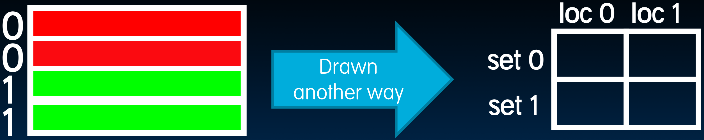
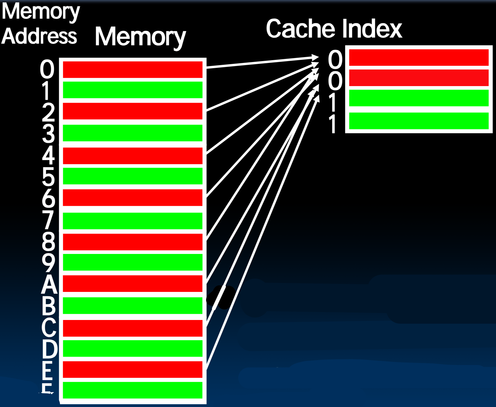
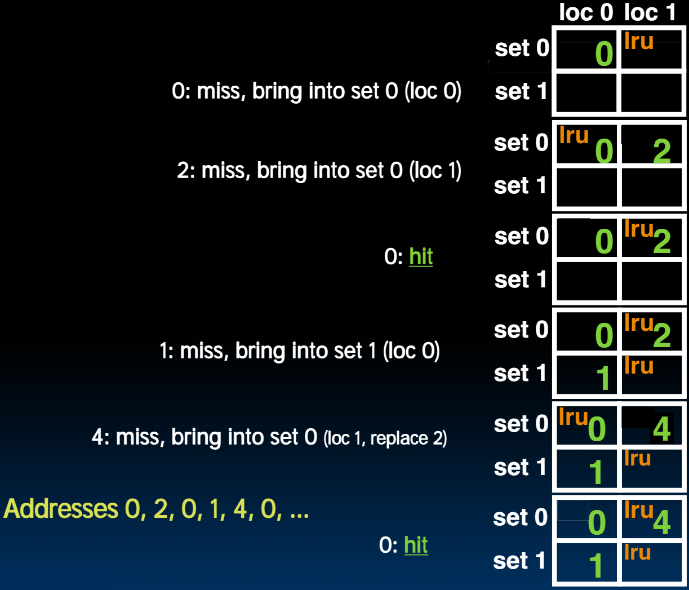
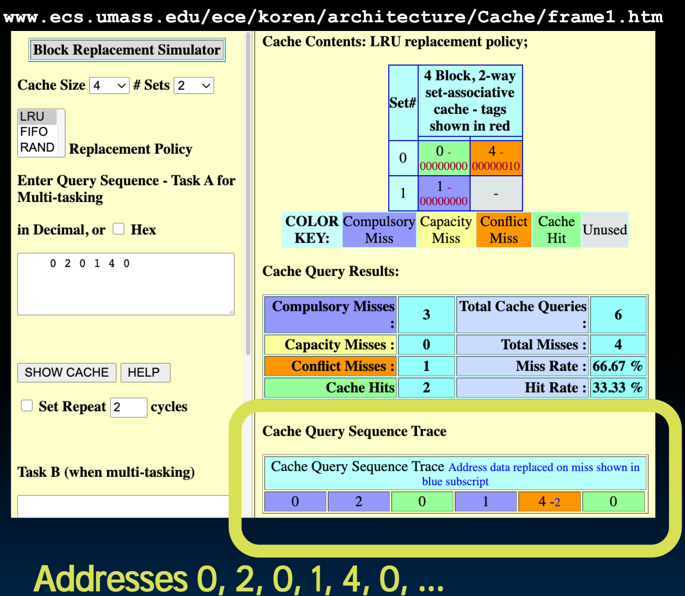

# 27.2-Block Replacement with Example


Lecture Video Address


## Block Replacement Policy

> 替换策略是当要进行Block替换的时候，选择替换哪一个Block

下面是三种Cache的情况

| Cache               | situation                                                    |
| ------------------- | ------------------------------------------------------------ |
| Direct-Mapped Cache | index completely specifies position which position a block can go in on a miss |
| N-Way Set Assoc     | index specifies a set, but block can occupy any position within the set on a miss |
| Fully Associative   | block can be written into any position                       |

> - 发生Compulsory misses的时候很简答。
> - 对于Direct-Mapped Cache来说很简单，其在发生Conflict misses的时候需要进行替换，此时只要将发生冲突的那个Block替换即可
> - 但是对于`N-Way Set Assoc`和`Fully Associative`来说，就不一定了，他们不会发生`Conflict misses`，只会在Cache或者Set满的时候要进行替换。

Question: if we have the choice, where should we write an incoming block?

- If there's a valid bit off(valid bit = 0), write new block into first invalid（此时发生了）
- If all are valid, pick a replacement policy
    - rule for which block gets "cached out" on a miss.

> 此时就需要replacement policy了

---

- LRU (Least Recently Used)
    - Idea: cache out block which has been accessed (read or write) least recently
    
    - 优点: temporal locality → recent past use implies likely future use: in fact, this is a very effective policy
    
    - 缺点: with 2-way set assoc, easy to keep track (one LRU bit); with 4-way or greater, requires complicated hardware and much time to keep track of this
    
        > 很难用硬件记录哪一个Block是最近没有访问过的，可能需要更多的bits
    
- FIFO
    - Idea: ignores accesses, just tracks initial order
    
- Random
    - If low temporal locality of workload, works ok

## Block Replacement Example

Our same 2-way set associative cache with a four byte total capacity and one byte blocks. 

> 这里将Cache画成右图的样子。我们这里仍然以偶数地址为Set0，奇数地址为Set1。
>
> 

We perform the following byte accesses: 0, 2, 0, 1, 4, 0...

How many hits and how many misses will there be for the LRU replacement policy?

### Block Replacement Example: LRU

下面逐行说明：

| Address | Set  | situation                                                    | lru  | supplyment                                                |
| ------- | ---- | ------------------------------------------------------------ | ---- | --------------------------------------------------------- |
| 0       | 0    | 第一次访问0，Index指向Set0，此时Set0里面的Block的valid bit全为0，这里选择loc0。此时lru = loc1 | loc1 |                                                           |
| 2       | 0    | loc1的valid bit = 0，MEM[2]的内容放在loc2，lru = loc0        | loc0 | 此时同一颜色的Block可以共存，减小了ping pong effect的风险 |
| 0       | 0    | hit                                                          | loc1 |                                                           |
| 1       | 1    | Set1的valid bit都为0，放在loc0                               | loc1 |                                                           |
| 4       | 0    | Set0的valid bit都为1，并且Tag没有与4匹配的，发生miss，lru替换loc1的2 | loc0 | 此时发生的misses叫做Conflict misses                       |
| 0       | 0    | hit                                                          |      |                                                           |

> 每次访问Cache的一个Block之后需要更新lru

## Cache Simulator!

下面这个网站就模拟了上述的过程http://www.ecs.umass.edu/ece/koren/architecture/Cache/frame1.htm

> 现在这个网站好像没有访问权限

- 不同的颜色表示不同的情况，如Compulsory Miss，Capacity Miss，Conflict Miss等等
