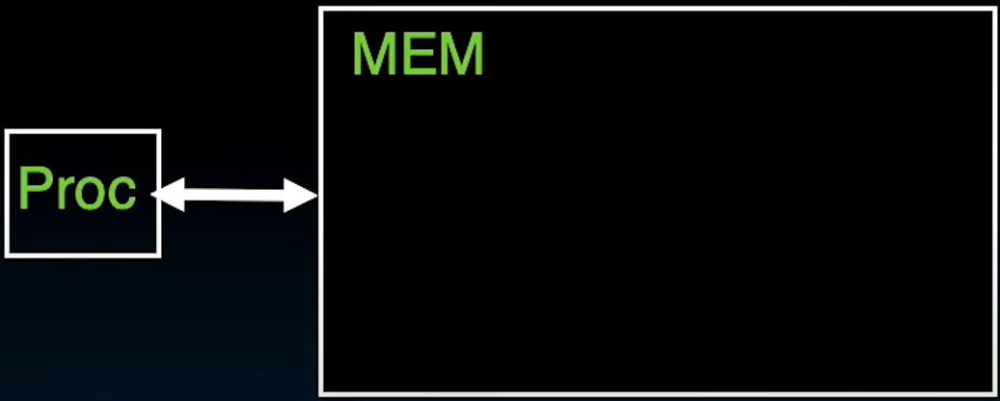
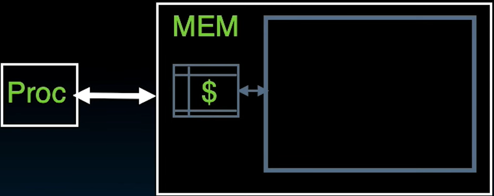
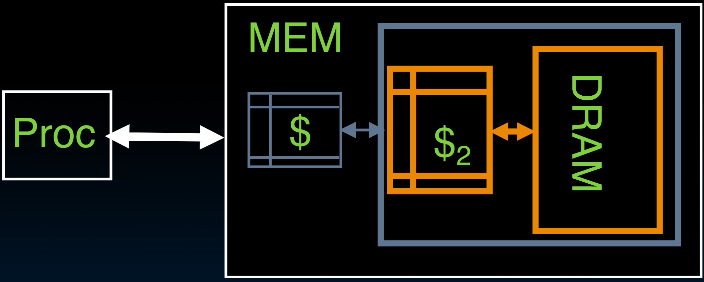
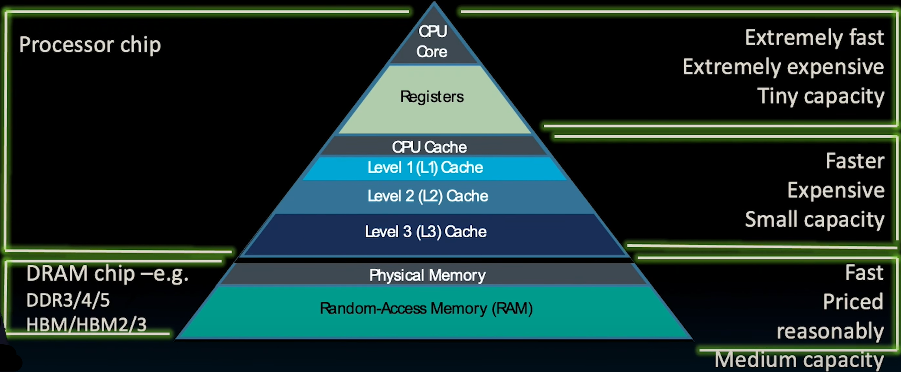
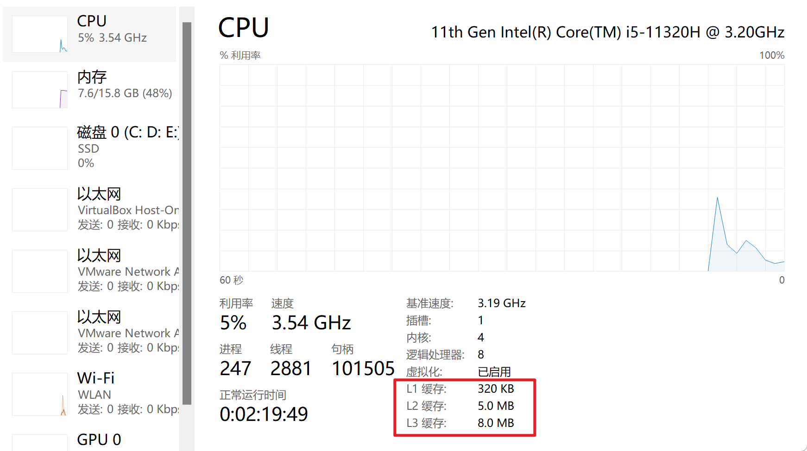
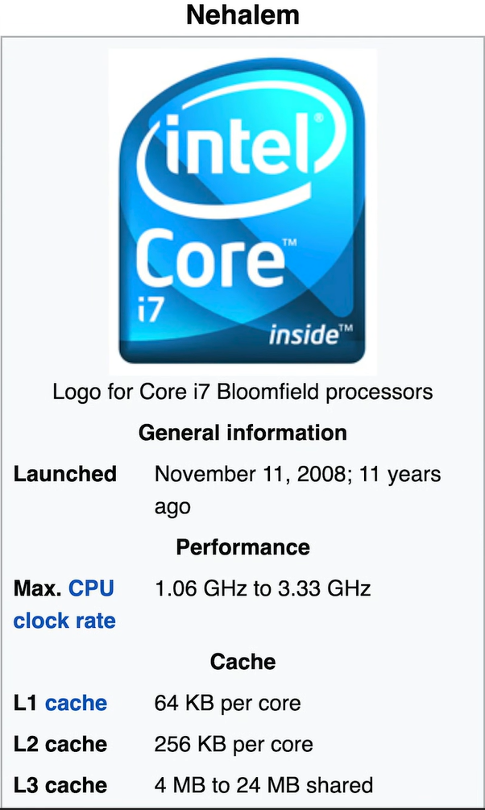
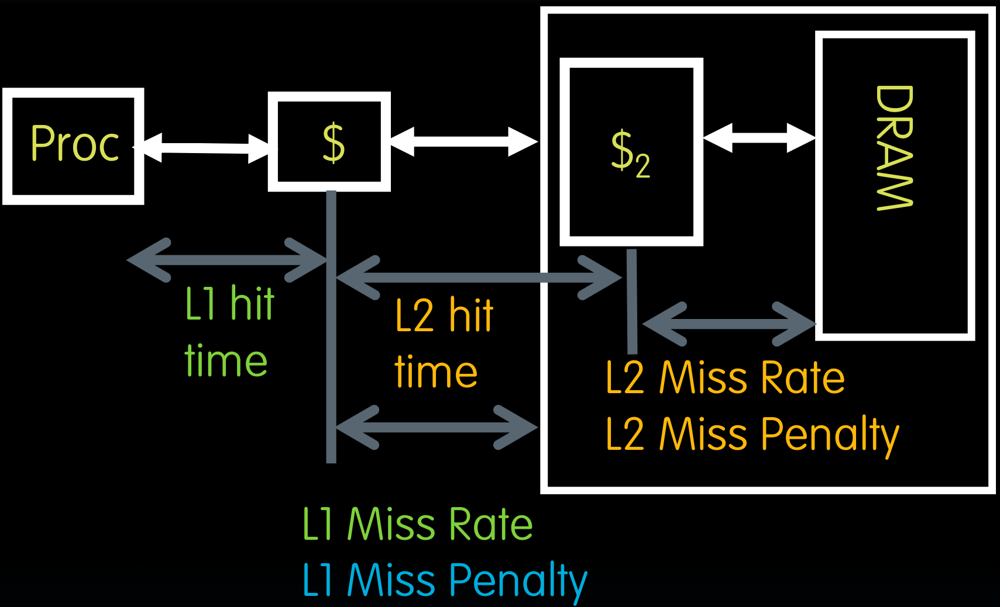

# 27.3-AMAT & Multi-level cache


Lecture Video Address


本节来讲述一种衡量缓存性能的方法。（之前我们仅仅希望减少Miss次数，增加Hit次数，所以调整了associativity）

但是除了Miss rate之外，还需要考虑Miss Penalty等因素。所以需要新的指标。

> Average Memory Access Time (AMAT)

## AMAT Model

- How to choose between `associativity`, `block size`, `replacement & write policy`?

    > 我们已经学习了associativity，block size, replacement policy和Write Policy这几个有关Cache的参数，但是如何选择。

- Design against a performance model
    - Minimize: `Average Memory Access Time = Hit Time + Miss Penalty x Miss Rate`
    
    > 需要建立一个模型，依据模型来选择参数。

Create the illusion of a memory that is large, cheap, and fast - on average

> Cache的作用就是为Memory提供了一层illusion(或者说Abstraction)，有memory的Capacity，price，以及有AMAT的速度。

How can we improve miss penalty?

> 之前所说，增大block Size可以减少Miss rate，但是可以提高Miss Penalty，因为一次Miss后从memory copy的数据量会增多

## Reduce Miss Penalty(L2 Cache)

When caches first became popular, Miss Penalty ~ 10 processor clock cycles(这是非常快的，processor和memory的速度几乎没有Gap)

> 回想之前Register和memory的类比，没有Cache会相差几百倍的速度。

Today 3 GHz Processor (1/3 ns per clock cycle) and 80 ns to go to DRAM
- ~200 processor clock cycles!（也就是说，从memory中读取数据是Clock cycles的200倍）

如下， Cache为我们提供了一层抽象，large, cheap, and fast 

但是实际在内层，使用Cache与DRAM进行交互，Processor不会考虑抽象里面是怎么执行的，也就是不会管是否hit，miss，block replacement，processor只负责从MEM中读写数据

既然我们可以通过添加一层Cache减少Proc与DRAM的时间，那么为什么不可以再添加一层Cache减少Cache与DRAM的时间呢？（recursion）

Solution: another cache **between memory and the processor cache**: Second Level (L2) Cache

> 之前说的Cache都是CPU内部的Cache，现在是在CPU Cache和DRAM之间添加的Cache

当然，可以加L2 Cache，那么L3 也是可以的

## Great Idea #3: Principle of Locality / Memory Hierarchy

由此，我们就得到了计算机内部完整的存储体系了。

- 越往下，容量越大，速度越慢，每bit价钱越便宜
- 上面的存储是下面存储子集的copy（Write-back除外，此时lower的内容是stale的）

可以在计算机性能中查看Cache的信息

> 可以看到，capacity: L3 > L2 > L1，速度是反过来的

下面是I7的指标

> - L1和L2是每个core独有的
> - L3是多个core共享的

## Analyzing Multi-level cache hierarchy

下面我们分析多级Cache的ATAM（可以使用递归）

- `Avg Mem Access Time = L1 Hit Time + L1 Miss Rate * L1 Miss Penalty`
- `L1 Miss Penalty = L2 Hit Time + L2 Miss Rate * L2 Miss Penalty`
- Avg Mem Access Time = L1 Hit Time + L1 Miss Rate * (L2 Hit Time + L2 Miss Rate * L2 Miss Penalty)

> \$2在\$1和DRAM之间提供了一层抽象。这是递归思想的体现。计算ATAM的时候也是用同样的思想。

## Example

下面是L1 Cache的ATAM的计算例子

Assume 

- Hit Time = 1 cycle
- Miss rate = 5%
- Miss penalty = 20 cycles
- Calculate AMAT…

`Avg mem access time = 1 + 0.05 x 20 = 1 + 1 cycles = 2 cycles`

## Ways to reduce miss rate

- Larger cache
    - limited by cost and technology
    - hit time of first level cache < cycle time (bigger caches are slower)
- More places in the cache to put each block of memory – associativity
    - fully-associative
        - any block any line
    - N-way set associated
        - N places for each block
        - direct map: N=1

## Typical Scale

下面是常规的L1和L2的规格

|            | L1                          | L2               |
| ---------- | --------------------------- | ---------------- |
| size       | tens of KB                  | hundreds of KB   |
| hit time   | complete in one clock cycle | few clock cycles |
| miss rates | 1-5%(very good)             | 10-20%           |

L2 miss rate is fraction of L1 misses that also miss in L2

- 因为L1确实在temporal locality做的很好

## Example: with L2 cache

下面是L2 Cache的计算方式

Assume

- L1 Hit Time = 1 cycle
- L1 Miss rate = 5%
- L2 Hit Time = 5 cycles
- L2 Miss rate = 15% (% L1 misses that miss)
- L2 Miss Penalty = 200 cycles

L1 miss penalty = 5 + 0.15 * 200 = 35

Avg mem access time = 1 + 0.05 x 35 = 2.75 cycles

> L2 Miss Penalty有200cycles，但是使用多级缓存最终减少到2.75cycles，虽然比起Hit Time还是慢一些，但是相比于Penalty来说已经足够快了。

---

如果没有L2 Cache，那么速度是多少

Assume 

- L1 Hit Time = 1 cycle
- L1 Miss rate = 5%
- L1 Miss Penalty = 200 cycles

Avg mem access time = 1 + 0.05 x 200 = 11 cycles

4x faster with L2 cache! (2.75 vs. 11)

> 可以看到有了L2 Cache可以大大提升AMAT
