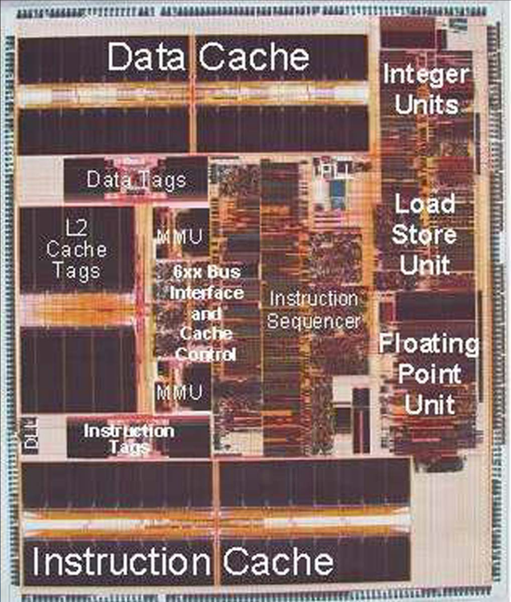
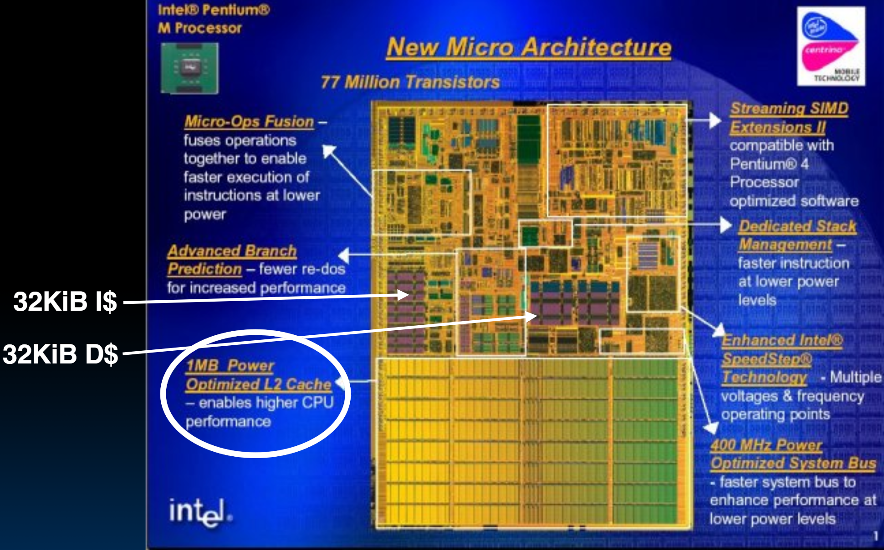
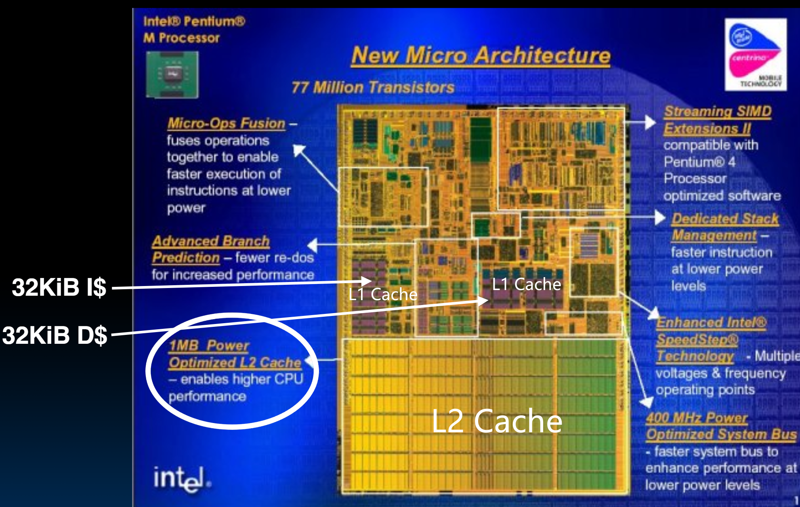
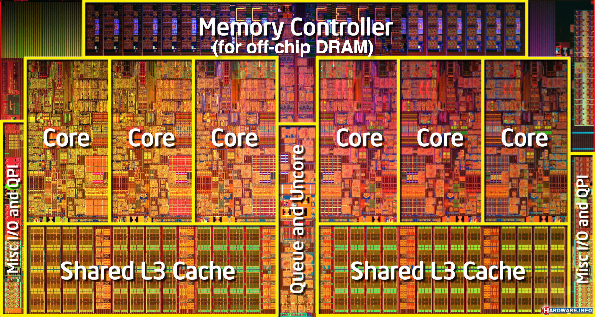

# 27.4-Actual CPUs & Cache Idea


Lecture Video Address


## An Actual CPU

### Early PowerPC

Cache: 32 KiB Instructions & 32 KiB Data L1 caches

- External L2 Cache interface with integrated controller and cache tags, supports up to 1 MiB external L2 cache

    > L2 Cache只有Tag在CPU内，在L2 Tag Comparison的时候很快。

- 上面的两个黑色长条都是Data Cache，下面的两个长条都是Instruction Cache
- 在Cache中，Tag并不属于Block（Tag的数据仅仅用来比较的），所以Tag可以分开，如上，Data Tag和Instruction Tag都是分开的一个模块（可以用于快速比较）
- Dual Memory Management Units (MMU) with Translation Lookaside Buffers (TLB)

---

- Pipelining
    - Superscalar (3 inst/cycle)
    - 6 execution units (2 integer and 1 double precision IEEE floating point)

    > 所以很多指令可以同时进行。

### Pentium M

L2 Cache已经集成到chip上了

### Intel core i7

这已经是非常现代的了

- i7里面有6个Core，每个Core都有L1 L2 Cache
- 多个Core共享一个L3 Cache

## In Conclusion

We’ve discussed memory caching in detail. Caching in general shows up over and over in computer systems

- Filesystem cache
- Web page cache
- Game databases / tablebases
- Software memoization
- Phone recent call list
- ...

> Cache不仅仅是一个硬件，更是计算机的一种思想，即使是在软件编程中也可以有Cache

Big idea: if something is expensive but we want to do it repeatedly, do it once and cache the result. 

> 例如在进行递归计算`F(n) = F(n - 1) + F(n - 2)`的时候，直接计算可能会导致很多重复计算（而且有些计算量很大），因此可以将一些结果保留下来，这是Software memoization。

Cache design choices:

- Size of cache: speed v. capacity
- Block size (i.e., cache aspect ratio)
- Write Policy (Write through v. write back
- Associativity choice of N (direct-mapped v. set v. fully associative)
- Block replacement policy
- 2nd level cache?
- 3rd level cache?

> 这些选择不仅仅是硬件中可以使用，软件中也可以应用

Use performance model to pick between choices, depending on programs, technology, budget, ...
