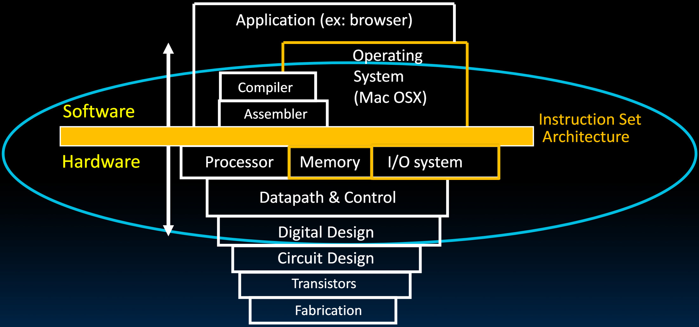
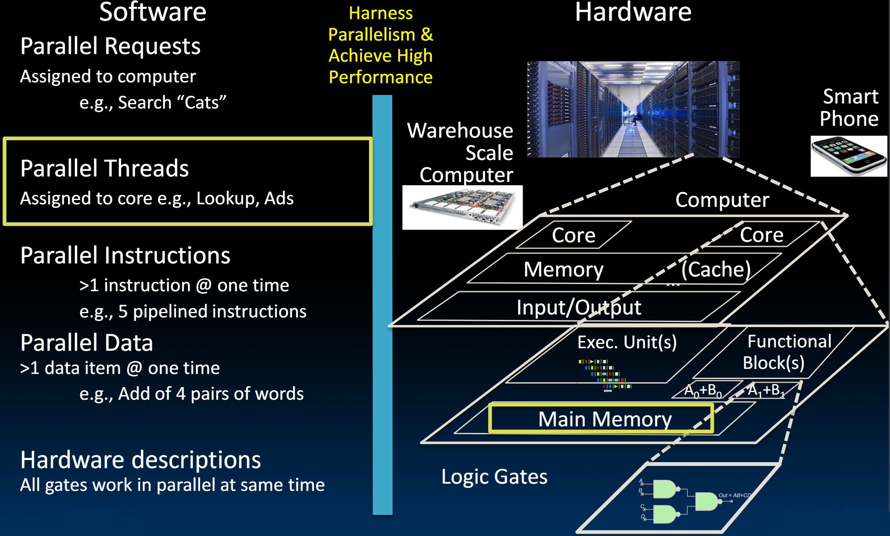
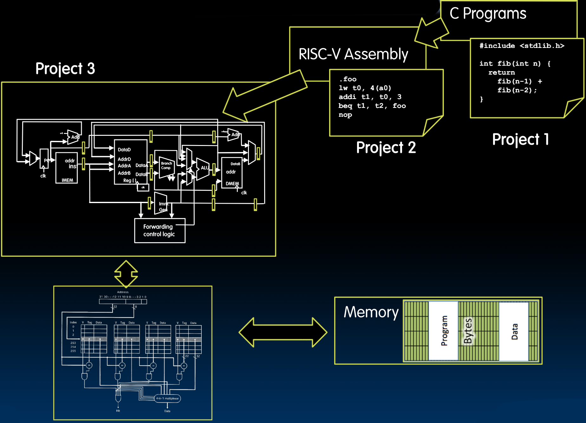
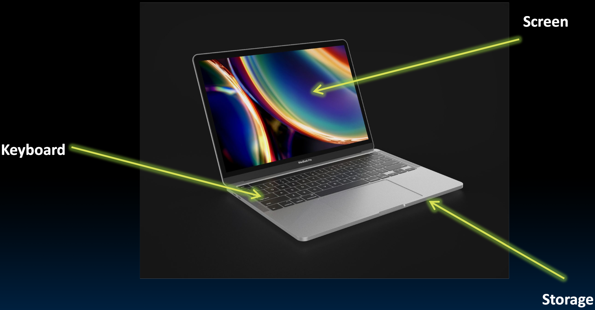
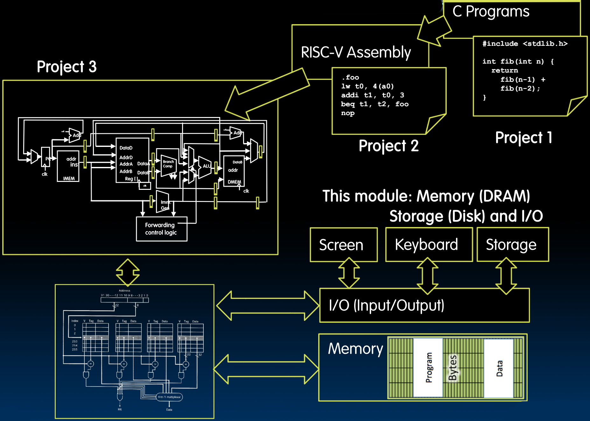
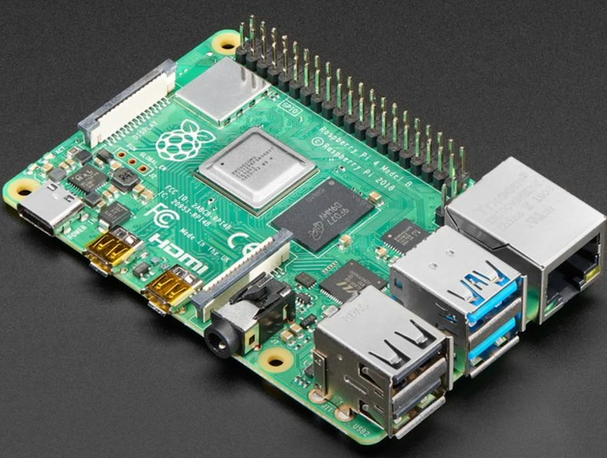
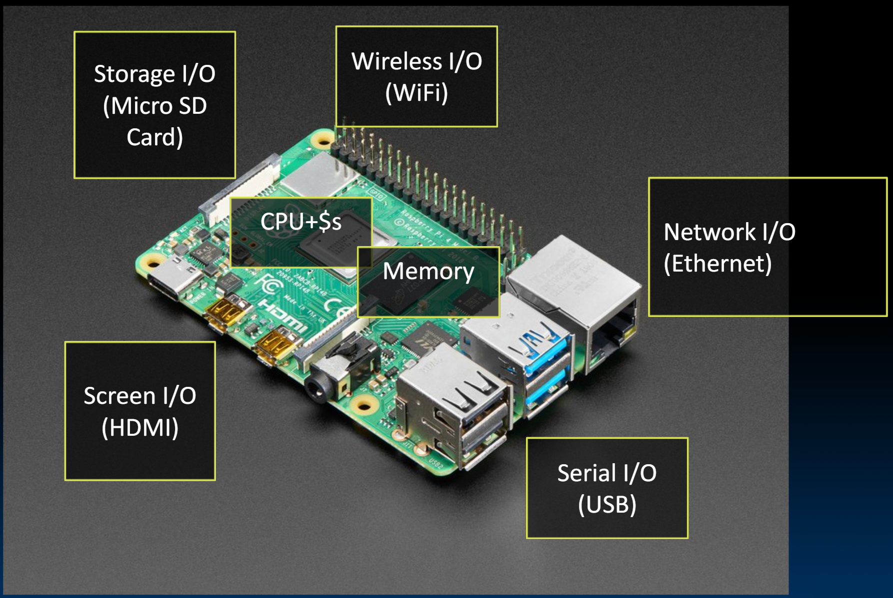
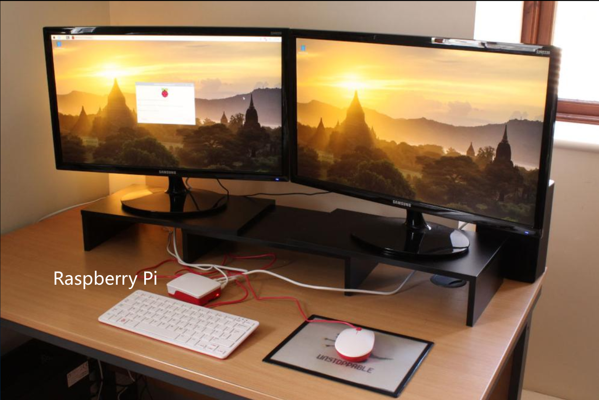
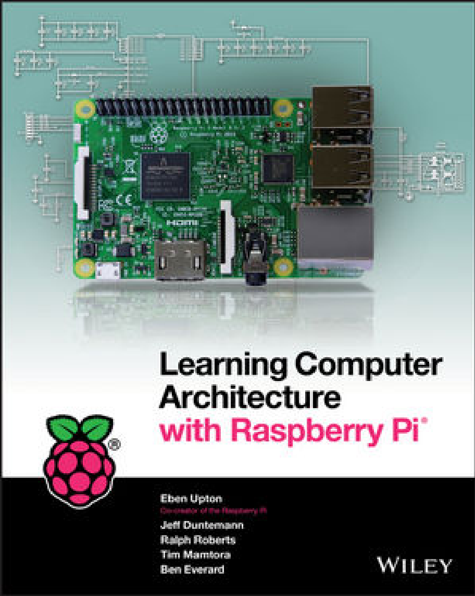
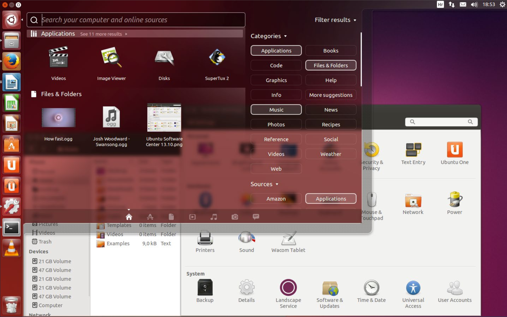

# 28.1-Intro


Lecture Video Address


在这个模块中，我们将介绍操作系统的基础知识，并了解虚拟内存是如何工作的。

## Machine Structures

### Old-School Machine Structures

在此之前，我们已经围绕ISA讲了软件和硬件分别是怎样工作，并且讲了处理器是如何工作的，以及它是如何与片上缓存协同工作的。

后面，我们要讲的内容有：

1. 运行Linux、Mac OS或Windows所需的基本功能
2. 计算机的输入和输出(I/O)
3. 如何与内存协同工作，特别是主内存如何与存储器协同工作。

### New-School Machine Structures

本节开始要处理的是如何在计算机中支持并行线程以及与main memory相关的主题。

### Great Idea #3: Principle of Locality / Memory Hierarchy

并且从本节开始，会揭示内存层次结构的完整结构。

前面我们已经学习了缓存，现在我们要真正了解物理内存（在这种情况下是DRAM）如何与SSD和磁盘一起工作来实现虚拟内存。

当我们完成这些后，我们将拥有这种无限快和无限大的内存的illusion。

### Recap

回顾之前学习的内容

从C program到RISC-V Assembly，再到Datapath，然后又扩展了Cache。

对于内存，我们仅仅是简单从概念上介绍了，但是并没有深入讲解其是怎么工作的。

虽然现在学了很多component，但是到目前还没有一个真正的计算机。

## Computer

### laptop

下面是一台真实的计算机，比如一台笔记本电脑。笔记本电脑和我们迄今为止构建的东西有何不同？

除了Processor，Memory，Cache之外，笔记本还有Screen，Keyboard。Storage(在现代计算机中，通常是固态硬盘。在一些较旧的计算机中，我们通常会遇到磁性硬盘驱动器)。

所以，在本模块中，要做的事情：

1. 添加I/O。我们将相对简短但希望有效地研究如何向计算机添加输入/输出设备，这将提供一种统一的方法来连接屏幕(Screen)、键盘(Keyboard)和存储设备(Storage)
2. 内存DRAM是如何工作的
3. 添加存储设备，并研究如何处理输入/输出。

除了全功能的笔记本电脑外，还有许多其他更简单的计算机。

### Raspberry Pi

有许多被称为单板计算机的设备。其中一种特别受欢迎，真正开创了单板计算机领域的设备是Raspberry Pi（树莓派）。

- 中间银色的芯片是Processor
- 紧接着下面黑色的芯片是Main Memory(DRAM芯片)
- 最上面长方形的是Storage，是一种Flash Card闪存卡（这里不是固态硬盘作Storage，虽然可以连接固态硬盘），Flash Card可以用于照相机或者音乐播放器，这里的闪存卡被称为secure digital Card(安全数字卡)或者SD卡，基于Flash Memory
- 左侧金色的是Screen I/O，使用的是HDMI接口 
- 右下方左边两个口以串行总线的形式添加输入/输出。有四个串行输入/输出接口。
- 右下方右边的口可以连接有线以太网。这个设备支持有线以太网。
- 最后，银色芯片基本上是Wi-Fi。因此，我们还有Wi-Fi和蓝牙连接作为其他类型的输入/输出。

我们将探讨这些东西如何实际连接到我们的处理器上。

图景应该相对简单且统一，当我们向这个相对简单的单板计算机添加输入/输出时，我们就有了一台真正的计算机。

将Raspberry Pi连接两个屏幕，一个键盘，一个鼠标，然后运行Linux和其他的应用程序，就可以成为如下的样子。

---

下面是推荐学习的书。

Lot’s of concepts from 61C covered in a book, with Raspberry Pi exercises

(and it is free to download if you are a Cal student: https://onlinelibrary.wiley.com/doi/book/10.1002/9781119415534)

但是本课程并不以Raspberry Pi作为教授的例子。原因：

1. 这本书还要更底层一些
2. Raspberry Pi是基于ARM的
3. 构建ARM type的processor也是比较难的

但是这本书还是很友好的，介绍了很多内容，并且有很多很棒的实验

## OS

That’s not the same! When we run VENUS, it only executes one program and then stops.

> VENUS只是运行简单的程序的。

When I switch on my computer, I get this:

Yes, but that’s just software! The Operating System (OS)
