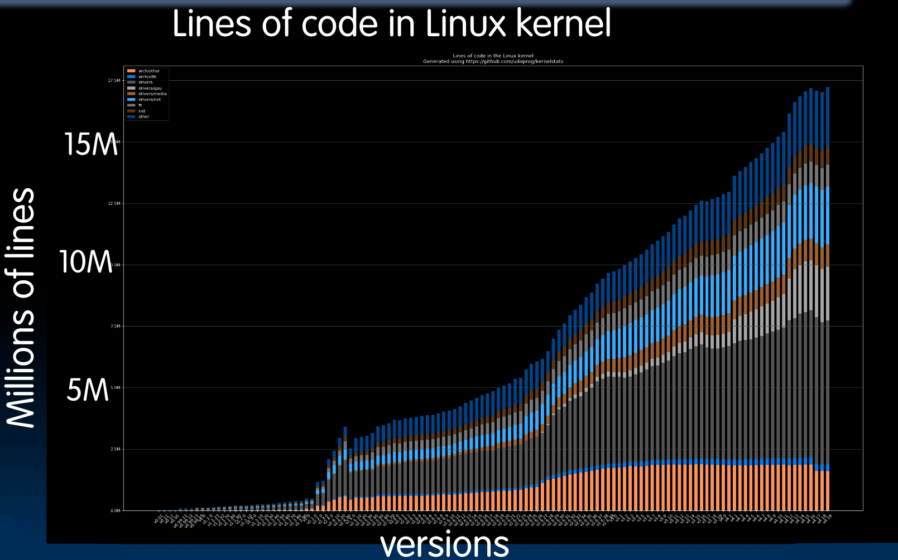

# 28.2-Operating System Basics


Lecture Video Address


## How many lines of code?

OS也仅仅就是软件而已。

- The biggest piece of software on your machine?

    > 看下图，虽然没有Google多，但是也足够复杂了

- How many lines of code? These are guesstimates:（https://informationisbeautiful.net/visualizations/million-lines-of-code/）

下图是过去的几十年里，Linux代码的增长量，现在的代码量已经有~20M了

那么这么多的代码做什么呢？

## What Does the OS do?

1. OS is (almost) the (first) thing that runs when computer starts

    > 准确的说，最早的应该是BIOS和Bootloader，但在此之后，不会立即加载程序，而是加载OS。

2. 一旦操作系统在计算机内部找到自己的位置，它将会找到所有设备。它将会查找有多少个Core，有什么样的IO设备？你有打印机、显示器、键盘吗？有什么样的磁盘，等等

    - 在Linux中，它会构建一个设备树。通过使用这个设备树，我们将知道我们拥有什么样的资源，以及我们可以使用什么样的OS Function来访问这些设备。

    - Relying on hardware specific "device drivers"（这通常依赖于使用硬件特定的设备驱动程序。我们计算机中的每个设备，无论是CD还是打印机或其他设备，都将有一个特定于该设备的设备驱动程序）

        > 比如说在连接打印机的时候，需要安装对应的打印机的驱动

3. 在确定了计算机中有什么后，操作系统将启动服务：File system, Network stack (Ethernet, WiFi, Bluetooth, …), TTY (keyboard)。

    - 这样做的原因是许多这些服务将在不同的用户和用途之间共享，如果你是那个要编写一个接受键盘输入并简单地在屏幕上显示字符的应用程序的人，将会非常繁琐，不可能在每个应用程序中都这样做。

        > 也就是说这些服务都是为上层的应用提供的，上层应用可以直接调用这些服务，避免重复写冗余的代码。

> 第2点和第3点是有顺序的，先检测有哪些设备，然后为那些设备启动服务程序以供上层应用使用。

在许多情况下，操作系统是免费提供的。无论是专有的还是开源的。

4. 最后，当一切都设置好后，OS就开始加载，运行和管理程序。
    - 可以同时运行多个程序，无论是同一用户还是多个用户（time-sharing）
    - 将这些程序相互隔离。它们中的任何一个都不知道其他程序正在运行（isolation）
    - 它们都可以很好地共享系统资源，包括外围设备。
    - 如果这些程序中的任何一个出现任何故障，例如崩溃，它应该被优雅地终止，而不是导致其他所有事情都崩溃。

### What Does the Core of the OS Do?

Core of the OS必须提供这里列出的一些基本功能，而这些功能可以分为两类。（这些实际上就是上面的行为需要的基本的功能）

1. Provide isolation between running processes (Each program runs in its own little world)

    > Core of the OS提供了运行程序之间的隔离。每个程序都在自己的世界中运行，它不知道其他任何程序，只是使用操作系统服务。如果有另一个程序正在使用这些服务，它们不会相互干扰。

2. Provide interaction with the outside world(Interact with "devices": Disk, display, network, etc... )

    > Core of the OS提供了与外部世界的交互。OS提供了一种非常便捷的方式与设备交互，应用可以调用这个功能。

### What Does OS Need from Hardware?

之前的Datapath已经能够让操作系统在其上运行，但是还需要一些修改。

为了让OS实现上述功能，硬件还需要实现以下的功能。

1. Memory Translation
    - 当运行的汇编代码或 C 代码时，多个程序可能正在访问相同的内存位置。如果我们实际上在物理DRAM中访问相同的内存位置 1,000 次，那将是一个相当大的问题。我们会互相覆盖。
    - 操作系统会截取所谓的虚拟地址，并将其映射到物理地址。因此，如果有多个应用将要写入相同的地址1,000次，操作系统将会将其转换为不同的物理地址(同一进程映射到相同的地址)，取决于想要使用多少内存，这些东西将会被分离开。
    - 在执行Load或者Store的时候，程序会发出一个虚拟地址，操作系统将该虚拟地址转换为物理地址。真正访问内存的是物理地址。
    - 这种内存地址转换是需要硬件实现的（下一点）

2. Protection and privilege
    - 需要一些特定的保护和权限。通常至少有两种运行模式，即两种不同级别的保护和权限，`user`和`Supervisor`(RISC-V还支持`machine`，介于`user`和`Supervisor`之间)
    - 用户模式将拥有最少的权限，然后是机器模式和监督员模式，监督员拥有最多的权限。
    - 较低的权限是不能更改Memory mapping的。在用户模式下，不应该能够造成任何损害。你不能覆盖其他任何人。监督员模式是改变内存映射并为不同的用户分配不同的内存映射的模式。因此，监督员可以为任何给定的程序更改映射，并且它有自己的从虚拟到物理的映射。
    - 模式更改通常通过写入一些控制和状态寄存器来完成。只需设置位和控制状态寄存器，这与不同类型的 ISA 有很大的关系。控制和状态寄存器的存在，以便用户可以向操作系统请求某些内容，但不能搞乱一些内容。
    - 监督员模式将访问更多的控制和状态寄存器，它将用于管理竞争不同设备的多个进程。

3. Traps & Interrupts（中断和异常）
    - 从硬件中运行操作系统需要需要能够处理中断和异常。这些本质上是处理程序的异常行为的方式。
    - 程序可能会被内部或外部事件中断，或者可能需要处理内部异常，例如检测到无效指令。为此，必须能够执行所谓的陷阱处理程序。
    - 监督员模式将为我们执行此功能调用的一些东西。我们可以按需执行这项工作。不必由外部触发器或内部触发器触发，我们可以只是调用监督员来为我们执行某些操作。

## What Happens at Boot?

When the computer switches on, it does the same as VENUS: the CPU executes instructions from some start address (stored in Flash ROM)

启动时做的第一件事是跳转到一个预定的地址（一般为0x2000，不同的机器可能地址不同），程序计数器被设置为一个特定的预定值，然后开始执行一些预定的指令，这些指令将帮助我们启动操作系统。这些指令通常存储在我们称之为Flash ROM的东西中。

> - 也就是说这些指令是从Memory外部的存储器中加载到Memory当中的
> - ROM代表Read Only Memory，但其是可以重新编程的（但实际上，很少重新编程，有99.99%的时间是读取的），有时计算机会想要更新boot ROM，其实就是更新新的Flash ROM的内容(此过程比较慢)。
> - 由于很少写ROM，所以写ROM是一个相当缓慢的过程。但读取它的速度非常快

如下图

- BIOS可以被直接定位，processor会直接将PC定位到BIOS(这存在于Flash ROM)
- 但在大多数情况下，闪存的内容将被复制到与我们通常开始的位置相对应的内存空间中，然后开始执行它的内容(BIOS)，无论这是在我们的DRAM中还是在一个独立的芯片中。这取决于指向地址的这些导线在哪里。

下面是启动的时候的步骤。

1. BIOS*: Find a storage device and load first sector (block of data)

    > block of data有一些非常重要的信息，包括包含bootloader。

2. Bootloader (stored on, e.g., disk): Load the OS kernel from disk into a location in memory and jump into it

    > bootloader可能支持多个操作系统。其可以实现双重启动，以便我们可以启动不同版本的操作系统。

3. OS Boot: Initialize services, drivers, etc.

4. Init: Launch an application that waits for input in loop (e.g., Terminal/Desktop/...

    > 最后进入一个无限循环，等待输入后启动程序。
    >
    > Windows的界面就是一直等待鼠标输入，点击应用后即可启动程序。
