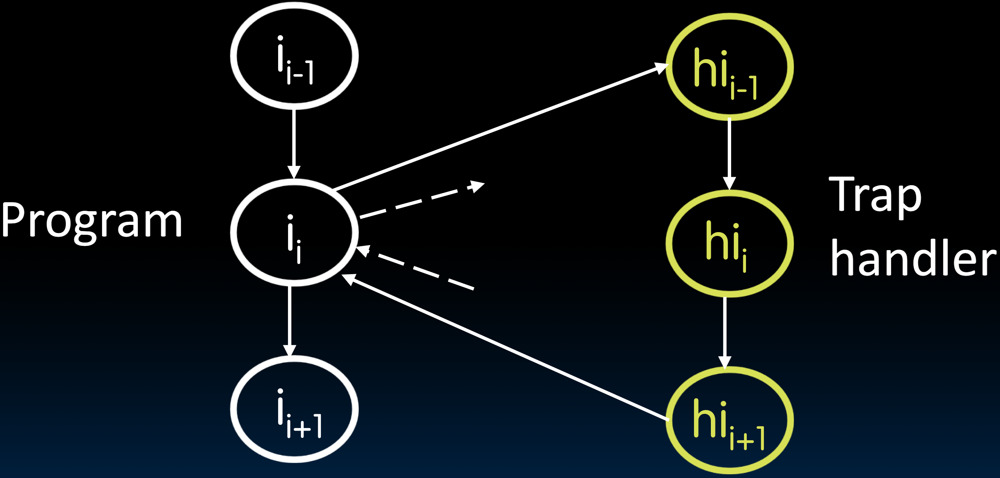
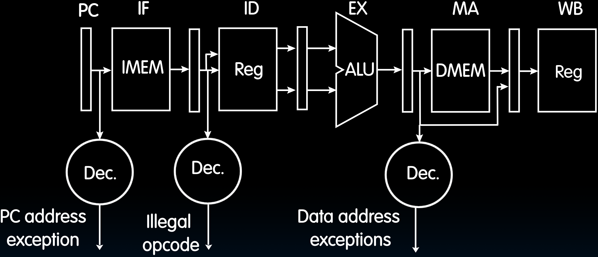

# 28.3-Operating System Functions


Lecture Video Address


上文我们简单介绍了一下OS应该实现什么，硬件应该为其提供什么功能。

并且学习了从外部闪存ROM设备启动操作系统到主内存，并将操作系统加载到我们的处理器中。

接下来，要学习怎么执行程序，以及OS需要执行的功能。

> 这个模块有点叙述性。在完成整个虚拟内存和I/O部分后，再次观看可能会更有意义。

## Launching Applications

在上一节最后我们说到，OS启动之后会加载shell(在Linux中)，并开始一个无限循环，等待用户的输入，这个输入来启动应用。

Applications are called "processes" in most OSs

- Thread: shared memory

- Process: separate memory

- Both threads and processes run (pseudo) simultaneously

    > 伪并行：在用户的视角看来，threads和processes是并行执行的，但是processor的数量是小于processes和threads，所以多个processes或者threads会共用一个processor，这个processor会执行一个进程一段时间，执行另一个进程一段时间。

---

下面是Linux执行程序的步骤

1. Apps are started by another process (e.g., `shell`) calling an OS routine(操作系统例程) (using a "`syscall`")

    - Depends on OS; Linux uses `fork` to create a new process, and `execve` (execute file command) to load application

        > 这里是先创建一个进程，然后加载应用

2. Loads executable file from disk (using the file system service) and puts instructions & data into memory (.text, .data sections), prepares stack and heap

3. Set `argc` and `argv`, jump to start of `main`

4. Shell waits for main to return (`join`)

## Supervisor Mode

有许多进程同时运行，管理这些进程很重要。我们需要确保它们不会互相覆盖运行。所以这就是为什么我们有Supervisor Mode。

如果应用程序出了问题，我们不希望它崩溃整个机器并在磁盘上乱写。我们也必须有办法阻止恶意软件(malware)做同样的事情。

The OS enforces resource constraints to applications (e.g., access to memory, devices)

To help protect the OS from the application, CPUs have a supervisor mode (e.g., set by a status bit in a special register)

> Supervisor是由硬件支持的。硬件会通过在状态寄存器中翻转几个位来发现已进入监督模式。

- A process can only access a subset of instructions and (physical) memory when not in supervisor mode (user mode)（这些指令就是我们之前学到过的指令）

- Process can change out of supervisor mode using a special instruction, but not into it directly – only using an interrupt（这些指令通常是设置CSR的指令）

- the supervisor mode also has access to the special set of CSR registers.

- Supervisory mode is a bit like "superuser(超级用户)"
    - But used much more sparingly(节约的) (most of OS code does not run in supervisory mode)，（也就是说我们很少进入监督模式）
    
    - Errors in supervisory mode often catastrophic (blue "screen of death", or "I just corrupted your disk")
    
        > 如果监督模式中出现错误，通常是灾难性的。这就是导致Windows中蓝屏死机或在磁盘驱动器上乱写的原因。

## Syscalls

在上层应用中，我们可能希望OS执行某些操作，例如`read a file`, `launch a new process`, `ask for more memory (malloc)`, `send data (e.g. to a network or wifi), etc`，如果我们自己编写底层的routine将一帧数据发送给Wi-Fi解调器确实很繁杂。

> 虽然可以做到，但是一方面这样做很麻烦，而且另一方面多个进程可能会同时争用一个共享资源。

因此，上层应用可以像OS发出系统调用syscalls，由OS帮助我们管理这些操作（包括解决资源争用的问题）

进行系统调用syscall只需要将一些参数放在寄存器当中，通常是放置信息的地方，并且会创建软件中断（有一个特殊的指令会执行这个中断）。然后操作系统会接管并执行所有的操作，无论是通过打印机还是Wi-Fi发送数据库，然后返回user Mode。

通过这种方式，操作系统可以管理多个尝试做类似事情或相同事情的进程。多个进程可以打印或访问网络等。操作系统确保它们之间没有冲突，并且按适当顺序执行。

---

下面是ChatGPT对于`syscall`的解释

> ChatGPT
>
> 系统调用（syscall）是操作系统内核提供给用户空间程序的一组接口，用于访问操作系统核心功能。通过系统调用，用户程序可以请求操作系统执行诸如文件操作、进程管理、网络通信等特权操作，而不直接操作硬件。这种方式保证了操作系统的安全性和稳定性，同时也提供了更高级别的抽象，使得用户程序更容易编写和维护。
>
> 系统调用的具体实现取决于操作系统的设计和架构，但通常包括以下步骤：
>
> 1. **准备参数**：用户程序将需要的参数（如文件描述符、内存地址等）传递给特定的寄存器或内存位置。
>
> 2. **触发中断**：用户程序通过调用特殊的指令（通常是`int`指令或`syscall`指令）触发一个中断，将控制权交给操作系统内核。
>
> 3. **切换到内核态**：当中断发生时，处理器从用户态切换到内核态，操作系统内核开始执行。
>
> 4. **处理系统调用**：操作系统内核根据中断号或其他标识确定用户请求的系统调用类型，并根据参数执行相应的操作。
>
> 5. **返回结果**：操作系统将结果返回给用户程序，并将处理器状态恢复到用户态，用户程序继续执行。
>
> 常见的系统调用包括`open`（打开文件）、`read`（读取文件）、`write`（写入文件）、`close`（关闭文件）、`fork`（创建进程）、`exec`（执行程序）等。这些系统调用为用户程序提供了访问操作系统功能的途径，是操作系统与用户空间之间的重要接口。

## Interrupts, Exceptions, Traps

当发生重要事件时，我们通常需要转换到Supervisor Mode。这些重要事件可以是外部(external)的或内部(internal)的。

- Interrupt(中断): Something external to the running program
    - Something happens from the outside world（比如在外面按了门铃）
- Exception(异常): Something done by the running program
    - E.g. Accessing memory it isn't "supposed" to, executing an illegal instruction, reading a csr not supposed at that privilege
- `ECALL`: Trigger(触发) an exception to the higher privilege
    - How you communicate with the operating system: Used to implement "syscalls" 
- `EBREAK`: Trigger an exception within the current privilege

> ecall是我们与操作系统通信的方式。这就是我们用来影响系统调用的基本方法。因此，我们将为ecall设置一组参数，这会在Linux中引发系统调用。另一方面，ebreak在当前权限级别内传递控制。

下面再介绍一些与异常和中断相关的术语。

| Terminology | Desc                                                         | E.g.                                                         | Async & Sync                          | handle                                                       | explaination                                                 | Analogy                                                |
| ----------- | ------------------------------------------------------------ | ------------------------------------------------------------ | ------------------------------------- | ------------------------------------------------------------ | ------------------------------------------------------------ | ------------------------------------------------------ |
| Interrupt   | caused by an event external to current running program(中断的引起与当前程序的运行无关) | key press, disk I/O, Wi-Fi Frame                             | Asynchronous to current program(异步) | Can handle interrupt on any convenient instruction "Whenever it's convenient, just don't wait too long" | 一般不急于处理这样的中断。在Linux环境中，有一些更高优先级的中断，但通常我们不需要立即处理中断，可以等我们完成当前任务后再处理。 | 如果有人按门铃，我可以先完成当前的任务，然后暂停去开门 |
| Exception   | caused by some event during execution of one instruction of current running program(在程序内部发生的事情，一般比较严重) | memory error, bus error, illegal instruction, raised exception | Synchronous(同步)                     | Must handle exception precisely on instruction that causes exception "Drop whatever you are doing and act now" | 异常需要立即处理，需要立即停止所有正在做的事情。             | 就像火警一样，去弄清楚发生了什么。                     |
| Trap        | action of servicing interrupt or exception by hardware jump to "interrupt or trap handler" code |                                                              |                                       |                                                              |                                                              |                                                        |

> 处理中断或异常的行为非常类似，被称为Trap。所以，一般来说，为了处理中断或异常，我们会跳转到中断或陷阱处理程序(jump to an interrupt or trap handler.)。这是一段驻留在内存中的代码，专门用于处理特定的中断或陷阱。
>
> 如果没有中断处理程序(interrupt handler)或陷阱处理程序(trap handler)，我们要么忽略这个事件，要么崩溃。

## Trap Handling

陷阱处理与我们在函数调用中看到的情况非常相似，但通常需要更加精确。

> 在函数调用的过程中，需要jump，保存恢复信息并且返回（如果在流水线中，还需要考虑将后面的指令替换为nop）

Altering the regular execution flow

> An external or internal event that needs to be processed - by another program; often handled by OS. The event is often unexpected from original program's point of view

- 左侧为主程序，正在运行指令i~i-1~, i~i~, i~i+1~（每个圈表示一个instruction）

- 当中断或异常发生时，我们通常希望完成所有先于这个陷阱的指令，然后跳转到Trap handler。

    > 因为有流水线的存在，当一条指令发生异常的时候，前面的指令可能还未执行完。为了防止后面的指令进行，需要将后续的指令更换为nop(在Pipeline Hazard中学过)

- 执行完Trap handler之后返回到原先停止的点。

---

当执行Trap handler的时候，需要对寄存器和指令执行做什么。

Trap handler's view of machine state(陷阱处理程序对机器代码状态的看法) is that every instruction prior to the trapped one (e.g., memory error) has completed, and no instruction after the trap has executed.

> 因为有流水线的存在，当一条指令发生异常的时候，前面的指令可能还未执行完，并且后面的指令可能开始执行。
>
> 对于Superscalar processor来说比较复杂，因为同一时刻有多条指令在飞行中。

Implies that handler can return from an interrupt by restoring user registers and jumping back to interrupted instruction(处理程序可以通过恢复用户寄存器并跳回到被中断的指令来返回中断)

> 这意味着，每次我们有一个中断处理程序时，我们必须恢复机器的完整状态，所有寄存器就像在函数调用中做的那样，通常会保存所有寄存器，包括Saved的和Temporary的，就像中断从未发生过一样，我们的程序将继续执行。

- Interrupt handler software doesn't need to understand the pipeline of the machine, or what program was doing! 
- More complex to handle trap caused by an exception than interrupt 

Providing precise traps is tricky in a pipelined superscalar outof-order processor! 

> 必须精确地插入、转换一些指令为nop。如果有一条指令引发异常，所有后续指令将被转换为nop。在那时，我们将控制转移到陷阱处理程序。陷阱处理程序将保存寄存器状态，做需要做的事情，恢复寄存器，并返回并重新执行我们已转换为nop的指令。

### Exceptions in a 5-Stage Pipeline

下面是一个5-Stage Pipeline发生Exception的例子

简要介绍一下可能发生的Exception：

- PC Address Exception：遇到错误的指令空间地址
- illegal opcode: opcode是标识一个指令类型的操作码，可能会执行非法的指令
- Data address exceptions: /0

> 这里注意，Trap Handling可以用来执行硬件不支持的指令，比如说乘法指令，硬件并没有支持，但是可以检测出该指令，然后再Trap Handling中(软件)来执行乘法。这会比较慢，但不会导致机器崩溃。

而Trap handling的过程和Function call是非常类似的

Exceptions are handled like pipeline hazards 

1. Complete execution of instructions before exception occurred
2. Flush instructions currently in pipeline (i.e., convert to `nops` or "bubbles")
3. Optionally store exception cause in status register 
    - Indicate type of exception 
4. Transfer execution to trap handler 
5. Optionally, return to original program and re-execute instruction 

## Multiprogramming

操作系统支持多程序同时运行，通过将这些程序调度到不同的Core来实现。但通常在单核机器，或者核心的数量小于进程的数量的情况下，会调度到一个Core（这种调度是非常快的）。

具体做法是，运行一段代码，通常是几百万条指令，然后切换上下文。去服务下一个程序，运行几百万条指令，然后再切换回来。

> Switches between processes very quickly (on human time scale) – this is called a "`context switch`"

每次我们在多程序模式下跳转到一个程序时，操作系统会设置一个定时器。定时器可以通过控制和状态寄存器访问。它像厨房定时器一样设置定时器，比如10毫秒，然后执行一个程序。

> 在厨房里，可能不会以10毫秒的间隔操作，但会将一些东西放入烤箱。如果烤箱是共享资源，我们会在烤箱里放10分钟。厨房定时器告诉我们何时将其取出，然后将其他东西放入烤箱。然后会再次设置厨房定时器，取出物品并继续在烤箱中处理多样的东西。在处理器中，这以非常微小的时间尺度工作，通常是10毫秒。

那么每次定时器响起时，保存正在运行的程序的状态，加载新程序的状态并开始运行新程序。

决定如何执行这一操作以及为这些进程分配多少时间是操作系统的工作，称为调度（schedule）。

## Protection, Translation, Paging

上面已经说了很多事情，包括Exception，Interrupt，Multiprogramming，我们需要保证这些事情不能相互覆盖的运行。

- Supervisor mode alone is not sufficient to fully isolate applications from each other or from the OS
    
    > 还需要提供需保护、地址转换和分页。目标是防止一个程序覆盖另一个程序的运行。
    
    - Application could overwrite another application's memory.
    - Typically programs start at some fixed address, e.g. 0x8FFFFFFF
        - How can 100's of programs share memory at location 0x8FFFFFFF?
    - Also, may want to address more memory than we actually have (e.g., for sparse data structures)
    
- Solution: Virtual Memory
    - Gives each process the illusion of a full memory address space that it has completely for itself
    
        > 就像Caches一样，每个程序都会认为自己拥有可用的缓存。这是通过硬件在软件的支持下实现的。
